<!--more-->

## 控制寄存器、分页保护模式

### 控制寄存器（CRx）

1. 要学习分页保护模式，前提需要了解到控制寄存器（Control Register），关于控制寄存器，可以有以下表格内容：

| 控制寄存器编号 | 定义                                                         |
| -------------- | ------------------------------------------------------------ |
| CR0            | 控制CPU各种基础能力，是否`启用保护模式PE`、启用`分页保护模式PG`、`内存写保护WP`等等 |
| CR1            | Reserved                                                     |
| CR2            | **#PF**缺页异常处理相关，保存最近一次发生缺页异常的线性地址  |
| CR3            | 存放进程页目录表物理地址、同时还有属性位                     |
| CR4            | 控制当前CPU的各种**拓展能力**（启用HyperVisor、PAE物理地址拓展等等） |
| ...            | CR5~CR7 Reserved                                             |
| CR8            | 当然代码中断等级，即IRQL                                     |


#### CR0寄存器

​	关于Cr0寄存器，部分关键位如下：

1. Bit0（PE）：
   1. Cr0.PE = 0时，CPU处于实模式下，此时只有物理内存的概念。
   2. Cr0.PE = 1时，CPU处于段保护模式下，此时CPU通过分段实现权限控制、线性地址
2. Bit31（PG）：是否启用分页保护，Cr0.PG = 1时，CPU工作在分页保护模式下，此时用户态能访问的都是线性地址
3. Bit16（WP）：内存写保护位，Cr0.WP = 1时，此时尝试写入不可写的内存页面，会触发异常。在一些内核InlineHook场景，会临时禁用写保护

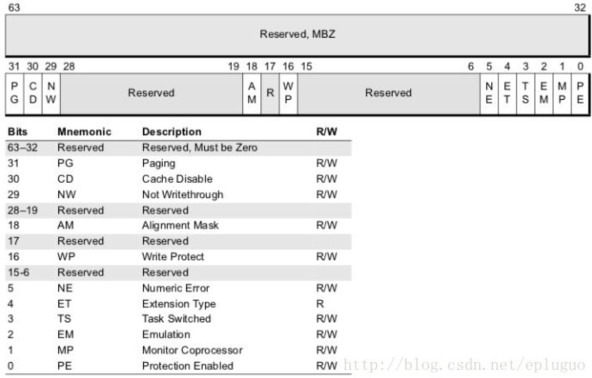


#### CR2寄存器

1. 当访问某个线性地址出错、缺页时，CPU会将对应的线性地址保存到`Cr2`寄存器

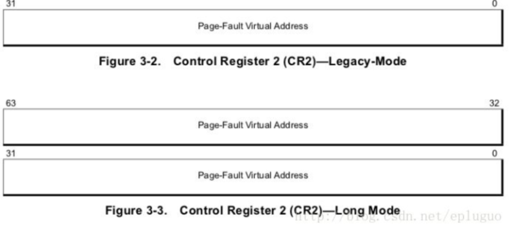


#### CR3寄存器

1. 用于保存当前CPU工作内存上下文的页目录表基址，指向的是一块物理内存，已知Win内核中使用的页式内存管理，其粒度为4KB，必定是内存对齐的，所以利用其中的低12位充当属性位
2. Cr3.PCD（Page Cache Disable）：当前页面禁用缓存
3. Cr3.PWT（Page Write Through）：PWT = 1时，同时更新缓存、内存。PWT = 0时，先更新缓存、再更新内存

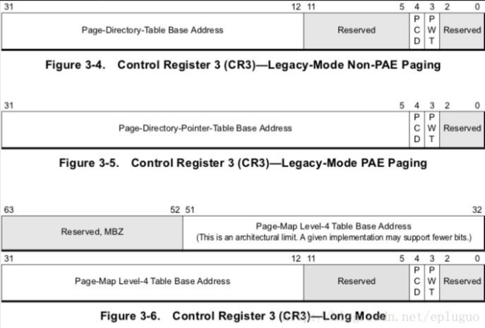


#### CR4寄存器

| 属性位 | 定义                                                         |
| ------ | ------------------------------------------------------------ |
| VME    | VME = 1时，允许启用VT虚拟化相关功能                          |
| PSE    | PSE = 1时，启用大页面模式，64位下允许2MB、1GB的超大页面，主要是优化服务器、数据库等特殊场景下的内存性能 |
| PAE    | 是否启用物理地址拓展功能，启用后，32位系统下的最大物理寻址范围支持到64GB |

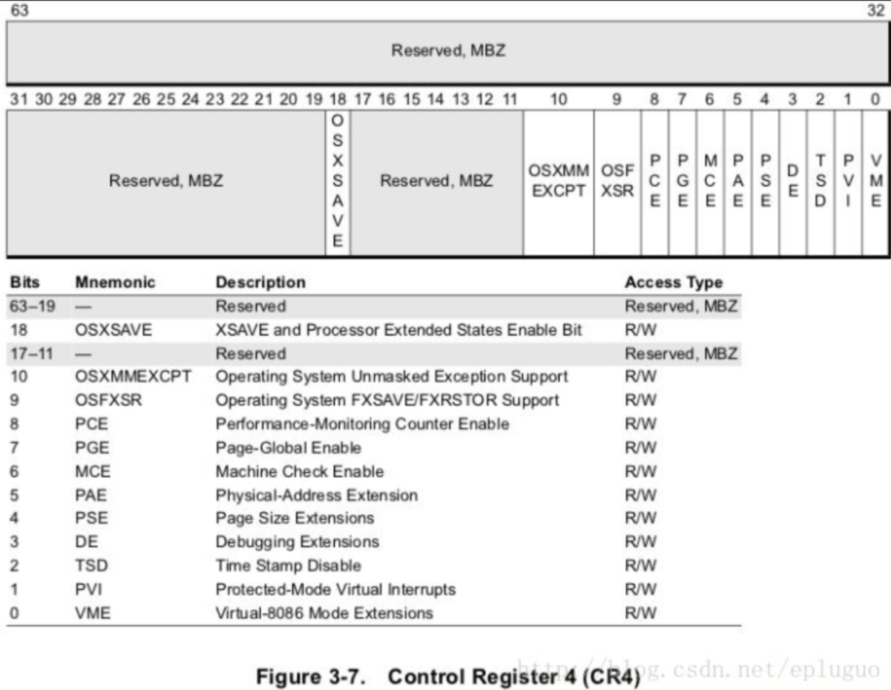


### 32位下页保护模式1（10-10-12分页）

1. `页保护模式`其实实在段保护模式的基础上拓展出来的，所以也可以叫`段页模式`，在如何在x64系统上，段保护、页保护是共存的，不存在纯页保护模式！
2. 当`Cr0.PE = 1`、`Cr0.PG = 1`时，说明此时CPU工作在段页保护模式下，此时所访问的线性地址需要经过CPU中的`MMU转换`后才能找到其对应的物理页面

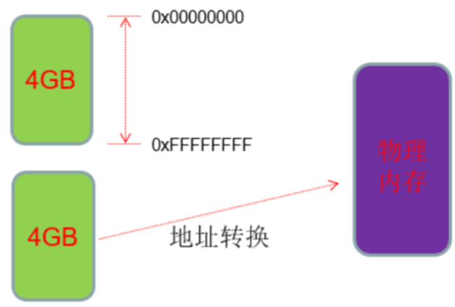

3. Cr3寄存器也叫页目标基址寄存器，其指向的是一块4KB的物理内存，这块物理内存也叫PDT，其中存放的是1024个PDE，每个PDE指向的是PT，每张PT中保存的是1024个PTE，每个PTE指向的是一块物理页面
4. 关于转换关系，初见确实是比较绕的，可以由下图进行理解

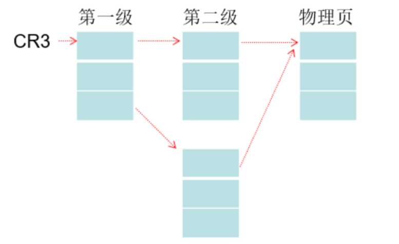

#### 拆解分页机制细节（模拟CPU MMU寻址）

1. 这里的`10-10-12分页`机制，本质上是将一个32位的线性地址拆分为3段，例如一个线性地址为`0x000AAFF8`，CPU在寻址值，内部会自动分段，其中分出来的每一段，得到的数值可以认为是`数组下标`，如下所示

```c
0000 0000 00     //  Hex: 0*4 = 0
00 1010 1010     //  Hex: AA*4 = 2A8
1111 1111 1000   //  Hex: FF8
```

2. 此时我们找一个实验进程，假设其`Cr3 = 0x16BCF000`，使用WinDbg双机调试，如下所示：

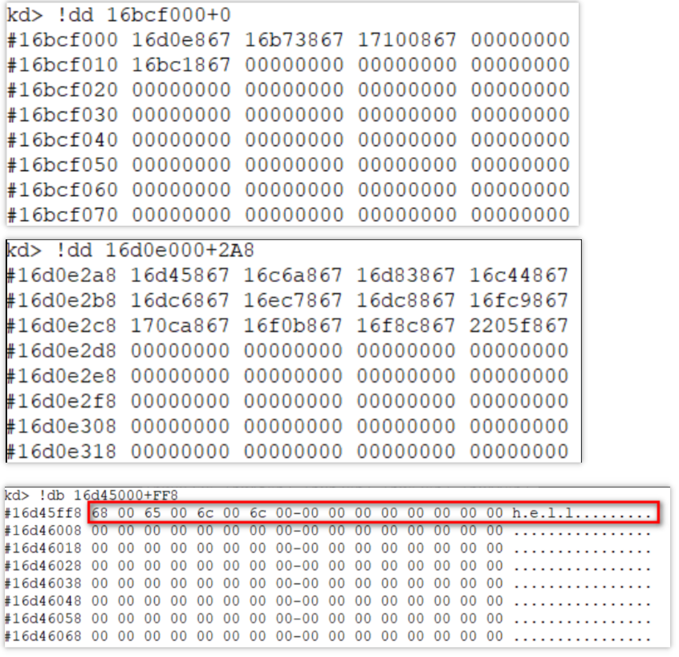


#### PDE、PTE定义

1. 在涉及到分页保护寻址时，这些页表项的低12位均为属性位，在模拟寻址时需要手动去除（其实很好理解：**物理页面本身就是4KB对齐的，低12位本身就空闲的，所以CPU尝试就利用上了**）

```c
PTE &= ~0xFFF;
```

2. 关于PDE、PTE的定义，CPU手册定义如下：

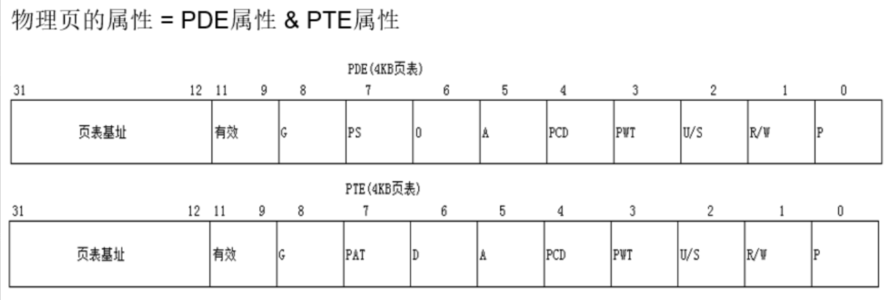

3. 关于PDE、PTE的属性位定义，如下所示：

| PDE、PTE属性位 | 定义                                                         |
| -------------- | ------------------------------------------------------------ |
| P（Present）   | 表示该PDE、PTE是否有效                                       |
| R/W            | 表示该PDE、PTE所对应的页面，是可读可写、还是只读             |
| U/S            | 表示对应页面的访问权限，0->系统权限才能访问，负责就是R3、R0均可访问 |
| PS             | PDE指向的页面是否为大页，如果PS = 1，那么PDE直接指向目标物理页面 |
| PAE            | 是否启用物理地址拓展模式                                     |
| A              | 表示对应页面是否被访问过                                     |
| D              | 表示对应的页面是否被写入过                                   |
| PCD            | 表示对应的页面是否禁用缓存                                   |
| PWT            | 表示同时更新缓存、内存，还是回写                             |
| G              | 全局位，表示该PDE、PTE对应的页面是否为全局页面，当G = 1，那么切换Cr3时，会保存相关的TLB条目，我们知道高2G的空间属于是内核态，是所有进程共享的，切Cr3时当然要保留TLB缓存条目 |


### 32位下页保护模式2（2-9-9-12分页）

1. 当CPU启用了PAE物理地址拓展模式后，此时CPU的寻址会变成`三级寻址2-9-9-12分页`，让CPU的最大物理寻址范围扩大到64GB
2. 此时Cr3中保存的是PDPT页表，其中保存着512项PDPTE（PDPTE、PDE、PTE都拓展为8字节），如下所示：

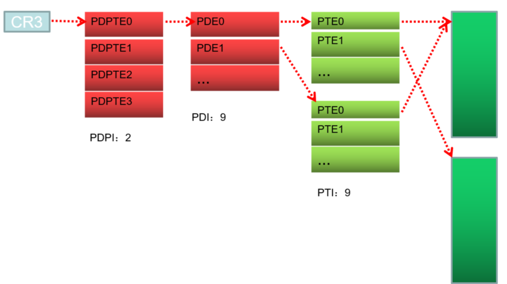

3. 已知PDPTE、PDE、PTE都拓展为了8字节，也就是64位，厂商将其中的12~35位来存放物理页面地址PFN，可得如下：

```
2 ^ 36 = 64GB
```

4. 当开始PAE后，PDPTE、PDE、PTE的定义如下所示：

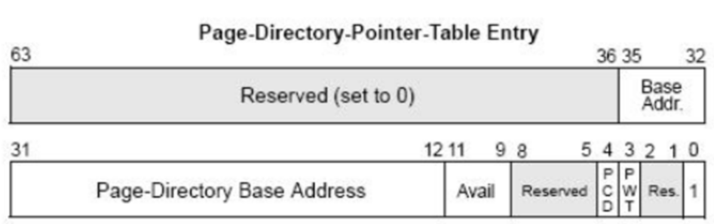

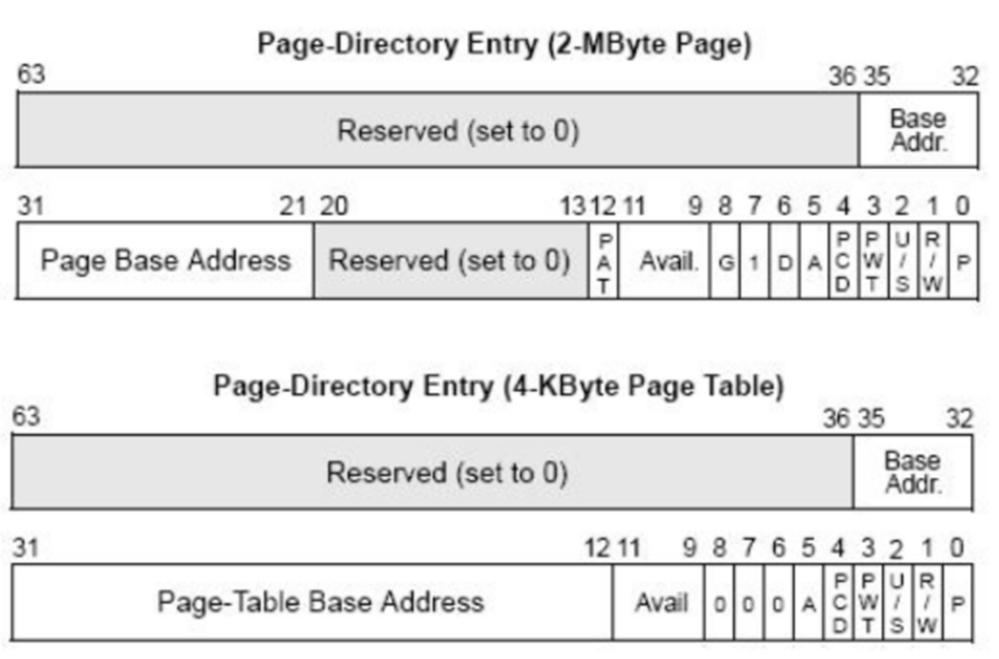

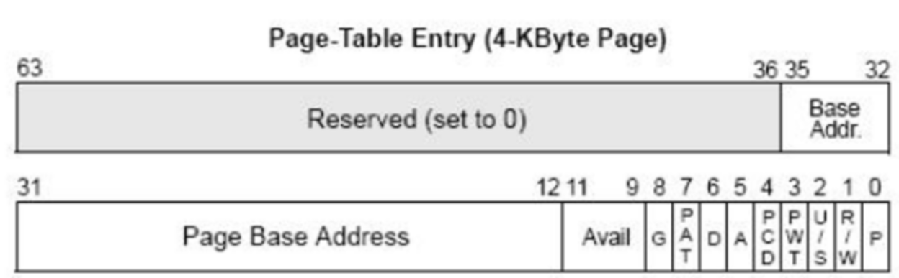


### 64位下页保护模式（9-9-9-9-12分页）

1. 到了如今的64位系统时代，CPU厂商继续拓展了分页保护模式，拓展为了四级分页，即9-9-9-9-12分页，此时理论支持最大物理地址寻址扩大到了256T，如下所示：

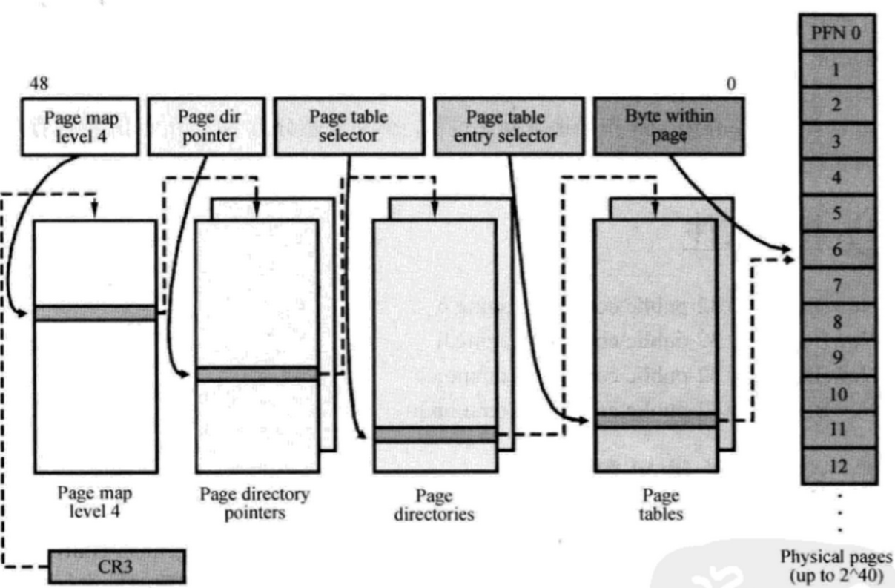

2. 关于四级分页机制，其实整体上跟三级分页2-9-9-12分页其实没太大区别，在四级分页的系统上，Cr3寄存器保存的是PML4E表的物理地址


### 手动挂物理页实验（空指针读写）

1. 我们现在简单复习一下PTE的特征：

| PTE特征       | 定义                                                         |
| ------------- | ------------------------------------------------------------ |
| PTE无效的     | 即PTE没有映射对应的物理页面，分配内存首次访问、内存换出到磁盘时会出现这种情况 |
| PTE指向唯一性 | 一个PTE只能指向一块确定的物理页面                            |
| 多PTE指向     | 多个PTE是可以指向同一块确定的物理页面，即多线性地址映射同一块物理页面 |

1. 我们知道在访问了空指针时，程序往往会报错、崩溃`0xC0000005异常`。在学习了以上分页保护的知识后，我们使用WinDbg观察一下线程情况，由图可发现，空指针的PDE是有效的、但是PTE无效！
2. 所以CPU在寻址时会抛出异常

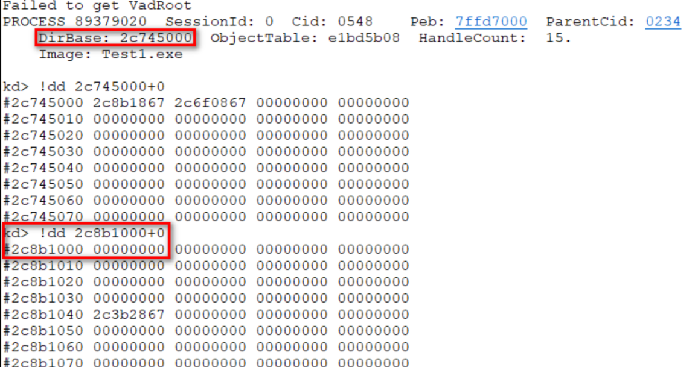

3. 那么我们在WinDbg双机调试的情况下，手动为空指针挂上物理页、建立正确的内存映射，如图所示

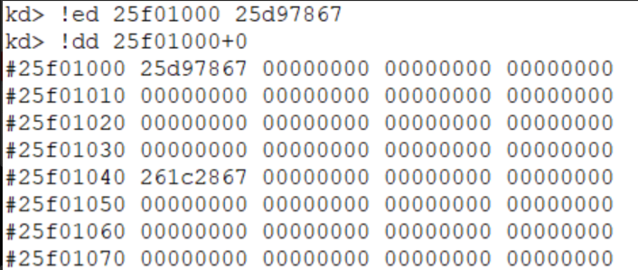

4. 此时R3程序再次访问空指针，就能读出来正常内容了


### DEP数据属性保护（隐藏不可执行页面）

1. 在早期的程序开始阶段，虽然在程序结构上划分除了代码区、数据区（堆栈区），但是这仅仅是逻辑上划分
2. 在数据区、或者是堆栈区，其实也是可以执行代码的，笔者这里举一个经典的栈溢出攻击的例子，在网络编程中，调用recv可以从网络接收数据，那么攻击者就可以精心构造一个数据包，主动知道堆栈溢出，覆盖栈中的返回地址，做到劫持代码执行流，从而执行攻击者自定义的代码
3. 在后来CPU、操作系统厂商一合计，发现这是一个很严重的漏洞，所以CPU厂商在硬件层面，当启用了PAE后，此时PDE、PTE的最高位就变成了Nx位，实现在CPU硬件层面控制数据可执行权限，如图所示：


4. 但是这导致了一个新的利用点，Rootkit开发者可以在R3分配一块`只读内存`，可以将目标页面的PDE、PTE的Nx同时置0、RW = 1，那么在硬件层面，这块内存就变成了可读可写可执行的内存，往往被配合用来手动映射注入代码、隐藏内存Shellcode
5. 因为这是硬件层面的控制，调用R3各种API进行查询内存保护属性时，查询的往往是进程Vad内存信息，查得到还是最初的内存保护属性`只读`！


### TLB

1. 目前已知CPU在寻址是会经过多级分页的映射，特别是如今的四级分页时代，程序反复访问同一块内存时，难道CPU会重复循环寻址过程吗？这无疑是低效的，所以CPU厂商在CPU中增加TLB缓存
2. 关于TLB是什么：这里简单理解就是CPU中的一组硬件电路，容量不大，其主要存储的内存是县线性地址到物理地址的映射关系，如图所示：

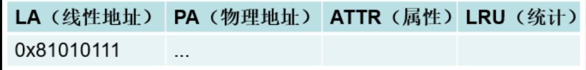

3. 可以发现，TLB中的每一条目，除了会保存线性地址、物理地址映射关系外，还会进行统计计数，CPU在运行中会不断丢弃哪些使用次数较少的TLB条目


### CPU缓存

1. 在上一节笔者介绍了TLB，其保存的是`线性地址LA`到`物理地址PA`之间的映射
2. 那么CPU缓存，保存的是其实是物理地址、内容的映射

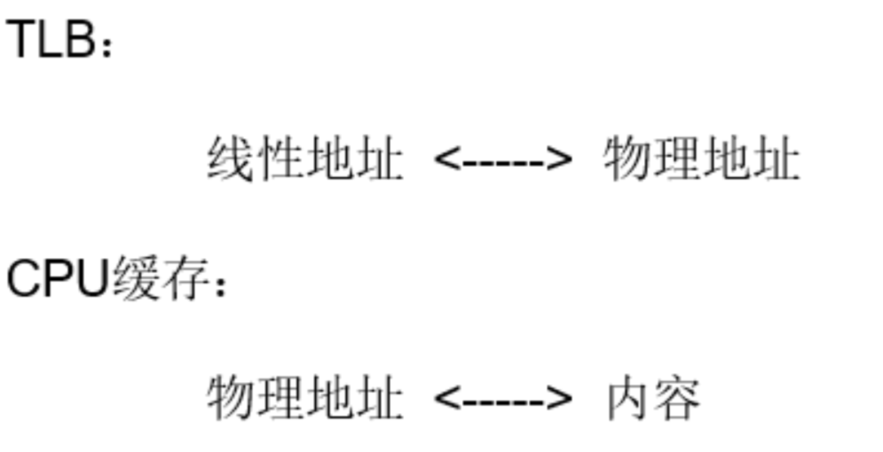
