<!--more-->

## 写在前面

​	本文定位为`抛砖引玉`，分享一系列`实验性质`思路、代码实现方法，并非一整套体系化、成熟化的商业对抗方案。

​	文中涉及的内容，均基于`自建靶场`环境下的模拟分析与验证，仅用于技术研究和交流。若文中有表述不够准确、理解不到位，或存在笔误、疏漏之处，也欢迎各位朋友在评论区指正。

​	文中涉及到的教学代码也已整理并完整开源到 `GitHub`，欢迎各位朋友交流、指正。


## 早期驱动隐藏

​	在内核对抗、游戏安全方面，`驱动隐藏`总是一个津津乐道的话题。最早的驱动隐藏为断链隐藏驱动，一个标准流程加载的驱动将自身`DriverObject`从系统模块链表中摘除，再通过各种DKOM手法，使得PCHunter一类的ARK工具也无法在驱动列表中找到相关信息。


## "无痕"驱动

​	在2019年，GitHub上一个名为kdmapper的开源项目，该项目利用了存在安全缺陷的驱动，可以绕过DSE，直接在内核态中分配内存、拉伸PE镜像、解析导入等等操作，最后调用驱动入口点，实现把未签名的内核驱动手动映射进内核。这就是自己实现了一套ImageLoader，不走系统正常加载流程，根本不会创建正常的`DRIVER_OBJECT`，从隐蔽性角度来优于早期的断链隐藏驱动。

​	kdmapper刚开源那段时间，游戏安全简直就是一场无序的乱战，各路开发者利用kdmapper的能力随意将驱动程序映射到内核态实现提权，绕过游戏保护，当时大多数反作弊（AC）厂商都没有很完善的检测方案。早期检测方案是向可疑线程发送APC，在APC回调中采集堆栈信息，后来演进到注册NMI回调。

​	在笔者印象中，所谓`无痕驱动`一词被广泛提及，大概是在PUBG爆火的那几年，当时大量的灰产、外挂在宣传时都声称自己所谓的无痕化驱动。

​	在2025年，随着某国产摸金搜打撤游戏的爆火，某些社区论坛出现帖子，公然宣传、售卖所谓的`无痕化`商业驱动，这些商业驱动大多声称"可以稳定xxx反作弊保护"，提供的功能无非是：读写内存、注入、模拟键鼠...

​	笔者对于`无痕驱动`一词的理解是：不存在绝对意义上的无痕化驱动，只要其加载、驻留在内存中，一定会留下痕迹。只是人为地将这些特征隐藏、抹除，从而抬高分析成本，使得短时间内绕过了安全审查。


## 文章目录速览

1. 重映射方式加载驱动

   1.1 重映射加载驱动原理

   1.2 重映射加载驱动的重定位问题

   1.3 重映射加载驱动的通讯问题

2. 劫持系统调用指针实现通讯

   2.1 劫持系统调用指针原理

   2.2 IDA脚本搜索内核模块中所有的CFG调用

   2.3 筛选可利用的CFG点

   2.4 符合要求的CFG点分析

   2.5 利用特征码定位CFG点

   2.6 兼容Win10~Win11多系统版本驱动通讯

   2.7 修复通讯回调寻址问题

   2.8 替换CFG函数指针

   2.9 多系统通讯测试

   2.10 小结

3. 检测PoolBigPageTable内存痕迹(Win11 25H2)

   3.1 MmAllocateContiguousMemory分析

   3.2 MiAllocateContiguousMemory分析

   3.3 ExInsertPoolTag分析

   3.4 ExpAddTagForBigPages分析

   3.5 调用链、参数分析

   3.6 PoolBigPageTable对象中成员结构

   3.7 利用PoolBigPageTable检测匿名内存分配行为可行性分析

   3.8 利用特征码定位PoolBigPageTable表

   3.9 遍历PoolBigPageTable中的成员

   3.10 检测敏感内存分配行为

   3.11 对抗PoolBigPageTable内存扫描

   3.12 小结

4. 扫描内核态下所有可执行内存

   4.1 扫描内核态下PTE

   4.2 Win11 25H2环境下测试

   4.3 通过扫描可执行内核页面检测Shellcode驱动

   4.4 小结

5. 利用编译器特征扫描"无痕"驱动

   5.1 利用导入表特征检测原理

   5.2 测试结果

   5.3 剥离导入表Stub特征

   5.4 延迟导入API

6. 扫描被劫持的系统调用指针

   6.1 扫描 ntoskrnl 中的 CFG 间接调用点

   6.2 定位当前内核中的 __guard_dispatch_icall

   6.3 扫描内核模块代码中所有对 __guard_dispatch_icall 的调用

   6.4 还原数据指针槽位

   6.5 过滤正常CFG点

   6.6 扫描、检测测试

   6.7 绕过常规的指针扫描

7. Github开源仓库地址

8. 结束语


## 1. 重映射方式加载驱动

​	常见的手动映射加载驱动方式往往分为`两层`，外层驱动仅作为Loader（使用未被AC厂商拉黑的签名），内层驱动（无签名）负责实现各种功能，以Shellcode、无模块镜像的形式驻留 / 运行在内核态（Ring 0）中。根据笔者接触到的一些样本来看，常规的Loader驱动工作流程往往分为以下几步：

- 从云端 / 本地PE文件中取得被加密内层功能驱动资源
- 解密Shellcode驱动二进制
- 解析PE头中的SizeOfImage字段，在内核态分配内存
- 手动拉伸PE，将初步处理好的Shellcode放置到分配好的内存中
- 修复重定位表（Reloc）
- 修复导入表（IAT）
- 刷新SecurityCookie
- 调用AddressOfEntryPoint入口点程序
- 抹除整个PE文件头


### 1.1 重映射加载驱动原理

​	本文会介绍一种取巧的思路：先让当前驱动按系统正常流程被加载一次，等内核加载器把镜像映射、重定位、导入解析等工作全部完成后，在 `DriverEntry` 阶段将自身重新映射到另一块匿名内核内存中继续执行，原始的`DriverEntry` 主动返回`STATUS_UNSUCCESSFUL`。此时我们的重映射驱动不再依赖原始的`DRIVER_OBJECT`和模块加载记录。

​	重映射并没有像传统手动映射那样，从头实现一整套 PE Loader。当 `DriverEntry` 被调用时，`DrvObj->DriverStart` 指向的已经不是磁盘上的原始PE文件，而是系统完成装载后的运行时镜像。所以我们在重映射时，很多初始化结果天然被继承下来了，例如PE已经被拉伸、IAT导入表中的函数地址已经被系统处理好。


### 1.2 重映射加载驱动的重定位问题

​	我们将驱动自身直接重映射到一块新的匿名内核内存中，此时Shellcode驱动还不能直接运行，原因在于新旧镜像的基址（ImageBase）不同，镜像内部凡是依赖固定基址的绝对地址项，都需要根据新的地址重新修正。修正流程、部分关键代码如下：

- 计算原始镜像与新镜像之间的基址差值：`LocationDelta = MappedBase - SourceBase`
- 解析新镜像中的DOS头、NT头，定位 `IMAGE_DIRECTORY_ENTRY_BASERELOC` 重定位目录
- 逐个遍历 `IMAGE_BASE_RELOCATION` 块，枚举每一个重定位条目
- 针对x64环境下，仅处理最常见的 `IMAGE_REL_BASED_DIR64` 类型重定位项
- 根据 `VirtualAddress + Offset` 计算待修补地址，并将 LocationDelta 累加到目标指针上

```c++
static VOID RelocateImage(PVOID SourceBase, PVOID MappedBase)
{
    const ULONG_PTR LocationDelta = (ULONG_PTR)MappedBase - (ULONG_PTR)SourceBase;
    if (LocationDelta == 0)
    {
        return;
    }

    auto DosHeader = (PIMAGE_DOS_HEADER)MappedBase;
    auto NtHeaders = (PIMAGE_NT_HEADERS)((PUCHAR)MappedBase + DosHeader->e_lfanew);
    auto OptionalHeader = &NtHeaders->OptionalHeader;
    if (OptionalHeader->DataDirectory[IMAGE_DIRECTORY_ENTRY_BASERELOC].Size == 0)
    {
        return;
    }

    auto RelocationBlock = (PIMAGE_BASE_RELOCATION)(
        (PUCHAR)MappedBase +
        OptionalHeader->DataDirectory[IMAGE_DIRECTORY_ENTRY_BASERELOC].VirtualAddress);

    auto RelocationEnd = (PIMAGE_BASE_RELOCATION)(
        (PUCHAR)RelocationBlock +
        OptionalHeader->DataDirectory[IMAGE_DIRECTORY_ENTRY_BASERELOC].Size);

    while (RelocationBlock < RelocationEnd && RelocationBlock->SizeOfBlock != 0)
    {
        const ULONG_PTR EntryCount = (RelocationBlock->SizeOfBlock - sizeof(IMAGE_BASE_RELOCATION)) / sizeof(USHORT);
        PUSHORT RelocationInfo = (PUSHORT)(RelocationBlock + 1);
        for (ULONG_PTR Index = 0; Index < EntryCount; ++Index, ++RelocationInfo)
        {
            if (!IsDir64Relocation(*RelocationInfo))
            {
                continue;
            }

            PUINT_PTR PatchAddress = (PUINT_PTR)(
                (PUCHAR)MappedBase +
                RelocationBlock->VirtualAddress +
                ((*RelocationInfo) & 0x0FFF));

            *PatchAddress += LocationDelta;
        }

        RelocationBlock = (PIMAGE_BASE_RELOCATION)((PUCHAR)RelocationBlock + RelocationBlock->SizeOfBlock);
    }
}
```


### 1.3 重映射加载驱动的通讯问题

​	当重定位修正完成后，这份新镜像在执行层面就已经具备了独立运行的基础。此时再结合后续的特征剥离操作，例如抹除PE头，以及让原始 DriverEntry 主动返回失败，就可以把真正的执行逻辑切换到这段匿名内存中。

​	笔者这些年接触、分析过诸多灰产驱动样本，这些驱动样本往往是提供一系列绕过AC保护、实现提权的功能，处于内核态的驱动程序大部分时间都是`被动地`接收来自应用层（Ring 3）程序的命令，解析命令后执行不同的动作。这一行为笔者笼统地概括为`驱动通讯`，常见的驱动通讯方式有：IO通讯、注册表回调通讯、MiniFilter通讯端口、共享内存通讯、本机Socket通讯等等。

​	本文提及的重映射加载驱动方式，本质上算是一种特殊的手动映射加载驱动。由于没有标准流程中的系统创建的`DRIVER_OBJECT`，所以常规的IO通讯、注册表回调、Filter端口通讯都会注册失败，必须寻找一条不依赖设备对象、同时又能被用户态正常触发的替代入口。

​	下一章节会介绍一种另类、相对隐蔽（指常规的ARK工具找不到痕迹）的驱动通讯方式。


## 2. 劫持系统调用指针实现通讯

### 2.1 劫持系统调用指针原理

​	在本文靶场中，劫持思路是基于`CFG`（Control Flow Guard，控制流保护）相关的特性，`CFG` 的设计目标，是对间接调用、间接跳转这类控制流转移行为进行约束和校验。内核运行时，会在特定分支上通过`间接函数指针`进入特定的处理逻辑，通过劫持这个`间接函数指针`，为重映射驱动提供了一条可被利用的隐藏通讯通道。

​	关于`PG`（PatchGuard）问题：有别于修改`SSDT`、`IDT`表项本身，这里真正劫持、改写的是某条系统调用内部会间接访问的函数指针或回调槽位，笔者测试时最长40h内无任何蓝屏状况。

​	如图2-1IDA反汇编所示，就是一条可被利用`CFG`劫持点：


​	其反汇编大多可以总结为如下格式：

```assembly
// 从全局变量中取出函数指针
mov rax, cs:qword_140xxxxxx

// 构造调用参数，rcx、rdx、r8、r9等等
mov r9, xxx
mov r8, xxx
mov rdx, xxx
mov rcx, xxx

// ....

call _guard_dispatch_icall
```


### 2.2 IDA脚本搜索内核模块中所有的CFG调用

​	内核中存在着大量的CFG间接调用，依赖手动查看明显不现实，所以这里我们使用Python编写用于IDA的脚本文件，自动化的方式减轻我们的重复劳动，运行效果如图2-2所示：

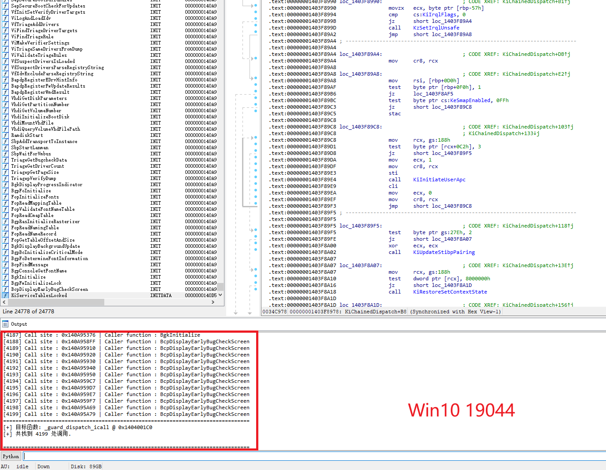


### 2.3 筛选可利用的CFG点

​	从IDA脚本执行结果来看，内核中这类通过 `CFG` 保护的间接调用点非常多，但绝大多数位置并不具备实际研究价值。原因很简单：很多间接调用只出现在初始化路径、错误处理分支、一次性回调、或者只能由内核内部状态机触发的逻辑中，既不稳定，R3应用程序也无法发起调用。对于当前场景而言，真正值得重点关注的应该是那些恰好位于用户态可触发系统调用链上的间接分发点。

​	这类`CFG`点需要具备以下几个共同特征：

- 它必须处于某条稳定、可`重复进入`的系统服务路径中，也就是说，用户态程序在 Ring 3 下能够通过正常系统调用请求反复触发它。
- 这条路径最好能够一路`携带调用参数`，使得内核在执行到该间接调用点之前，仍然保留着来自用户态的上下文信息，例如8字节指针信息。


### 2.4 符合要求的CFG点分析

​	经过笔者分析Win11 24H2版本的内核文件后，分析出一个符合我们要求的`CFG`点，如图2-4-1所示：

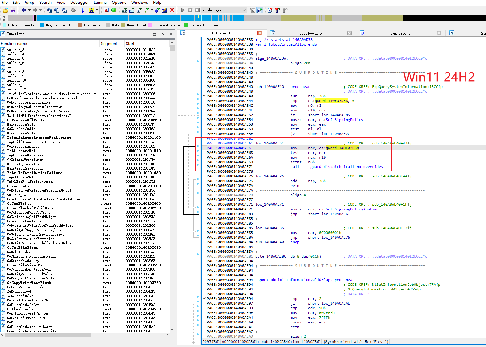

​	笔者首先关注到的函数为 `sub_140A0AE40`，从反编译结果来看，这个函数本身的逻辑非常简单：先检查一个全局函数指针是否为空，随后读取 SeILSigningPolicy / SeILSigningPolicyRuntime 相关状态，整理出一个布尔值，最后通过 guard_dispatch_icall_no_overrides 发起一次受 CFG 保护的间接调用。

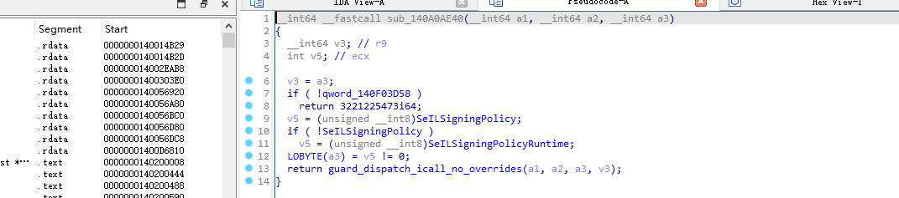

​	也就是说，`sub_140A0AE40` 本质上只是一个非常薄的`Wrapper`，真正决定执行流走向的并不是它自身，而是全局变量 `qword_140F03D58` 所保存的目标函数。

​	接下来继续查看 `sub_140A0AE40` 的交叉引用，可以发现它并不是一个孤立存在的内部函数，而是由 `ExpQuerySystemInformation` 在特定分支中调用。当 `SystemInformationClass == 103` 时，`ExpQuerySystemInformation` 会执行如下逻辑，如图2-4-2所示

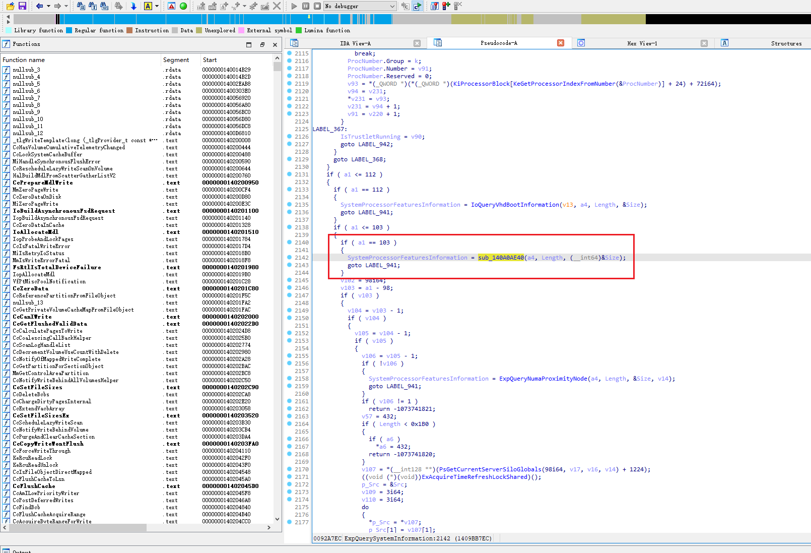

​	由以下代码可知，到了 `sub_140A0AE40` 这一层，来自 Ring 3 的`缓冲区地址` `缓冲区长度` 几乎原样保留、传递下来了。

```c++
// 这条调用语句非常关键，因为它直接展现了参数是如何传递到最终CFG落点前一层的：
// a4：用户态传入的 SystemInformation 缓冲区指针
// Length：用户态传入的 SystemInformationLength
// &Size：内核栈上的局部变量地址，用于保存返回长度
SystemProcessorFeaturesInformation = sub_140A0AE40(a4, Length, (__int64)&Size);
```

​	再继续向上追，就能回到最外层的系统调用入口 `NtQuerySystemInformation`，从反编译结果来看，`103` 这个分支并不属于那些需要特殊线程上下文处理的情况，因此它最终会走默认路径，如图2-4-3所示：

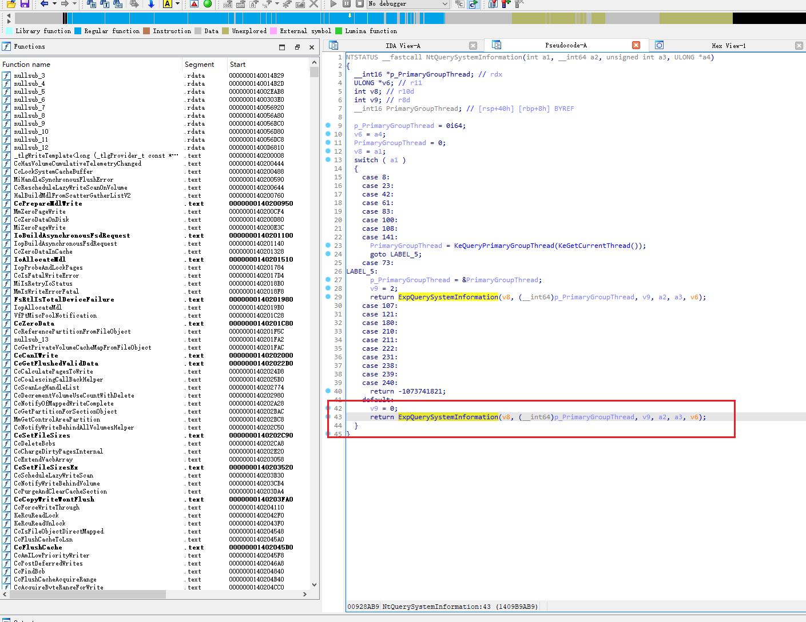

​	至此，这条调用链已经可以完整串联起来：

```c
NtQuerySystemInformation(
    SystemInformationClass = 103,
    SystemInformation,
    SystemInformationLength,
    ReturnLength
)
    ->
ExpQuerySystemInformation(103, ..., SystemInformation, SystemInformationLength, ReturnLength)
    ->
sub_140A0AE40(SystemInformation, SystemInformationLength, &Size)
    ->
guard_dispatch_icall_no_overrides(...)
```


### 2.5 利用特征码定位CFG点

​	在前文中，笔者已经通过逆向分析确认了一条符合要求的 `CFG` 调用链。但在实际研究中，仅靠手工在 IDA 里逐层点交叉引用并不高效，尤其是在需要适配多个系统版本、反复验证目标点是否发生偏移时，更需要一种相对稳定、可重复的定位方法。出于这个目的，笔者选择使用 IDA 脚本辅助提取目标代码片段的上下文特征，再结合模式匹配的方式，在不同版本内核中快速确认该 `CFG` 点是否仍然存在，IDA脚本运行效果如图所示：

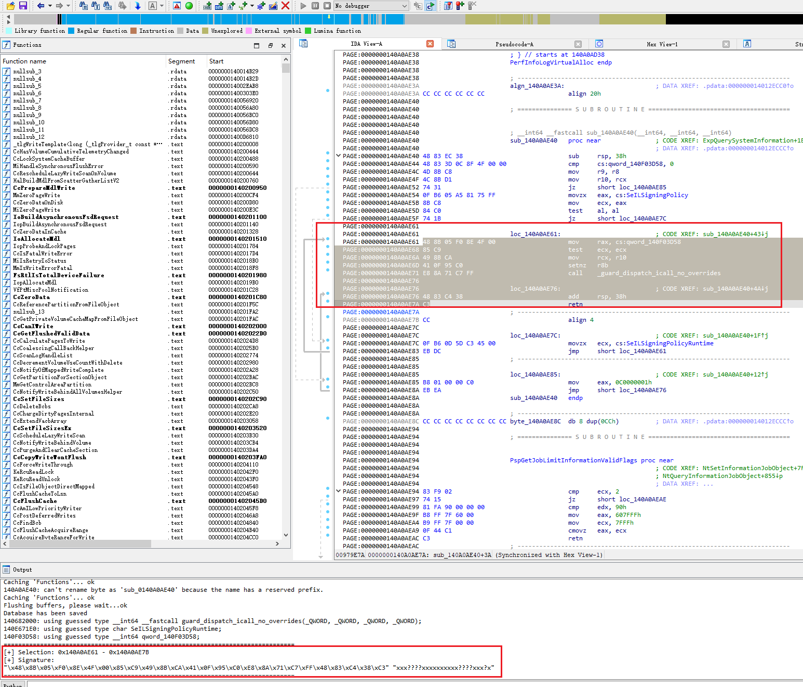


### 2.6 兼容Win10~Win11多系统版本驱动通讯

​	我们提取好特征码后，就可以在驱动运行时动态搜索特征码，定位到`CFG`点，部分关键代码如下：

```c++
	// Win10 19041 ~ Win11 24H2
	if (VersionInformation.dwBuildNumber >= 19041 && VersionInformation.dwBuildNumber < 26200)
	{
		CodeAddr = SearchFeatureCode(
			"ntoskrnl.exe",
			"PAGE",
			(PCUCHAR)"\x48\x8B\x05\xB9\xF6\x51\x00\x85\xC9\x49\x8B\xCA\x41\x0F\x95\xC0\xE8\x93\x1F\xD0\xFF\x48\x83\xC4\x38\xC3",
			"xxx????xxxxxxxxxx????xxx?x",
			0);
	}
	// Win11 25H2 or higher
	else if (VersionInformation.dwBuildNumber >= 26200)
	{
		CodeAddr = SearchFeatureCode(
			"ntoskrnl.exe",
			"PAGE",	(PCUCHAR)"\x48\x8B\x05\xA4\x10\x53\x00\x4C\x8D\x4C\x24\x44\x8B\xD7\x48\x8B\xCB\xE8\xAD\x46\xCD\xFF\x89\x44\x24\x40\xE9\x4F\x17\x00\x00",
			"xxx????xxxx?xxxxxx????xxx?x????",
			0);
	}
	// non supported
	else
	{
		CodeAddr = 0;
	}
```


### 2.7 修复通讯回调寻址问题

​	笔者编写的驱动通讯回调代码如下所示，需要修复全局变量的寻址问题：

```c++
// 这里保存的是CFG原本的函数地址
// 由于我们是重映射驱动，这里的全局变量地址还是原始驱动的，如果不修复必定BSOD
// 所以需要修复重映射后真实的g_OldCommCallback寻址
fn_CommCallback g_OldCommCallback = nullptr;

__int64 HookCallback(IN __int64 a1,IN __int64 a2,IN __int64 a3, IN __int64 a4)
{
	PDRV_COMM_PACKAGE CommPackage = (PDRV_COMM_PACKAGE)a1;
	if (a1 == 0 || a2 != sizeof(DRV_COMM_PACKAGE) || CommPackage->Magic != DRV_COMM_MAGIC)
	{
		return g_OldCommCallback(a1, a2, a3, a4);
	}

	CommPackage->RetValue = 0x12345678;
	DbgPrint("[+] Magic = 0x%llX  CtlCode = 0x%X. \n", CommPackage->Magic, CommPackage->CtlCode);
	return 0;
}
```

​	使用IDA反汇编我们的靶场驱动，其中的`HookCallback`函数需要修复的地方，如图所示：

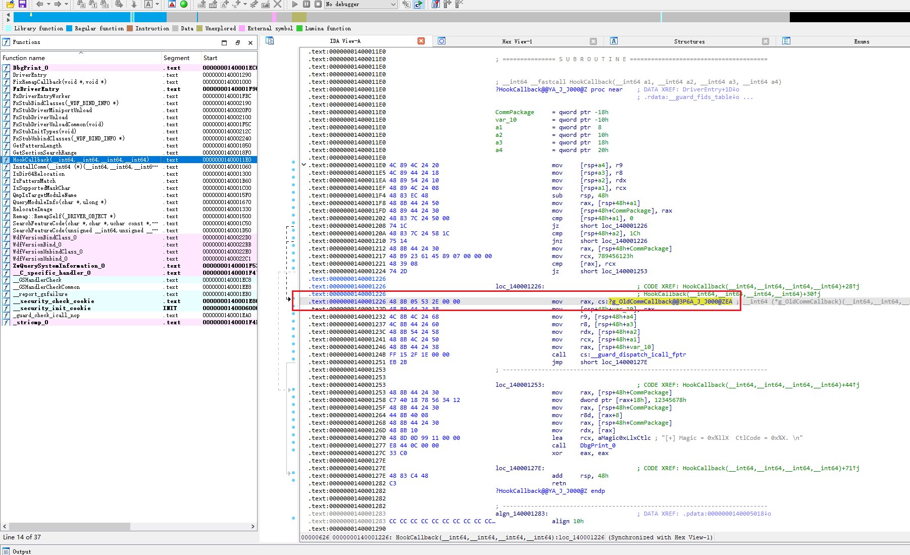

​	修复代码如下所示：

```c
VOID FixRemapCallback(IN PVOID NewCallback,IN PVOID FixCallback)
{
    // 定位到mov rax, cs:g_OldCommCallback后修复其寻址即可
	ULONG_PTR CodeAddr = SearchFeatureCode((ULONG_PTR)NewCallback, (SIZE_T)0x100, (PCUCHAR)"\x48\x8B\x05", "xxx", 0);
	if (0 != CodeAddr)
	{
		*DEREF_RELATIVE_ADDR(PVOID, CodeAddr, 3) = FixCallback;
	}
}
```


### 2.8 替换CFG函数指针

​	到了这一步，我们就可以替换`CFG`中的回调指针了，代码如下所示：

```c
_InterlockedCompareExchangePointer((PVOID volatile*)pCallback,Callback,OldCallback);
```


### 2.9 多系统通讯测试

​	至此我们的劫持CFG通讯方式算是完成了，剩下的就是由Ring 3应用程序主动发起`NtQuerySystemInformation`调用，让我们的Shellcode靶场驱动接管调用流程，关键代码如下所示：

```c
// R3、R0约定的识别码
#define DRV_COMM_MAGIC		0x789456123ull

// 通讯协议
#pragma pack(push, 1)
typedef struct _DRV_COMM_PACKAGE
{
	ULONG64 Magic;
	ULONG CtlCode;
	PVOID Buffer;
	ULONG BufferSize;
	ULONG RetValue;
} DRV_COMM_PACKAGE, *PDRV_COMM_PACKAGE;
#pragma pack(pop)

// R3程序发送命令
NTSTATUS DrvComm::SendMsg(PVOID Buffer,ULONG BufferSize,PULONG ReturnLength) const
{
	if (Buffer == nullptr || BufferSize == 0)
	{
		return STATUS_INVALID_PARAMETER;
	}

	return m_NtQuerySystemInformation(
		SystemCodeIntegrityInformation,	// 103
		Buffer,
		BufferSize,
		ReturnLength
	);
}
```

​	笔者针对多系统版本做了特征码提取，理论上可适配 Win10 19041 及之后的 Win10/Win11 版本。

​	驱动通讯测试结果如图所示，分别测试`Win10 19044`、`Win11 25H2`：

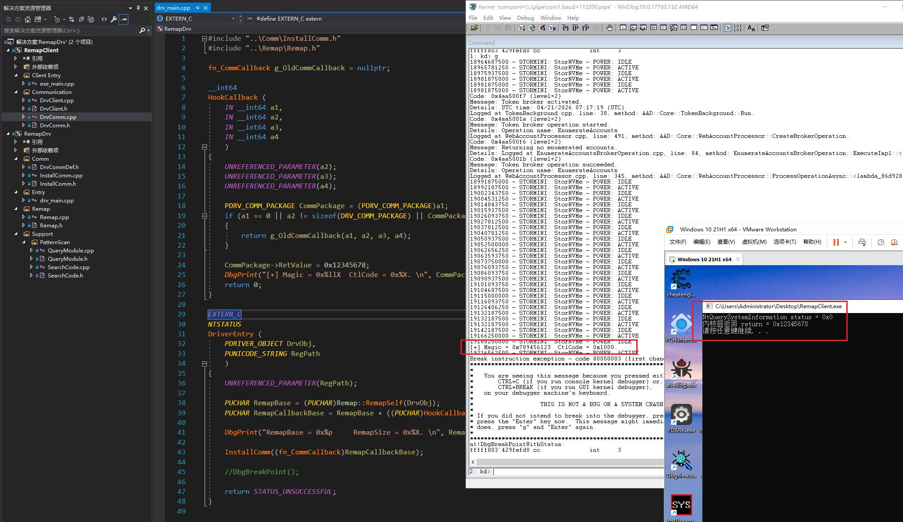

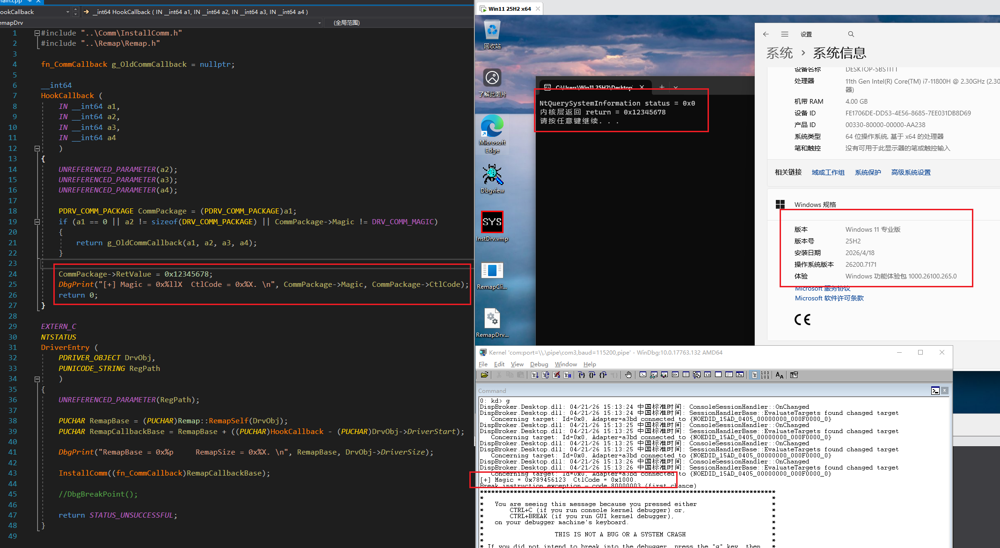


### 2.10 小结

​	至此，一个用于实验与分析的所谓"无痕"驱动框架就基本构造完成了。当然，当前靶场仍然保留了不少明显特征尚未处理，例如注册表、文件以及 `PiDDBCacheTable` 等相关痕迹。但这些内容并不属于本文的讨论重点。

​	本文阶段性目标，是构造一份以 `Shellcode` 形式驻留于内核中的驱动样本，作为后续分析与检测的`模拟靶场`。从成果来看，当前驱动已经具备了`重映射加载`与`隐蔽通讯`的基本能力，足以支撑后续章节的实验与分析。

​	接下来的内容中，笔者将从多个角度出发，对这类所谓"无痕"驱动进行剖析，展示如何一步步检测其残留特征。

​	

## 3. 检测PoolBigPageTable内存痕迹(Win11 25H2)
​	在检测这类 Shellcode 驱动时，一个很自然的切入点就是内核内存分配痕迹。因为无论是手动映射驱动，还是本文这种重映射后的匿名驱动，想要在内核中长期驻留，都必须先拿到一块新的可用内存。以本靶场中使用的 `MmAllocateContiguousMemory` 为例进行逆向分析。


### 3.1  MmAllocateContiguousMemory分析

​	先看最外层的 `MmAllocateContiguousMemory`。从 `Win11 25H2` 的反编译结果来看，它本身只是一个较薄的Wrapper。函数首先将调用者传入的 `NumberOfBytes` 保存到局部变量 `v4` 中，然后把 `HighestAcceptableAddress` 右移 12 位，转换成页帧号上限（PFN Upper Bound）。随后，它调用内部的 `MiAllocateContiguousMemory`：

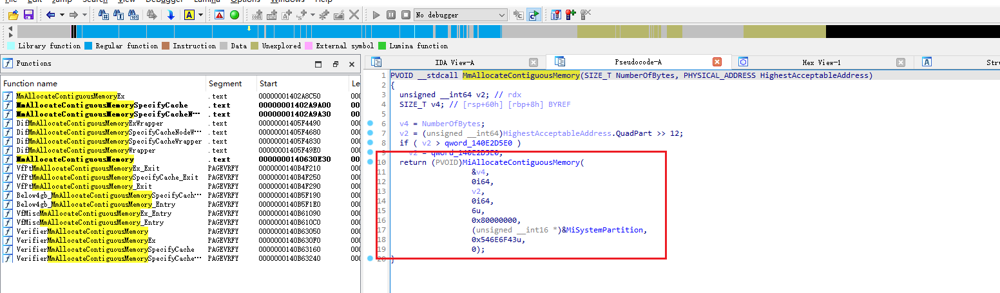


### 3.2 MiAllocateContiguousMemory分析

​	进入 `MiAllocateContiguousMemory` 后，内存管理器首先读取 *a1，并根据是否页对齐计算本次实际需要的页数：

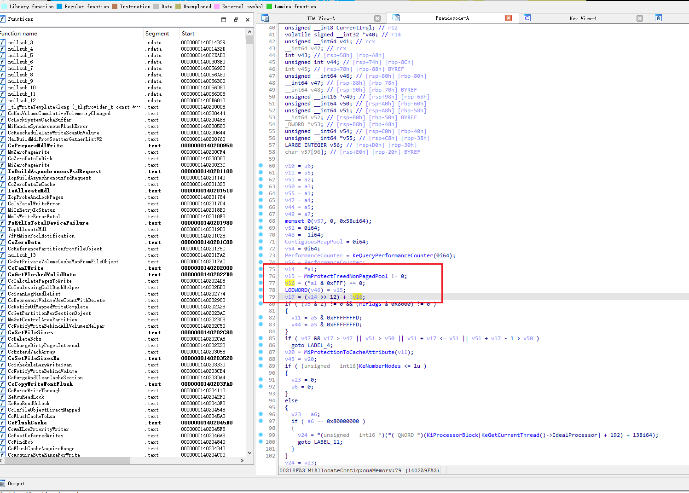

​	也就是说，`v17` 就是最终需要分配的页数，后续真正参与记录的大小也是 `v17 << 12`，而不是最初用户请求的原始字节数。随后，函数会在指定物理范围内搜索连续物理页，并在成功找到后调用 `MiMapContiguousMemory` 把这段物理内存映射成内核虚拟地址，紧接着调用`ExInsertPoolTag`，这条调用链已经把2个最关键的信息凑齐了：

- `v32`：分配完成后的内核虚拟地址 VA
- `v17 << 12`：按页对齐后的分配大小 Size

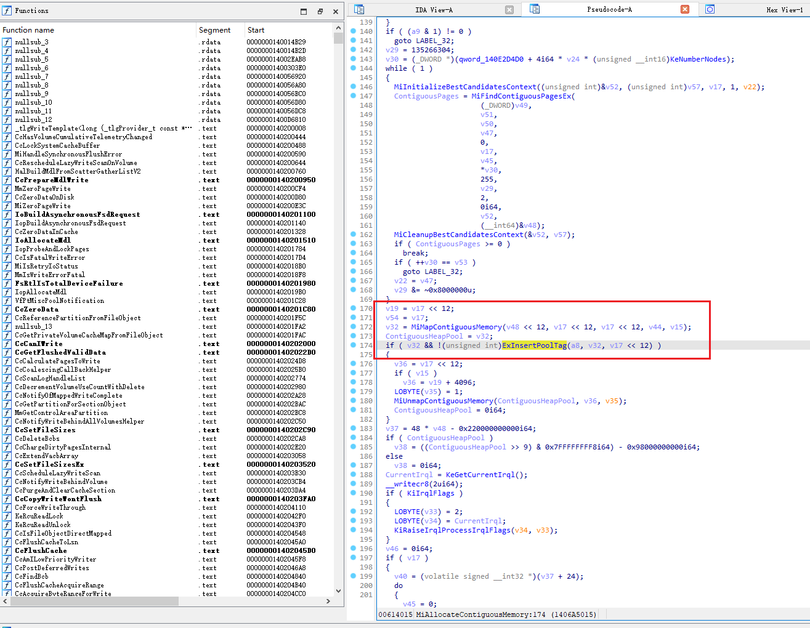


### 3.3 ExInsertPoolTag 分析

​	`ExInsertPoolTag` 会先把传入的大小再次按页对齐，随后调用核心函数`ExpAddTagForBigPages`，如图所示：

​	可以把 `ExpAddTagForBigPages` 的2个关键参数理解为：

- a1 = a2：大块分配对应的虚拟地址 VA
- a3 = v9：页对齐后的分配大小 Size

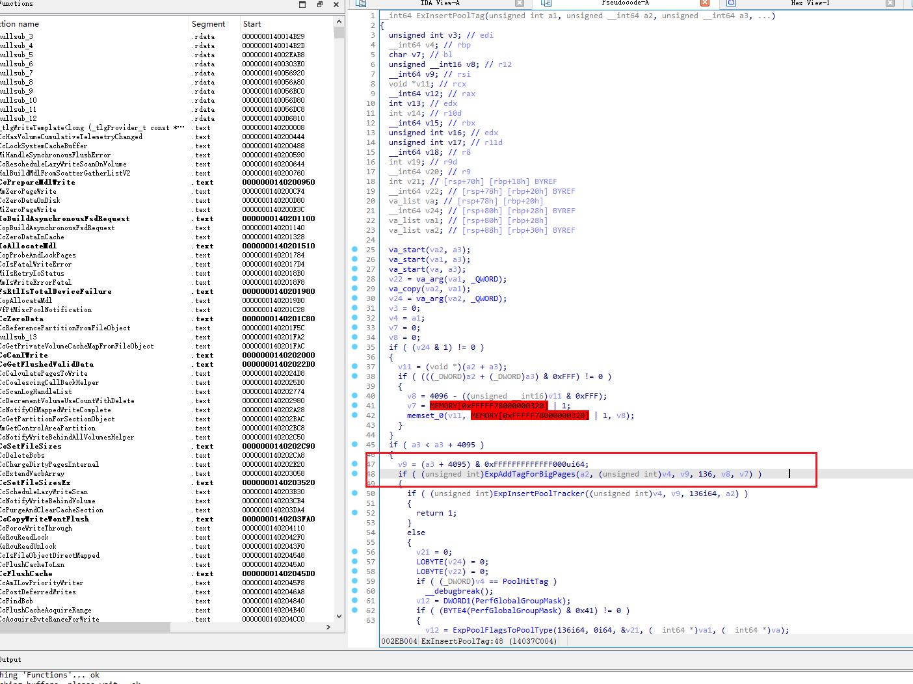


### 3.4 ExpAddTagForBigPages分析

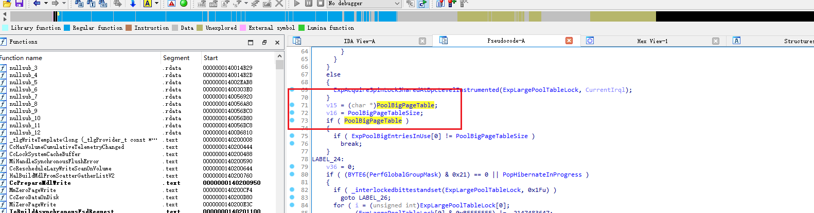

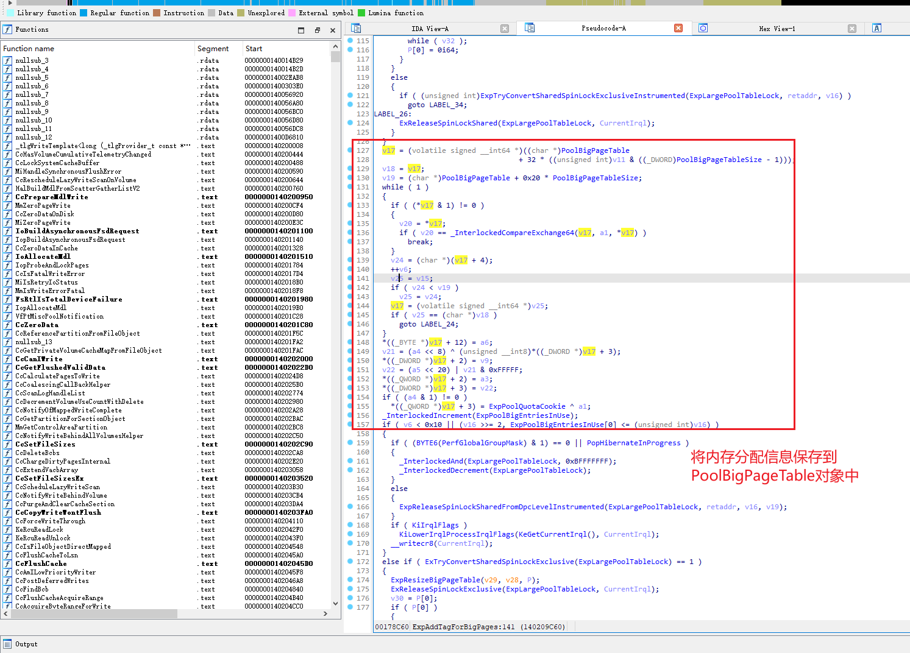


### 3.5 调用链、参数分析

```c
MmAllocateContiguousMemory(
    NumberOfBytes,
    HighestAcceptableAddress
)
    ->
MiAllocateContiguousMemory(
    a1 = &NumberOfBytes,                  // *a1 初始为请求大小
    ...,
    a3 = HighestAcceptableAddress >> 12,
    ...
)
    ->
v17 = ((*a1 >> 12) + ((*a1 & 0xFFF) != 0))   // 计算实际分配页数
    ->
MiMapContiguousMemory(..., v17 << 12, ...)
    = Va
    ->
ExInsertPoolTag(
    ...,
    Va,
    v17 << 12
)
    ->
ExpAddTagForBigPages(
    a1 = Va,
    ...,
    a3 = ALIGN_UP(v17 << 12, 0x1000)
)
    ->
PoolBigPageTable[slot].Va   = a1
PoolBigPageTable[slot].Size = a3
```


### 3.6 PoolBigPageTable对象中成员结构

​	目前可以知道分配出来的内存信息，都会保存到`PoolBigPageTable`对象中，并且在`Win11 25H2`下，其中的对象结构可以表示为如下：

```c
// Size = 0x20 Bytes
typedef struct _POOL_BIG_PAGE_INFO {
    volatile ULONG_PTR Va;   // +0x00
    UCHAR Reserved0[8];      // +0x08
    SIZE_T NumberOfBytes;    // +0x10
    UCHAR Reserved1[8];      // +0x18
} POOL_BIG_PAGE_INFO, *PPOOL_BIG_PAGE_INFO;
```

​	在Win10系统下，`PoolBigPageInfo`可以表示为如下结构：

```c
// Size = 0x18 Bytes
typedef struct _POOL_BIG_PAGE_INFO {
    volatile ULONG_PTR Va;   // +0x00，记录的虚拟地址
    UCHAR Reserved[8];       // +0x08，保留字段
    SIZE_T NumberOfBytes;    // +0x10，按页对齐后的大小
} POOL_BIG_PAGE_INFO, *PPOOL_BIG_PAGE_INFO;
```


### 3.7 利用PoolBigPageTable检测匿名内存分配行为可行性分析

​	经过笔者分析发现，内核中大部分常用的内存分配函数，最终都会将分配到的内存信息保存到`PoolBigPageTable`对象中，所以利用该系统特性，我们就可以遍历`PoolBigPageTable`中所有的条目，找出敏感的匿名内存分配行为。

```c
// 内核态中常用的内存分配接口
ExAllocatePool(...);
ExAllocatePoolWithTag(...);
MmAllocateContiguousMemory(...);
```


### 3.8 利用特征码定位PoolBigPageTable表

​	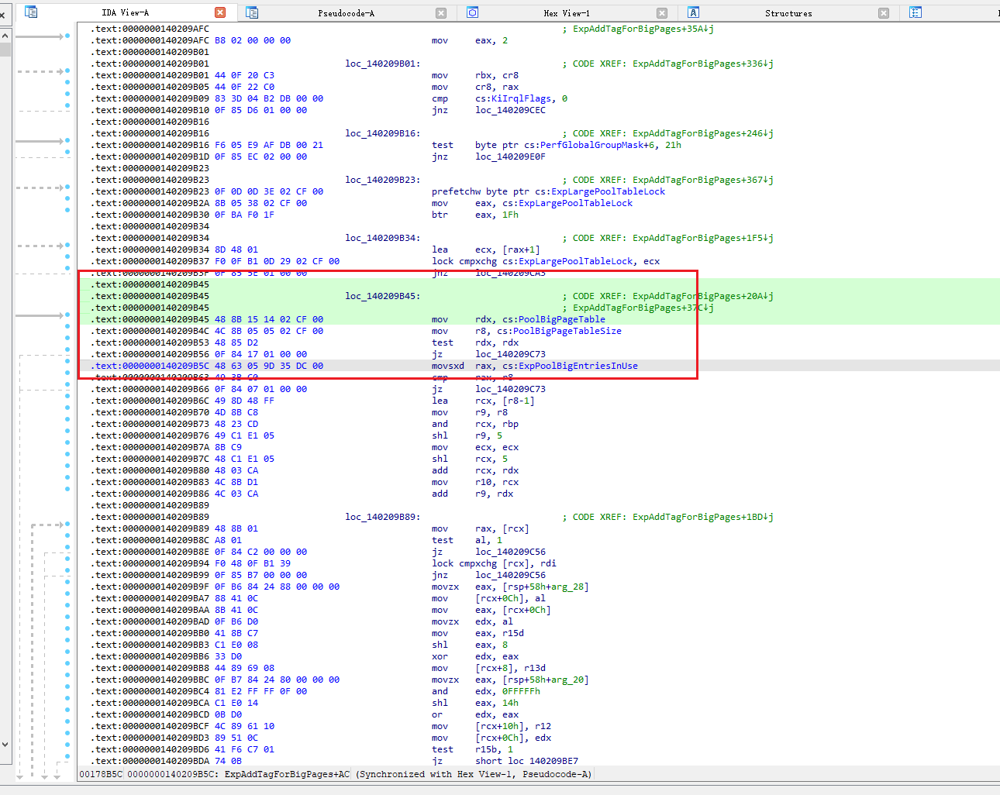

​	利用特征码定位`PoolBigPageTable`，关键代码如下所示：

```c
	RTL_OSVERSIONINFOW VersionInformation;
	RtlGetVersion(&VersionInformation);
	if (VersionInformation.dwBuildNumber <= 22621)
	{
		CodeAddr = SearchFeatureCode(
			"ntoskrnl.exe",
			".text",
			(PCUCHAR)"\x48\x8B\x15\x47\x58\x8E\x00\x4C\x8B\x0D\x48\x58\x8E\x00\x48\x85\xD2\x74\x55\x48\x63\x05\xE4\xC6\x9F\x00",
			"xxx????xxx????xxxx?xxx????",
			0);
	}
	else
	{
		CodeAddr = SearchFeatureCode(
			"ntoskrnl.exe",
			".text",
			(PCUCHAR)"\x48\x8B\x15\x64\x2C\xB6\x00\x4C\x8B\x05\x75\x2C\xB6\x00\x48\x85\xD2\x0F\x84\x11\x01\x00\x00",
			"xxx????xxx????xxxxx????",
			0);
	}
```


### 3.9 遍历PoolBigPageTable中的成员

​	使用特征码搜索到`PoolBigPageTable`对象后，遍历其中所有已分配内存信息，关键代码如下所示：

```c
	POOL_BIG_PAGE_INFO_WIN11* PoolBigPageTable = NULL;
	PoolBigPageTable = *DEREF_RELATIVE_ADDR(POOL_BIG_PAGE_INFO_WIN11*, CodeAddr, 3);
	if (NULL == PoolBigPageTable)
	{
		return VOID();
	}

	CodeAddr += 7;
	ULONG64 PoolBigPageTableSize = *DEREF_RELATIVE_ADDR(ULONG64, CodeAddr, 3);
	if (0 == PoolBigPageTableSize)
	{
		return VOID();
	}

	for (ULONG64 i = 0; i < PoolBigPageTableSize; i++)
	{
		POOL_BIG_PAGE_INFO_WIN11 PoolPageInfo = PoolBigPageTable[i];
		if (0 != PoolPageInfo.NumberOfBytes)
		{
			DbgPrint("PoolBase = 0x%p   PoolSize = 0x%X. \n", PoolPageInfo.Va, PoolPageInfo.NumberOfBytes);
		}
	}
```


### 3.10 测试检测敏感内存分配行为

​	测试系统版本为`Win11 25H2`，测试流程为：

- 扫一遍`PoolBigPageTable`中的内存分配信息
- 加载我们的靶场驱动
- 再扫一遍`PoolBigPageTable`中的内存分配信息
- 此时前后新增加的条目（Va、Size），大概率就是Shellcode驱动所在的内存区域。

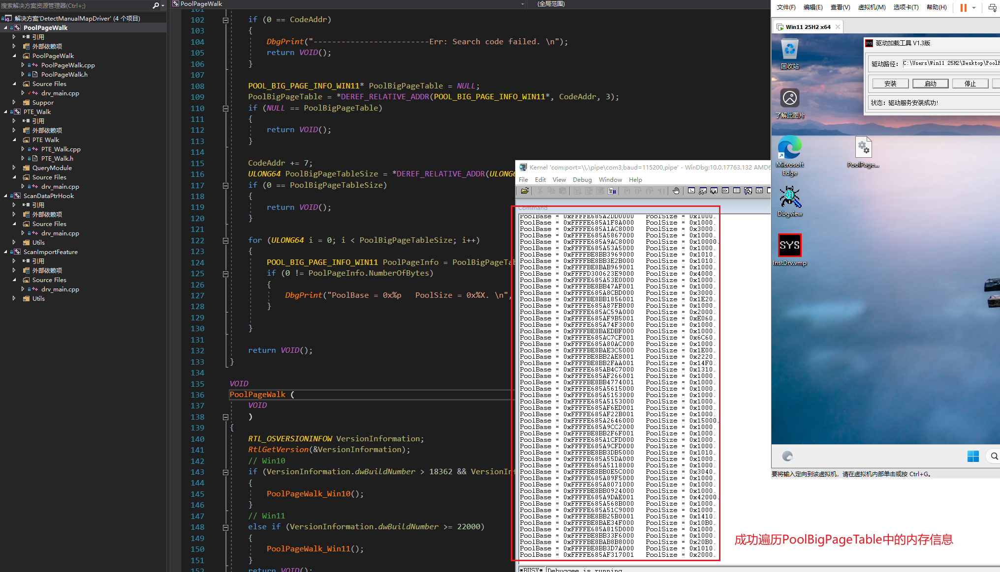

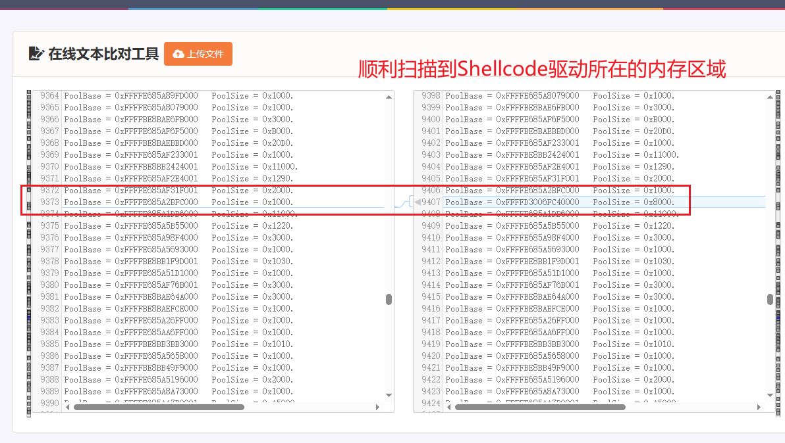


### 3.11 对抗PoolBigPageTable内存扫描

​	关于这一部分，笔者仅提供思路，暂不提供实现源码：

- 每次分配内存前，临时Hook `ExpAddTagForBigPages`函数，不让其将本次的内存分配信息保存到`PoolBigPageTable`

- 手动遍历`PoolBigPageTable`中所有成员，将敏感的内存分配信息清除

  
  

​	带来的缺陷：

  	释放内存前需要将抹除的信息还原，因为内核在释放内存时也会查找一次`PoolBigPageTable`对象，查找失败会触发`BugCheck`


### 3.12 小结

​	本文所使用的教学源码**已经完整开源，Git 仓库地址见文末**。

  

## 4. 扫描内核态下所有可执行内存

​	 除了前文提到的 `PoolBigPageTable` 这类"内存分配记录"思路外，另一种更直接、也更粗暴的检测方式，就是直接遍历内核态下所有虚拟地址对应的页表项（PTE）。

​	其核心思想很简单：既然所谓的 `Shellcode` 驱动最终总要以代码页的形式驻留在内核地址空间中，那么无论它是否存在标准的 `DRIVER_OBJECT`，也无论它是否已经抹除了 `PE` 头，只要它仍然需要执行，就必然对应着一段`可执行`的内核虚拟内存。因此，我们完全可以绕过模块链表、对象管理器等高层结构，直接从页表层面对整个内核地址空间做一次`暴力扫描`。


### 4.1 扫描内核态下PTE

​	 首先读取当前CPU的 `CR3` 寄存器，取得当前地址空间使用的顶级页表物理基址。随后通过 `MmGetVirtualForPhysical` 将 `PML4` 对应的物理页映射成内核虚拟地址，并从这里开始逐级遍历 PML4 -> PDPT -> PD -> PT 四级页表结构。

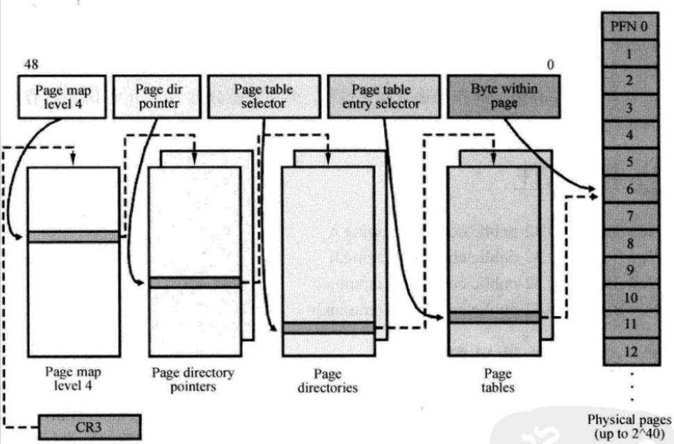

​	关于其中的每一级PTE，可以使用如下结构进行描述：

```c
typedef union _PAGE_ENTRY_64
{
	ULONG64 Value;
	struct 
    {
		ULONG64 Present : 1;
		ULONG64 Write : 1;
		ULONG64 User : 1;
		ULONG64 WriteThrough : 1;
		ULONG64 CacheDisable : 1;
		ULONG64 Accessed : 1;
		ULONG64 Dirty : 1;
		ULONG64 LargePage : 1;
		ULONG64 Global : 1;
		ULONG64 CopyOnWrite : 1;
		ULONG64 Prototype : 1;
		ULONG64 Reserved0 : 1;
		ULONG64 PageFrameNumber : 36;
		ULONG64 Reserved1 : 4;
		ULONG64 SoftwareWsIndex : 11;
		ULONG64 NoExecute : 1;
	};
} PAGE_ENTRY_64, *PPAGE_ENTRY_64;
```

​	由于x64下内核地址通常位于高地址空间，因此这里没有从 `PML4[0]` 开始全量遍历，而是直接枚举 `PML4[256] ~ PML4[511]` 这部分条目，把扫描范围收敛到内核态虚拟地址区间。遍历过程中，只保留满足 `Present = 1` 且 `NoExecute = 0` 的页表项，也就是当前真实存在、并且具备执行权限的页面；其余不可执行页、未映射页则直接跳过。

​	对于命中的可执行页，再结合是否`属于已知模块映像范围`进行一次过滤，就可以把大量正常内核模块代码排除掉，把关注点集中到那些不属于任何已加载模块、但却具备执行权限的匿名内存区域上。对于手动映射驱动、重映射驱动这类 `Shellcode` 驱动而言，这类区域往往就是后续重点分析的对象。

​	如下为关键部分代码：

```c
VOID PteWalk(VOID)
{
    ULONG64 Cr3 = __readcr3();
    ULONG64 Pml4Pa = Cr3 & (~0xFFF);
    PHYSICAL_ADDRESS PhysicalAddress = { 0 };
    PAGE_ENTRY_64* Pml4;

    PhysicalAddress.QuadPart = Pml4Pa;
    Pml4 = (PAGE_ENTRY_64*)MmGetVirtualForPhysical(PhysicalAddress);
    if (!MmIsAddressValid(Pml4))
    {
        return;
    }

    for (ULONG i = 256; i < 512; i++)
    {
        PAGE_ENTRY_64 Pml4e = Pml4[i];
        if (!Pml4e.Present)
        {
            continue;
        }

        PhysicalAddress.QuadPart = Pml4e.PageFrameNumber << PAGE_SHIFT;
        PAGE_ENTRY_64* Pdpt = (PAGE_ENTRY_64*)MmGetVirtualForPhysical(PhysicalAddress);
        if (!MmIsAddressValid(Pdpt))
        {
            continue;
        }

        for (ULONG j = 0; j < 512; j++)
        {
            PAGE_ENTRY_64 Pdpte = Pdpt[j];
            if (!Pdpte.Present)
            {
                continue;
            }

            if (Pdpte.LargePage)
            {
                if (!Pdpte.NoExecute)
                {
                    ULONG64 Va = BuildLinearAddr(i, j, 0, 0);
                    LogPageRange(Va, 1ull << 30, BuildRwxValue(Pdpte.Write != 0, TRUE), "1GB");
                }
                continue;
            }

            PhysicalAddress.QuadPart = Pdpte.PageFrameNumber << PAGE_SHIFT;
            PAGE_ENTRY_64* Pd = (PAGE_ENTRY_64*)MmGetVirtualForPhysical(PhysicalAddress);
            if (!MmIsAddressValid(Pd))
            {
                continue;
            }

            for (ULONG k = 0; k < 512; k++)
            {
                PAGE_ENTRY_64 Pde = Pd[k];
                if (!Pde.Present)
                {
                    continue;
                }

                if (Pde.LargePage)
                {
                    if (!Pde.NoExecute)
                    {
                        ULONG64 Va = BuildLinearAddr(i, j, k, 0);
                        LogPageRange(Va, 1ull << 21, BuildRwxValue(Pde.Write != 0, TRUE), "2MB");
                    }
                    continue;
                }

                PhysicalAddress.QuadPart = Pde.PageFrameNumber << PAGE_SHIFT;
                PAGE_ENTRY_64* Pt = (PAGE_ENTRY_64*)MmGetVirtualForPhysical(PhysicalAddress);
                if (!MmIsAddressValid(Pt))
                {
                    continue;
                }

                for (ULONG l = 0; l < 512; l++)
                {
                    PAGE_ENTRY_64 Pte = Pt[l];
                    if (!Pte.Present || Pte.NoExecute)
                    {
                        continue;
                    }

                    ULONG64 Va = BuildLinearAddr(i, j, k, l);
                    ULONG Rwx = BuildRwxValue(Pte.Write != 0, TRUE);
                    Append4KbPageRange(&Page4KbRange, Va, Rwx);
                }
            }
        }
    }

    FlushRange(&Page4KbRange);
}
```


### 4.2 Win11 25H2环境下测试

​	在Win11 25H2环境下测试，顺利枚举出所有的可执行内存页面信息，如图所示：

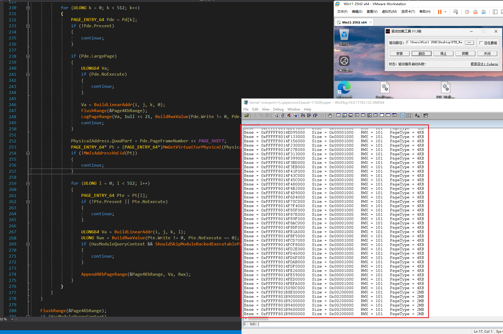


### 4.3 通过扫描可执行内核页面检测Shellcode驱动

​	这里的测试流程同`PoolBigPageTable`，先扫描一次PTE列表、加载靶场驱动、再扫描一次PTE列表，此时前后新增的可执行PTE条目大概率就是`Shellcode`驱动所在的内存范围，如图所示顺利扫描到靶场驱动所在Pool内存范围：

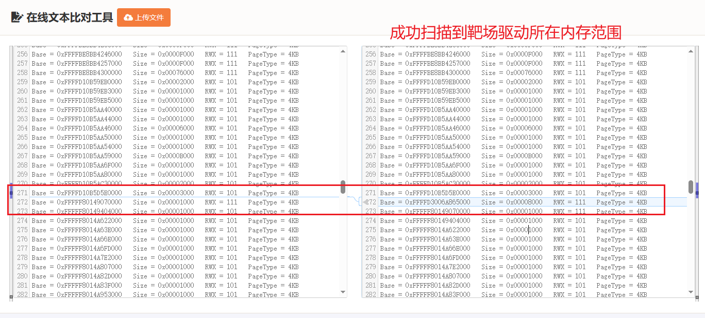


### 4.4 小结

​	看到这里，读者应该注意到一个细节，第3、4章节都是介绍如何利用内核下内存相关的机制，效果都是可以定位出`靶场驱动`的内存范围（起始地址、大小），那么定位到可疑的内存范围后，我们该如何利用呢？

​	第5章就是在确定了可疑的匿名内存范围后，利用`编译器特征`来进一步扫描。


## 5. 利用编译器特征扫描"无痕"驱动

### 5.1 利用导入表特征检测原理

​	在经过第3、4章节的铺垫后，我们已经顺利确定我们的`"无痕"靶场驱动`的可疑内存范围，接下来就是针对这段可疑的匿名内存，扫描其中是否存在编译器特征。

​	扫描编译器特征，笔者这里首先要介绍的是利用导入特征，使用IDA打开我们`靶场驱动`，切换到`Imports`页面，如图所示有着较多的导入函数：

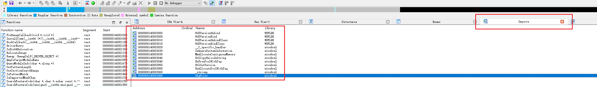

​	我们随便选中一项，这里以`DbgPrint`为例，双击跳转，来到idata节区：

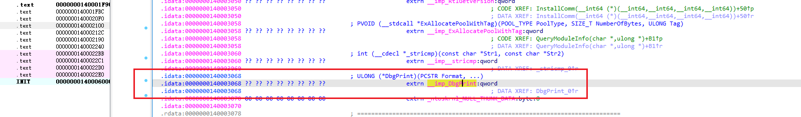

​	选中该项，背景标黄色后，查看其xref信息，来到其反汇编界面，可以看到这里的调用其实是编译器的导入Stub：

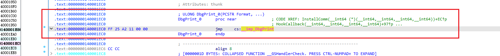

​	在 x64 平台下，这类编译器生成的导入 `Stub`，常见形式就是一条RIP 相对寻址的间接跳转指令：

```c
jmp qword ptr [rip+xxxx]
    
// 其机器码通常表现为：
FF 25 xx xx xx xx
```

​	这里的 FF 25 只是指令头，后面的 `disp32` 并不是最终导入函数地址，而是一个相对于当前指令末尾的偏移。程序执行到这里时，会先根据 `RIP + disp32` 定位到一项导入槽位，再从该地址中解引用出真正的函数指针，最终跳转到 `ntoskrnl.exe`、`Wdf01000.sys` 一类正常内核模块中的导出函数。

​	当我们已经通过前文的 `PTE Walk` 、`PoolBigPageTable扫描`锁定了一段匿名、可执行、且不属于任何已加载模块的可疑内存后，就可以继续在这段范围内扫描 `FF 25` 特征码。如果命中的位置在解引用后，最终跳转目标落在正常模块地址范围内，那么这往往就是一个非常典型的`导入表 Stub 特征`。对于一份经过重映射、手动映射、甚至已经抹除 PE 头的 Shellcode 驱动来说，虽然它的模块外观特征已经被剥离掉了，但编译器生成的这类导入跳转痕迹却往往仍然保留在代码段中。

​	如下为关键代码，传入我们扫描出来的可疑、匿名内存的起始地址、范围，即可开始扫描导入Stub特征：

```c
static ULONG ScanImportJumpTargets(IN ULONG_PTR SearchStartAddr,IN SIZE_T SearchSize)
{
    ULONG ModuleCount = 0;
    if (!QueryModuleSnapshot(NULL, 0, &ModuleCount) || ModuleCount == 0)
    {
        return 0;
    }

    PMODULE_ADDRESS_RANGE ModuleRanges = (PMODULE_ADDRESS_RANGE)ExAllocatePoolWithTag(
        NonPagedPoolNx,
        sizeof(MODULE_ADDRESS_RANGE) * (ModuleCount + 16),
        IMPORT_SCAN_TAG);
    if (ModuleRanges == NULL)
    {
        return 0;
    }

    if (!QueryModuleSnapshot(ModuleRanges, ModuleCount + 16, &ModuleCount))
    {
        ExFreePoolWithTag(ModuleRanges, IMPORT_SCAN_TAG);
        return 0;
    }

    ULONG HitCount = 0;
    PUCHAR SearchBase = (PUCHAR)SearchStartAddr;
    for (SIZE_T Index = 0; Index + 6 <= SearchSize; ++Index)
    {
        if (SearchBase[Index] != 0xFF || SearchBase[Index + 1] != 0x25)
        {
            continue;
        }

        ULONG_PTR TargetFunction = 0;
        __try
        {
            LONG RelativeOffset = *(LONG*)(SearchBase + Index + 2);
            ULONG_PTR ImportThunk = SearchStartAddr + Index + 6 + RelativeOffset;
            TargetFunction = *(ULONG_PTR*)ImportThunk;
        }
        __except (EXCEPTION_EXECUTE_HANDLER)
        {
            continue;
        }

        PMODULE_ADDRESS_RANGE ModuleRange = FindModuleByAddress(
            ModuleRanges,
            ModuleCount,
            TargetFunction);
        if (ModuleRange == NULL)
        {
            continue;
        }

        PCCHAR ExportName = LookupExportNameByAddress(ModuleRange->ImageStart, TargetFunction);
        DbgPrintEx(
            DPFLTR_IHVDRIVER_ID,
            DPFLTR_INFO_LEVEL,
            "可疑调用 Module = %s   ImportThunk = 0x%p   TargetFunc = 0x%p   FuncName = %s. \n",
            ModuleRange->ModuleName,
            (PVOID)(SearchStartAddr + Index),
            (PVOID)TargetFunction,
            ExportName != NULL ? ExportName : "Unknown");

        ++HitCount;
    }

    ExFreePoolWithTag(ModuleRanges, IMPORT_SCAN_TAG);
    return HitCount;
}
```


### 5.2 测试结果

​	测试环境为`Win11 25H2`，将前一步扫描得到的可疑匿名内存范围硬编码到测试工程中，测试效果如下所示，成功在可疑内存范围扫描到正常的`导入表Stub特征`：

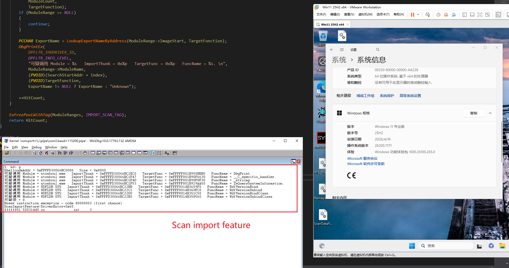


### 5.3 剥离导入表Stub特征

​	既然前文已经证明，匿名可执行内存中的 `FF 25` 导入 `Stub` 可以作为一类较强的编译器特征，那么一个很自然的思路就是：不再依赖静态导入表。这样一来，编译器就不会再为这些导入函数生成成片的 `jmp qword ptr [rip+xxxx]` 跳转桩，IDA 中的 `Imports` 页面也会随之大幅减少，甚至不再保留那些敏感 API 的显式导入项。


### 5.4 延迟导入API

​	既然不依赖静态导入表，就需要驱动在运行时动态找到对应函数的绝对地址进行调用，驱动开发中，我们需要调用的大部分函数都是由`ntoskrnl.exe`进行导出，这个延迟导入必须做到以下几点：

- 不依赖任何接口，获取`ntoskrnl`内核模块地址
- 解析`ntoskrnl`模块的PE结构，解析其导出表
- 解析导出表中函数名称字符串时，需要动态计算其字符串Hash值（如果采用字符串直接对比，会在`靶场驱动`PE文件中留下敏感字符串痕迹）
- 根据函数名Hash对比，取到目标函数绝对地址

关于这个库，笔者花了点时间实现了以上几点，其中关键代码实现如下所示：

```c
PVOID GetntoskrnlExportAddressByHash(ULONG FunctionHash)
{
    if (FunctionHash == 0)
    {
        return NULL;
    }

    ULONG64 ModuleBase = (ULONG64)GetKernelBaseWithoutAPI();
    if (ModuleBase == NULL)
    {
        return NULL;
    }

    PIMAGE_DOS_HEADER DosHeader = (PIMAGE_DOS_HEADER)ModuleBase;
    PIMAGE_NT_HEADERS NtHeader = (PIMAGE_NT_HEADERS)(ModuleBase + (ULONG)DosHeader->e_lfanew);
    IMAGE_DATA_DIRECTORY ExportDataDirectory = NtHeader->OptionalHeader.DataDirectory[IMAGE_DIRECTORY_ENTRY_EXPORT];

    if (ExportDataDirectory.VirtualAddress == 0 ||
        ExportDataDirectory.Size < sizeof(IMAGE_EXPORT_DIRECTORY))
    {
        return NULL;
    }

    PIMAGE_EXPORT_DIRECTORY ExportDirectory =(PIMAGE_EXPORT_DIRECTORY)(ModuleBase + ExportDataDirectory.VirtualAddress);
    PULONG AddressOfFunctions = (PULONG)(ModuleBase + ExportDirectory->AddressOfFunctions);
    PULONG AddressOfNames = (PULONG)(ModuleBase + ExportDirectory->AddressOfNames);
    PUSHORT AddressOfNameOrdinals = (PUSHORT)(ModuleBase + ExportDirectory->AddressOfNameOrdinals);

    for (ULONG i = 0; i < ExportDirectory->NumberOfNames; i++)
    {
        PCHAR ExportName = (PCHAR)(ModuleBase + AddressOfNames[i]);
        if (KernelRuntimeImport::detail::StringHashConstexpr(ExportName) == FunctionHash)
        {
            USHORT OrdinalIndex = AddressOfNameOrdinals[i];
            return (PVOID)(ModuleBase + AddressOfFunctions[OrdinalIndex]);
        }
    }

    return NULL;
}
```


## 6. 扫描被劫持的系统调用指针

​	前文中介绍了2种扫描可疑、匿名内存的方式，以及根据编译器导入特征扫描可疑内存的方法。这些操作都是针对于`靶场驱动`内存方面的检测。

​	在本章节中，会讲解如何检测所谓的"隐蔽"通讯，也就是剖析如何扫描`ntoskrnl`模块中疑似被劫持的CFG点。


### 6.1 扫描 ntoskrnl 中的 CFG 间接调用点

​	 本节的目标，不再是扫描匿名可执行内存，而是反过来从 ntoskrnl.exe 自身入手，检查其中那些可能被用于隐蔽通讯的 CFG 间接调用点是否被异常修改。整体思路并不复杂，可以概括为下面 `5` 步：

- 先定位 ntoskrnl 中的 __guard_dispatch_icall
- 再搜索 .text、PAGE 节区里所有对它的 call
- 对每个命中的 call，向前回溯查找对应的 mov rax, [rip+disp32]
- 解析出真实的数据指针槽位地址，并读取其中保存的回调函数地址
- 最后判断这个回调地址是否仍然落在正常模块范围内


### 6.2 定位当前内核中的 __guard_dispatch_icall

​	由于不同版本内核的实现细节存在差异，这里并没有依赖固定偏移，而是按照`构建号`选择不同的特征码进行搜索：

```c
ULONG_PTR GetGuardDispatchAddress(VOID)
{
    ULONG_PTR CodeAddr = 0;
    RTL_OSVERSIONINFOW VersionInformation = { 0 };
    RtlGetVersion(&VersionInformation);

    // Win10 19041 ~ Win11 24H2
    if (VersionInformation.dwBuildNumber >= 19041 && VersionInformation.dwBuildNumber < 26200)
    {
        CodeAddr = SearchFeatureCode(
            "ntoskrnl.exe",
            "PAGE",
            (PCUCHAR)"\x48\x8B\x05\xB9\xF6\x51\x00\x85\xC9\x49\x8B\xCA\x41\x0F\x95\xC0\xE8\x93\x1F\xD0\xFF\x48\x83\xC4\x38\xC3",
            "xxx????xxxxxxxxxx????xxx?x",
            16);
    }
    // Win11 25H2 or higher
    else if (VersionInformation.dwBuildNumber >= 26200)
    {
        CodeAddr = SearchFeatureCode(
            "ntoskrnl.exe",
            "PAGE",
         (PCUCHAR)"\x48\x8B\x05\xA4\x10\x53\x00\x4C\x8D\x4C\x24\x44\x8B\xD7\x48\x8B\xCB\xE8\xAD\x46\xCD\xFF\x89\x44\x24\x40\xE9\x4F\x17\x00\x00",
            "xxx????xxxx?xxxxxx????xxx?x????",
            17);
    }

    PVOID GuardDispatchAddress = DEREF_RELATIVE_ADDR(PVOID, CodeAddr, 1);
    return (ULONG_PTR)GuardDispatchAddress;
}
```


### 6.3 扫描内核模块代码中所有对 __guard_dispatch_icall 的调用

​	拿到 `__guard_dispatch_icall` 的地址后，第二步就是在 `ntoskrnl` 的 `.text` 和 `PAGE` 节区中，搜索所有直接 `call` 到它的位置。因为 x64 下相对调用通常表现为 `E8 + disp32`，所以这里只需要在目标节区中逐字节扫描 `0xE8`，再把相对偏移还原成真实调用目标即可：

```c
static ULONG SearchGuardDispatchCallsInSection(
    IN ULONG_PTR ModuleBase,
    IN PCCHAR SectionName,
    IN ULONG_PTR GuardDispatchAddress,
    IN PLIST_ENTRY CallList)
{
    ULONG_PTR SectionStart = 0;
    ULONG_PTR SectionEnd = 0;
    if (CallList == NULL || !QuerySectionRange(ModuleBase, SectionName, &SectionStart, &SectionEnd))
    {
        return 0;
    }

    ULONG HitCount = 0;
    for (ULONG_PTR Code = SectionStart; Code + 5 <= SectionEnd; ++Code)
    {
        if (*(PUCHAR)Code != 0xE8)
        {
            continue;
        }

        LONG RelativeOffset = *(PLONG)(Code + 1);
        ULONG_PTR CallTarget = Code + 5 + RelativeOffset;
        if (CallTarget != GuardDispatchAddress)
        {
            continue;
        }

        PGUARD_DISPATCH_CALL_ENTRY CallEntry =
            (PGUARD_DISPATCH_CALL_ENTRY)ExAllocatePoolWithTag(
                NonPagedPoolNx,
                sizeof(GUARD_DISPATCH_CALL_ENTRY),
                GUARD_CALL_TAG);

        if (CallEntry == NULL)
        {
            break;
        }

        RtlZeroMemory(CallEntry, sizeof(GUARD_DISPATCH_CALL_ENTRY));
        CallEntry->CodeAddr = Code;
        InsertTailList(CallList, &CallEntry->ListEntry);

        ++HitCount;
    }

    return HitCount;
}
```


### 6.4 还原数据指针槽位

​	对于这类 `CFG` 间接调用点，其前面通常会有一条类似下面这样的取值指令：

```c
mov rax, [rip+disp32]
```

​	其作用就是先从某个全局槽位中取出函数指针，再交给后面的 __guard_dispatch_icall 去完成最终分发。因此，当前实现采用了一种比较直接的办法：对每个命中的 call __guard_dispatch_icall，向前回溯 0x40 字节，搜索最近的一条 `48 8B 05`，也就是 mov rax, [rip+disp32] 指令。

```c
static VOID AnalyzeGuardDispatchCallList ( IN PLIST_ENTRY CallList)
{
    if (CallList == NULL)
    {
        return;
    }

    for (PLIST_ENTRY ListEntry = CallList->Flink; ListEntry != CallList; )
    {
        PLIST_ENTRY NextEntry = ListEntry->Flink;
        PGUARD_DISPATCH_CALL_ENTRY CallEntry = CONTAINING_RECORD(
            ListEntry,
            GUARD_DISPATCH_CALL_ENTRY,
            ListEntry);

        ULONG_PTR SearchStart = CallEntry->CodeAddr - 0x40;
        ULONG_PTR SearchEnd = CallEntry->CodeAddr;
        ULONG_PTR MovRaxCodeAddr = 0;

        for (ULONG_PTR Code = SearchStart; Code + 7 <= SearchEnd; ++Code)
        {
            PUCHAR Bytes = (PUCHAR)Code;
            if (Bytes[0] == 0x48 && Bytes[1] == 0x8B && Bytes[2] == 0x05)
            {
                MovRaxCodeAddr = Code;
            }
        }

        if (MovRaxCodeAddr == 0)
        {
            RemoveEntryList(&CallEntry->ListEntry);
            ExFreePoolWithTag(CallEntry, GUARD_CALL_TAG);
            ListEntry = NextEntry;
            continue;
        }

        CallEntry->MovRaxCodeAddr = MovRaxCodeAddr;
        CallEntry->DataPtrAddr = (ULONG_PTR)DEREF_RELATIVE_ADDR(PVOID, MovRaxCodeAddr, 3);
        if (!MmIsAddressValid((PVOID)CallEntry->DataPtrAddr))
        {
            RemoveEntryList(&CallEntry->ListEntry);
            ExFreePoolWithTag(CallEntry, GUARD_CALL_TAG);
            ListEntry = NextEntry;
            continue;
        }

        CallEntry->CallbackAddr = *(PULONG_PTR)CallEntry->DataPtrAddr;
        if (!IsKernelAddress(CallEntry->CallbackAddr) ||
            !MmIsAddressValid((PVOID)CallEntry->CallbackAddr))
        {
            RemoveEntryList(&CallEntry->ListEntry);
            ExFreePoolWithTag(CallEntry, GUARD_CALL_TAG);
            ListEntry = NextEntry;
            continue;
        }

        ListEntry = NextEntry;
    }
}
```


### 6.5 过滤正常CFG点

​	仅仅拿到槽位地址和回调地址，还不足以说明它一定被劫持。为了减少误报，当前实现又补了两层过滤。

​	第一层过滤，是要求这个保存回调指针的槽位本身必须位于 `ntoskrnl.exe` 的 `.data` 节区中。因为本文关注的是"内核自身数据区中的函数指针槽位被修改"这一类场景，如果槽位都不在 `.data`，那大概率并不是本文要找的目标：

```c
static VOID FilterGuardDispatchCallListByDataSection (IN PLIST_ENTRY CallList)
{
    ULONG ModuleSize = 0;
    ULONG_PTR ModuleBase = QueryModuleInfo("ntoskrnl.exe", &ModuleSize);
    if (ModuleBase == 0)
    {
        return;
    }

    ULONG_PTR DataStart = 0;
    ULONG_PTR DataEnd = 0;
    if (!QuerySectionRange(ModuleBase, ".data", &DataStart, &DataEnd))
    {
        return;
    }

    for (PLIST_ENTRY ListEntry = CallList->Flink; ListEntry != CallList; )
    {
        PLIST_ENTRY NextEntry = ListEntry->Flink;
        PGUARD_DISPATCH_CALL_ENTRY CallEntry = CONTAINING_RECORD(
            ListEntry,
            GUARD_DISPATCH_CALL_ENTRY,
            ListEntry);

        if (!(CallEntry->DataPtrAddr >= DataStart && CallEntry->DataPtrAddr < DataEnd))
        {
            RemoveEntryList(&CallEntry->ListEntry);
            ExFreePoolWithTag(CallEntry, GUARD_CALL_TAG);
        }

        ListEntry = NextEntry;
    }
}
```

​	第二层过滤，则是检查槽位里当前保存的回调函数地址，是否仍然落在某个正常加载模块的映像范围内。如果该地址位于 `ntoskrnl.exe`、`Wdf01000.sys` 或其它合法模块的 [ImageBase, ImageEnd) 区间内，说明它大概率仍然是合法回调；反之，如果它落在`匿名内存`、`非模块区域`，或者其它异常地址，那么这类点就值得重点关注，演示代码中会将可疑点打印输出：

```c
static VOID FilterGuardDispatchCallListByModuleSnapshot (
    IN PLIST_ENTRY CallList,
    IN PMODULE_ADDRESS_RANGE ModuleRanges,
    IN ULONG ModuleCount)
{
    if (CallList == NULL || ModuleRanges == NULL || ModuleCount == 0)
    {
        return;
    }

    for (PLIST_ENTRY ListEntry = CallList->Flink; ListEntry != CallList; )
    {
        PLIST_ENTRY NextEntry = ListEntry->Flink;
        PGUARD_DISPATCH_CALL_ENTRY CallEntry = CONTAINING_RECORD(
            ListEntry,
            GUARD_DISPATCH_CALL_ENTRY,
            ListEntry);

        BOOLEAN IsValidModuleAddress = FALSE;
        for (ULONG Index = 0; Index < ModuleCount; ++Index)
        {
            if (CallEntry->CallbackAddr >= ModuleRanges[Index].ImageStart &&
                CallEntry->CallbackAddr < ModuleRanges[Index].ImageEnd)
            {
                IsValidModuleAddress = TRUE;
                break;
            }
        }

        if (IsValidModuleAddress)
        {
            RemoveEntryList(&CallEntry->ListEntry);
            ExFreePoolWithTag(CallEntry, GUARD_CALL_TAG);
        }
        else
        {
            KdPrint(("Exception ---------- Call = 0x%p   MovRax = 0x%p   Slot = 0x%p   Callback = 0x%p. \n",
                (PVOID)CallEntry->CodeAddr,
                (PVOID)CallEntry->MovRaxCodeAddr,
                (PVOID)CallEntry->DataPtrAddr,
                (PVOID)CallEntry->CallbackAddr));
        }

        ListEntry = NextEntry;
    }
}
```


### 6.6 扫描、检测测试

​	测试系统环境为`Win11 25H2`，顺利扫描出被`靶场驱动`所劫持的系统调用指针，如图所示：

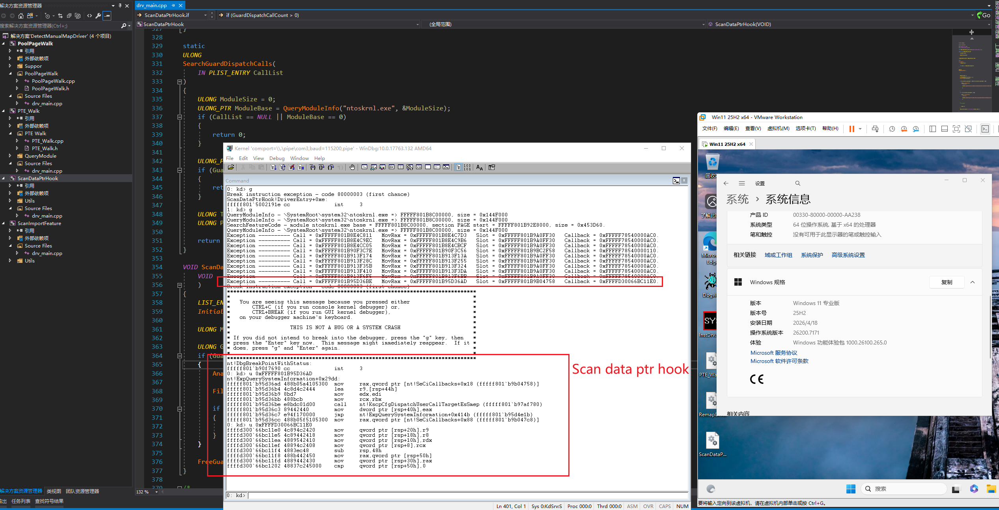


### 6.7 绕过常规的指针扫描

​	关于绕过扫描，笔者这里仅给出简答思路，构造一个跳板，隐藏真实的通讯回调入口，在跳板函数中解密出真正的回调，再进行调用，`伪代码`如下（随手写的，不保证能用）：

```c
sub rsp, 100h
mov rax, g_HookCommEncrypted
xor rax, g_XorKey
call rax
add rsp, 100h
ret
```

​	在驱动初始化时，动态修复上述的跳板Shellcode，之后在正常、合法模块内搜索一处`内存空洞`，将跳板Shellcode放置过去。

​	当然，这种也只是奇技淫巧罢了。成熟、完备的检测方案，往往还会重载内核文件，对比回调函数指纹是否正确。	


## 7. Github开源仓库地址

​	IDA脚本：扫描函数引用、特征码生成脚本：[IDA-Scripts](https://github.com/Shinn-Home/IDA-Scripts)

​	重映射靶场驱动、"隐蔽"通讯框架：[RemapDriver](https://github.com/Shinn-Home/RemapDriver)

​	PoolBigPageTable对象分析与扫描：[PoolBigPageTable](https://github.com/Shinn-Home/DetectManualMapDriver)

​	枚举内核态下所有的可执行PTE条目：[PTE_Walk](https://github.com/Shinn-Home/DetectManualMapDriver)

​	根据编译器导入Stub特征进行扫描：[ScanImportFeature](https://github.com/Shinn-Home/DetectManualMapDriver)

​	扫描当前内核下疑似被劫持的CFG项：[ScanDataPtrHook](https://github.com/Shinn-Home/DetectManualMapDriver)

​	驱动运行时动态导入API：[KernelRuntimeImport](https://github.com/Shinn-Home/KernelRuntimeImport)


## 8. 结束语

​	如果各位朋友看完本文觉得有所帮助、启发，欢迎点赞、收藏本文。另外，本文所涉及到的教学代码均已完整开源到Github，欢迎给仓库Star！
