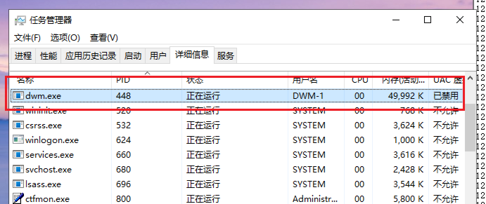

<!--more-->

## 全局句柄表

1. 与`私有句柄表`不同的是，全局句柄表中只保存了进程、线程的对象
2. 在内核开发中，我们常用的`PsLookupProcessByProcessId`、`PsLookupThreadByThreadId`内部其实就是去查全局句柄表的
3. 关于全局句柄表，它其实是一个内核态的全局变量`PspClientTable`，如下所示：

```c
2: kd> dq PspCidTable
fffff803`432fb5d0  ffffe78c`d321bc80 ffffbf01`4c4c4d20
fffff803`432fb5e0  00000000`00000000 00010000`00000000
fffff803`432fb5f0  00000000`00001000 00000000`00000000
fffff803`432fb600  00000000`00000000 00008d01`00000000

2: kd> dt _handle_table ffffe78c`d321bc80
nt!_HANDLE_TABLE
   +0x000 NextHandleNeedingPool : 0x1c00
   +0x004 ExtraInfoPages   : 0n0
   +0x008 TableCode        : 0xffffe78c`d6bee001	// 这里是一个二级句柄表
   +0x010 QuotaProcess     : (null) 				// 全局句柄表，无所属进程对象
												    // 全局句柄表有且只有一张，所以这个链表首尾都是自己（ListEntry挂在腰上的）
													// 如果是私有句柄表，就是通过这个对象，遍历出所有的私有句柄表对象
   +0x018 HandleTableList  : _LIST_ENTRY [ 0xffffe78c`d321bc98 - 0xffffe78c`d321bc98 ]	
   +0x028 UniqueProcessId  : 0
   +0x02c Flags            : 1
   +0x02c StrictFIFO       : 0y1
   +0x02c EnableHandleExceptions : 0y0
   +0x02c Rundown          : 0y0					// 从变量名，推测记录当前状态是否销毁
   +0x02c Duplicated       : 0y0
   +0x02c RaiseUMExceptionOnInvalidHandleClose : 0y0
   +0x030 HandleContentionEvent : _EX_PUSH_LOCK
   +0x038 HandleTableLock  : _EX_PUSH_LOCK			// 访问、修改这个表都要事先获取锁
   +0x040 FreeLists        : [1] _HANDLE_TABLE_FREE_LIST
   +0x040 ActualEntry      : [32]  ""
   +0x060 DebugInfo        : (null) 
```

4. 可以发现，全局句柄表、私有句柄表其实都是`HANDLE_TABLE`对象，所以很多对象是共通的，其中的`TableCode`指向的是`内核对象数组`，最多也是3级表

| 系统区别   |                                                 |
| ---------- | ----------------------------------------------- |
| 早期32位   | 内核对象数组中，直接保存`PEPROCESS`、`PETHREAD` |
| 高版本64位 | 存在加密问题，右移16位解密（高位补1）           |


## PEPROCESS解密实验

1. 全局句柄表中的保存的对象，在32位、Win7 64位下是直`明文`保存的
2. 在Win10 x64上是加密的，解密方式就绪将取到的对象`右移16位`
3. 测试在全局句柄表中找到`dwm.exe`进程信息，计算句柄表上的索引：448 / 4 = 112（0x70）



4. 取出全局句柄表PspClientTable，继续实验：

```c
0: kd> dq PspCidTable
fffff803`432fb5d0  ffffe78c`d321bc80 ffffbf01`4c4c4d20
fffff803`432fb5e0  00000000`00000000 00010000`00000000
fffff803`432fb5f0  00000000`00001000 00000000`00000000
fffff803`432fb600  00000000`00000000 00008d01`00000000
fffff803`432fb610  00000000`00000000 00000000`00000000
fffff803`432fb620  00000000`00000000 00000000`00000000
fffff803`432fb630  00000000`00000000 00000000`00000000
fffff803`432fb640  ffffbf01`4c4b7980 fffff803`43646000

0: kd> dt _HANDLE_TABLE ffffe78c`d321bc80
nt!_HANDLE_TABLE
   +0x000 NextHandleNeedingPool : 0x1c00
   +0x004 ExtraInfoPages   : 0n0
   +0x008 TableCode        : 0xffffe78c`d6bee001
   +0x010 QuotaProcess     : (null) 
   +0x018 HandleTableList  : _LIST_ENTRY [ 0xffffe78c`d321bc98 - 0xffffe78c`d321bc98 ]
   +0x028 UniqueProcessId  : 0
   +0x02c Flags            : 1
   +0x02c StrictFIFO       : 0y1
   +0x02c EnableHandleExceptions : 0y0
   +0x02c Rundown          : 0y0
   +0x02c Duplicated       : 0y0
   +0x02c RaiseUMExceptionOnInvalidHandleClose : 0y0
   +0x030 HandleContentionEvent : _EX_PUSH_LOCK
   +0x038 HandleTableLock  : _EX_PUSH_LOCK
   +0x040 FreeLists        : [1] _HANDLE_TABLE_FREE_LIST
   +0x040 ActualEntry      : [32]  ""
   +0x060 DebugInfo        : (null) 

0: kd> dq 0xffffe78c`d6bee000
ffffe78c`d6bee000  ffffe78c`d329f000 ffffe78c`d6bd5000
ffffe78c`d6bee010  ffffe78c`d708b000 ffffe78c`d7687000
ffffe78c`d6bee020  ffffe78c`d7c24000 ffffe78c`d80ea000
ffffe78c`d6bee030  ffffe78c`d8956000 00000000`00000000
ffffe78c`d6bee040  00000000`00000000 00000000`00000000
```

5. 由于`112（0x70）`明显小于4096 / 16 = 256，所有其在第一张表中，继续计算其索引：

```c
0: kd> dq ffffe78c`d329f000 + 70 * 10
ffffe78c`d329f700  bf0150ab`b080f77d 00000000`00000000
```

6. 将`bf0150ab`b080f77d`右移0x10解密后得到`FFFFBF01`50ABB080`，使用WinDbg调试，顺利得到DWM进程的`EPROCESS`对象：

```c
0: kd> dt _EPROCESS FFFFBF01`50ABB080
nt!_EPROCESS
   +0x000 Pcb              : _KPROCESS
   +0x438 ProcessLock      : _EX_PUSH_LOCK
   +0x440 UniqueProcessId  : 0x00000000`000001c0 Void
   +0x448 ActiveProcessLinks : _LIST_ENTRY [ 0xffffbf01`50ad1648 - 0xffffbf01`509af648 ]
   +0x458 RundownProtect   : _EX_RUNDOWN_REF
   +0x460 Flags2           : 0xd000
   +0x460 JobNotReallyActive : 0y0
   +0x460 AccountingFolded : 0y0
   +0x460 NewProcessReported : 0y0
   +0x460 ExitProcessReported : 0y0
   +0x460 ReportCommitChanges : 0y0
   +0x460 LastReportMemory : 0y0
   +0x460 ForceWakeCharge  : 0y0
   +0x460 CrossSessionCreate : 0y0
   +0x460 NeedsHandleRundown : 0y0
   +0x460 RefTraceEnabled  : 0y0
   +0x460 PicoCreated      : 0y0
   +0x460 EmptyJobEvaluated : 0y0
   +0x460 DefaultPagePriority : 0y101
   +0x460 PrimaryTokenFrozen : 0y1
   +0x460 ProcessVerifierTarget : 0y0
   +0x460 RestrictSetThreadContext : 0y0
   +0x460 AffinityPermanent : 0y0
   +0x460 AffinityUpdateEnable : 0y0
   +0x460 PropagateNode    : 0y0
   +0x460 ExplicitAffinity : 0y0
   +0x460 ProcessExecutionState : 0y00
   +0x460 EnableReadVmLogging : 0y0
   +0x460 EnableWriteVmLogging : 0y0
   +0x460 FatalAccessTerminationRequested : 0y0
   +0x460 DisableSystemAllowedCpuSet : 0y0
   +0x460 ProcessStateChangeRequest : 0y00
   +0x460 ProcessStateChangeInProgress : 0y0
   +0x460 InPrivate        : 0y0
   +0x464 Flags            : 0x144d0c01
   +0x464 CreateReported   : 0y1
   +0x464 NoDebugInherit   : 0y0
   +0x464 ProcessExiting   : 0y0
   +0x464 ProcessDelete    : 0y0
   +0x464 ManageExecutableMemoryWrites : 0y0
   +0x464 VmDeleted        : 0y0
   +0x464 OutswapEnabled   : 0y0
   +0x464 Outswapped       : 0y0
   +0x464 FailFastOnCommitFail : 0y0
   +0x464 Wow64VaSpace4Gb  : 0y0
   +0x464 AddressSpaceInitialized : 0y11
   +0x464 SetTimerResolution : 0y0
   +0x464 BreakOnTermination : 0y0
   +0x464 DeprioritizeViews : 0y0
   +0x464 WriteWatch       : 0y0
   +0x464 ProcessInSession : 0y1
   +0x464 OverrideAddressSpace : 0y0
   +0x464 HasAddressSpace  : 0y1
   +0x464 LaunchPrefetched : 0y1
   +0x464 Background       : 0y0
   +0x464 VmTopDown        : 0y0
   +0x464 ImageNotifyDone  : 0y1
   +0x464 PdeUpdateNeeded  : 0y0
   +0x464 VdmAllowed       : 0y0
   +0x464 ProcessRundown   : 0y0
   +0x464 ProcessInserted  : 0y1
   +0x464 DefaultIoPriority : 0y010
   +0x464 ProcessSelfDelete : 0y0
   +0x464 SetTimerResolutionLink : 0y0
   +0x468 CreateTime       : _LARGE_INTEGER 0x01dc11c0`4eff830a
   +0x470 ProcessQuotaUsage : [2] 0x9d28
   +0x480 ProcessQuotaPeak : [2] 0xada0
   +0x490 PeakVirtualSize  : 0x00000201`18d1f000
   +0x498 VirtualSize      : 0x00000201`15ba0000
   +0x4a0 SessionProcessLinks : _LIST_ENTRY [ 0xffffbf01`52321660 - 0xffffbf01`5091f5a0 ]
   +0x4b0 ExceptionPortData : 0xffffbf01`4f326810 Void
   +0x4b0 ExceptionPortValue : 0xffffbf01`4f326810
   +0x4b0 ExceptionPortState : 0y000
   +0x4b8 Token            : _EX_FAST_REF
   +0x4c0 MmReserved       : 0
   +0x4c8 AddressCreationLock : _EX_PUSH_LOCK
   +0x4d0 PageTableCommitmentLock : _EX_PUSH_LOCK
   +0x4d8 RotateInProgress : (null) 
   +0x4e0 ForkInProgress   : (null) 
   +0x4e8 CommitChargeJob  : (null) 
   +0x4f0 CloneRoot        : _RTL_AVL_TREE
   +0x4f8 NumberOfPrivatePages : 0x31b4
   +0x500 NumberOfLockedPages : 0x21fa
   +0x508 Win32Process     : 0xffffaabb`00776870 Void
   +0x510 Job              : (null) 
   +0x518 SectionObject    : 0xffffe78c`d6b4cf80 Void
   +0x520 SectionBaseAddress : 0x00007ff6`c9a50000 Void
   +0x528 Cookie           : 0x1ccbef90
   +0x530 WorkingSetWatch  : (null) 
   +0x538 Win32WindowStation : 0x00000000`000000d0 Void
   +0x540 InheritedFromUniqueProcessId : 0x00000000`00000270 Void
   +0x548 OwnerProcessId   : 0x270
   +0x550 Peb              : 0x00000043`138dd000 _PEB
   +0x558 Session          : 0xffffd380`96920000 _MM_SESSION_SPACE
   +0x560 Spare1           : (null) 
   +0x568 QuotaBlock       : 0xffffbf01`50919cc0 _EPROCESS_QUOTA_BLOCK
   +0x570 ObjectTable      : 0xffffe78c`d6add340 _HANDLE_TABLE
   +0x578 DebugPort        : (null) 
   +0x580 WoW64Process     : (null) 
   +0x588 DeviceMap        : 0xffffe78c`d6a21120 Void
   +0x590 EtwDataSource    : 0xffffbf01`509a3790 Void
   +0x598 PageDirectoryPte : 0
   +0x5a0 ImageFilePointer : 0xffffbf01`509cb790 _FILE_OBJECT
   +0x5a8 ImageFileName    : [15]  "dwm.exe"
    // ...
```
