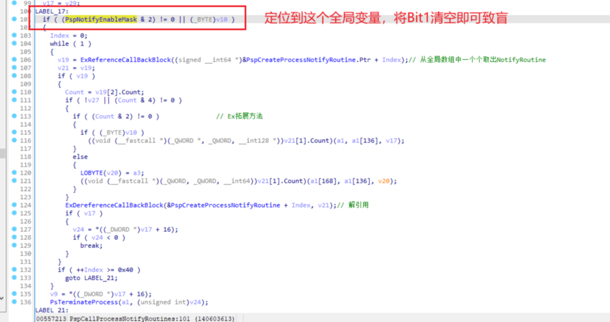
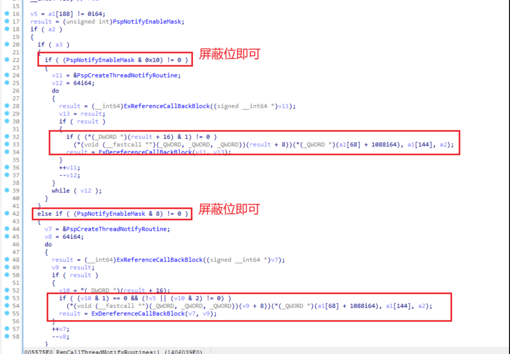
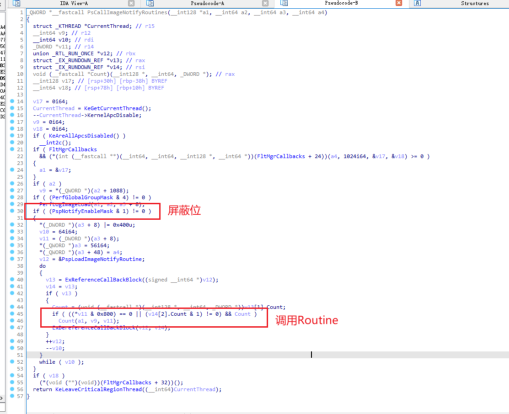

<!--more-->

## 进程创建回调使用场景

1. 在EDR、反作弊开发中，往往会在进程创建回调中扫描进程特征，看看是不是病毒、已知的外挂样本
2. 如果匹配到特征了，那么就拒绝创建进程

## 线程创建回调使用场景

1. 在反作弊中，可以判断当前线程是不是属于游戏进程创建的，如果是，就继续判断该线程的入口点地址，是不是不属于任何一个等级在册的DLL模块，可以用来检测Shellcode线程

## 镜像加载回调使用场景

1. 防止DLL注入、劫持：可以检测当前加载的DLL模块签名，如果不是白名单中的签名，就拒绝加载即可
2. 禁止加载驱动模块：在手动查毒的场景中，我们可以自己挂一个回调，拦截所有内核模块的加载，当然，镜像加载回调中并不存在直接拦截加载的方式，所以我们需要手动解析PE头，算出来EP地址，对着入口点下一个Inline Hook拦截即可

## 屏蔽监控回调（致盲EDR）

1. 在某些特殊应用场景下，是可以暂时屏蔽监控回调的，因为不管是进程、线程、镜像回调，在调用回调例程前，都会判断`PspNotifyEnableMask`这个内核全局变量，这个变量中不同的位可以控制是否启用某个监控回调，如图所示：

2. 当然，也有一种粗狂的屏蔽方式，在保存了原始`PspNotifyEnableMask`数值后，直接将其置零，之后再恢复。这种做法就是屏蔽全局的进程、线程、镜像加载回调
