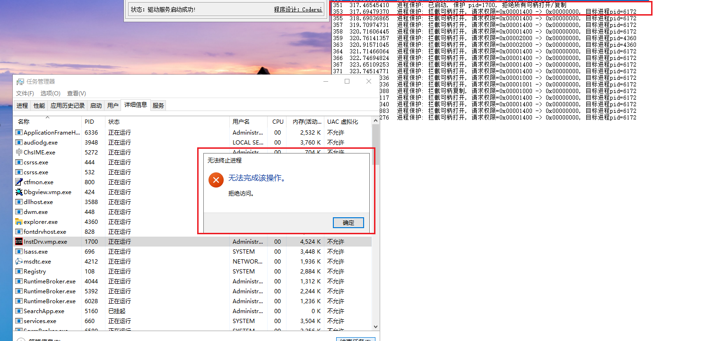

<!--more-->

1. 在杀软、EDR场景中我们需要保护主进程（主引擎）、在游戏反作场景中需要保护游戏进程
2. 早期实现进程保护，是在内核中下各种深层次的InlineHook，导致内核中布满了各种钩子，对系统稳定性造成极大的影响
3. 后来微软一寻思，既然大家都有保护进程的需求，那么我来提供一个Ob回调钩子吧，把回调函数注册进来，你们自己来处理句柄权限问题


## 注册Ob进程回调钩子（进程保护）

1. 要注册Ob进程保护钩子，使用函数如下：

```c
NTSTATUS ObRegisterCallbacks(
  [in]  POB_CALLBACK_REGISTRATION CallbackRegistration,
  [out] PVOID                     *RegistrationHandle
);
```

2. 注册的关键在于构造`CallbackRegistration`对象，代码如下所示：

```c
EXTERN_C
NTSTATUS
DriverEntry(
	_In_ PDRIVER_OBJECT DriverObject,
	_In_ PUNICODE_STRING RegistryPath)
{
	OB_OPERATION_REGISTRATION Operations[1];
	OB_CALLBACK_REGISTRATION Registration;
	NTSTATUS Status;

	UNREFERENCED_PARAMETER(RegistryPath);

	DriverObject->DriverUnload = ObMonUnload;

	// 默认拿"当前进程"当保护目标，方便直接看效果
	g_Pid = (ULONG)6088;

	RtlZeroMemory(Operations, sizeof(Operations));

	// 进程类型的Ob构造回调
	Operations[0].ObjectType = PsProcessType;

	// 处理进程句柄打开、复制
	Operations[0].Operations = OB_OPERATION_HANDLE_CREATE | OB_OPERATION_HANDLE_DUPLICATE;
	Operations[0].PreOperation = ObMonPreOperation;

	// Post回调不关心
	Operations[0].PostOperation = NULL;   

	RtlInitUnicodeString(&g_Altitude, L"320000");

	RtlZeroMemory(&Registration, sizeof(Registration));
	Registration.Version = OB_FLT_REGISTRATION_VERSION;
	Registration.OperationRegistrationCount = 1;
	Registration.Altitude = g_Altitude;
	Registration.RegistrationContext = NULL;
	Registration.OperationRegistration = Operations;

	Status = ObRegisterCallbacks(&Registration, &g_ObHandle);
	if (!NT_SUCCESS(Status))
	{
		DbgPrint("进程保护: ObRegisterCallbacks 注册失败 0x%08X\n", Status);
		return Status;
	}

	DbgPrint("进程保护: 启动成功, 保护 pid=%u, 拒绝所有句柄打开/复制\n", g_Pid);

	return STATUS_SUCCESS;
}
```

3. 回调函数中，判断打开的进程是不是受保护进程，如果是就抹去所有的权限：

```c
OB_PREOP_CALLBACK_STATUS
ObMonPreOperation(
	_In_ PVOID RegistrationContext,
	_Inout_ POB_PRE_OPERATION_INFORMATION Info
)
{
	ACCESS_MASK Original;
	UNREFERENCED_PARAMETER(RegistrationContext);

	// 只管进程对象
	if (Info->ObjectType != *PsProcessType)
	{
		return OB_PREOP_SUCCESS;
	}

	// 不是保护目标就放行
	if (PsGetProcessId((PEPROCESS)Info->Object) != (HANDLE)(ULONG_PTR)g_Pid)
	{
		return OB_PREOP_SUCCESS;
	}

	// 把本次请求的权限清零
	if (Info->Operation == OB_OPERATION_HANDLE_CREATE)
	{
		Original = Info->Parameters->CreateHandleInformation.OriginalDesiredAccess;
		Info->Parameters->CreateHandleInformation.DesiredAccess = 0;
	}
	else
	{
		Original = Info->Parameters->DuplicateHandleInformation.OriginalDesiredAccess;
		Info->Parameters->DuplicateHandleInformation.DesiredAccess = 0;
	}

	DbgPrint("进程保护: 拦截%s, 请求权限=0x%08X -> 0x00000000, 目标进程pid=%u\n",
		(Info->Operation == OB_OPERATION_HANDLE_CREATE) ? "句柄打开" : "句柄复制",
		Original,
		(ULONG)(ULONG_PTR)PsGetCurrentProcessId()
	);

	return OB_PREOP_SUCCESS;
}
```

4. 编译驱动，放到虚拟机中测试，我们这里注册失败了，错误码`0xC0000022`，这其实是驱动签名校验失败了，这里增加补丁代码，手动Patch我们的驱动对象：

```c
((PLDR_DATA_TABLE_ENTRY64)pDriver->DriverSection)->Flags |= 0x20;
```

5. 重新编译驱动，顺利注册表Ob句柄回调，笔者这里保护的是一个安装驱动的工具，顺利实现进程保护，任务管理器无法结束进程：



6. 关于卸载Ob回调函数，代码如下：

```c
VOID
ObMonUnload(
	_In_ PDRIVER_OBJECT DriverObject)
{
	UNREFERENCED_PARAMETER(DriverObject);

	if (g_ObHandle != NULL)
	{
		ObUnRegisterCallbacks(g_ObHandle);
		g_ObHandle = NULL;
	}

	DbgPrint("进程保护卸载成功. \n");
}
```


## 注册Ob线程回调构造（线程保护）

1. 注册线程Ob句柄钩子跟进程操作差不多，这里就不再赘述了


## 初见误区

1. 这里笔者要强调一点，Ob回调钩子并不能阻止将句柄插入到私有句柄表，能做的只是`修改句柄权限`


## 海拔高度问题

1. 在注册进程、线程Ob回调时，海拔高度越高，那么就能越早接收到句柄打开（复制）操作的通知，Pre、Post回调与海拔高度之间的关系，如下所示：

```c
                Pre                  Post
高 Altitude     A  ───────────────→  A
                ↓                    ↑
                B  ───────────────→  B
                ↓                    ↑
低 Altitude     C  ───────────────→  C
                ↓                    ↑
                Configuration Manager
```

2. 那么就引出来了一个`漏洞`问题，早期某些Rootkit会注册一个海拔非常低的Ob回调，重新把句柄权限修改为满权限，实现破除保护的效果

3. 所以作为反作弊开发者，需要定时扫描私有句柄表内容，发现某进程持有了游戏进程句柄，并且权限异常高，就需要清除其权限
