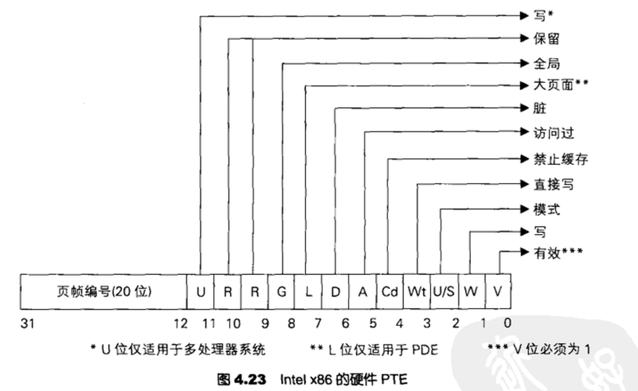
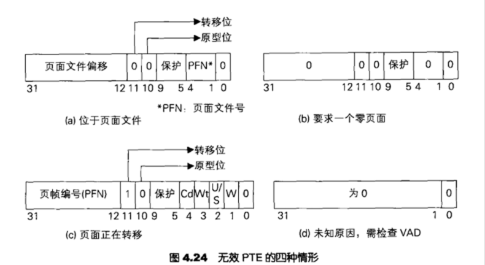

<!--more-->

## 内核态高地址共享

1. 不管是32还是64位系统下，高2GB的内核态空间都是共享的
2. 实现这一原理，在四级分页保护情况下，PML4T中的高一半PML4E条目（256~511）是完全相同的，32位系统同理
3. `PTE Hook`原理，这种Hook方式可以避免PG蓝屏，实现方式是针对指定进程，从目标PML4T页表就开始隔离


## PTE

1. 这里简单复习一下，在64位系统下，经过PML4E、PDPTE、PDE三次寻址后，得到的64位值就是PTE
2. 当`PTE.Present = 1`时，说明这是一个建立了有效物理页面映射的PTE，可以让CPU正常寻址访问，此时该PTE叫做硬件PTE
3. 当`PTE.Present = 0`时，说明当前PTE没有建立有效的物理页面映射，当首次分配内存尚未使用、内存短缺时换出到磁盘时就会出现这种情况，此时该PTE称为软件PTE，供Win内核内存管理器使用（必要时挂物理页面、磁盘内存换入）修复异常


## 硬件PTE

1. 前文已经提到了，硬件PTE建立了正确物理页面映射，可以让CPU MMU正常寻址、访问
2. 其实硬件PTE的属性定位，跟普通的PTE定义没什么区别，如图所示（属性位定义都一样）：



3. 关于硬件PTE，其定义如下所示，可以发现，硬件PTE其实我们最早解除到的PTE类型：

```c
//0x8 bytes (sizeof)
struct _MMPTE_HARDWARE
{
    ULONGLONG Valid:1;                                                      //0x0
    ULONGLONG Dirty1:1;                                                     //0x0
    ULONGLONG Owner:1;                                                      //0x0
    ULONGLONG WriteThrough:1;                                               //0x0
    ULONGLONG CacheDisable:1;                                               //0x0
    ULONGLONG Accessed:1;                                                   //0x0
    ULONGLONG Dirty:1;                                                      //0x0
    ULONGLONG LargePage:1;                                                  //0x0
    ULONGLONG Global:1;                                                     //0x0
    ULONGLONG CopyOnWrite:1;                                                //0x0
    ULONGLONG Unused:1;                                                     //0x0
    ULONGLONG Write:1;                                                      //0x0
    ULONGLONG PageFrameNumber:36;                                           //0x0
    ULONGLONG ReservedForHardware:4;                                        //0x0
    ULONGLONG ReservedForSoftware:4;                                        //0x0
    ULONGLONG WsleAge:4;                                                    //0x0
    ULONGLONG WsleProtection:3;                                             //0x0
    ULONGLONG NoExecute:1;                                                  //0x0
}; 
```


## 软件PTE（无效PTE）

1. 前文已经提到过了，软件PTE（也可以叫无效PTE），是不存在正确物理页面映射的，是供Win内核内存管理器使用的，此时`PTE.Present = 0`，剩下的属性位，是用于指示这是一个首次访问尚未挂页、还是内容被换出到磁盘
2. 这里简单总结一下系统修复流程：访问到无效PTE，触发`#PF`异常，系统解析该PTE，识别是哪种异常：
   1. 内存紧缺导致内容换出到磁盘，解析PTE，得知是哪个PageFile文件、文件内偏移（注意这里的文件内偏移粒度是4KB，很好理解，因为内存的换出、换入肯定也是以页面为粒度进行操作的），此时系统分配一块独立的物理页面，将内容从磁盘回读，再将PFN挂在该PTE下，将Present = 1，告诉CPU重试
   2. 首次分配内存：从系统空闲物理内存中分配一个页面，将PFN挂在该PTE下，将Present = 1，告诉CPU重试

3. 关于无效PTE的几种情况，如图所示：



4. 关于软件PTE，其定义如下所示，可以发现，其中的字段内容都是帮助内存管理器MM修复错误用的：

```c
//0x8 bytes (sizeof)
struct _MMPTE_SOFTWARE
{
    ULONGLONG Valid:1;                                                      //0x0
    ULONGLONG PageFileReserved:1;                                           //0x0
    ULONGLONG PageFileAllocated:1;                                          //0x0
    ULONGLONG ColdPage:1;                                                   //0x0
    ULONGLONG SwizzleBit:1;                                                 //0x0
    ULONGLONG Protection:5;                                                 //0x0
    ULONGLONG Prototype:1;                                                  //0x0
    ULONGLONG Transition:1;                                                 //0x0
    ULONGLONG PageFileLow:4;                                                //0x0
    ULONGLONG UsedPageTableEntries:10;                                      //0x0
    ULONGLONG ShadowStack:1;                                                //0x0
    ULONGLONG Unused:5;                                                     //0x0
    ULONGLONG PageFileHigh:32;                                              //0x0
}; 
```


## PTE自映射

1. 首先我们得确定一个认知，在CPU视角中，给它一个线性地址，它可以通过MMU进行四级寻址，最终定位到对应的物理页面，这是CPU的硬件工作流程，速度是很快的
2. 但是在操作系统层面，往往需要大量、频繁地管理内存（维护内存属性），于是Win内核就建立了一种高效的`自映射`机制，可以高效地管理线性地址
3. Win内核中存在一个全局变量为`MmPTEBase`，在早期的版本Win7、Win10中，是导出到一个固定的线性地址`0xFFFFF68000000000`，后期出于安全性考虑，改为了随机的内核态线性地址
4. `MmPTEBase`指向的其实是一个类似`数组`的对象，其中包含了大量的PML4E、PDPTE、PDE、PTE，这样操作系统自身拿到一个线性地址，就能快速拆分，定位到各级映射表项入口


## MmPTEBase的作用

1. 在前文中已经简单介绍了`PTE自映射`，那么如何通过一个线性地址，快速计算得到其PML4E、PDPTE、PDE、PTE，方法如下：

```c
MiGetPteAddress(x) = MmPteBase + (((UINT64)x >> 9) & 0x7FFFFFFFF8ull);

PTE   = MiGetPteAddress(va);
PDE   = MiGetPteAddress(PTE);
PDPTE = MiGetPteAddress(PDE);
PML4E = MiGetPteAddress(PDPTE);
```

2. 关于上述这个计算公式，一步步理解如下：

```c
// 1. 首先计算出PT Index
PE_Index = Va >> 12
    
// 2. 由于MmPTEBase'数组'中每个成员8字节
PE_Offset = (Va >> 12) * 8 = Va >> 9
    
// 3. MmPTEBase数组必定是8字节对齐、去除高16位的符号位
PE_Offset = (Va >> 9) & 0x7FFFFFFFF8ull
    
// 4. 最终得到公式
MiGetPteAddress(x) = MmPteBase + (Va >> 9) & 0x7FFFFFFFF8ull
    
// 5. 需要注意的是，这里的MiGetPteAddress(x)得到的是MmPTEBase中的虚拟地址，是自映射出来的
```

3. 这里初见可能会有点迷惑，通过MmPTEBase、还是Cr3一层层寻址算出来得到的各级PML4E、PDPTE、PDE、PTE以及最后的物理页面，都是一样的


## MmIsAddressValid原理

1. 在了解了PTE自映射原理后，我们知道可以通过MmPTEBase，将一个线性地址La的PML4E、PDPTE、PDE、PTE快速计算出来
2. 此时从一层层分别判断表项入口的Present位是否有效即可
3. 判断PDPTE、PDE如果是大页，会提前判断结束
4. 使用`MmIsAddressValid`判断一个线性地址是否有效是不安全的！在MSDN文档页提及了这一点：不建议使用该函数
   1. 因为使用该函数判定一个指针是否有效，只能判断该指针的1字节，如果地址跨页，判断就不准了
