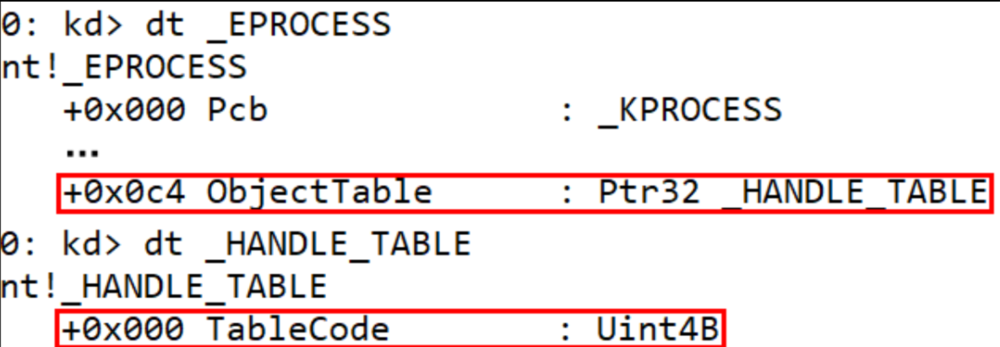
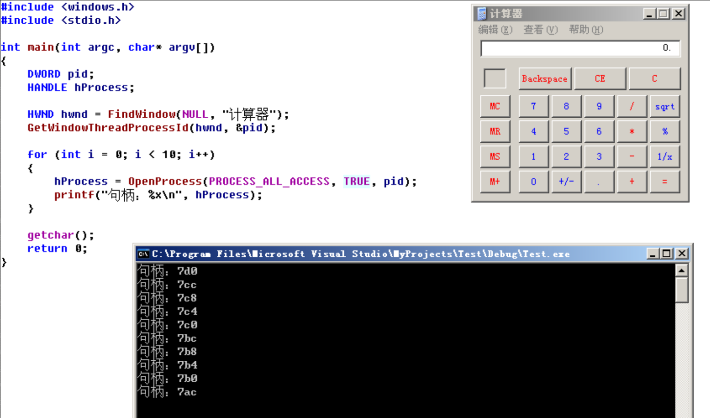
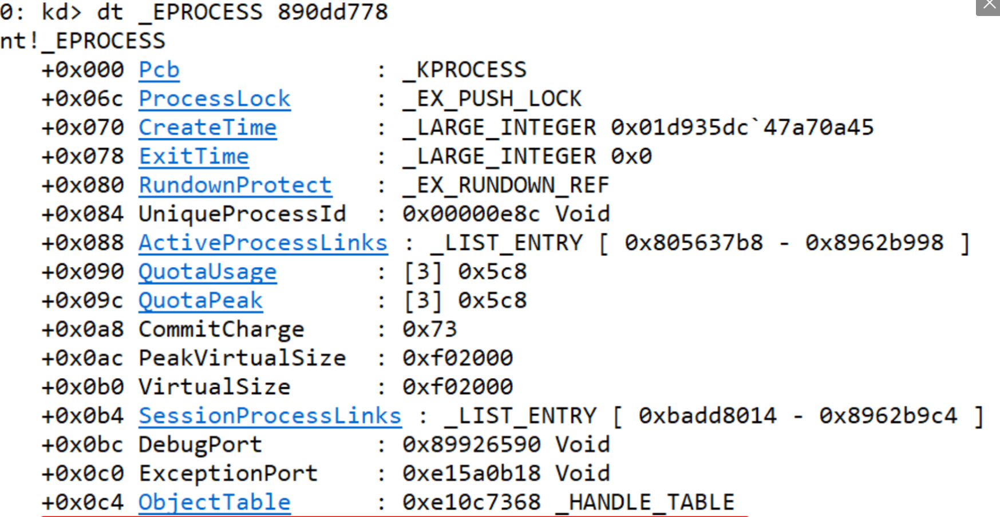
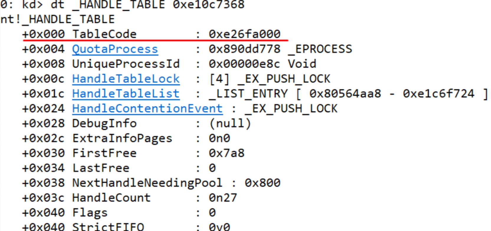
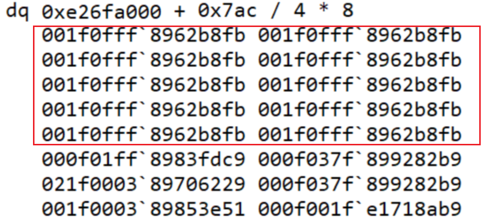
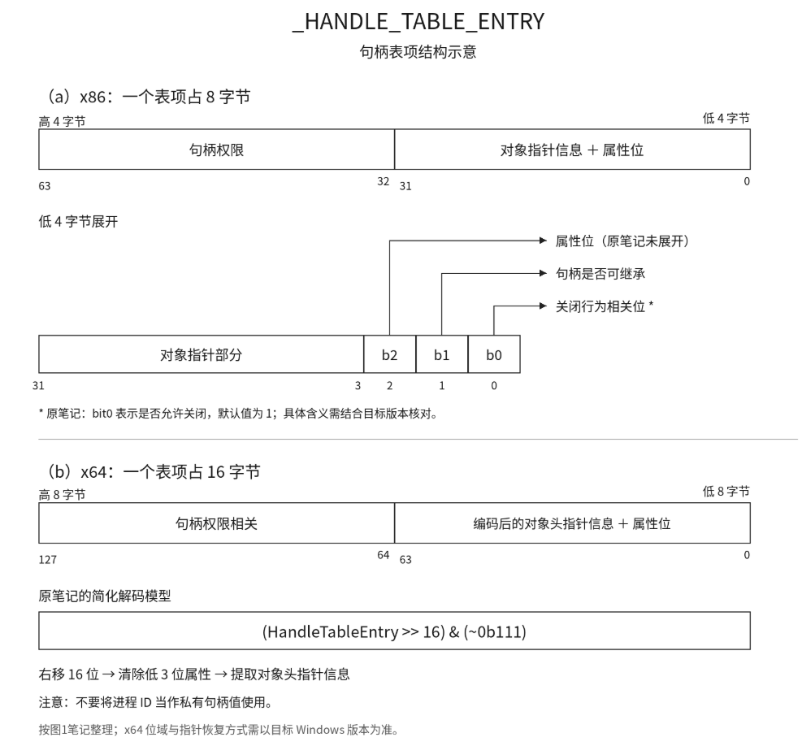

<!--more-->

## 私有句柄表

1. 操作系统是不允许用户态的代码直接操作内核对象的，所以就设置句柄这个东西，将一个具体的内核对象抽象出一个句柄，这个句柄赋予其属性、权限后，就可以暴露给用户态进程了
2. 当一个进程打开了一个文件、进程、线程、节区、定时器对象时，所获得的就是一个句柄对象，也叫私有句柄，这个私有句柄本质上是私有句柄表中的一个`索引`
3. 当多个、单个进程反复打开同一个内核对象时，系统并不会创建多份对象副本，而是将该内核对象保存到`私有句柄表`中，再返回一个索引值暴露给用户态的程序


## 私有句柄表保存位置

1. 我们有了基础概念后，知道句柄这个东西属于进程级别私有的，那么必定是保存在进程对象下的，即保存在`EPROCESS`下，如下所示（Win10 x64）：

```c
//0x880 bytes
struct _EPROCESS
{
    struct _KPROCESS Pcb;                                                   //0x0
	// ...
    struct _HANDLE_TABLE* ObjectTable;                                      //0x418
	// ...
}; 

//0x80 bytes
struct _HANDLE_TABLE
{
    ULONG NextHandleNeedingPool;                                            //0x0
    LONG ExtraInfoPages;                                                    //0x4
    volatile ULONGLONG TableCode;                                           //0x8
    struct _EPROCESS* QuotaProcess;                                         //0x10
    struct _LIST_ENTRY HandleTableList;                                     //0x18
    ULONG UniqueProcessId;                                                  //0x28
	// ...
}; 
```

2. 在双机调试情况下，也可以查看，如图所示（早期Win版本）




## 私有句柄表实验

1. 首先我们的测试代码如下所示，可以反复打开计算器的进程句柄：



2. 在WinDbg中查看句柄表，如下所示：



3. 查看`ObjectTable`，如图所示：



4. 这里的`TableCode`指向的就是私有句柄表，这个句柄表有以下注意事项：
   1. 32、64位系统下：TableCode的低2位为属性位，表示句柄表层级，最多为3级句柄表，在枚举句柄表时，需要去除属性位，得到的才是句柄表的指针，即TableCode & ~0b11
   2. 32、64位系统下：私有句柄表可以粗浅认为是一个数组，其中的成员为`HANDLE_TABLE_ENTRY`，句柄数值 / 4就数值下标
5. 如下图所示，就能找到10个一模一样的句柄值（进程对象系统、权限系统）：



6. 关于这个句柄表项解析，如图所示，不管是32、64位下的句柄表项，有着以下几点：
   1. 句柄表项中保存着`句柄权限`、该内核对象的`OBJECT_HEADER`、`附加属性`
   2. x64下的句柄表项比较特殊，需要右移16位进行解密（高位补1）




## 内核对象头OBJECT_HEADER

1. `OBJECT_HEADER`在32、64位下其实变动不大，大小为0x18、0x30，从对象大小也能判断出来字段成员定义一样，仅仅是指针大小改变引起的，该对象定义如下所示：

```c
//0x18 byt (sizeof)
struct _OBJECT_HEADER
{
    LONG PointerCount;                                                      //0x0
    union
    {
        LONG HandleCount;                                                   //0x4
        VOID* NextToFree;                                                   //0x4
    };
    struct _OBJECT_TYPE* Type;                                              //0x8
    UCHAR NameInfoOffset;                                                   //0xc
    UCHAR HandleInfoOffset;                                                 //0xd
    UCHAR QuotaInfoOffset;                                                  //0xe
    UCHAR Flags;                                                            //0xf
    union
    {
        struct _OBJECT_CREATE_INFORMATION* ObjectCreateInfo;                //0x10
        VOID* QuotaBlockCharged;                                            //0x10
    };
    VOID* SecurityDescriptor;                                               //0x14
}; 
```

2. 关于这个对象头，比较重要的字段定义如下所示：

| 字段成员     | 定义                         |
| ------------ | ---------------------------- |
| PointerCount | 该内核对象的引用计数         |
| HandleCount  | 有多少个个句柄指向该内核对象 |
| Type         | 该内核对象的类型             |


## 内核对象OBJECT_TYPE

1. 定义如下所示

```c
//0xd8 bytes (sizeof)
struct _OBJECT_TYPE
{
    struct _LIST_ENTRY TypeList;                                            //0x0
    struct _UNICODE_STRING Name;                                            //0x10
    VOID* DefaultObject;                                                    //0x20
    UCHAR Index;                                                            //0x28
    ULONG TotalNumberOfObjects;                                             //0x2c
    ULONG TotalNumberOfHandles;                                             //0x30
    ULONG HighWaterNumberOfObjects;                                         //0x34
    ULONG HighWaterNumberOfHandles;                                         //0x38
    struct _OBJECT_TYPE_INITIALIZER TypeInfo;                               //0x40
    struct _EX_PUSH_LOCK TypeLock;                                          //0xb8
    ULONG Key;                                                              //0xc0
    struct _LIST_ENTRY CallbackList;                                        //0xc8
}; 
```

2. 关于`OBJECT_TYPE`这个对象，其中关键字段定义如下：

| 成员字段     | 定义                                                         |
| ------------ | ------------------------------------------------------------ |
| TypeList     | 保存在全局的ObTypeIndexTable中                               |
| Name         | 该TypeObject的名称，例如"Process"、"Thread"                  |
| Index        | 该类型在ObTypeIndexTable数值中的下标                         |
| TypeInfo     | 重点字段，下文详细展开                                       |
| CallbackList | 保存着跟对象管理的所有回调，例如这是一个Process进程对象，那么就会保存着所有的Ob进程句柄回调 |

3. 在内核中，其实是有一张表，表中存储了所有的内核Type对象，使用WinDbg调试如下所示：

```c
0: kd> dq ObTypeIndexTable
fffff803`432fbe80  00000000`00000000 ffffd380`96164000
fffff803`432fbe90  ffffbf01`4c474d30 ffffbf01`4c474ea0
fffff803`432fbea0  ffffbf01`4c49f7a0 ffffbf01`4c49fd20
fffff803`432fbeb0  ffffbf01`4c49fbc0 ffffbf01`4c49fe80
fffff803`432fbec0  ffffbf01`4c49f900 ffffbf01`4c49fa60
fffff803`432fbed0  ffffbf01`4c49f4e0 ffffbf01`4c49f0c0
fffff803`432fbee0  ffffbf01`4c49f640 ffffbf01`4c49f220
fffff803`432fbef0  ffffbf01`4c49f380 ffffbf01`4c4c5ae0

0: kd> dt _OBJECT_TYPE ffffbf01`4c49f900
nt!_OBJECT_TYPE
   +0x000 TypeList         : _LIST_ENTRY [ 0xffffbf01`4c49f900 - 0xffffbf01`4c49f900 ]
   +0x010 Name             : _UNICODE_STRING "Thread"
   +0x020 DefaultObject    : (null) 
   +0x028 Index            : 0x8 ''
   +0x02c TotalNumberOfObjects : 0x4f9
   +0x030 TotalNumberOfHandles : 0x5ef
   +0x034 HighWaterNumberOfObjects : 0x5b1
   +0x038 HighWaterNumberOfHandles : 0x677
   +0x040 TypeInfo         : _OBJECT_TYPE_INITIALIZER
   +0x0b8 TypeLock         : _EX_PUSH_LOCK
   +0x0c0 Key              : 0x65726854
   +0x0c8 CallbackList     : _LIST_ENTRY [ 0xffffbf01`4c49f9c8 - 0xffffbf01`4c49f9c8 ]
```

4. 其中我们关心的对象是`_OBJECT_TYPE_INITIALIZER`，定义如下：

```c
//0x78 bytes (sizeof)
struct _OBJECT_TYPE_INITIALIZER
{
    USHORT Length;                                                          //0x0
    union
    {
        USHORT ObjectTypeFlags;                                             //0x2
        struct
        {
            UCHAR CaseInsensitive:1;                                        //0x2
            UCHAR UnnamedObjectsOnly:1;                                     //0x2
            UCHAR UseDefaultObject:1;                                       //0x2
            UCHAR SecurityRequired:1;                                       //0x2
            UCHAR MaintainHandleCount:1;                                    //0x2
            UCHAR MaintainTypeList:1;                                       //0x2
            UCHAR SupportsObjectCallbacks:1;                                //0x2
            UCHAR CacheAligned:1;                                           //0x2
            UCHAR UseExtendedParameters:1;                                  //0x3
            UCHAR Reserved:7;                                               //0x3
        };
    };
    ULONG ObjectTypeCode;                                                   //0x4
    ULONG InvalidAttributes;                                                //0x8
    struct _GENERIC_MAPPING GenericMapping;                                 //0xc
    ULONG ValidAccessMask;                                                  //0x1c
    ULONG RetainAccess;                                                     //0x20
    enum _POOL_TYPE PoolType;                                               //0x24
    ULONG DefaultPagedPoolCharge;                                           //0x28
    ULONG DefaultNonPagedPoolCharge;                                        //0x2c
    VOID (*DumpProcedure)(VOID* arg1, struct _OBJECT_DUMP_CONTROL* arg2);   //0x30
    LONG (*OpenProcedure)(enum _OB_OPEN_REASON arg1, CHAR arg2, struct _EPROCESS* arg3, VOID* arg4, ULONG* arg5, ULONG arg6); //0x38
    VOID (*CloseProcedure)(struct _EPROCESS* arg1, VOID* arg2, ULONGLONG arg3, ULONGLONG arg4); //0x40
    VOID (*DeleteProcedure)(VOID* arg1);                                    //0x48
    union
    {
        LONG (*ParseProcedure)(VOID* arg1, VOID* arg2, struct _ACCESS_STATE* arg3, CHAR arg4, ULONG arg5, struct _UNICODE_STRING* arg6, struct _UNICODE_STRING* arg7, VOID* arg8, struct _SECURITY_QUALITY_OF_SERVICE* arg9, VOID** arg10); //0x50
        LONG (*ParseProcedureEx)(VOID* arg1, VOID* arg2, struct _ACCESS_STATE* arg3, CHAR arg4, ULONG arg5, struct _UNICODE_STRING* arg6, struct _UNICODE_STRING* arg7, VOID* arg8, struct _SECURITY_QUALITY_OF_SERVICE* arg9, struct _OB_EXTENDED_PARSE_PARAMETERS* arg10, VOID** arg11); //0x50
    };
    LONG (*SecurityProcedure)(VOID* arg1, enum _SECURITY_OPERATION_CODE arg2, ULONG* arg3, VOID* arg4, ULONG* arg5, VOID** arg6, enum _POOL_TYPE arg7, struct _GENERIC_MAPPING* arg8, CHAR arg9); //0x58
    LONG (*QueryNameProcedure)(VOID* arg1, UCHAR arg2, struct _OBJECT_NAME_INFORMATION* arg3, ULONG arg4, ULONG* arg5, CHAR arg6); //0x60
    UCHAR (*OkayToCloseProcedure)(struct _EPROCESS* arg1, VOID* arg2, VOID* arg3, CHAR arg4); //0x68
    ULONG WaitObjectFlagMask;                                               //0x70
    USHORT WaitObjectFlagOffset;                                            //0x74
    USHORT WaitObjectPointerOffset;                                         //0x76
}; 
```

5. 关于`OBJECT_TYPE_INITIALIZER`这个对象，其中关键字段定义如下：

| 成员字段                      | 定义                                                         |
| ----------------------------- | ------------------------------------------------------------ |
| SupportsObjectCallbacks       | 当该位置零，那么该对象所绑定的所有回调都会**失效**，会PG，但是调试场景下可以用来临时干掉Ob进程、线程保护， |
| ValidAccessMask、RetainAccess | 打开一个对象获取其句柄时，计算公式：期望权限 & ValidAccessMask \| RetainAccess，手法1：将DbgkDebugObject对象的ValidAccessMask = 0，这样全局的调试器都会失效    手法2：将RetainAccess = 0x1FFFFF，实现提权，但是句柄表中权限是满的，可以没枚举出来 |
| OpenProcedure、CloseProcedure | 打开、关闭该内核对象句柄时的回调，受PG保护                   |
