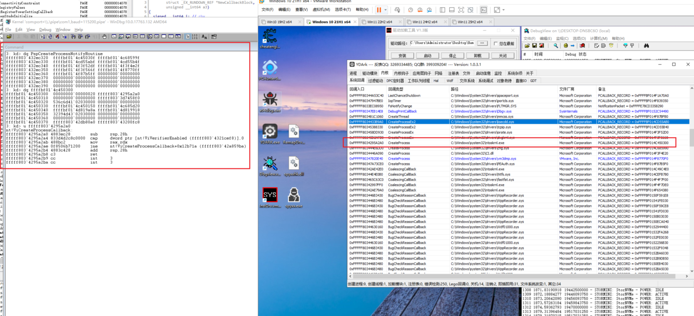
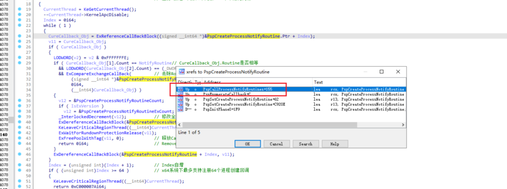
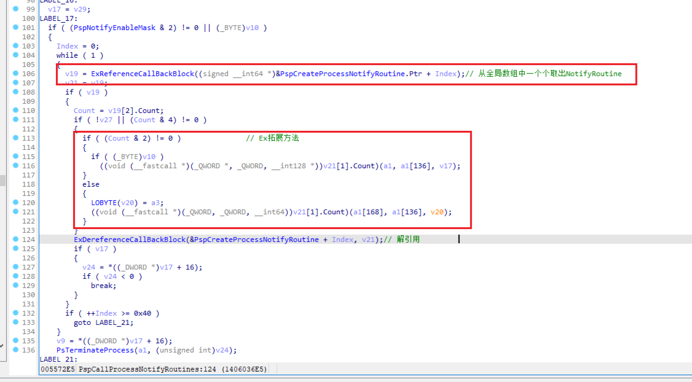
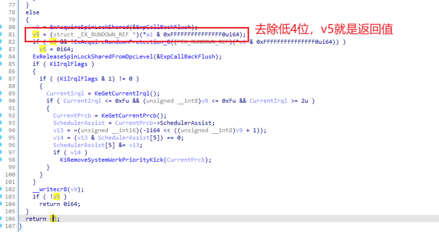

<!--more-->

## 进程创建回调

1. 注册进程创建回调，调用函数如下所示：

```c
NTSTATUS PsSetCreateProcessNotifyRoutine(
  [in] PCREATE_PROCESS_NOTIFY_ROUTINE NotifyRoutine,
  [in] BOOLEAN                        Remove
);
```

2. 关于回调的函数原型，如下所示：

```c
PCREATE_PROCESS_NOTIFY_ROUTINE PcreateProcessNotifyRoutine;

VOID PcreateProcessNotifyRoutine(
  [in] HANDLE ParentId,		// 父进程ID，双击exe运行，父进程一般就是资源管理器
  [in] HANDLE ProcessId,	// 当前进程ID
  [in] BOOLEAN Create		// TRUE = 创建进程，FALSE = 进程退出
)
{...}
```


## PsSetCreateProcessNotifyRoutine

1. `PsSetCreateProcessNotifyRoutine`本质上只是一个很薄的`Wrapper`
2. 内部直接调用`PspSetCreateProcessNotifyRoutine`

```c
NTSTATUS __stdcall PsSetCreateProcessNotifyRoutine(
	PCREATE_PROCESS_NOTIFY_ROUTINE NotifyRoutine, 
	BOOLEAN Remove
)
{
  return PspSetCreateProcessNotifyRoutine(
	  NotifyRoutine, 
	  Remove != 0
  );
}
```


## PsSetCreateProcessNotifyRoutineEx

1. `PsSetCreateProcessNotifyRoutineEx`本质上也是一个很薄的`Wrapper`
2. 内部也是直接调用`PspSetCreateProcessNotifyRoutine`

```c
NTSTATUS __stdcall PsSetCreateProcessNotifyRoutineEx(
	PCREATE_PROCESS_NOTIFY_ROUTINE_EX NotifyRoutine, 
	BOOLEAN Remove
)
{
  return PspSetCreateProcessNotifyRoutine(
	  (__int64)NotifyRoutine, 
	  (unsigned int)(Remove != 0) + 2
  );
}
```


## PspSetCreateProcessNotifyRoutine

1. 不管是常规版本、Ex拓展版本，最终都是调用`PspSetCreateProcessNotifyRoutine`函数，区别在于参数2的处理
2. Ex拓展版本相当于多设置了一个位：Arg2 = (unsigned int)(Remove != 0) | 0b10;
3. IDA分析如下所示：

```c
__int64 __fastcall PspSetCreateProcessNotifyRoutine(unsigned __int64 NotifyRoutine, unsigned int Remove)
{
  KSPIN_LOCK v2; // rbx
  unsigned int IsExVersion; // esi
  int v5; // edx
  struct _EX_RUNDOWN_REF *CallBack_Obj; // rdi
  __int64 Index_2; // rbx
  struct _KTHREAD *CurrentThread; // rbp
  __int64 Index; // r15
  struct _EX_RUNDOWN_REF *CureCallback_Obj; // rax
  struct _EX_RUNDOWN_REF *v11; // rdi
  volatile signed __int32 *v12; // rax

  v2 = Remove;
  IsExVersion = Remove & 2;                     // 取出Bit1位，判断上层调用方是常规还是Ex拓展版本
  if ( (Remove & 1) != 0 )                      // 如果是Remove，就走这里
                                                // 遍历"数组"中的64个元素，一个个对比判断
  {
    CurrentThread = KeGetCurrentThread();
    --CurrentThread->KernelApcDisable;
    Index = 0i64;
    while ( 1 )
    {
      CureCallback_Obj = ExReferenceCallBackBlock((signed __int64 *)&PspCreateProcessNotifyRoutine.Ptr + Index);
      v11 = CureCallback_Obj;
      if ( CureCallback_Obj )
      {
        LODWORD(v2) = v2 & 0xFFFFFFFE;
        if ( CureCallback_Obj[1].Count == NotifyRoutine// CureCallback_Obj.Routine是否相等
          && LODWORD(CureCallback_Obj[2].Count) == (_DWORD)v2
          && ExCompareExchangeCallBack(         // 去除Routing数组中的CurCallback_Obj
               (signed __int64 *)&PspCreateProcessNotifyRoutine.Ptr + Index,
               0i64,
               (__int64)CureCallback_Obj) )
        {
          v12 = &PspCreateProcessNotifyRoutineCount;
          if ( IsExVersion )
            v12 = &PspCreateProcessNotifyRoutineExCount;
          _InterlockedDecrement(v12);           // 修改全局计数，减1
          ExDereferenceCallBackBlock(&PspCreateProcessNotifyRoutine + Index, v11);
          KeLeaveCriticalRegionThread((__int64)CurrentThread);
          ExWaitForRundownProtectionRelease(v11);
          ExFreePoolWithTag(v11, 0);            // 释放Callback_Obj
          return 0i64;                          // Remove成功返回0
        }
        ExDereferenceCallBackBlock(&PspCreateProcessNotifyRoutine + Index, v11);
      }
      Index = (unsigned int)(Index + 1);        // Index自增
      if ( (unsigned int)Index >= 64 )          // x64系统下最多支持注册64个进程创建回调
      {
        KeLeaveCriticalRegionThread((__int64)CurrentThread);
        return 0xC000007Ai64;
      }
    }
  }
  if ( (Remove & 2) != 0 )
    v5 = 0x20;                                  // Ex拓展版本走这里
  else
    v5 = 0;
  if ( !(unsigned int)MmVerifyCallbackFunctionCheckFlags(NotifyRoutine, v5) )// 
                                                // 验证以下2件事，注册Ob回调也会调用这个，DrvObj->DriverSection下的Flags |= 0x20即可：
                                                // 1. 回调地址是否处于合法模块内
                                                // 2. 该模块是否有签名
    return 0xC0000022i64;
  CallBack_Obj = (struct _EX_RUNDOWN_REF *)ExAllocateCallBack(NotifyRoutine, v2);// 分配一个新的Callback对象，这个对象结构如下
                                                // struct
                                                // {
                                                //     Routine;
                                                //     a2
                                                //     PushLock
                                                // };
  if ( !CallBack_Obj )
    return 0xC000009Ai64;                       // 分配失败返回错误码
  Index_2 = 0i64;
  while ( !ExCompareExchangeCallBack((signed __int64 *)&PspCreateProcessNotifyRoutine.Ptr + Index_2, CallBack_Obj, 0i64) )// 遍历Routine[64]数组，从中找一个非0坑位，将新分配的CallbackObj填进去
  {
    Index_2 = (unsigned int)(Index_2 + 1);
    if ( (unsigned int)Index_2 >= 64 )
    {
      ExFreePoolWithTag(CallBack_Obj, 0);
      return 0xC000000Di64;
    }
  }
  if ( IsExVersion )
  {
    _InterlockedIncrement(&PspCreateProcessNotifyRoutineExCount);
    if ( (PspNotifyEnableMask & 4) == 0 )
      _interlockedbittestandset(&PspNotifyEnableMask, 2u);
  }
  else
  {
    _InterlockedIncrement(&PspCreateProcessNotifyRoutineCount);
    if ( (PspNotifyEnableMask & 2) == 0 )
      _interlockedbittestandset(&PspNotifyEnableMask, 1u);
  }
  return 0i64;
}
```


## ExCompareExchangeCallBack

1. 这个函数的原型可以理解为如下（**不严谨，但是从作用角度来说差不多**）：

```c
char __fastcall ExCompareExchangeCallBack(
        PVOID Destination,
        PVOID Exchange,
        __int64 Comperand
);
```

2. 这个函数有啥特殊的？通过这个函数内部调用时关键部分如下所示：

```c
char __fastcall ExCompareExchangeCallBack(
        signed __int64 *CallBackSlot,
        struct _EX_RUNDOWN_REF *NewCallbackBlock,
        unsigned __int64 a3)
{
   for ( i = *CallBackSlot; (a3 ^ i) <= 0xF; i = v11 )
  {
    v11 = _InterlockedCompareExchange64(        // 通过这里可知，真正写入回调槽位的是NewCallbackBlock | 0xF
                                                // 所以在解引用时需要去除低下4位，即CallbackBlock & (~0xF)
            CallBackSlot,
            ((unsigned __int64)NewCallbackBlock | 0xF) & -(__int64)(NewCallbackBlock != 0i64),
            i);
    if ( i == v11 )
      break;
  }
}
```

3. 这个函数内部关键调用的是`_InterlockedCompareExchange64`，加锁保护下的数值交换，特殊在于真正写入槽位内容为`Value | 0xF`


## NotifyRoutine数组

1. x64系统下最多支持注册64个NotifyRoutine回调，所有的`NotifyRoutine`回调都是保存在`PspCreateProcessNotifyRoutine`全局变量中，如下所示：

```c
// Size : 0x18 Bytes
struct
{
	KSPIN_LOCK* Lock;
	PVOID NotifyRoutine;
	ULONG64 Remove;	// 这里为什么要保存一个Remove？
					// 真正有用的应该是其中的Remove & 0b10，其中的Bit1
					// 回调被调用时，应该用来判断是常规、Ex拓展版本
} CallbackBlock;
CallbackBlock PspCreateProcessNotifyRoutine[64];
```

2. 使用WinDbg进行试验，如下所示：

```c
// 试验的虚拟机中注册了9个进程创建回调，所有下面保存了9个CallbackBlock
3: kd> dq PspCreateProcessNotifyRoutine
fffff803`432ec320  ffffbf01`4c45030f ffffbf01`4c68599f
fffff803`432ec330  ffffbf01`4cd55abf ffffbf01`4cd55b4f
fffff803`432ec340  ffffbf01`4f3f52df ffffbf01`4f3f4e2f
fffff803`432ec350  ffffbf01`4f3f566f ffffbf01`4f8770ff
fffff803`432ec360  ffffbf01`4f87b5ff 00000000`00000000
fffff803`432ec370  00000000`00000000 00000000`00000000

// 由ExCompareExchangeCallBack分析可知，低下4位需要去除
// 成功取出第一个CallbackBlock对象[Lock][Routine][Remove]
// 从[2]易知，这是一个常规版本的NotifyRoutine
3: kd> dq ffffbf01`4c450300
ffffbf01`4c450300  00000000`00000020 fffff803`4295a2a0
ffffbf01`4c450310  00000000`00000000 fffff803`3d7458f0

// 成功取出第一个CreateProcessRoutine回调
3: kd> u fffff803`4295a2a0
nt!ViCreateProcessCallback:
fffff803`4295a2a0 4883ec28        sub     rsp,28h
fffff803`4295a2a4 833d4d2c8c0000  cmp     dword ptr [nt!ViVerifierEnabled (fffff803`4321cef8)],0
fffff803`4295a2ab 488bc2          mov     rax,rdx
fffff803`4295a2ae 0f8506b71200    jne     nt!ViCreateProcessCallback+0x12b71a (fffff803`42a859ba)
fffff803`4295a2b4 4883c428        add     rsp,28h
fffff803`4295a2b8 c3              ret
fffff803`4295a2b9 cc              int     3
fffff803`4295a2ba cc              int     3
```




## 全局变量计数

1. 内核态中存在以下2个全局变量，实时记录CreateProcessNotifyRoutine、CreateProcessNotifyRoutineEx回调的数量
2. 开发ARK工具时，可以尝试定位到这2个全局变量，之后再开始循环

```c
PspCreateProcessNotifyRoutineCount
PspCreateProcessNotifyRoutineExCount
```


## 进程创建回调的调用

1. 既然已知了`PspCreateProcessNotifyRoutine`中保存着所有的进程创建回调，直接查看交叉引用，会发现`PspSetCreateProcessNotifyRoutine`存在引用，如图所示：





2. `ExReferenceCallBackBlock`取出每一个槽位的`CallbackBlock`：


