<!--more-->

## 保护模式、x86汇编基础

### 实模式

1. 在引入保护模式之前，要知道在最早期的操作系统下，运行的是实模式，也叫`实地址模式`。此时操作的所有内存都是实际的物理内存，不存在虚拟地址（线性地址）的概念
2. 实模式下不存在用户态、内核态的区分，整个操作系统都是`平坦化`的，进程A可以自由访问甚至修改进程B、内核的数据
4. 当CPU刚上电时，就是运行在`实模式`下


### 保护模式

1. 引入了保护模式，便有了权限控制的概念
2. 这个阶段的保护模式叫做段保护模式，通过分段来实现权限划分、线性地址


### 段寄存器

1. 这里的拆分其实有点像是汇编开发中的段逻辑设计，设计出代码段、堆栈段、数据段等等，CPU中设置了多种段寄存器，如下所示：

| 段寄存器                  | 段选择子 | 属性 | 段基址     | 段边界     |
| ------------------------- | -------- | ---- | ---------- | ---------- |
| CS，代码段                | 001B     | RX   | 0          | 0x7FFFFFFF |
| SS，堆栈段                | 0023     | RW   | 0          | 0x7FFFFFFF |
| DS，数据段                | 0023     | RW   | 0          | 0x7FFFFFFF |
| ES，附加段                | 0023     | RW   | 0          | 0x7FFFFFFF |
| FS，上下文段（x64下为GS） | 003B     | RW   | 0x7FFDF000 | 0xFFF      |

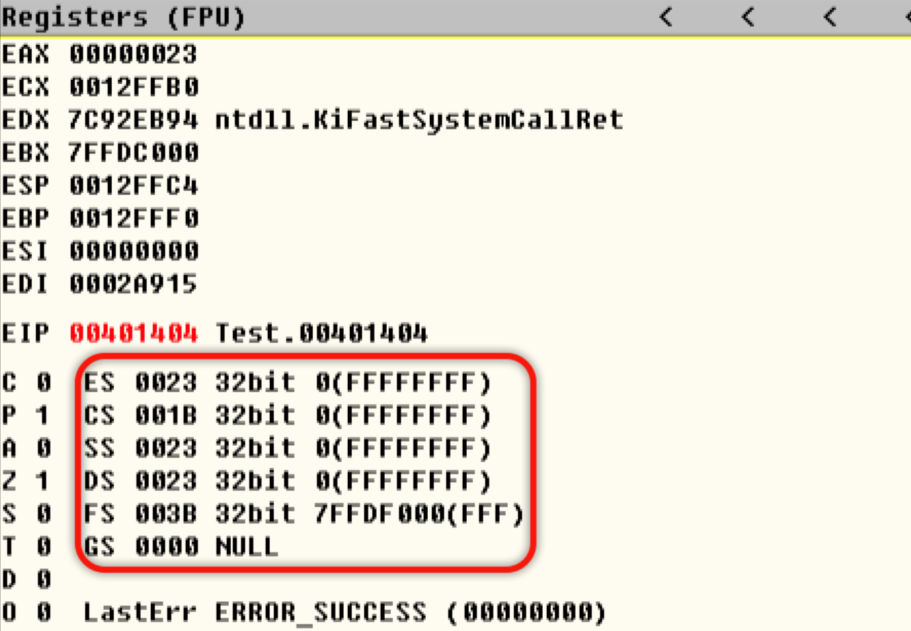

2. 在32位系统下，段寄存器的大小为12字节，还原的内容如下所示：

```c
typedef struct _Segment
{
    WORD Selector;
    WORD Attr;
    DWORD Limit;
    DWORD Base;
}Segment;
```

3. 其中暴露出来可见的只有其中的16位`Segment.Selector`，即段选择子


#### 段选择子

1. 在上一小节中，我们介绍了CPU中的各种段寄存器，并知道了暴露出来的可见部分仅为16位的段选择子

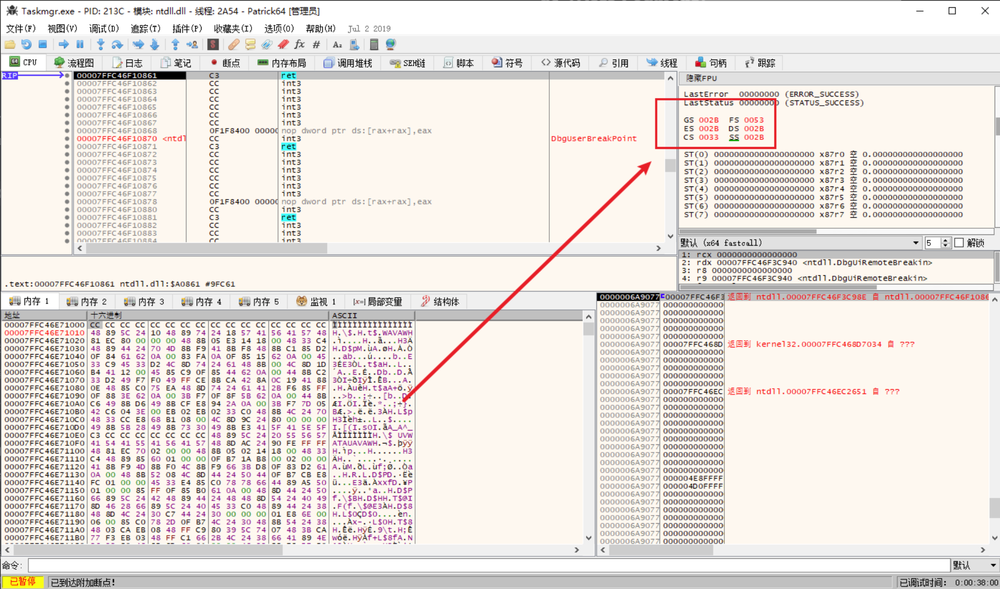

2. 这暴露出来的`段选择子`，结构如下所示：

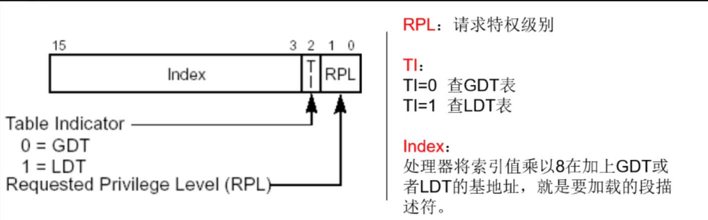

3. 在Win系统下，是没有使用到`LDT局部描述符表`的，所以`Selector.Ti = 0`
4. 关于`Selectot.RPL`段请求权限，这里只使用到的3、0环
5. 最后的`3-15位`，就是`Selectot.Index`其实是一个数组下标，指向的是`GDT全局描述符表`中的描述符对象

> 这个GDT在保护模式中是非常重要的存在，中断门、调用门、异常相关内容，最后都会走到GDT


### 修改段寄存器

1. 段寄存器中的内容是可以修改的，如下所示：

```c
__asm
{
    mov ax, fs;
    mov ds, ax;

    // 可以正常读出数值
    mov ebx, dword ptr ds:[0]	
}
```

2. 在如上代码中，看似仅仅写入了2字节的段寄存器内容，实际上CPU内部会做以下隐含动作：
   1. 解析2字节段选择子
   2. 从GDT表中找到对应的段描述符
   3. 解析找到的段描述符，得到Base、Limit、Attr等等信息
   4. 将解析得到的信息回写到段寄存器中，完成段寄存器内容切换
3. CPU会做这种操作其实是很正常的优化行为，假设段寄存器仅仅保存2字节的段选择子，那么在使用这个段时，CPU是不是每次都要实时到GDT中查询？这显然是不合理的设计


 ### 跨段跳转（跨段调用）

1. 当涉及到代码跨段跳转时，CPU会判断`当前权限CPL`、`目标段权限RPL`，如果权限校验不通过，那么CPU会抛出异常，已知jmp这种跳转转移指令，是不会影响堆栈的

```c
__asm
{
    jmp far selector:offset
}
```

2. 当涉及到跨段调用（call）是，工作流程跟跨段跳转差不多，我们知道call是会将返回地址（原选择子）压入堆栈

```c
call far selector:offset
```

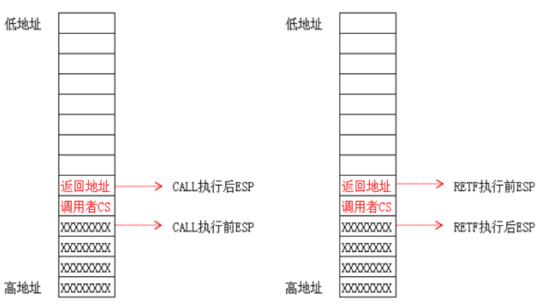

3. 这种涉及到跨段操作的，CPU内部其实会做以下动作：
   1. 取出目标段选择子，从GDT中解析出对应的段描述符
   2. 判断权限，CPL、DPL是否符号权限校验
   3. 将目标段描述符的Base、Limit装载到CS段寄存器中
   4. 将Eip设置为CS.Base + Offset
   5. 如果是跨段调用，调用完成后是要返回的，那么会将原CS段选择子、返回地址压入堆栈


### 调用门提权（无参）

1. Win中并没有使用到调用门，这是CPU支持的机制
2. 这里做实验的话，在双机调试情况下，步骤如下：
   1. 手动构造一个GDT描述符，该描述的DPL = 3，这样可以被用户代码正常调用
   2. 将其中的段描述符设置为内核CS的段描述符
   3. 将Offset设置为我们要提权调用的目标函数

3. 一个GDT描述符定义如下所示：

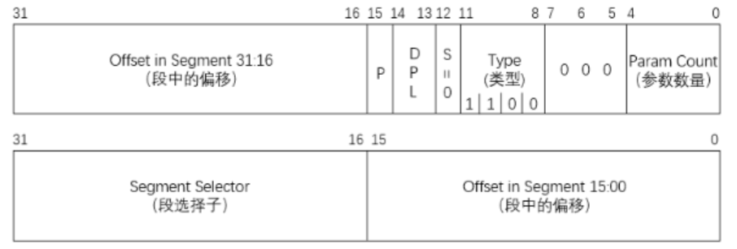

```c
低32位：
1. 段内偏移：你要跳转执行的目标函数的高16位 -> 0040h
2. P位表示有效：必须为1b
3. DPL：描述符权限必须为3，这个调用门构造出来是给我们的R3代码调用的 -> 11b
4. S位：必须为0表示系统段描述符 -> 0b
5. Type：类型必须为1100，这个是手册中表格规定，表格在超链接中查看 -> 1100b
6. Bit5-8：这里必须全0 -> 0000b
7. 参数数量：参数为0个 -> 0000b
综上，低32位内容为0000EC00
```

```c
高32位：
1. 段选择子：0x8为内核代码段、0x1B为3环代码段，我们这里提权要跳到内核态执行 -> 0008h
2. 段内偏移：你要跳转执行的目标函数的低16位 -> 1000h
综上：低32位内容为00080000
```

4. 综合以上，一个门描述符为`0040EC00'00081000`，我们将这个构造好的描述符写入到GDT的空闲槽位：

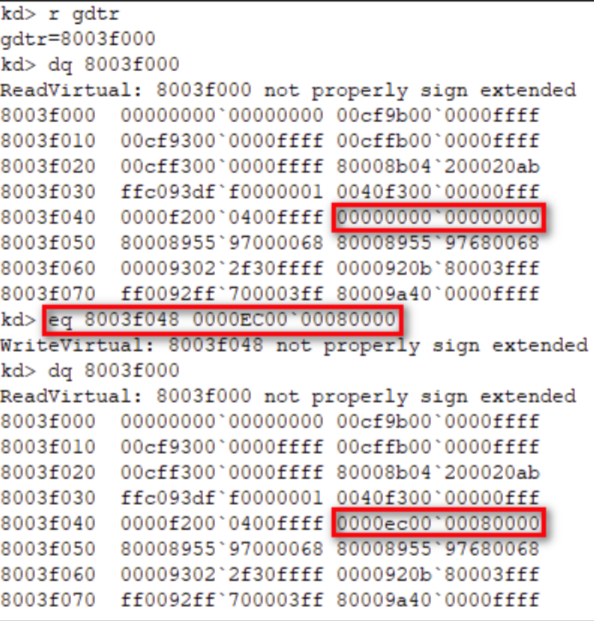

5. 接下来写一段简单的代码，来测试提权：

```c
void __declspec(naked) Test() 
{
    _asm 
    {
        int 3	// 代码执行到这里时，我们就是内核态权限
                // 可以正常读写高2GB的内存空间
                // 可以正常调用一些特权级指令
        retf
    }
}
 
void main()
{
    char buff[6];
    *(DWORD*)&buff[0] = 0x0; // 目标函数地址, 这里填了也用不到
    *(WORD*)&buff[4] = 0x48; // 这是我们构造的目标门描述符
    _asm 
    {
        call far fword ptr[buff]
    }
    getchar();
}
```

6. 由于提权调用，涉及到了权限的变化，由基础知识可知，权限变化了，那么使用的堆栈也是要切换的，那么就需要将原始的SS、Esp保存到堆栈中

> 系统调用R3进入R0时，就会切换到内核栈

```c
push ss
push esp
push cs
push ret_eip
```

7. 涉及到跨段调用时，使用的是`retf`进行返回


### 中断门、陷阱门

1. 中断门、陷阱门其实非常相似，这2者都是保存在`IDT中断描述符表`中的
2. 中断门描述符，定义如下所示：

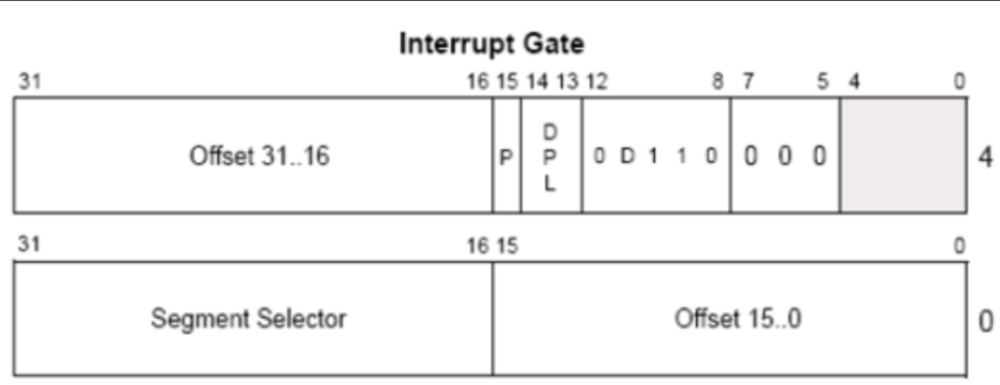

3. 陷阱门描述符，定义如下所示：

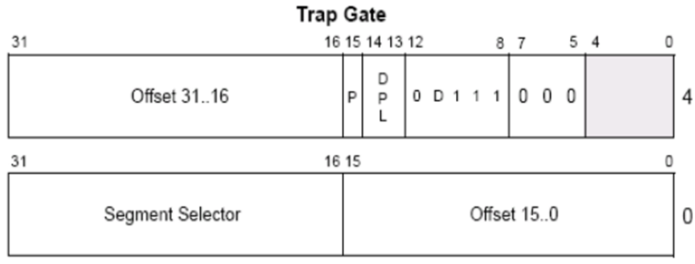


### 中断门使用流程、中断返回

1. 在早期的系统中，发起一次系统调用靠的是中断门（Int 0x2E）

> 现代化的系统中利用了CPU的快速系统调用功能，不再依赖中断实现

2. 在触发中断时（Int xxx），CPU工作流程如下所示：
   1. 会根据中断的异常向量号，在IDT表中找到对应的描述符符，解析出其中的`SegmentSelector`、`Offset`
   2. 拿着解析好的`SegmentSelector`，到GDT表中查询得到对应的描述符，再解析出其中的Base、Limit、Attr等信息
   3. 修改CS段寄存器、修改Eip
   4. 最后跳转到目标处理函数处执行代码
3. 当中断返回时，使用的是`iret`实现返回


### 任务段、任务门

1. 这一部分属于是CPU支持，但是操作系统不用的东西，简单了解一下其中的结构即可，不深入
2. TR任务段寄存器，跟其他的段寄存器一样都是96位

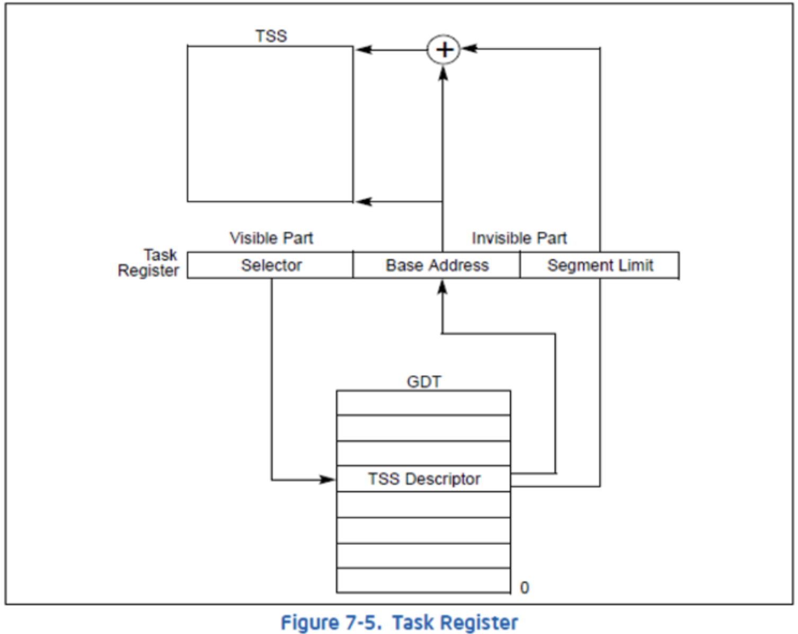


### GDTR、IDTR

1. 前文中提到了GDT表、IDT表，这些表其实时存放在CPU中的GDTR、IDTR寄存器中的，这些寄存器大小为48位，`GDTR定义`如下所示（IDTR同理）：

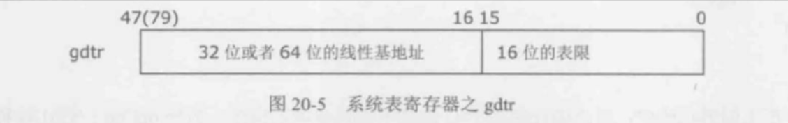


### x86汇编基础

### 16位时期通用寄存器

1. 在早期的16位汇编时期，有着以下8个16位的寄存器

| 寄存器名 | 用途简介                                                     |
| -------- | ------------------------------------------------------------ |
| AX       | 累加寄存器                                                   |
| BX       | 基址寄存器，16位汇编时期，数组寻址就会将数组首地址存放到BX寄存器中 |
| CX       | 计数（Counter）寄存器，直到如今的64位汇编，依旧使用CX作为循环计次 |
| DX       | 数据寄存器                                                   |
| SI       | 在涉及到数据拷贝时，存放源地址                               |
| DI       | 在涉及到数据拷贝时，存放目标地址                             |
| BP       | 栈基址寄存器，存放栈基址，也叫栈底                           |
| SP       | 存放当前栈位置，也叫栈顶                                     |

2. 当然，这些16位的寄存器，也可以按需拆为高、低8位进行使用，例如AH、AL


### 32位时期的通用寄存器

1. 在32位汇编时期，原有的通用寄存器大小拓展为了32位，例如Eax、Ebx、Ecx、Edx、Esp等等


### 64位时期的通用寄存器

1. 在64位汇编时期，将原有的通用寄存器大小拓展为了64位，例如Rax、Rbx、Rsp等等
2. 增加了8个通用寄存器R8~R15


### 标志寄存器

1. `Flags标志寄存器`的作用，就是存放各种运算的结果，也是16位的，其定义如下所示：

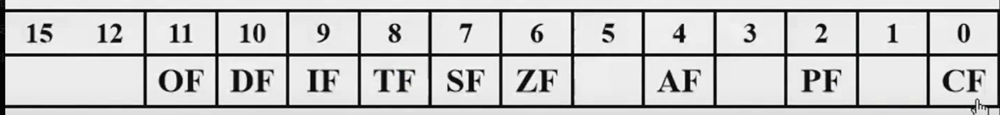

2. 这些标志位，哪怕在如今的64位汇编时代，使用最多的也是这些
3. 在后续的32、64位汇编时代，由于寄存器位宽的扩展，标志寄存器也拓展为了`EFlags`、`RFlags`，如下所示：

> RFlags这个拓展，仅仅是将高32位全部置零，本质上跟EFlags没啥区别

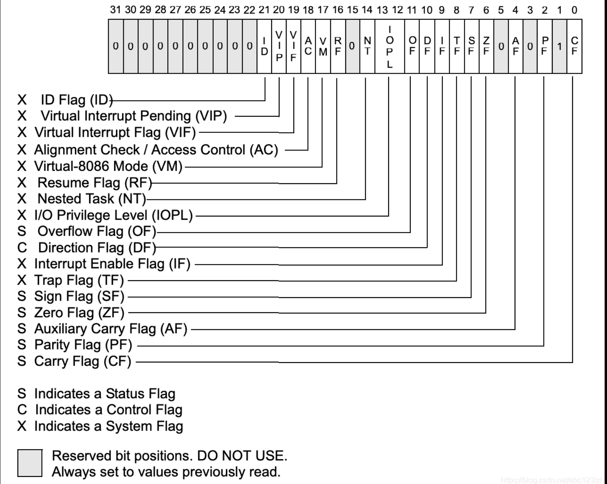

4. 关于标志寄存器，其中一些位，定义如下所示：

| 位   | 定义                                                       |
| ---- | ---------------------------------------------------------- |
| CF   | 进位标志位                                                 |
| PF   | 奇偶标志位                                                 |
| AF   | 借位标志位                                                 |
| ZF   | 零标志位                                                   |
| SF   | 符号标志位                                                 |
| TF   | 陷阱标志位，该位置1后，CPU每执行一行汇编，都会抛出单步异常 |
| IF   | 中断标志位，使用cli将该位`置零`后，CPU不再响应可屏蔽中断   |
| DF   | 控制方向的，mmcpy时，是按照地址增大正向、还是反向拷贝数据  |
| OF   | 溢出标志位                                                 |

5. 以下操作会影响标志寄存器：

| 操作符   | 定义                            |
| -------- | ------------------------------- |
| xor      | 计算异或，加解密常用，不同出1   |
| sub、add | 加、减运算                      |
| and、or  | 位与、位或                      |
| cmp      | 本质上就是一次丢弃结果的sub运算 |
| test     | 本质上就是一次丢弃结果的and运算 |
| inc、dec | 自增、自减                      |


### 非易失寄存器

1. `非易失寄存器`的定义，就是这些寄存器往往有着特定的用途，例如ebp、esp、rdi、rsi等等，正常调用约定不会使用这些寄存器来传递参数
2. 所以在子程序中使用到这些非易失寄存器时，不能破坏其线程，使用前必须要保存起来，函数退出时要恢复
3. 那么反过来思考，rcx、rdx、r8、r9这些用来传递参数的寄存器，就是易失寄存器（当然还有r10、r11）


### 堆栈

1. 关于堆栈，要记住一句话：堆栈是向低地址方向增长的

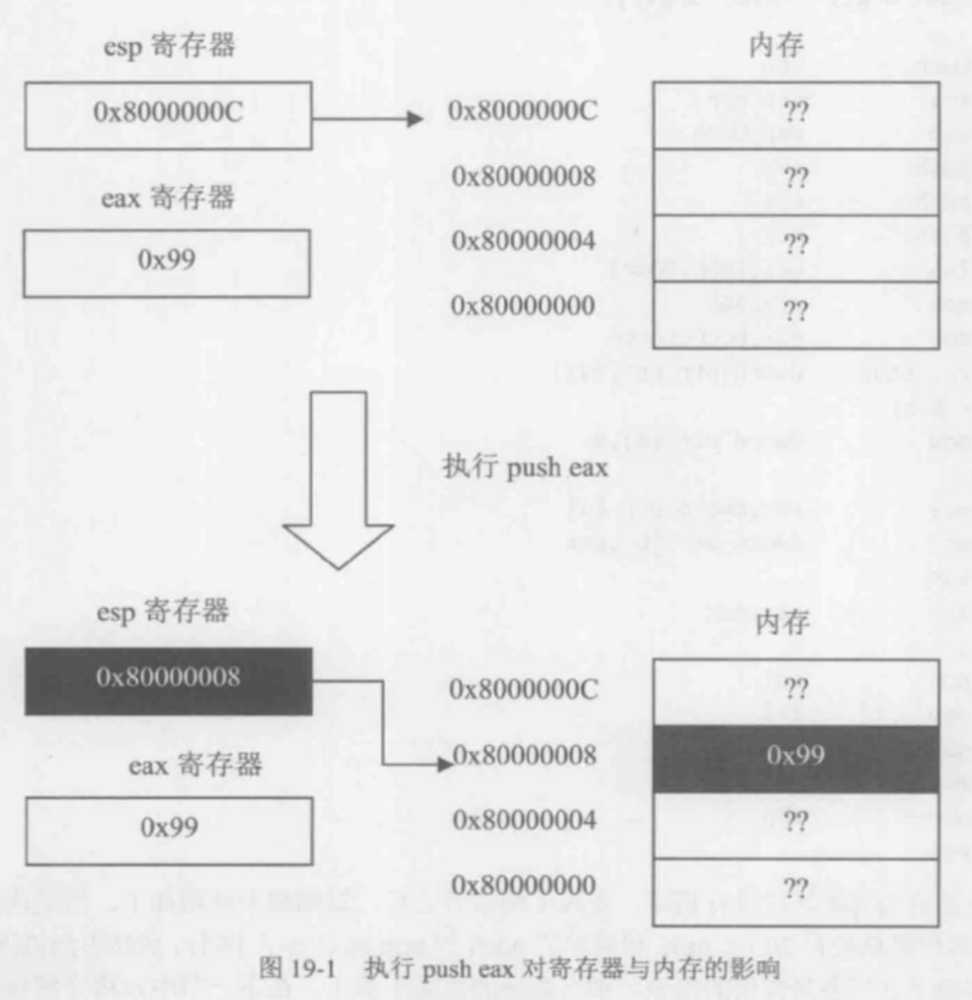

2. 当发生函数调用时，入栈顺序如下所示：
   1. 参数入栈
   2. 返回地址入栈
3. 可得堆栈示意图如下所示：

| 低地址     | 调试器中的堆栈图(低地址在顶部) |           | 调用过程，入栈顺序                                        |                         |
| ---------- | ------------------------------ | --------- | --------------------------------------------------------- | ----------------------- |
| \|         | local_n                        |           | 1. 参数                                                   |                         |
| \|         | ...                            |           | 2. 返回地址                                               |                         |
| \|         | local_3                        |           | 3. 保存old_ebp                                            | push ebp; mov ebp, esp; |
| \|         | local_2                        | [ebp - 8] | 4. 局部变量(locals)所以访问局部变量，是[esp + n][ebp - n] |                         |
| \|         | local_1                        | [ebp - 4] |                                                           |                         |
| \|         | old_ebp                        | [ebp]     | 在函数的调用序言部分，往往会sub esp, n;来分配内存         |                         |
| \|         | RetAddr                        | [ebp + 4] |                                                           |                         |
| \|         | Arg1                           | [ebp + 8] |                                                           |                         |
| \|         | Arg2                           |           |                                                           |                         |
| \|         | Arg3                           |           |                                                           |                         |
| \|         | Arg4                           |           |                                                           |                         |
| \|         | ...                            |           |                                                           |                         |
| **高地址** | Argn                           |           |                                                           |                         |

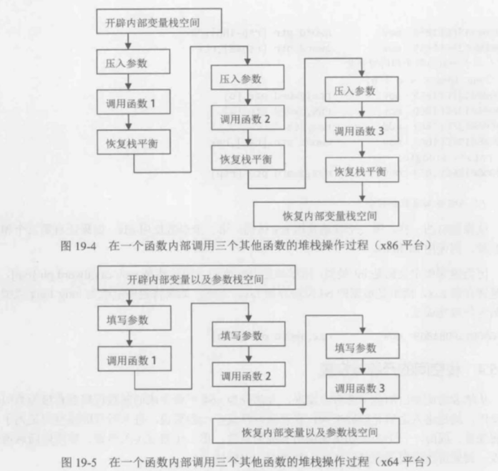


### mov指令

1. mov指令可以将内容转移，如下所示：

```c
// ✔️
mov eax, 1

// ✔️
mov eax, ebx

// ✔️
mov eax, [Addr]

// ✔️
mov [Addr], eax

// ❌️
mov [Addr], [Addr]
```


### x86调用约定

1. 在32位下，调用约定乱七八糟的，有以下调用约定：

| 调用约定   | 定义                                        |
| ---------- | ------------------------------------------- |
| __cdecl    | C调用约定，外平栈                           |
| __fastcall | 前2个参数使用ecx、edx传递，后续使用堆栈传参 |
| __thiscall | ecx寄存器传递的是class的this指针            |
| ...        | 其他暂时忽略                                |

2. 这些调用约定中，只有`__cdecl`是调用方平栈，这是因为很多crt函数是变长参数列表（例如printf），函数内部是不知道该平多少栈的，只能由外部调用方平栈


### x64调用约定

1. 在64位汇编下，只有一种`x64调用约定`，定义如下所示：
   1. 函数的前4个参数使用寄存器来传递，分别为rcx、rdx、r8、r9
   2. 如果前4个参数里面有着浮点数，那么使用xmm0~xmm3传递
   3. 参数列表大于4个参数的，后续参数回退到使用堆栈传参
2. 但是需要注意的是，x64调用下堆栈开辟时，存在32字节的`ShadowSpace`，这是因为rcx、rdx等等参数传递用的寄存器可能会被使用，就需要将参数内容保存到`ShadowSpace`中
