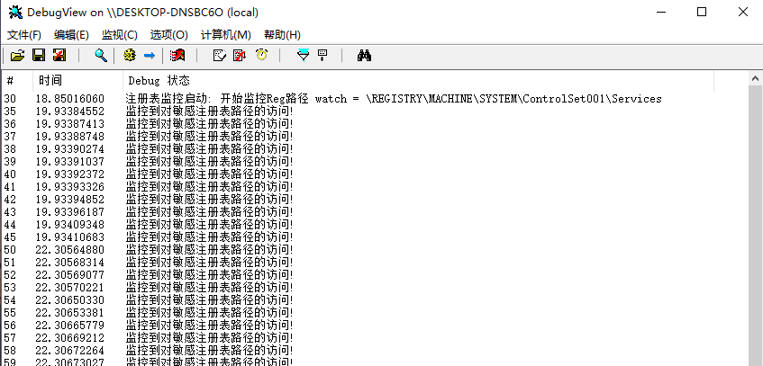
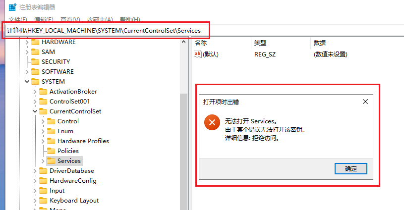

<!--more-->

1. 在部分杀软、EDR场景中，需要监控注册表的相关操作
2. 例如设置程序开机自启动、修改敏感系统设置、加载驱动时都需要访问注册表


## 设置注册表监控回调

1. 设置注册表监控回调，调用函数如下所示：

```c
NTSTATUS CmRegisterCallbackEx(
  [in]           PEX_CALLBACK_FUNCTION Function,
  [in]           PCUNICODE_STRING      Altitude,
  [in]           PVOID                 Driver,
  [in, optional] PVOID                 Context,
  [out]          PLARGE_INTEGER        Cookie,
                 PVOID                 Reserved
);
```

2. 当有注册表相关操作，系统会调用我们的回调函数，该函数原型如下：

```c
EX_CALLBACK_FUNCTION ExCallbackFunction;

NTSTATUS ExCallbackFunction(
  [in]           PVOID CallbackContext,
  [in, optional] PVOID Argument1,
  [in, optional] PVOID Argument2
)
{...}
```

3. 注册的代码如下所示：

```c
EXTERN_C
NTSTATUS
DriverEntry(
	PDRIVER_OBJECT DriverObject,
	PUNICODE_STRING RegistryPath)
{
	UNREFERENCED_PARAMETER(RegistryPath);

	DriverObject->DriverUnload = RegMonUnload;

	RtlInitUnicodeString(&g_Path, L"\\REGISTRY\\MACHINE\\SYSTEM\\ControlSet001\\Services");
	RtlInitUnicodeString(&g_Altitude, L"380000");

	NTSTATUS Status = CmRegisterCallbackEx(
		(PEX_CALLBACK_FUNCTION)RegMonCallback,
		&g_Altitude,		// 注册海拔高度越高，越早接收到通知
		DriverObject,
		NULL,
		&g_Cookie,			// 注册成功，返回一个"句柄"，后续卸载时要用
		NULL
	);

	if (!NT_SUCCESS(Status))
	{
		DbgPrint("CmRegisterCallbackEx 注册失败! \n");
		return STATUS_UNSUCCESSFUL;
	}

	DbgPrint("注册表监控启动: 开始监控Reg路径 watch = %wZ\n", &g_Path);

	return STATUS_SUCCESS;
}
```

4. 在监控回调例程中，我们可以判断操作的注册表路径是不是受保护的路径，如果是就输出日志：

```c
NTSTATUS 
RegMonCallback(
	PVOID Context, 
	PVOID Arg1, 
	PVOID Arg2
)
{
	REG_NOTIFY_CLASS Class = (REG_NOTIFY_CLASS)(ULONG_PTR)Arg1;
	PUNICODE_STRING Path = NULL;
	PCUNICODE_STRING ObjectPath = NULL;

	UNREFERENCED_PARAMETER(Context);

	switch (Class)
	{
		// 建键 / 开键的通知里直接带完整路径
	case RegNtPreCreateKeyEx:
		Path = ((PREG_CREATE_KEY_INFORMATION_V1)Arg2)->CompleteName;
		break;
	case RegNtPreOpenKeyEx:
		Path = ((PREG_OPEN_KEY_INFORMATION_V1)Arg2)->CompleteName;
		break;
	default:
		break;
	}

	if (Path != NULL)
	{
		if (RegMonHit(Path))
		{
			DbgPrint("监控到对敏感注册表路径的访问! \n");
		}
	}

	return STATUS_SUCCESS;
}
```

5. 将驱动加载起来，可以监控到所有对该注册表路径的访问，如图所示：




## 禁止访问某注册表路径

1. 要想禁止访问某注册路径，只需要简单我们的注册表回调例程，如下所示：

```c
NTSTATUS
RegMonCallback(
	PVOID Context,
	PVOID Arg1,
	PVOID Arg2
)
{
	REG_NOTIFY_CLASS Class = (REG_NOTIFY_CLASS)(ULONG_PTR)Arg1;
	PUNICODE_STRING Path = NULL;

	UNREFERENCED_PARAMETER(Context);

	// 只有建键 / 开键的通知里直接带完整路径
	switch (Class)
	{
	case RegNtPreCreateKeyEx:
		Path = ((PREG_CREATE_KEY_INFORMATION_V1)Arg2)->CompleteName;
		break;
	case RegNtPreOpenKeyEx:
		Path = ((PREG_OPEN_KEY_INFORMATION_V1)Arg2)->CompleteName;
		break;
	default:
		return STATUS_SUCCESS;
	}

	if (RegMonHit(Path))
	{
		DbgPrint("监控到对受保护注册表路径的访问，已拒绝! pid=%u\n",
			(ULONG)(ULONG_PTR)PsGetCurrentProcessId());
		DbgPrint("  %wZ\n", Path);

         // 返回权限不足
		return STATUS_ACCESS_DENIED;
	}

	return STATUS_SUCCESS;
}
```

2. 再次编译驱动，放入虚拟机测试，顺利保护指定的注册表路径，如图所示：




## 卸载注册表监控

1. 要卸载注册表监控非常简单，如下所示：

```c
VOID
RegMonUnload(
	PDRIVER_OBJECT DriverObject
)
{
	UNREFERENCED_PARAMETER(DriverObject);

	CmUnRegisterCallback(g_Cookie);
	DbgPrint("注册表监控已卸载.\n");
}
```
