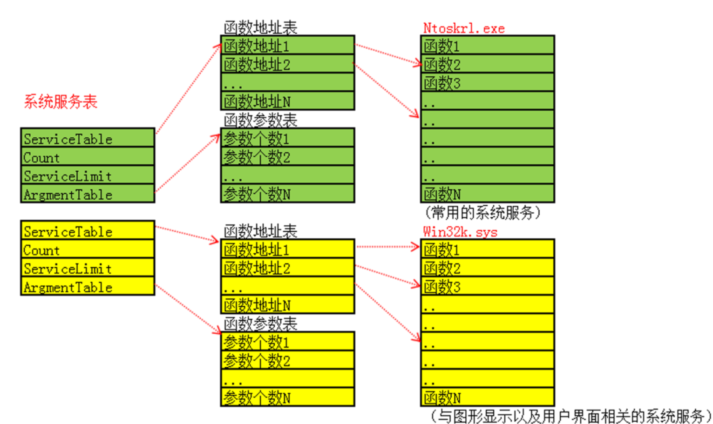
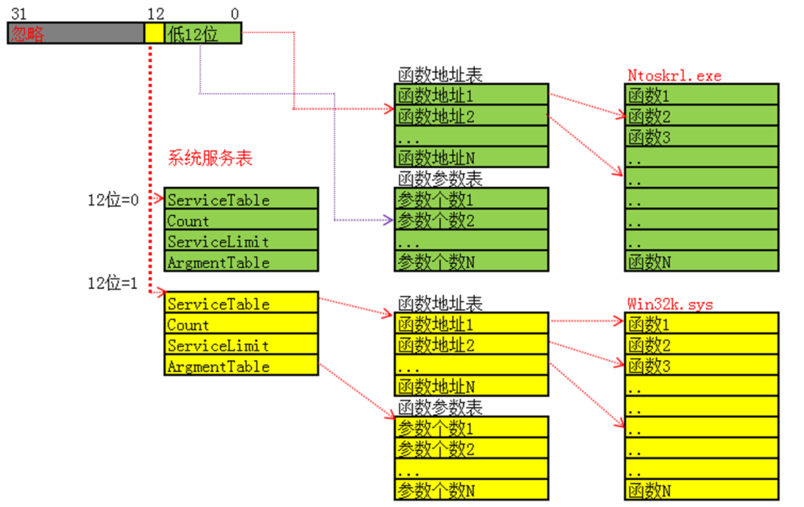

<!--more-->

## 系统服务描述表

1. 在上一篇笔记中，我们已经讲解了系统调用的发起流程，这篇笔记就展开SSDT相关内容
2. SSDT、SSSDT其实是内核中的2个全局变量，在Xp下该符号是`导出的`，在高版本的系统下不导出
3. SSDT全称为`SystemServerDescriptorTable`，保存的是`ntoskrnl`中的内核函数
4. SSSDT全称为`ShadowSystemServerDescriptorTable`，保存的是`Win32k`中的内核函数，跟图形Gui相关
5. SSDT、SSSDT的对象定义是相同的，32位系统如下所示：

```c
// 在xp下，内核服务描述表SSDT其实是一个0x10字节的对象
typedef struct _KeServiceDescriptorTable
{
    ULONG ServiceTable;	     // 指向一个函数数组
    ULONG Count;		    // 这个表的引用计数，基本上都为0
    ULONG ServiceLimit;	     // 函数数组中的成员个数
    
    PUCHAR ArgTable;		// 保存每一个SSDT函数的参数列表的字节数，每个成员单字节
                             // 因为保存现场完成后，需要将参数从R3栈中完整复制一份到R0栈
} KeServiceDescriptorTable;
```




## 系统调用号

1. 在32、64位系统下，系统调用号只有`低13位`有效：
   1. Bit0-11：表示调用号，范围为0-0xFFF
   2. Bit12：表示调用哪张范围表，0 -> SSDT、1 -> SSSDT



2. 这里有一个点需要注意，`SSSDT`只会映射到存在Gui的进程上下文中
3. 这里假设我要取出服务号为10的系统函数，伪代码如下（非常简单）：

```c
FuncAddr = ServiceTable[10];
```


## SSDT Hook（32位）

1. 由于在x64系统上存在PG的缘故，内核Hook操作是会蓝屏的，所以这部分内容作为了解即可、不深入学习
2. SSDT Hook的手法有以下几种：
   1. 替换SSDT槽位中的函数指针，这样就能Hook该函数所有来自R3的调用
   2. 通过SSDT，解析到目标函数地址，在函数头部下Inline Hook，这样可以同时监控来自R3、R0的调用


## x64下的SSDT

1. x64下的SSDT其实相比32位下，其实变动不大（**每个字段成员变为了8字节**），其对象定义如下：

```c
// Windows x64：单个系统服务表描述符
// 内部结构，非 WDK 稳定接口
typedef struct _SYSTEM_SERVICE_TABLE64
{
    PLONG ServiceTableBase;          // +0x00：指向 LONG 编码表项数组
    PULONG ServiceCounterTableBase;  // +0x08：服务调用计数表，通常为空
    ULONG64 NumberOfServices;        // +0x10：服务数量
    PUCHAR ParamTableBase;           // +0x18：参数信息表
} SYSTEM_SERVICE_TABLE64;            // sizeof = 0x20
```

2. 其中的`ServiceTableBase`指向的是一个`LONG数组`，例如我要取出服务号为10的函数地址 ，伪代码如下所示：

```c
Offset = ServiceTableBase[10];
FuncAddr = SSDT_TableBase + (Offset >> 4);
```


## x64下的SSDT Hook

1. 由于在x64系统上存在`PG`的缘故，内核Hook操作是会蓝屏的，所以这部分内容作为了解即可、不深入学习
1. 其实x64下的SSDT Hook，手法跟32位下没什么区别，要么`替换槽位信息`、要么直接在函数头部`下Inline Hook`
2. 但是由于x64寻址大了非常多，并且32位的Offset里面还要去掉4位的属性位，导致实际可用的**寻址范围非常小**，`SSDT_TableBase`大多数情况下`无法一步跳到`我们的Hook函数中
3. 所以这里我们需要进行`代码中转`，在`SSDT_TableBase`的上下搜索代码空洞，在代码空洞中设置跳板`FF 25绝对跳转`，再跳转到我们的Hook接管函数中


## SSDT表中的函数

1. SSSDT表中保存的函数，是`NtUserxxx`，例如`NtUserFindWindow`
1. SSDT表中保存的函数，是`Ntxxx`，例如`NtOpenProcess`，可以被R3调用进来，那么这里就隐含了一个`参数检查`的步骤，因为在驱动开发的规范中，用户态传入的参数、缓冲区，我们一般要默认其**无效的**、**错误的**，需要进行完备的参数校验
2. 在内核中同时存在`Zwxxx`、`Ntxxx`函数，例如`ZwCreateFile`、`NtCreateFile`，一般情况下优先调用`NtCreateFile`，函数内部会帮我们检查参数是否有问题
3. 但是在某些特殊的开发场景，我们需要跳过参数检查，此时就可以调用`Zwxxx`函数，这个函数内部工作流程如下：
   1. 将当前线程的先前模式修改为内核模式`KernelMode`
   2. 再调用`Ntxxx`函数，对于内核态`原生发起`的调用，我们默认参数的可信的、经过严密检查的
   3. 知道了原理后，我们也可以自己实现


## 定位未导出、未文档化函数

1. 在内核对抗中，一些奇技淫巧的操作往往需要借助一些未公开、未文档化的函数，那么首先就要考虑如何定位到这些函数的地址，笔者这里想到了一些方法：

| 定位方法             | 问题点                                                       |
| -------------------- | ------------------------------------------------------------ |
| 解析PDB符号表        | 1. 部分离线、内网环境无法下载PDB符号表  2. 部分较新的系统，可能暂时没有符号表供下载 |
| 跳过函数调用间接定位 | A函数本身未导出，但是B函数内部调用了A函数，且B函数是直接导出的。我们就可以在B函数内部小范围匹配特征码即可 |
| 特征码定位           | 这是最后的方案，特征码定位你要搜集几乎所有的系统版本来生成特征码、并且后续更新维护也是个问题 |
