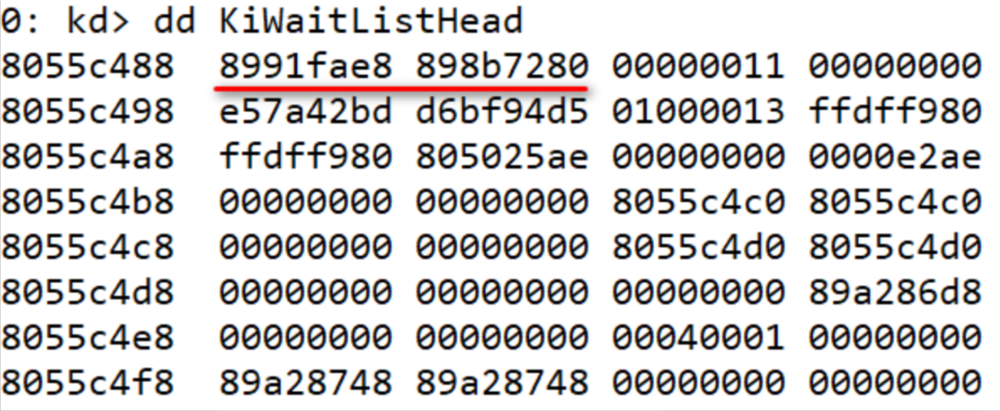
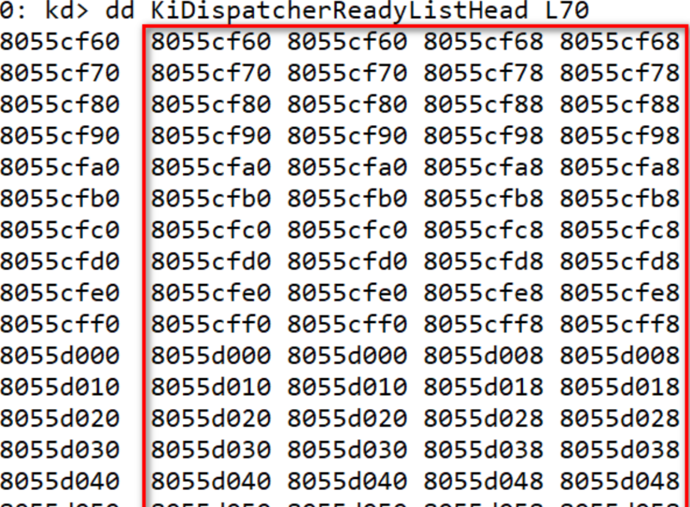
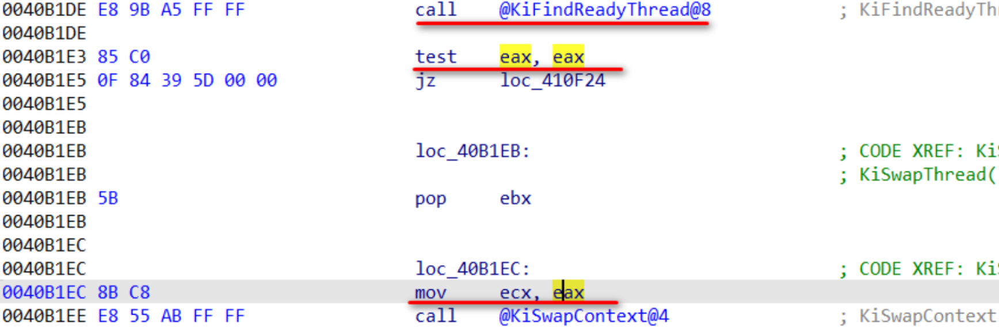
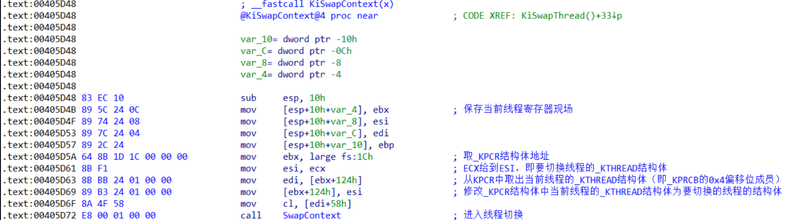
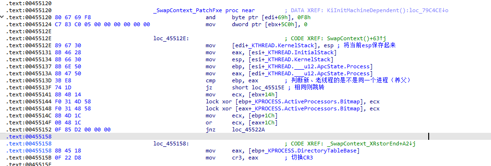
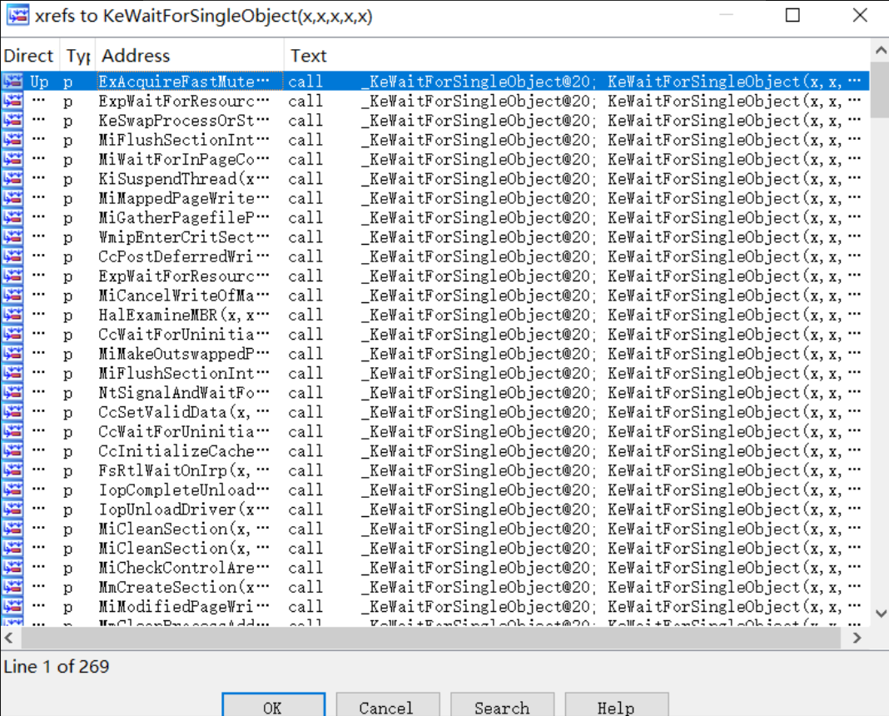
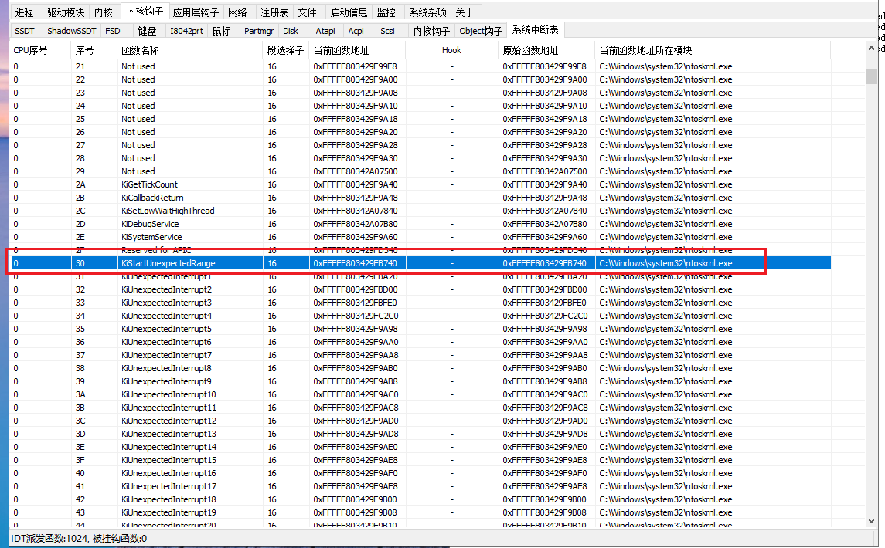
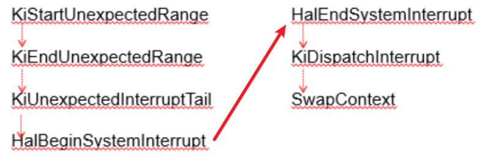
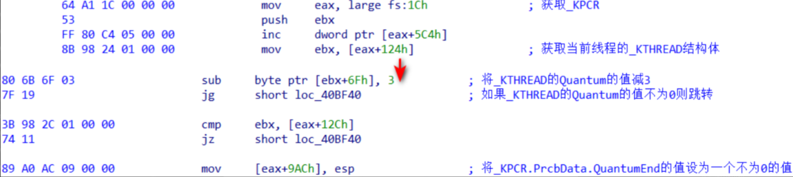
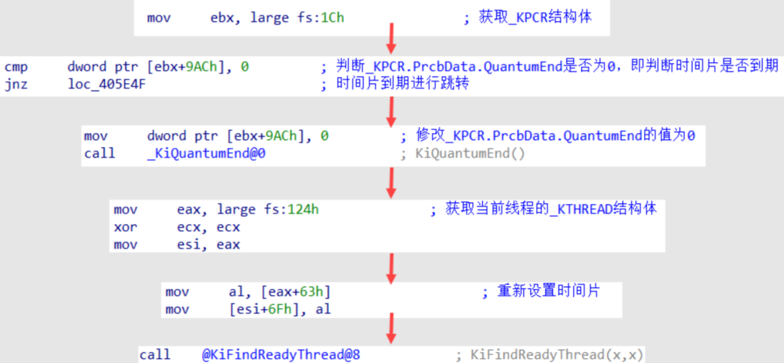

<!--more-->

## 线程状态

1. 在上一篇笔记中，笔者提到了线程的一些状态，现在正式列举出线程有哪些状态：

| 线程状态 | 定义                                                         |
| -------- | ------------------------------------------------------------ |
| 运行     | 线程拥有CPU时间碎片，正在执行代码                            |
| 就绪     | 线程未运行，等待被调度进入执行状态                           |
| 等待     | 线程主动调用Slepp、WaitForSingleObject等函数，主动交出CPU    |
| 换出     | 由于线程长时间不活跃，系统将线程对象、相关堆栈换出到磁盘，节省内存资源 |
| 换入     | 当不活跃的线程被激活时，系统会将资源换入到内存中             |

## 33个调度链表

1. 在**早期**的Win内核中，系统设置了33个链表来管理线程，同一条线程处在不同状态下时，会保存在不同的链表中，这些链表信息如下所示：

| 调用链表                 | 定义                                                     |
| ------------------------ | -------------------------------------------------------- |
| 1个等待链表（WaitList）  | 等待状态的线程，系统会将其移动到其中                     |
| 32个调度链表（SwapList） | 这32个调度链表，其实也是区分出了32个线程执行的**优先级** |

2. 双机调试情况下，等待链表其实是`KiWaitListHead`一个全局变量，如下所示：

3. 双机调试情况下，查看32个就绪链表如下所示：

## 线程优先级

1. 在发生`线程切换`时，系统会调用`KiFindReadyThread`来查找下一个就绪的线程对象
2. 前文我们已经知道了存在32个就绪链表，那么0-31这些链表中，31号链表的优先级最高，所以`KiFindReadyThread`会从31号链表开始查找，直到取出了有效的线程对象
3. 但是这里存在一个效率问题，32个链表，其中大部分链表可能都是空的，所以内核中设置了一个`位图`，这是一个4字节32位的数据，按位来指示某个线程中是否有线程对象，这样在查找时先读取一下这个Bitmap就可以高效判断了

4. 如下图所示，30、28号链表中就有就绪的线程对象

## 查找就绪的线程对象

1. 相关反汇编如下图所示，先尝试`KiFindReadyThread`找到一个就绪的线程，如果返回线程对象不为`NULL`，那么就将其传递给ecx寄存器，再调用`KiSwapContext`切换线程：

## KiSwapContext

1. 首先保存非易失寄存器环境
2. 将原线程对象保存到edi寄存器
3. 将参数1，也就是ecx中的新线程对象保存到esi中
4. 设置`KPCR.CurThread`修改为新线程对象
5. 此时esi = 下一个线程对象、edi = 当前线程对象，调用内部函数`SwapContext`

## SwapContext

1. 关于该函数内部做了什么，初见时我们只要知道这个线程切换的工作流程如下所示：
   1. 切换线程堆栈
   2. 判断新、老线程是否同属一个进程，如果不是就切Cr3
   3. 保存原线程的寄存器环境，这下下次切回去运行时，才能"无感知"地接续执行代码

## 主动线程切换

1. 当一个线程主动调用`Sleep`、`WaitForSingleObject`时会交出触发线程切换、主动交出CPU拥有权
2. 我们查看一下`KeWaitForSingleObject`，会发现有着大量的引用，如图所示：

## 被动线程切换（时钟中断）

1. 当发生时钟中断（Int 0x30）时，在中断例程内，会减少当前线程的时间碎片，当减到0时，当前线程时间碎片耗尽，失去本次CPU执行权
2. 使用ARK工具查看0x30号中断信息，如图所示：

3. 使用IDA分析该函数流程，会发现内部最终调用的也是`SwapContext`实现切换线程：

4. 每次时钟中断触发时，都会调用`KeUpdateRunTime`函数（刷新线程时间片信息），该函数每次执行，就会将当前线程的时间片减3，如果减到0会将`KPCR.PrcbData.QuantumEnd`设置一个非0值表示时间片到期

5. 系统时钟中断完成后，会去调用`KiDispatchInterrupt`函数，该函数主要判断判断`KPCR.PrcbData.QuantumEnd`是否非0，该值非0则会将该值重新置0，并调用`_KiQuantumEnd`函数（在该函数里面重新将时间片数值设置为6），之后调用`KiFindReadyThread`查找下一个要切换的线程

## 线程切换小结

1. 到了这里我们可以发现，不管是主动调用Slepp函数交出执行权、还是时钟中断，最终都会走到`SwapContext`实现线程切换
2. 所以我们可以得到一个结论：线程切换是**系统主动发生**的
3. 所以我们可以设想一个极端场景：某线程屏蔽了时钟中断（cli）、并且不调用任何API、不发生异常，那么该线程将会永久占用当前CPU

## 空闲线程

1. 我们设想一个极限的情况，32个就绪链表中都没有线程，那么线程查找就会失败
2. 但是CPU只要上电了就要一直跑代码的，所以系统设置了一个`空闲线程`（应该是原地空转），让没事干的CPU去执行这个线程
3. 这个空闲线程对象保存在`KPCR.PrcbData.IdleThread`中

## 线程附加

1. 有了前置的基础知识，我们知道了线程是代码执行的实体，而进程只是提供了内存换进程（即Cr3）
2. 一个线性对象中有2处地方保存了进程对象：
   1. ETHREAD.ThreadProcess：该线程是由哪个进程对象创建的，有人喜欢管他叫`亲生父亲`
   2. ETHREAD.ApcState.Process：当前线程运行时**实际使用**的进程上下文，有人喜欢叫他`养父`
3. 在内核中，不管是代码执行、线程切换时，真正使用的对象是`ETHREAD.ApcState.Process`
