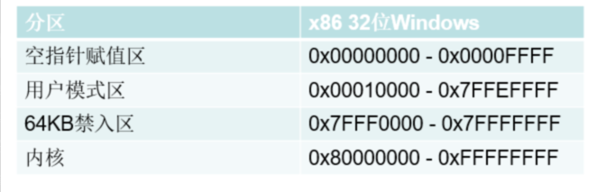
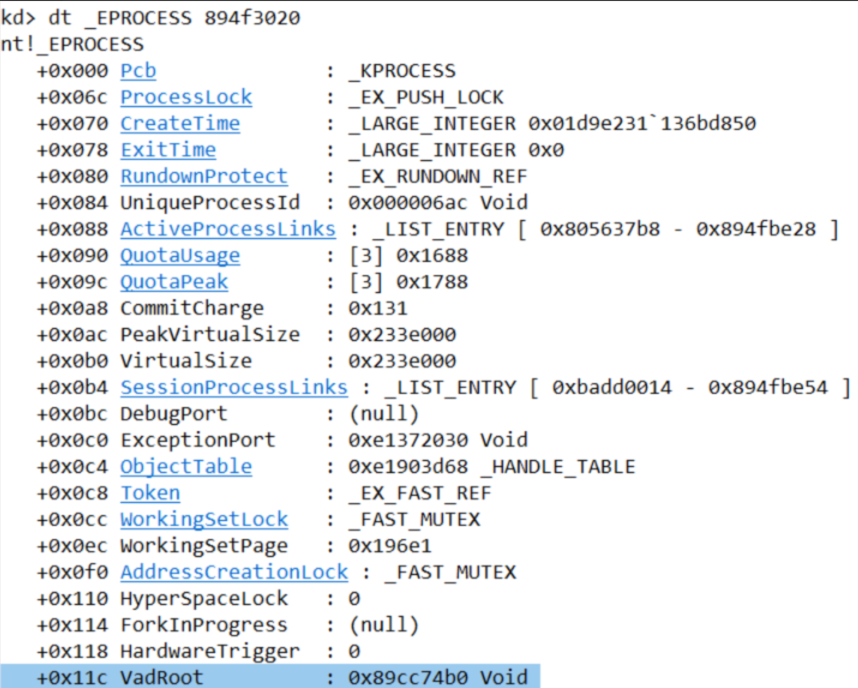
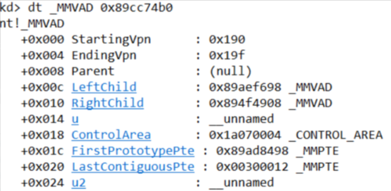
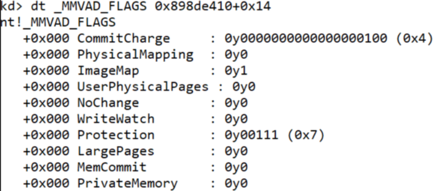
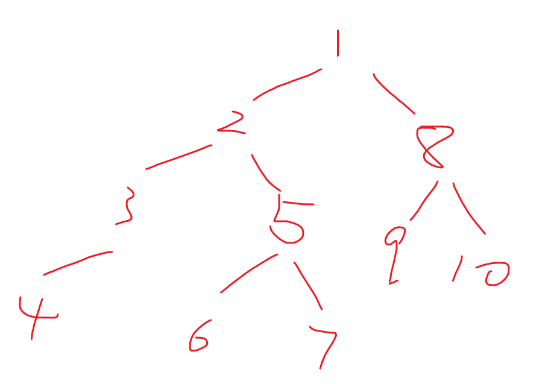

<!--more-->

## 用户态线性地址

1. 我们知道Cr3存放的是每个进程独立的页目录表基址，当CPU切换上下文时会切换Cr3，实现了每个`进程独立`的用户态空间
2. 在32位系统下，用户态线性地址的边界为`0x7FFFFFFF`，这些线性地址划分如图所示：



3. 其中的空指针赋值区域、64KB禁入区，R3、R0均不能访问，在学习了分页保护模式的知识后，我们知道这些禁止访问的线性地址区域，本质上是是没有建立正确的页表映射关系，CPU访问就会抛异常`0xC0000005`
4. 在WinDbg双机调试情况下，我们可以为这些区域手动建立正确的页表映射，也能访问这些线性地址了


## 用户态线性地址管理（Vad）

1. 为了方便管理`用户态的线性地址空间`，微软设计了`Vad（Virtual Address Descriptor）`这个对象，初见误区：Vad是不能管理内核态线性地址的！

2. Vad本质上是一颗平衡二叉树，其根节点保存在进程对象下，即`EPROCESS.VadRoot`，如下所示：

   > 平衡二叉树：任意节点的左右子树高度差不超过1
   >
   > `EPROCESS`相关内容在后续笔记中会提及，读者只需要知道每一个R3的进程，必定存在一个内核态的进程对象，同理，每一个线程在内核态都会有一个线程对象实体

```c
//0x260 bytes (sizeof)
struct _EPROCESS
{
    struct _KPROCESS Pcb;                                                   //0x0
    // ...
    VOID* VadRoot;                                                          //0x11c
	// ...
}; 
```




## _MMVAD（32位下）

1. Vad这颗二叉树，其中的每一个节点，对象为`_MMVAD`，对象定义如下所示：

```c
//0x28 bytes (sizeof)
struct _MMVAD
{
    ULONG StartingVpn;        // 起始编号
    ULONG EndingVpn;          // 终止编号                                  
    struct _MMVAD* Parent;    // 上一个MMVAD节点                                
    struct _MMVAD* LeftChild; // 左子树                                        
    struct _MMVAD* RightChild;// 右子树                                       
    union
    {
        ULONG LongFlags;                                              
        struct _MMVAD_FLAGS VadFlags; // 实际中一般用这个                            
    } u;                                                                 
    struct _CONTROL_AREA* ControlArea; // 控制区域                           
    struct _MMPTE* FirstPrototypePte;                                       
    struct _MMPTE* LastContiguousPte;                                    
    union
    {
        ULONG LongFlags2;                                               
        struct _MMVAD_FLAGS2 VadFlags2; // 实际中一般用这个                             
    } u2;                                                                  
}; 
```

2. 关于这些字段的定义，如下表格所示：

| 成员字段                      | 定义                                                         |
| ----------------------------- | ------------------------------------------------------------ |
| StartingVpn、EndingVpn        | 当前vad节点所**管理**的线性地址的起始、结束页帧号（也就是页面对齐后），例如StartingVpn = 0x1FF，那么实际控制的起始线性地址为0x1FF000 |
| Parent、LeftChild、RightChild | 父节点、左子节点、右子节点                                   |
| VadFlags                      | 属性控制，保存的是这块内存**初始申请**时提交的内存保护属性   |
| ControlArea                   | 属性控制，可以用来判断这段线性地址是**私有**占用、还是**PE文件镜像**占用 |
| VadFlags2                     | 属性控制，下文展开                                           |

3. 我们使用WinDbg双机调试来查看一个根节点的`_MMVAD`长什么样，如图所示：




### 锁定内存保护属性1

1. 在反作弊对抗上，有时往往需要锁定敏感的代码页面，避免修改内存保护属性为可写后、挂上Inline Hook
2. 在VadFlags、VadFlags2字段的对象定义如下所示：

```c
//0x4 bytes (sizeof)
struct _MMVAD_FLAGS
{
    ULONG CommitCharge:19;                                                  //0x0
    ULONG PhysicalMapping:1;                                                //0x0
    ULONG ImageMap:1;                                                       //0x0
    ULONG UserPhysicalPages:1;                                              //0x0
    ULONG NoChange:1;                                                       //0x0
    ULONG WriteWatch:1;                                                     //0x0
    ULONG Protection:5;                                                     //0x0
    ULONG LargePages:1;                                                     //0x0
    ULONG MemCommit:1;                                                      //0x0
    ULONG PrivateMemory:1;                                                  //0x0
}; 

//0x4 bytes (sizeof)
struct _MMVAD_FLAGS2
{
    ULONG FileOffset:24;                                                    //0x0
    ULONG SecNoChange:1;                                                    //0x0
    ULONG OneSecured:1;                                                     //0x0
    ULONG MultipleSecured:1;                                                //0x0
    ULONG ReadOnly:1;                                                       //0x0
    ULONG LongVad:1;                                                        //0x0
    ULONG ExtendableFile:1;                                                 //0x0
    ULONG Inherit:1;                                                        //0x0
    ULONG CopyOnWrite:1;                                                    //0x0
}; 
```

3. 在观察字段定义后，可以得到以下2种在早期Win版本下锁定内存保护属性的方式：
   1. `_MMVAD_FLAGS.NoChange = 1`
   2. `_MMVAD_FLAGS2.SecNoChange = 1`


### Vad属性（_MMVAD_FLAGS）

1. 我们主要来学一下Vad的一些关键属性位，使用WinDbg双机调试`_MMVAD_FLAGS`，如图所示：



2. 其中一些主要字段定义如下：

| 成员字段      | 定义                                                         |
| ------------- | ------------------------------------------------------------ |
| CommitCharge  | 当前Vad节点，支撑最大虚拟虚拟页面的数量                      |
| ImageMap      | 当前Vad所描述的线性地址，属于是Private、还是Image            |
| Protection    | 当前Vad所描述的线性地址内存保护属性，属性定义如见表格后追加内容 |
| PrivateMemory | 所描述的线性地址是否为私有                                   |

3. 关于保护属性的定义，以下内容摘自WRK，这些保护属性掩码是Win内核内部真正使用的Mask，R3所使用的内存保护属性定义如`PAGE_READONLY`、`PAGE_READWRITE`、`PAGE_EXECUTE_READ`等等，在进入内核后会进行转换


```c
#define MM_ZERO_ACCESS         0  // this value is not used.
#define MM_READONLY            1
#define MM_EXECUTE             2
#define MM_EXECUTE_READ        3
#define MM_READWRITE           4  // bit 2 is set if this is writable.
#define MM_WRITECOPY           5
#define MM_EXECUTE_READWRITE   6
#define MM_EXECUTE_WRITECOPY   7
#define MM_NOCACHE            0x8
#define MM_GUARD_PAGE         0x10
#define MM_DECOMMIT           0x10   // NO_ACCESS, Guard page
#define MM_NOACCESS           0x18   // NO_ACCESS, Guard_page, nocache.
#define MM_UNKNOWN_PROTECTION 0x100  // bigger than 5 bits!
```


### 遍历Vad二叉树

1. 在双机调试情况下，可以使用如下命令来查看目标Vad的情况：

```c
!vad <VadRoot>
```

2. 输出内容大概如下所示（输出内容位64位系统下，但是输出内容大差不差）：

```c
3: kd> !vad 0xffffbf015343bb60 
VAD           Level     Start       End Commit
ffffbf015317b360  5     7ffe0     7ffe0      1 Private      READONLY           
ffffbf015317c300  6     7ffe2     7ffe2      1 Private      READONLY           
ffffbf015317c440  4   e933200   e9333ff     29 Private      READWRITE          
ffffbf015317c4e0  5   e933400   e93347f      8 Private      READWRITE          
ffffbf01521244f0  6   e933480   e9334ff      7 Private      READWRITE          
ffffbf0150fce7e0  3   e933600   e93367f      5 Private      READWRITE          
ffffbf0150fcf320  5   e933700   e93377f     10 Private      READWRITE          
ffffbf0150fcf3c0  6   e933780   e9337ff      8 Private      READWRITE          
ffffbf0150fcf410  4   e933800   e93387f      6 Private      READWRITE          
ffffbf0150fceec0  6   e933880   e9338ff     10 Private      READWRITE          
ffffbf0150fd44b0  5   e933900   e93397f     10 Private      READWRITE          
ffffbf01524e69e0  6   e933a00   e933a7f      7 Private      READWRITE          
ffffbf0152124720  2   e933b00   e933b7f      5 Private      READWRITE          
ffffbf01509027a0  6   e933c00   e933c7f      5 Private      READWRITE          
ffffbf0150903ba0  7   e933c80   e933cff      5 Private      READWRITE          
ffffbf0150903c40  5   e933d00   e933d7f      5 Private      READWRITE          
ffffbf01509037e0  6   e933e00   e933e7f     11 Private      READWRITE          
ffffbf015343b7a0  4  286225d0  286225df      0 Mapped       READWRITE          Pagefile section, shared commit 0x10
ffffbf0153441060  6  286225e0  286225e0      0 Mapped       READONLY           Pagefile section, shared commit 0x1
ffffbf015343bf20  5  286225f0  2862260c      0 Mapped       READONLY           Pagefile section, shared commit 0x1d
ffffbf015343c380  3  28622610  28622613      0 Mapped       READONLY           Pagefile section, shared commit 0x4
ffffbf015343a080  7  28622620  28622622      0 Mapped       READONLY           Pagefile section, shared commit 0x3
ffffbf015317a2d0  6  28622630  28622631      2 Private      READWRITE          
ffffbf015343d280  7  28622640  28622708      0 Mapped       READONLY           \Windows\System32\locale.nls
```

3. 如何代码来递归枚举Vad，示例代码如下所示：

```c
typedef struct _VAD32
{
    ULONG StartingVpn;
    ULONG EndingVpn;
    struct _VAD32* Parent;
    struct _VAD32* LeftChild;
    struct _VAD32* RightChild;
} VAD32, *PVAD32;

VOID WalkVad32(PVAD32 Vad)
{
    if (Vad == NULL)
        return;

    // 左子树
    WalkVad32(Vad->LeftChild);

    // 当前节点：EndingVpn 包含最后一页
    ULONG startVa = Vad->StartingVpn << 12;
    ULONG endVa   = (Vad->EndingVpn << 12) | 0xFFF;

    DbgPrint(
        "VAD=%p  VA=[%08lX, %08lX]\n",
        Vad, startVa, endVa
    );

    // 右子树
    WalkVad32(Vad->RightChild);
}

// 传入真实的根 VAD 节点，不是根节点指针的地址，也不是哨兵节点。
// WalkVad32(rootVad);
```

4. 在初见遍历二叉树时，可能会有些迷惑，笔者这里画了一个简单草图，如下所示：



5. 那么在这个图中，实际`DbgPrint`的输出顺序为：`4->3->2->6->5->7->1->9->8->10`


## _MMVAD（64位）

1. 在如今的64位系统下，微软还是使用Vad二叉树来管理用户态线性地址空间，但是对其结构做了一些拓展、封装，如下所示：

```c
//0x88 bytes (sizeof)
struct _MMVAD
{
    struct _MMVAD_SHORT Core;                                               //0x0
    union
    {
        ULONG LongFlags2;                                                   //0x40
        volatile struct _MMVAD_FLAGS2 VadFlags2;                            //0x40
    } u2;                                                                   //0x40
    struct _SUBSECTION* Subsection;                                         //0x48
    struct _MMPTE* FirstPrototypePte;                                       //0x50
    struct _MMPTE* LastContiguousPte;                                       //0x58
    struct _LIST_ENTRY ViewLinks;                                           //0x60
    struct _EPROCESS* VadsProcess;                                          //0x70
    union
    {
        struct _MI_VAD_SEQUENTIAL_INFO SequentialVa;                        //0x78
        struct _MMEXTEND_INFO* ExtendedInfo;                                //0x78
    } u4;                                                                   //0x78
    struct _FILE_OBJECT* FileObject;                                        //0x80
}; 
```

2. 乍一看会觉得`_MMVAD`结构怎么大变样了，细看其实不然，其中的大部分内容都移动到了`_MMVAD_SHORT Core`中，如下所示：

```c
//0x40 bytes (sizeof)
struct _MMVAD_SHORT
{
    union
    {
        struct
        {
            struct _MMVAD_SHORT* NextVad;                                   //0x0
            VOID* ExtraCreateInfo;                                          //0x8
        };
        struct _RTL_BALANCED_NODE VadNode;                                  //0x0
    };
    ULONG StartingVpn;                                                      //0x18
    ULONG EndingVpn;                                                        //0x1c
    UCHAR StartingVpnHigh;                                                  //0x20
    UCHAR EndingVpnHigh;                                                    //0x21
    UCHAR CommitChargeHigh;                                                 //0x22
    UCHAR SpareNT64VadUChar;                                                //0x23
    LONG ReferenceCount;                                                    //0x24
    struct _EX_PUSH_LOCK PushLock;                                          //0x28
    union
    {
        ULONG LongFlags;                                                    //0x30
        struct _MMVAD_FLAGS VadFlags;                                       //0x30
        struct _MM_PRIVATE_VAD_FLAGS PrivateVadFlags;                       //0x30
        struct _MM_GRAPHICS_VAD_FLAGS GraphicsVadFlags;                     //0x30
        struct _MM_SHARED_VAD_FLAGS SharedVadFlags;                         //0x30
        volatile ULONG VolatileVadLong;                                     //0x30
    } u;                                                                    //0x30
    union
    {
        ULONG LongFlags1;                                                   //0x34
        struct _MMVAD_FLAGS1 VadFlags1;                                     //0x34
    } u1;                                                                   //0x34
    struct _MI_VAD_EVENT_BLOCK* EventList;                                  //0x38
}; 
```

3. 我们观察新增的结构，会发现以下点：
   1. 新增了`StartingVpnHigh`，是因为独立的`StartingVpn`已经无法支撑64位下更大的指针了
   2. 第2个联合体设计更加方便理解，区分出来私有内存、共享内存等等属性区分
   3. 64位下的Vad仍然是二叉树，只不过将父节点、左右子节点放进了`VadNode`中


### 锁定内存保护属性2

1. 在高版本的Win系统中，我们观察`_MM_PRIVATE_VAD_FLAGS`对象结构，如下所示：

```c
//0x4 bytes (sizeof)
struct _MM_PRIVATE_VAD_FLAGS
{
    ULONG Lock:1;                                                           //0x0
    ULONG LockContended:1;                                                  //0x0
    ULONG DeleteInProgress:1;                                               //0x0
    ULONG NoChange:1;                                                       //0x0
    ULONG VadType:3;                                                        //0x0
    ULONG Protection:5;                                                     //0x0
    ULONG PreferredNode:6;                                                  //0x0
    ULONG PageSize:2;                                                       //0x0
    ULONG PrivateMemoryAlwaysSet:1;                                         //0x0
    ULONG WriteWatch:1;                                                     //0x0
    ULONG FixedLargePageSize:1;                                             //0x0
    ULONG ZeroFillPagesOptional:1;                                          //0x0
    ULONG Graphics:1;                                                       //0x0
    ULONG Enclave:1;                                                        //0x0
    ULONG ShadowStack:1;                                                    //0x0
}; 
```

2. 修改其中的`_MM_PRIVATE_VAD_FLAGS.Enclave = 1`即可实现锁定内存保护属性，伪代码如下所示：

```c
VOID LockPageProtect(
    PVOID UserVa
	)
{
    _MMVAD* Vad = QueryVad(UserVa);
    Vad.Core.PrivateVadFlags.Enclave = 1;
    return VOID();
}
```


## 扫描Shellcode、可疑内存

1. 不管是杀软、EDR、反作弊，都会扫描一个进程中可疑的内存，这些可疑内存往往具备以下特征：
   1. 私有内存，**不属于**任何一个PEB.Ldr登记在册的DLL模块中
   2. 内存保护属性**可执行**

2. 那么在扫描时，方法1就是使用`VirtualQuery`查询内存块属性，找出可疑内存
3. 方法2就是遍历Vad，找出其中的可疑可执行内存


## Vad断链问题、拓展检测方法

1. 已知R3调用查询内存保护属性的API，最后其实会去查Vad，那么Rootkit开发者会申请R3内存后、赶紧将Vad断链，那么此时就查询不出来了
2. 笔者这里介绍一种方法，从PML4E的低半部分开始扫描，直接`扫硬件PTE`中是否具备可疑的可执行内存
