<!--more-->

# Win11 26H1内核异常体系分析与实验：提前接管用户态、内核态异常，实现无痕Hook、进程保护、反调试，附PoC

## 1. 写在前面

​	各位看雪论坛的朋友大家好，我是`__Shinn`，凌晨码字，精神有点迷糊，帖子中如果存在表述不严谨、甚至出错的地方，欢迎在评论区指正

​	本文定位为`抛砖引玉`，分享一些`实验性质`的思路、代码实现方法，本文在结构上大体分为了以下2部分

- 针对Win11 26H1内核异常体系的详细分析，理清楚异常体系是如何工作的
- 针对现有异常体系，分析出3种可以提前接管`用户态`、`内核态`异常的利用点，并利用这些点实现对抗上的一些操作

> 笔者最初原稿是4种提前接管异常的手法，后来发现，利用InstrumentationCallback提前接管异常，论坛内已经有师傅发文公开了，所以发帖前删除了这部分内容，避免重复赘述

​	本文涉及到的大部分工程文件已经整理好并开源到Github，欢迎给仓库Star


## 2. Win11 26H1内核异常体系分析

​	本次分析的目标系统版本为`Win11 26H1 28000`，如图所示：

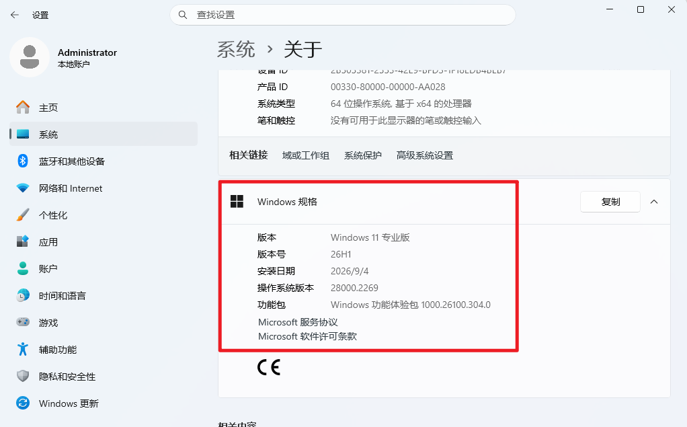

​	首先我们可以主动制造一个`除零`异常，如下所示：

```c
volatile int Divisor = 0;
volatile int Result = 1 / Divisor;
```

​	当CPU检测到除零异常后会抛出`#DE`。由于`#DE`的异常向量号为0，所以CPU会找到IDT表中第0项中断门描述符，从中解析出异常处理回调的函数入口，将执行流转移到该入口。使用WinDbg调试如下所示：

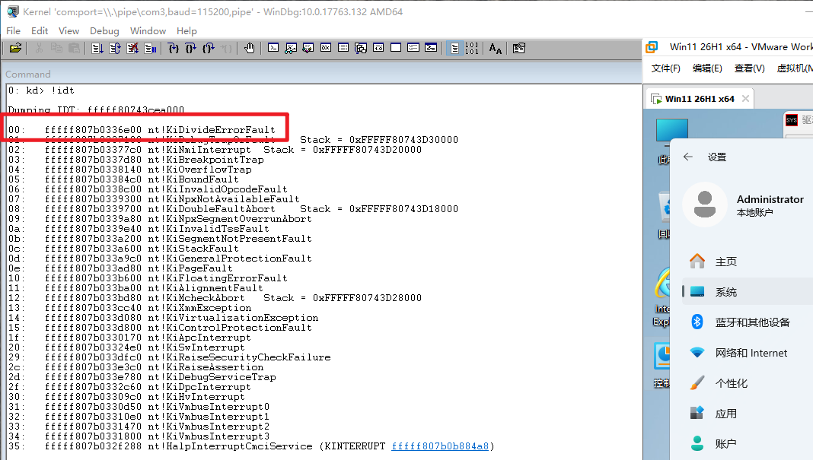

​	由于在虚拟机中调试，并没启用`内核页表隔离`，所以这里的异常处理例程为`KiDivideErrorFault`，正常用户的PC开启该机制后，CPU抛出`#DE`异常实际执行的是`KiDivideErrorFaultShadow`


### 2.1 内核页表隔离（KVA  Shadow）

> 1. 内核页表隔离并不是Win下特有的，在Linux下该技术叫做`KPTI`
>
> 2. 在早期的Windows、Linux中，用户态和内核态会共用同一份页表基址（Cr3）。当前Cr3除了映射用户地址空间，还会完整映射内核地址空间。由于现代CPU存在预测执行机制，以 2018 年公开的 **Meltdown（CVE-2017-5754）**为例，攻击者可以构造一段用户态代码，使CPU在权限检查完成前短暂`读取`内核地址中的数据，虽然这次读取最终会被判定为非法并回滚，但是CPU回滚状态时并不会清空缓存内容，通过测信道攻击后，R3可以读取到R0的数据

​	Win在开启内核页表隔离后，一个进程其实有2套页目录表基址（Cr3），平时R3程序在运行时使用的是一份`残缺`的页表，这份页表会映射完整的用户态内容，由于`异常`、`中断`、`系统调用`等操作会进入到内核，必须在内核设置一个落脚点，所以还会映射一小部分的内核态代码，这部分的代码保存在`KVASCODE`节区中。真正进入内核后，再切换到包含完整内核地址空间的页表。

​	在`KPROCESS`结构中，其实有着2个Cr3的保存点，如下所示：

```c
struct _KPROCESS
{
    struct _DISPATCHER_HEADER Header;                                       //0x0
    struct _LIST_ENTRY ProfileListHead;                                     //0x18
    ULONGLONG DirectoryTableBase;                                           //0x28	// 内核态CR3
	// ...
    ULONGLONG UserDirectoryTableBase;                                       //0x280	// 用户态CR3
	// ...
}; 
```

#### 2.1.1 2套CR3引入的效率问题

​	我们知道不同的Cr3切换时，会清空TLB缓存（当然，PTE.G = 1的全局PTE会保留），那么在启用了`KVA Shadow`后，一个进程有着2套CR3，这样是不是也会导致切Cr3清空TLB？

> 所以CPU厂商在这里引入了优化：`CR4.PCIDE = 1`启用进程识别标识符后，此时CR3的`Bit0~11位`会保存一个标识符，通过这个标识符可以告诉CPU这是同一个进程下不同的CR3在切换，此时就保留TLB缓存


### 2.2 KiDivideErrorFaultShadow

​	`KiDivideErrorFaultShadow`这个函数本身只是一个桩函数（过渡用，本身不处理异常），代码保存在`KVASCODE`节区中，首先判断判断`CS.RPL`，区分本次异常的来源是R3还是R0，如果是来自R0的异常，直接跳转到`KiDivideErrorFault`处理该异常。如果是来自R3的异常，会做以下事情：

- 将CR3切换为完整内核页表
- 将KVA Shadow使用的临时栈，切换为真正使用的内核栈
- 在内核堆栈中重新构造一份异常现场
- 最后直接jmp到真正的`#DE`处理函数

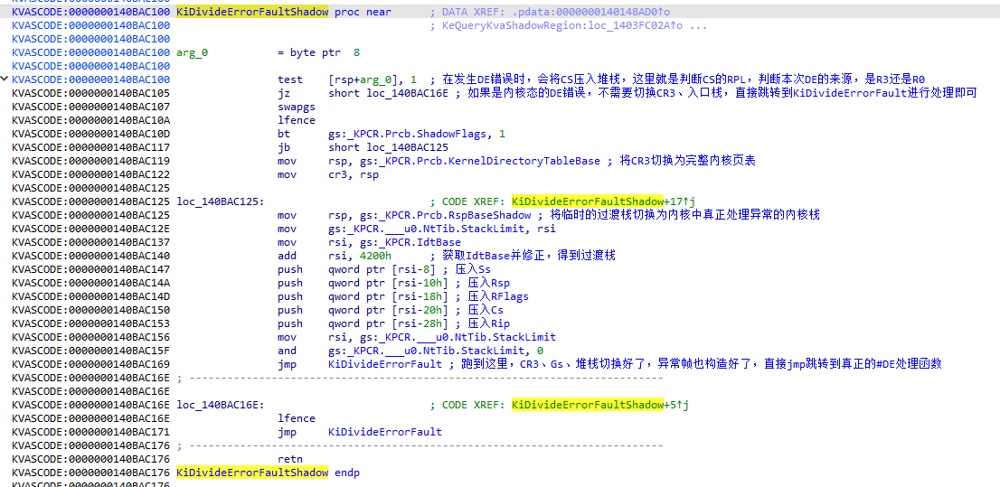


### 2.3 KiDivideErrorFault 

​	`KiDivideErrorFault `函数开头其实是在堆栈中构造`TrapFrame`对象，由于`#DE` 不压入硬件错误码，所以函数入口先保留了8字节的槽位，再保存`Rcx` `Rdx` `R8` `R9`等等易失寄存器，因为这些寄存器可能包含被中断代码正在使用的临时值，如图所示：

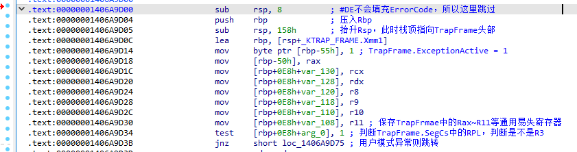


#### 2.3.1 R0异常派发路径

​	如果时来自内核的`#DE`异常，处理流程会简短很多，首先读取`CET`影子栈指针并将其保存到TrapFrame中

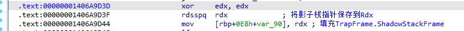

​	这里涉及到的`CET机制`，笔者比较通俗的理解如下：

> 1. 某些攻击手法是想办法让栈溢出，覆盖返回地址，做到`劫持执行流`，跳转执行自己的代码
> 2. 在开启了`CET机制`后，在`call xxx`调用函数时，CPU会同时将返回地址保存到普通栈、影子栈中，在调用`ret`返回时，CPU同时取出2个栈中的返回地址，此时做校验，如果不一致就抛出异常
> 3. 普通栈、影子栈是相互独立的，很难做到同时攻击2个栈中的返回地址

​	随后执行`lfence`入口屏障，限制CPU预测执行不能超过这个位置，根据每 CPU 的预测执行状态更新Msr寄存器

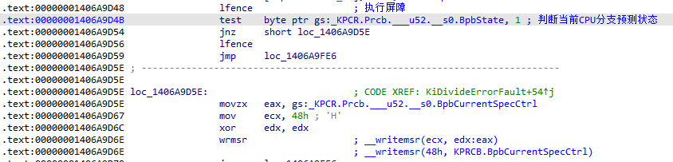

​	保存`SIMD`浮点现场、保存`XMM0~XMM5`等易失寄存器现场

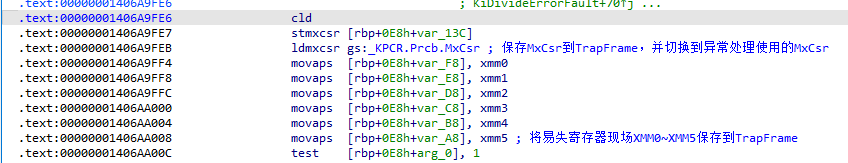

​	由于CPU执行中断门时，会自动清除`RFlags.IF`，这里判断异常发生时CPU的中断响应状态，并根据先前状态重新设置中断状态

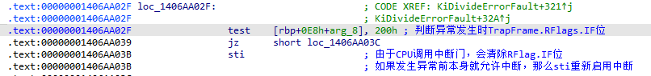

​	构造内部异常错误码`10000003h`、异常发生时的线性地址，调用`KiExceptionDispatch`公共异常分发入口进行异常派发

```c
// 根据x64调用约定，伪代码如下
KiExceptionDispatch(
	0x10000003,
	0,
	ExceptionAddress
);
```

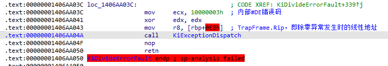


#### 2.3.2 R3异常路径

​	如果时来自R3的`#DE`错误，首先根据`KVA Shadow`状态选择是否切换`GS`

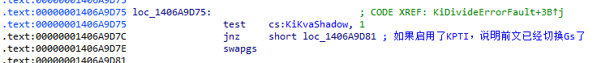

​	在`KiDivideErrorFaultShadow `中已经将内核过渡栈切换到了内核普通栈，但是由于`CET保护机制`，还需要将`过渡影子栈`切换到`内核影子栈`

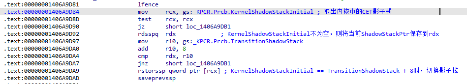

​	继续往下看汇编，会发现有着大量、重复的`call xxx`、`add rsp, 8`组合，这样的组合有32组，表面看似无意义，如图所示：

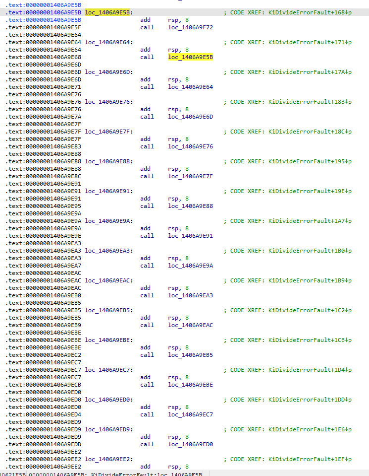

​	这里的汇编涉及到CPU中的RSB机制，笔者对此理解如下：

> 1. RSB叫做Return Stack Buffer，可以理解为CPU内部专门预测ret返回地址的小型硬件栈
>
> 2. 每次call xxx时，会将返回地址同时压入普通栈、RSB硬件栈，当CPU执行到ret返回时，CPU会提前读取RSB中的返回地址，提前取指令、译码，减少流水线执行的等待空窗，提高CPU执行效率

​	结合本文的异常处理，由于本次异常（R3异常路径）是在R3程序中出现的，就导致RSB中可能已经存储了大量R3的返回地址，那么CPU就有可能拿着R3返回地址进行错误的预测执行，这是非常危险的。

​	写到这里，这些大量调用的`call xxx`的作用就非常明显了，其作用如下：

```c
// 1. 将返回地址压入普通栈
// 2. 将预测返回地址压入CPU的RSB（Return stack buffer）
call xxx

// 丢弃普通栈上的返回地址，但是保留RSB中的返回地址
add rsp, 8
```

​	如此循环32次后，RSB中会被覆盖为内核态的返回地址，这个过程叫做`RSB stuffing`。同时由于`CET影子栈`保护机制的存在，如此循环执行32次`call xxx`，会导致`Shadow Stack` 也会保存32条内核态返回地址，所以还需要同步影子栈，如图所示：

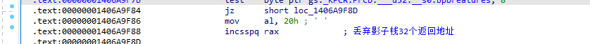

​	随后判断当前进程是否处于调试状态，如果是则保存调试寄存器：

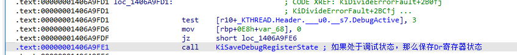

​	之后的代码其实算是R3、R0的公共代码了，都是保存`MxCsr`、`XMM0~XMM5`、尝试重新启用中断、调用`KiExceptionDispatch`派发异常，如下所示：

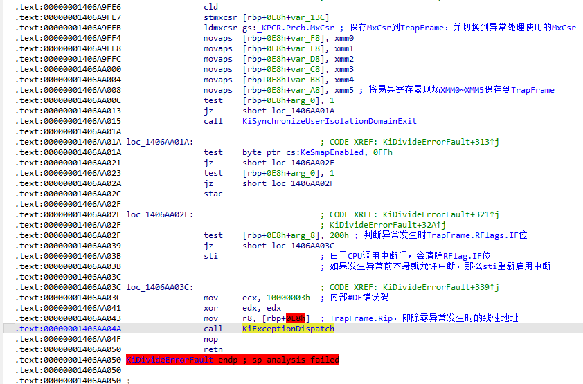


### 2.4 KiExceptionDispatch

​	函数入口处抬升堆栈，在栈中构造`ExceptionRecord`、`ExceptionFrame`对象，将`XMM6~XMM15`、`rbx`、`rdi`、`rsi`、`r12~r15`等非易失寄存器保存到`KEXCEPTION_FRAME`中：

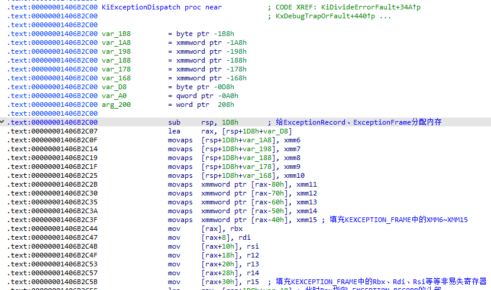

​	继续构造`ExceptionRecord`对象，填充异常错误码`0x10000003`、`异常地址ExceptionAddress`等等：

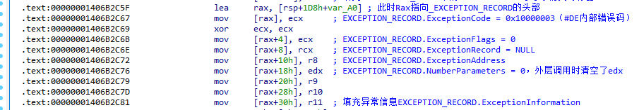

​	构造好`ExceptionRecord`、`ExceptionFrame`对象后，构造参数调用`KiDispatchException`继续派发异常：

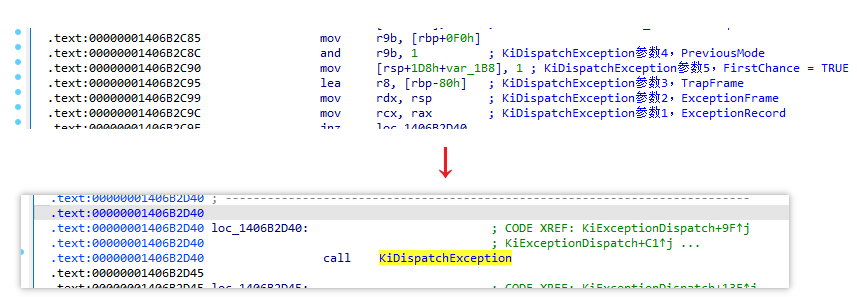

​	在`KiDispatchException`返回后，此时会有一次派发`用户Apc回调`的机会：

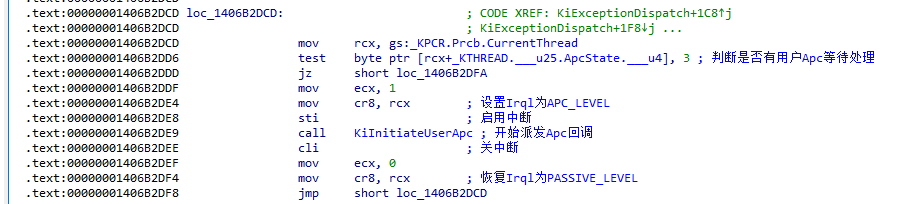


### 2.5 KiDispatchException

​	`KiDivideErrorFault `、`KiExceptionDispatch`等函数，主要功能是完成异常的记录，也有朋友称为`异常登记`，指的是同一件事。`KiDispatchException`函数负责异常的`派发`，在函数开头，会将增加异常派发计数：

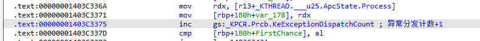


#### 2.5.1 上下文转换（构造Context）

​	在当前函数中，有着`TrapFrame`对象，其中保存着`易失寄存器环境`。还有着`ExceptionFrame`对象，其中保存着`非易失寄存器环境`。通过两者结合，就可以还原出异常发生时完整的`Context`上下文，有过异常开发、异常处理相关经验的朋友对这个对象肯定不陌生

​	转换的过程为：获取`Context`对象大小、初始化`Context`对象、将`TrapFrame`和`ExceptionFrame`转为`Context`

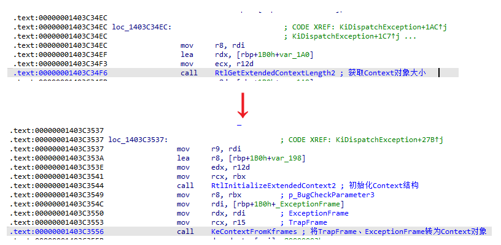


#### 2.5.2 内部错误码转换

​	通过前文我们可以知道，`#DE`除零错误的内部错误码为`0x10000003`，会调用`KiPreprocessFault`将内部错误码转为熟知的`C0000094`，代码如下：

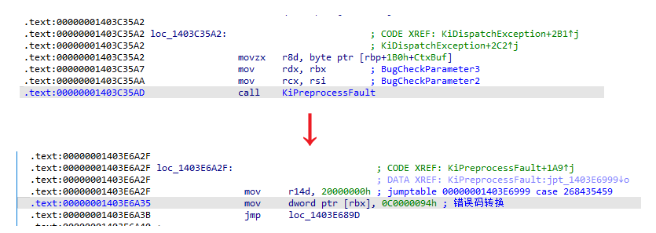


#### 2.5.3 R0异常路径

​	首先来分析R0发生`#DE异常时的处理路径：会判断`FirstChance`是否成立，如果成立，就尝试先将本次异常派发给`内核调试器`

​	这里存在一个内核全局变量`KdpDebugRoutineSelect`，由这个全局变量控制调用`KdTrap`还是`KdStub`，这是一个伏笔，后续章节会涉及到该全局变量

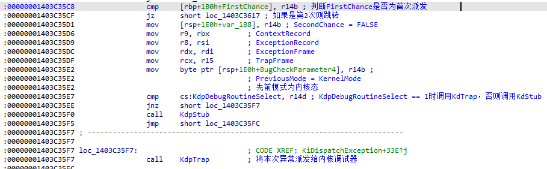

​	不管是调用`KdTrap`还是`KdStub`，返回`TRUE`则代表`内核调试器`顺利处理了该异常，会将`Context`恢复到`TrapFrame`中，之后`KiDispatchException`函数正常返回

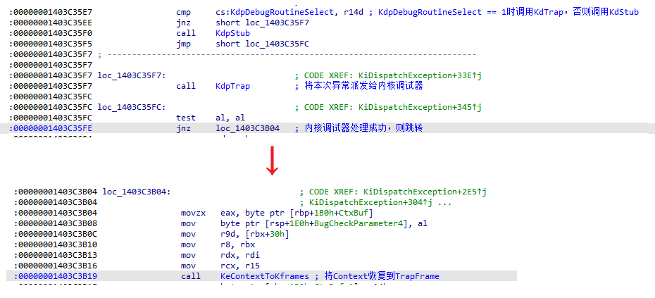

​	如果内核调试器没有处理异常，`KdTrap`、`KdStub`就会返回`FALSE`，会调用`RtlDispatchException`函数，将异常派发到`内核SEH`，尝试让程序自己来处理异常

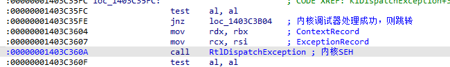

​	如果程序的`SEH Handler`顺利处理了该异常，`RtlDispatchException`函数返回`TRUE`，会将`Context`恢复到`TrapFrame`中，之后`KiDispatchException`函数正常返回

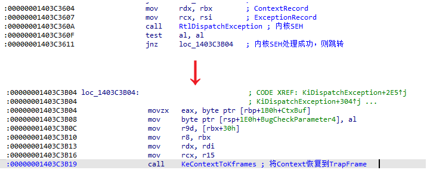

​		`RtlDispatchException`函数返回`FALSE`，说明`内核SEH`没有处理该（程序没有注册SEH、或者SEH没处理）异常，此时就会进入到内核异常的`二次派发`，当然，笔者称其为`二次派发`可能不太严谨，因为`KiDispatchEXception`函数本身并没有二次调用

​		内核异常的`二次派发`其实就是再次将异常派发给`内核调试器`，如果这次内核调试还不处理异常，则调用`KeBugCHeckEx`触发蓝屏

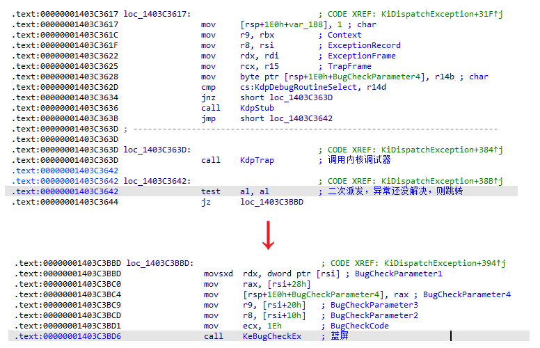

​	内核异常的派发，笔者画了一个粗糙的流程图：

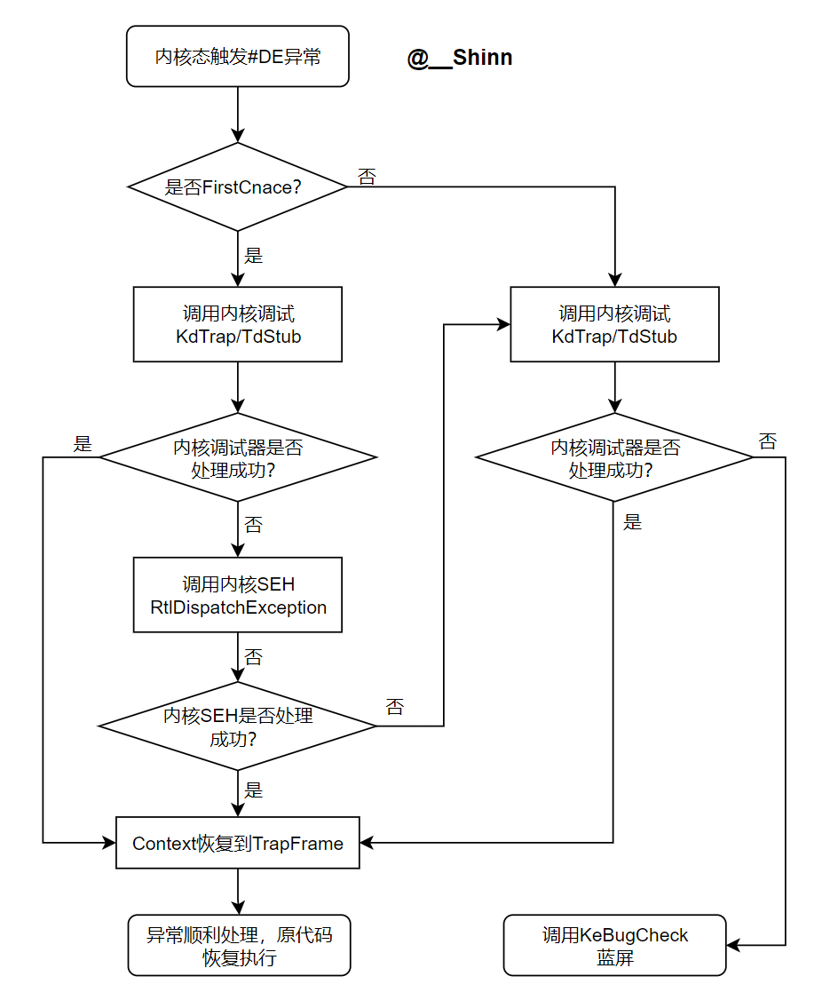


#### 2.5.4 R3异常路径（FirstChance路径）

​	我们首先来看一下如果`#DE`异常来自用户态，并且为首次派发的情况。

​	会检测内核全局变量`KdIgnoreUmExceptions`的状态，如果为`FALSE`，那么会将该用户态异常派发到`内核调试器`，如果`内核调试器`顺利处理了该异常，会将`Context`恢复到`TrapFrame`中，之后`KiDispatchException`函数正常返回

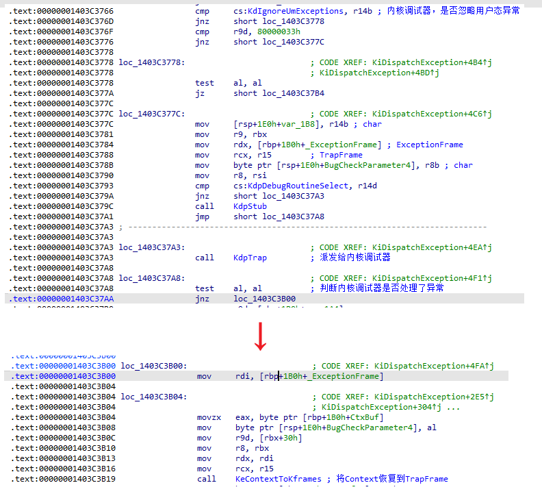

​	如果内核调试器没有处理该异常，则调用`DbgkForwardException`将异常派发给用户态调试器，即Windbg、x64Dbg等常用调试器，该函数返回`TRUE`，说明R3调试器处理了异常，`KiDispatchException`正常返回，本次异常派发流程结束

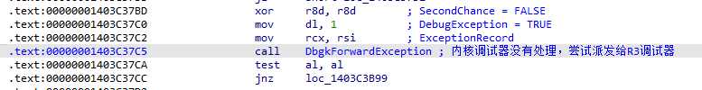

​	如果该3环程序没有挂载调试器、或者调试器选择不处理该异常，`DbgkForwardException`会返回`FALSE`，此时轮到用户态的`VEH`、`SEH`处理异常了，但是这些异常处理回调处于R3用户态，必须退回到R3环境才能执行这些回调，所以我们需要构造返回R3的用户栈，该过程跟`用户Apc`回调非常相似

​	要安全地访问用户态内存，要使用`ProbeForWrite`来探测用户态内存，之后在用户栈中填充`ExceptionRecord`、`Context`

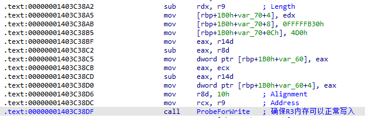

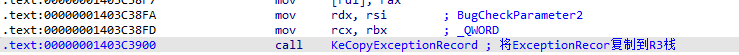

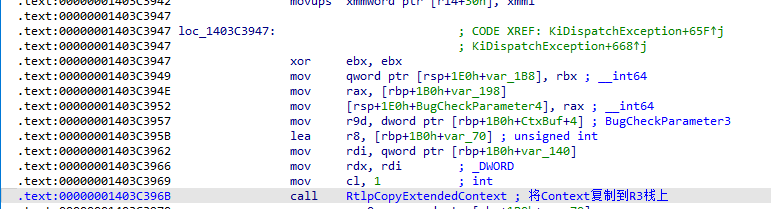

​	退回到用户态的栈环境布置好了，接下来就修改`TrapFrame`中的`Rsp`、`Rip`，这里的Rip其实就是用户态`ntdll!KiUserExceptionDispatcher`函数，该函数是用户态异常异常分发的落脚点，所以很多游戏安全厂商喜欢Hook这个点，可以最早监控到用户态异常的动态

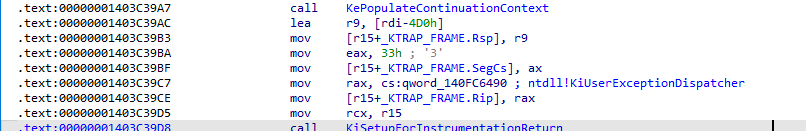

​	完成以上步骤后，`KiDispatchException`正常返回，结束FirstChance异常派发，当退回到用户态继续执行时，用户态代码如图所示(`ntdll!KiUserExceptionDispatcher`)，内部主要做了以下几件事：

- 从堆栈拿异常信息`ExceptionRecord`、异常上下文`Context`
- 调用`RtlDispatchException`函数：这个函数内部首先会遍历ntdll中的一个全局链表，这个全局链表保存着所有用户注册的VEH异常回调，一个个调用VEH回调来处理异常。如果VEH没处理，则调用`LookupFunctionEntry`尝试找到该函数的异常信息，让SEH来处理异常
- `RtlDispatchException`返回`TRUE`，则说明VEH或SEH处理成功，则调用`RtlGuardRestoreContext`，这个函数内部最终会调用`ZwContinue`恢复到原代码处继续执行
- 如果`RtlDispatchException`返回`FALSE`，则说明用户态异常处理失败了，调用`ZwRaiseException`模拟触发一次异常派发

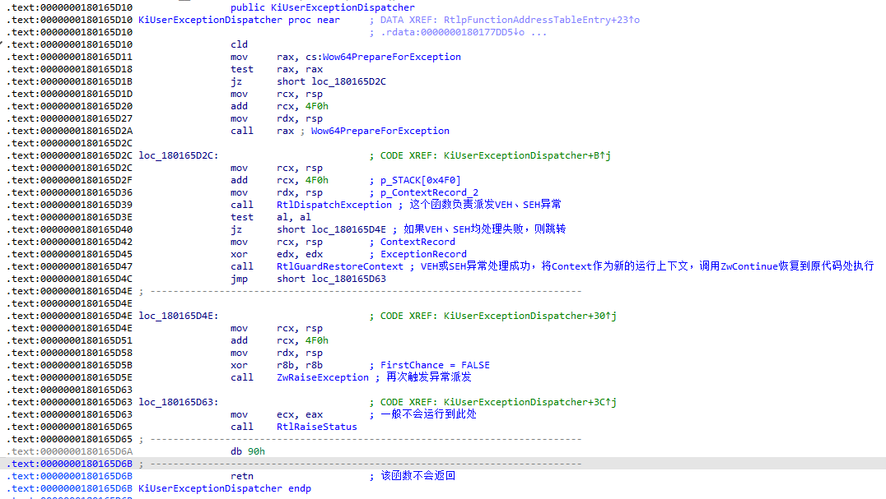

​	由于本文主要是针对Win11内核异常体系的分析，用户态部分碍于篇幅，在此就不详细展开分析了


#### 2.5.5 R3异常路径（SecondChance路径）

​	上一小节提到了，如果用户态异常也没处理好异常，会调用`ZwRaiseException`模拟产生异常异常派发，这就是用户态异常的`二次派发`，我们的视角继续回到`KiDispatchException`函数

​	用户异常的二次派发就简单多了，尝试将异常派发给用户调试器、异常端口，如果都没处理，最后结束当前进程

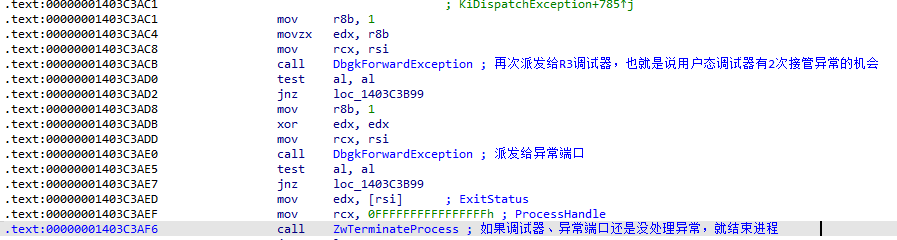


#### 2.5.6 R3异常路径小结

​	各位朋友看到这里应该发现了，用户态的异常派发相比内核态异常过程要麻烦得多，因为用户态异常的处理中间还涉及到构建用户栈、回退用户态、再次派发异常进入内核态，笔者当年首次分析Windows这套异常体系时，就被迷惑了好一段时间，这里笔者画了一张粗糙的流程图，或许可以帮助初学的朋友理清流程：

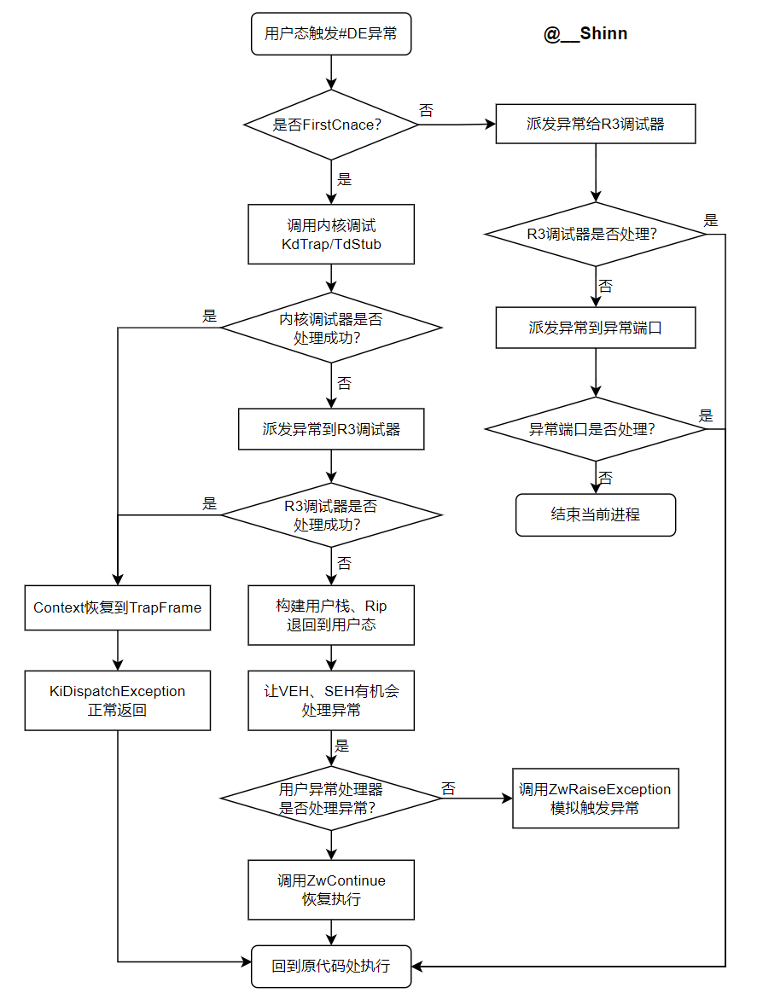


### 2.6 Win11 26H1异常体系总结

​	从整个异常处理的流程来看，大体上还是遵循着`异常记录`、`异常派发`、`异常处理`这三步骤进行：保存被打断的执行现场，将 CPU 硬件事件转换为统一的 Windows 异常对象，再根据异常来源和处理机会逐层派发，最后使用修改后的上下文恢复执行，或者终止无法恢复的执行主体。

​	`KVA Shadow`、`CET`、`RSB`等机制相关的代码，更多的是出于安全考虑，并不等同于异常处理逻辑本身


## 3. 提前接管用户态异常方法1

​	经过本文上半部分的铺垫，相信各位朋友对于Windows异常体系已经有了初步的认识，接下来笔者将会分析有哪些可以利用的点。

### 3.1 ntdll!KiUserExceptionDispatcher

​	首先让让我回顾一下，已知内核态退回到用户态让`VEH`、`SEH`有机会处理异常时，回去的落脚点为`KiUserExceptionDispatcher`函数，该函数完整反汇编如下：

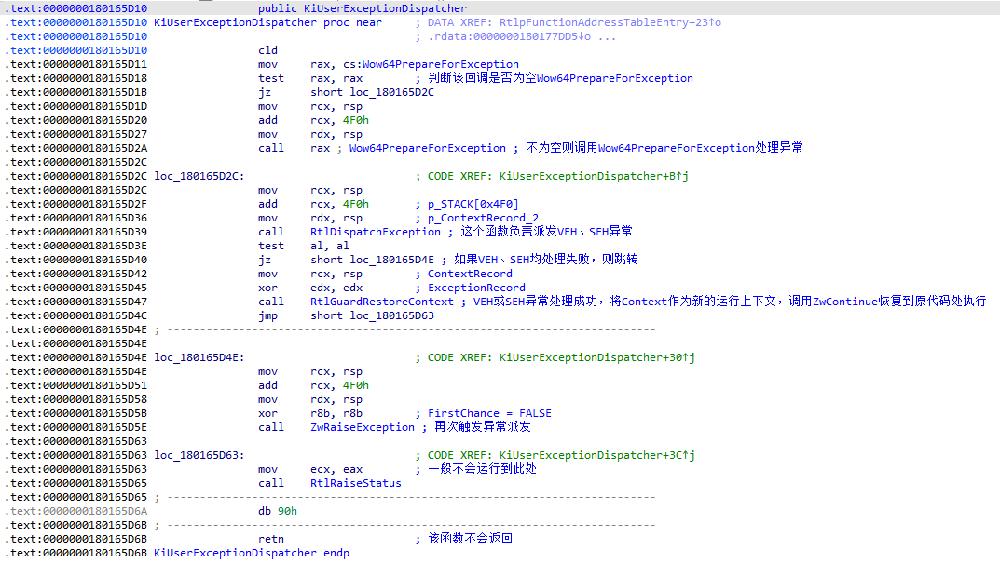

​	我们注意看函数的开头部分，首先判断一个全局变量`Wow64PrepareForException`是否为空，如果不为空则提前调用该回调，该回调的调用时机是明显早于`RtlDispatchException`的，即异常处理的优先级高于所有的用户`VEH`、`SEH`异常处理的

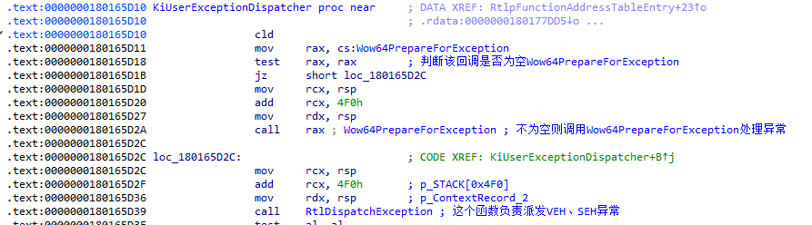

​	我们使用`x64Dbg`附加一个64位的程序调试一下，会发现大部分的应用程序`Wow64PrepareForException`该变量其实是空的

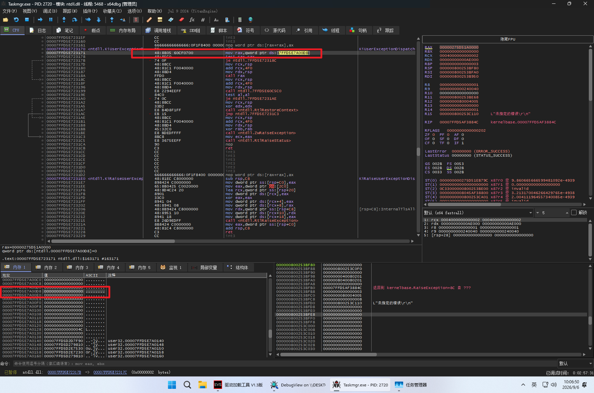

​	那么这个点我们可以利用起来，手动将我们自己的一个回调"注册"进去，这样每次自己的异常回调不就早于所有的`VEH`、`SEH`提前处理异常了？


### 3.2 ntdll!Wow64PrepareForException

​	现在方向非常明确了，我们要找到`ntdll!Wow64PrepareForException`这个全局变量，将我们的回调函数写进该变量中，那么如何定位到该变量呢？

​	笔者最早想到的是直接特征码硬搜呗，但是检查了一下发现，`ntdll!KiUserExceptionDispatcher`这个函数其实是导出的，那就很方便了

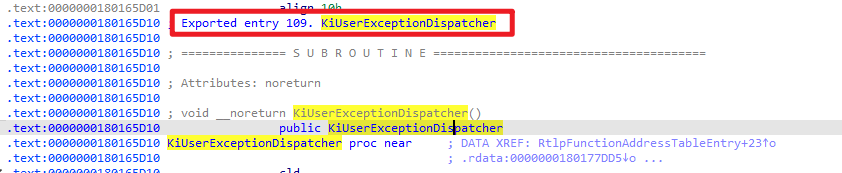

​	所有我们的注册异常回调函数，部分代码如下如下：

- 获取`ntdll!KiUserExceptionDispatcher`函数地址
- 从中匹配`mov rax, xxx`的3字节特征码
- 解引用算出`Wow64PrepareForException`全局变量地址
- 将自己的异常回调写到`Wow64PrepareForException`中，同时保存原有的`Wow64PrepareForException`回调指针

```c
BOOLEAN
InstallExceptionHook(
    _In_ fn_ExceptionCallback ExceptionCallback
)
{
    BOOLEAN Ret = FALSE;
    do
    {
        if (nullptr == ExceptionCallback)
        {
            break;
        }

        HMODULE hNtdll = GetModuleHandleA("ntdll.dll");
        if (nullptr == hNtdll)
        {
            break;
        }

        _NtContinue = (fn_NtContinue)GetProcAddress(hNtdll, "NtContinue");
        if (nullptr == _NtContinue)
        {
            break;
        }

        PVOID pKiUserExcpetionDispatch = GetProcAddress(hNtdll, "KiUserExceptionDispatcher");
        if (nullptr == pKiUserExcpetionDispatch)
        {
            break;
        }

        BOOLEAN bIsFound = FALSE;
        PUCHAR pByetCode = (PUCHAR)pKiUserExcpetionDispatch;
        while (TRUE)
        {
            if (pByetCode[0] == 0xC3 && pByetCode[1] == 0xCC)
            {
                break;
            }

            if (pByetCode[0] == 0x48 && pByetCode[1] == 0x8B && pByetCode[2] == 0x05)
            {
                bIsFound = TRUE;
                break;
            }

            pByetCode++;
        }

        if (!bIsFound)
        {
            break;
        }

        _ExceptionCallback = ExceptionCallback;

        LONG Offset = *(LONG*)(pByetCode + 3);
        pWow64PrepareForException = (fn_ExceptionCallback*)(pByetCode + 7 + Offset);

        DWORD OldProtrect = 0;
        VirtualProtect(
            (PVOID)PAGE_ALIGN(pWow64PrepareForException),
            USN_PAGE_SIZE, 
            PAGE_READWRITE,
            &OldProtrect
        );

        Old_ExceptionCallback =
            (fn_ExceptionCallback)_InterlockedExchangePointer((volatile PVOID*)pWow64PrepareForException, Wow64PrepareForException_Hook);

        VirtualProtect(
            (PVOID)PAGE_ALIGN(pWow64PrepareForException), 
            USN_PAGE_SIZE,
            OldProtrect, 
            &OldProtrect
        );

        Ret = TRUE;
    } while (FALSE);

    return Ret;
}
```

​	到了这里我们注册好了异常处理回调，那么这个回调本身笔者的写法如下所示：

- 出于工程解耦的设计思想，`_ExceptionCallback`才是外部注册时传进来的异常处理回调
- 如果`_ExceptionCallback`返回`TRUE`，那么我们调用`ntdll!NtContinue`直接**吞掉本次异常**，不继续向下调用`VEH`、`SEH`异常
- 当然，如果`_ExceptionCallback`返回`FALSE`选择不处理异常，`Wow64PrepareForException_Hook`直接返回即可，此时不会影响正常的`VEH`、`SEH`异常调用

```c
VOID
Wow64PrepareForException_Hook(
    _In_ PEXCEPTION_RECORD ExceptionRecord,
    _In_ PCONTEXT ContextRecord
)
{
    if (_ExceptionCallback(ExceptionRecord, ContextRecord))
    {
        _NtContinue(ContextRecord, FALSE);
    }
    else
    {
        if (nullptr != Old_ExceptionCallback)
        {
            Old_ExceptionCallback(ExceptionRecord, ContextRecord);
        }
    }
    return VOID();
}
```

​	测试代码如下所示，自定义异常处理器确实早于`VEH`、`SEH`接管了异常处理：

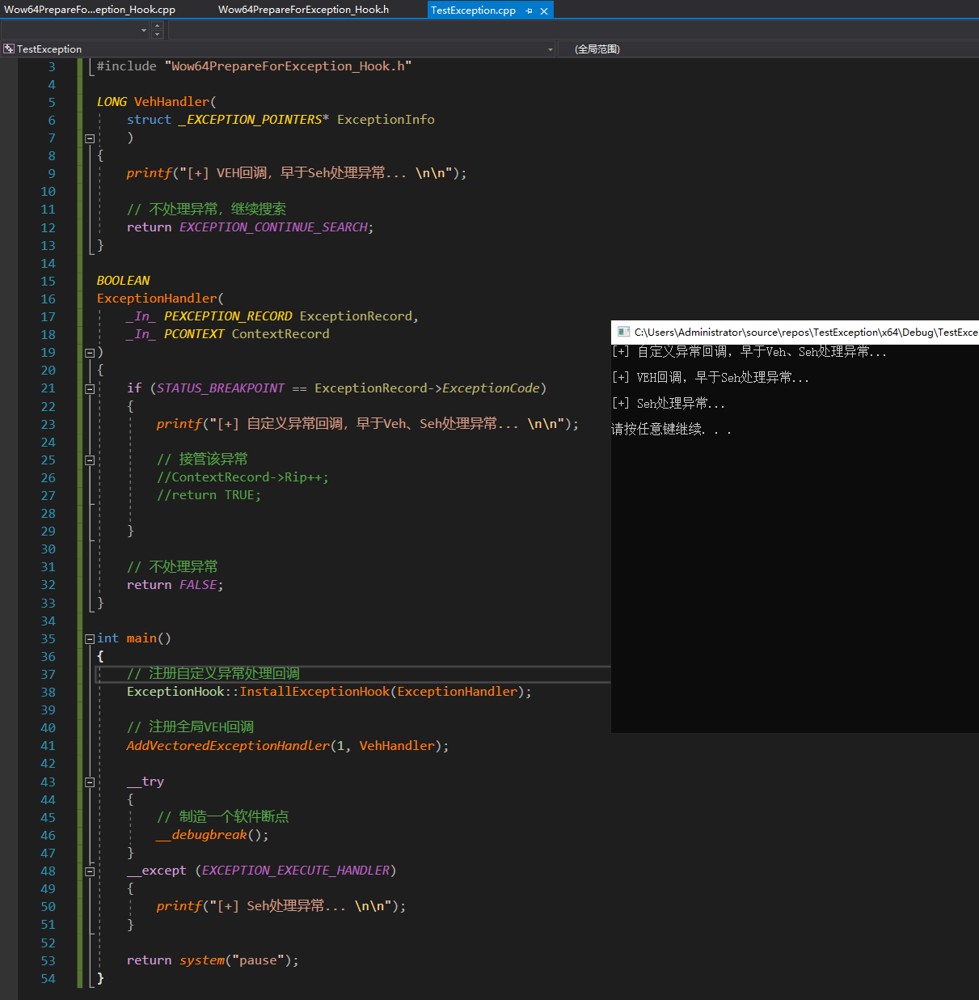


## 4. 无痕Hook代码实验（无痕Hook发包函数为例）

​	现在有了一个可以最早接管用户态异常的手法，笔者在想是不是应该做一个有意思的实验来证明其价值。所以就利用这个手法实现一个`无痕Hook`实验吧

​	当然，这里的`无痕Hook`并不是绝对意义上的无痕，指的是我们**不会破坏目标代码处的任何机器码**，让常规的`代码CRC校验`失效

​	笔者这里挑选的目标函数，是网络通讯中最常用的`send`函数

​	笔者的实验思路、粗糙画图如下：

- 注册`Wow64PrepareForException`，提前接管异常
- 定位到`send`函数所在的模块信息，例如模块基址、模块大小
- 完完全全复制一份目标模块，将其作为影子模块`ShadowModule`
- 向`send`函数所在的页面，注入一个页面异常，这样`send`函数每次被调用，都会触发异常
- 我们的异常回调接管到异常，判断异常发生的地址、错误码是不是我们关注的
- 如果是，那么就根据`ExceptionAddress`相对原模块的偏移，将`Ctx->Rip`重定向到影子模块`ShadowModule`中，将代码执行流劫持到`ShadowModule`中
- 最后我们可以在`ShadowModule`中不是想干什么就干什么，根本不会触发原代码段处的`CRC校验`
- 在影子模块`ShadowModule` 中的`send`函数处，直接挂上一个`inline Hook`，就能像常规逆向一样，监控、过滤参数信息

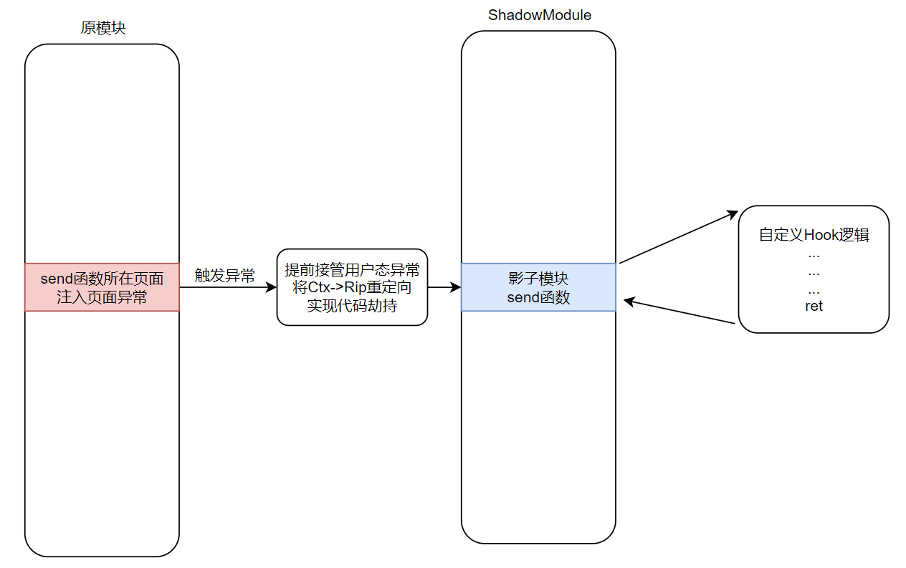


### 4.1 制造影子模块（ShadowModule）

​	制造影子模块其实很简单，传入我们要Hook的函数，这里以`send`发包函数为例，找到其所在模块基址、解析PE头得到模块大小，再完完整整构造一份`ShadowModule`，部分关键代码如下所示：

```c
PVOID
BuildShadowModule(
    _In_ PVOID pFuncAddr
)
{
    PVOID ShadowFuncAddr = nullptr;

    do
    {
        if (nullptr == pFuncAddr)
        {
            break;
        }

        PVOID ImageBase = nullptr;
        if (!RtlPcToFileHeader(pFuncAddr, &ImageBase))
        {
            break;
        }

        ULONG64 FuncOffset = (ULONG64)pFuncAddr - (ULONG64)ImageBase;

        SHADOW_MODULE_INFO* pExisting = FindModuleByBase(ImageBase);
        if (nullptr != pExisting)
        {
            ShadowFuncAddr = (PVOID)((ULONG64)pExisting->ShadowImageBase + FuncOffset);
            break;
        }

        PIMAGE_DOS_HEADER pDosHeader = (PIMAGE_DOS_HEADER)ImageBase;
        PIMAGE_NT_HEADERS64 pNtHeaders = (PIMAGE_NT_HEADERS64)((PUCHAR)pDosHeader + pDosHeader->e_lfanew);
        ULONG SizeOfImage = pNtHeaders->OptionalHeader.SizeOfImage;

        PVOID ShadowModule = VirtualAlloc(
            NULL,
            SizeOfImage,
            MEM_COMMIT,
            PAGE_EXECUTE_READWRITE
        );

        if (nullptr == ShadowModule)
        {
            break;
        }

        ULONG PageNum = SizeOfImage >> 12;
        BOOLEAN CopySuccess = TRUE;
        for (ULONG i = 0; i < PageNum; i++)
        {
            ULONG CurOffset = i * USN_PAGE_SIZE;

            BOOL ReadRet = ReadProcessMemory(
                GetCurrentProcess(),
                (PUCHAR)ImageBase + CurOffset,
                (PUCHAR)ShadowModule + CurOffset,
                USN_PAGE_SIZE,
                NULL
            );

            if (FALSE == ReadRet)
            {
                CopySuccess = FALSE;
                VirtualFree(ShadowModule, 0, MEM_RELEASE);
                break;
            }
        }

        if (!CopySuccess)
        {
            break;
        }

        SHADOW_MODULE_INFO ShadowInfo = { 0 };
        ShadowInfo.OriginalImageBase = ImageBase;
        ShadowInfo.ShadowImageBase = ShadowModule;
        ShadowInfo.ImageSize = SizeOfImage;

        PIMAGE_SECTION_HEADER pSectionHeader = IMAGE_FIRST_SECTION(pNtHeaders);
        for (WORD i = 0; i < pNtHeaders->FileHeader.NumberOfSections; i++)
        {
            if (memcmp(pSectionHeader[i].Name, ".data", 5) == 0)
            {
                ShadowInfo.OriginalDataSectionAddr = (PVOID)((ULONG64)ImageBase + pSectionHeader[i].VirtualAddress);
                ShadowInfo.ShadowSectionDataAddr = (PVOID)((ULONG64)ShadowModule + pSectionHeader[i].VirtualAddress);
                ShadowInfo.DataSectionSize = pSectionHeader[i].Misc.VirtualSize;

                break;
            }
        }

        g_ShadowModules.push_back(ShadowInfo);

        ShadowFuncAddr = (PVOID)((ULONG64)ShadowModule + FuncOffset);

    } while (FALSE);

    return ShadowFuncAddr;
}
```


### 4.2 向目标函数页面注入异常（隐藏不可执行页面）

​	在构造好影子模块后，就要想办法让`send`函数所在的页面注入页面异常了，很常见的方式是将目标函数所在页面使用`VirtualProtect`，修改页面属性为以下几种：

- 修改页面保护属性为`PAGE_READONLY`只读、`PAGE_READWRITE`读写等等，总之就是让页面不可执行
- 修改页面保护属性，增加`PAGE_GUARD`

> 这种都是非常常见的应用层套路，单论效果来说，确实可以达到注入页面异常的效果，但是这样**痕迹太明显了**，安全程序扫描时直接调用`VirtualQuery`就能查询目标页面的内存保护属性，很轻易就能发现页面保护属性被修改了

​	所以我们目前的发现，就是要**隐藏目标页面的不可执行属性**，该如何实现呢，这里笔者想到了`DEP数据执行保护`机制，简单讲解一下这是什么（很口语化的讲解，不保证严谨）：

> 在很早期的Win系统时期，当时的应用程序虽然在设计上区分出来代码段、数据段（堆栈区），但是这仅仅是逻辑上的划分，数据段（堆栈区）其实也是可以运行代码的
>
> 笔者这里举一个非常经典的栈溢出攻击例子：调用recv接收网络数据包时，攻击者可以精心构造一个数据包，其中其实是一段shellcode，当数据包接收后，会栈溢出覆盖栈上的RetAddress，这样函数返回时就会跑去执行攻击者的shellcode，做到劫持执行流，可以给目标PC植入木马
>
> 所以后来Win系统跟CPU厂商合计了一下发现，嘶~这是个大问题啊，得想办法修好这个问题。所以就设计出了DEP数据执行保护机制，通过硬件层面的强控制，来保证数据区（堆栈区）不能执行代码

​	DEP数据执行保护在硬件层面设计上，是将`PTE`的最高位保留为`Nx`不可执行属性位，由于Win的段页模式存在2MB大页面的情况，所以`PDE`的最高位也保留为了`Nx`不可执行属性位。

​	当`PTE.Nx = 1`后，该PTE所控制的4kb页面就是不可执行代码的。当`PDE.Nx = 1`后，该PDE所控制的2MB大页面都是不可执行代码的

​	设置目标页面代码不可执行，关键代码如下所示：

```c
typedef struct HARDWAREPTE_X64
{
	ULONG64 valid : 1;               //!< [0]
	ULONG64 write : 1;               //!< [1]
	ULONG64 owner : 1;               //!< [2]
	ULONG64 write_through : 1;       //!< [3]
	ULONG64 cache_disable : 1;       //!< [4]
	ULONG64 accessed : 1;            //!< [5]
	ULONG64 dirty : 1;               //!< [6]
	ULONG64 large_page : 1;          //!< [7]
	ULONG64 global : 1;              //!< [8]
	ULONG64 copy_on_write : 1;       //!< [9]
	ULONG64 prototype : 1;           //!< [10]
	ULONG64 reserved0 : 1;           //!< [11]
	ULONG64 page_frame_number : 36;  //!< [12:47]
	ULONG64 reserved1 : 4;           //!< [48:51]
	ULONG64 software_ws_index : 11;  //!< [52:62]
	ULONG64 no_execute : 1;          //!< [63]
}HARDWAREPTE, *PHARDWAREPTE;

BOOLEAN 
SetPageNonExecutable(
	ULONG64 VirtualAddress,
	ULONG Size
)
{
	ULONG64 EndAddress = (ULONG64)PAGE_ALIGN(VirtualAddress + Size);
	ULONG64 StartAddress = (ULONG64)PAGE_ALIGN(VirtualAddress);

	while (EndAddress >= StartAddress)
	{
		HARDWAREPTE* Pde = (HARDWAREPTE*)GetPde(StartAddress);
		if (MmIsAddressValid(Pde) && Pde->valid && !Pde->large_page)
		{
			HARDWAREPTE* Pte = (HARDWAREPTE*)GetPte(StartAddress);
			if (MmIsAddressValid(Pte) && Pte->valid)
			{
				Pte->no_execute = 1;
			}

		}

		StartAddress += PAGE_SIZE;
	}

	return TRUE;
}
```

​	我们设置硬件PTE来隐藏不可执行页面，效果如下所示，虽然内存监控工具CE表面上显示该页面保护属性为`PAGE_EXECUTE_READ`可执行可读，但是实际上该页面已经被注入了`页面执行异常`

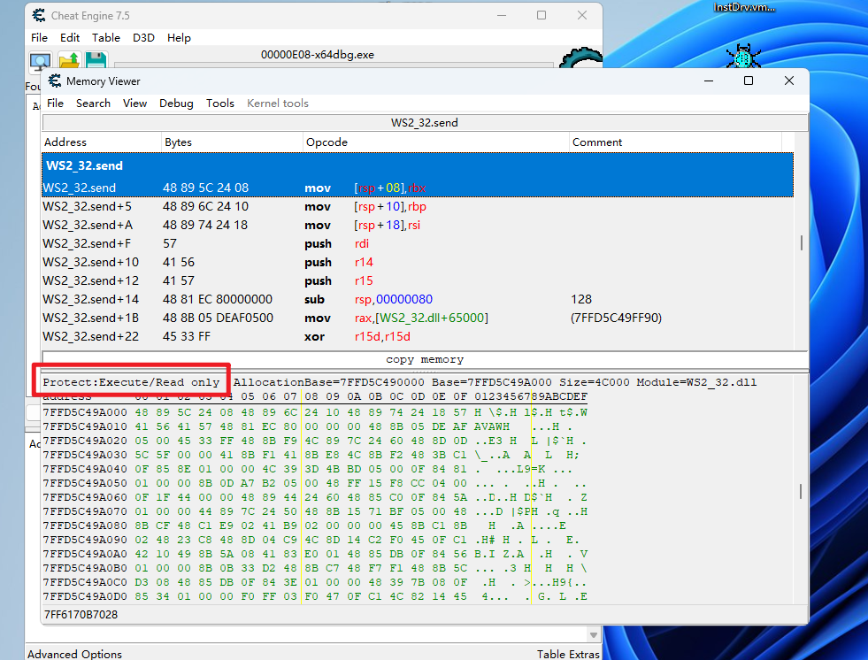


### 4.3 修复控制流防护问题（CFG）

​	我们构造好了`ShadowModule`、目标函数页面注入了执行异常，那么我们要着手写异常处理回调中的逻辑了，关键代码如下所示：

- 判断出现异常错误码是不是`STATUS_ACCESS_VIOLATION`，如果不是就放过该异常
- 如果是页面访问异常，就继续判断出现异常的地址ExceptionAddress是不是被我们要的。本实验就是判断异常地址是不是处于`ws2_32.dll`模块内
- 如果是，那么就是计算异常地址ExceptionAddress到原模块的偏移
- 根据计算好的偏移，将`Rip`一比一重定向影子模块中

```c
BOOLEAN
ExceptionHandler(
	_In_ PEXCEPTION_RECORD ExceptionRecord,
	_In_ PCONTEXT ContextRecord
)
{
	if (STATUS_ACCESS_VIOLATION == ExceptionRecord->ExceptionCode)
	{
		ShadowModule::SHADOW_MODULE_INFO ShadowInfo = { 0 };
		if (!ShadowModule::QueryByExceptionAddress(ExceptionRecord->ExceptionAddress, &ShadowInfo))
		{
			return FALSE;
		}

		ULONG64 FuncOffset = (ULONG64)ExceptionRecord->ExceptionAddress - (ULONG64)ShadowInfo.OriginalImageBase;
		ContextRecord->Rip = (ULONG64)ShadowInfo.ShadowImageBase + FuncOffset;

		return TRUE;
	}

	return FALSE;
}
```

​	我们现在编译出exe、drv进行实验，放到Win11 26H1中进行实验，打开程序结果直接崩溃了，好吧果然不能一次过

​	我们挂上`x64Dbg`调试器看看是啥情况，笔者第一次看到这个反汇编窗口，懵了一下，代码怎么跑飞到这种地方来了，没招了分析吧

1. 当前崩溃的`ExceptionAddress = 12B701980C0`，这个rip地址，看起来像是是属于影子模块`ShadowModule`的范围内

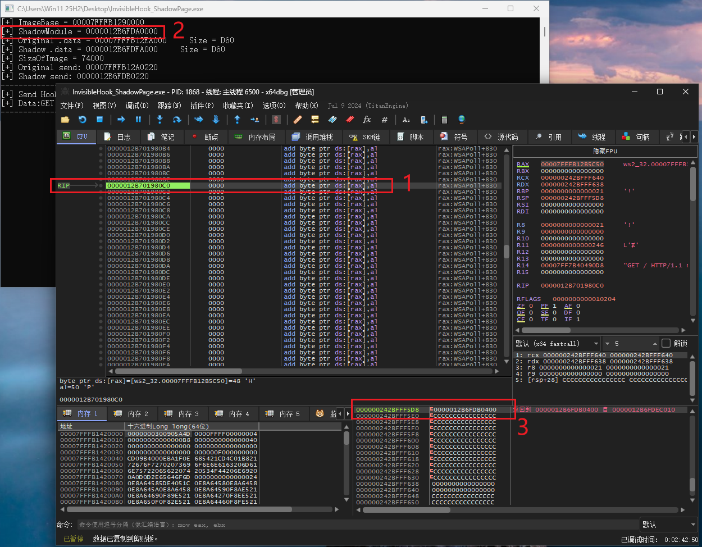

2. 我们看一下栈顶的返回地址`000000242BFFF5D8`，跳到其反汇编窗口看看，如下图所示
3. 问题点很清晰了，十有八九是`call 12B6FDEC010`出了问题

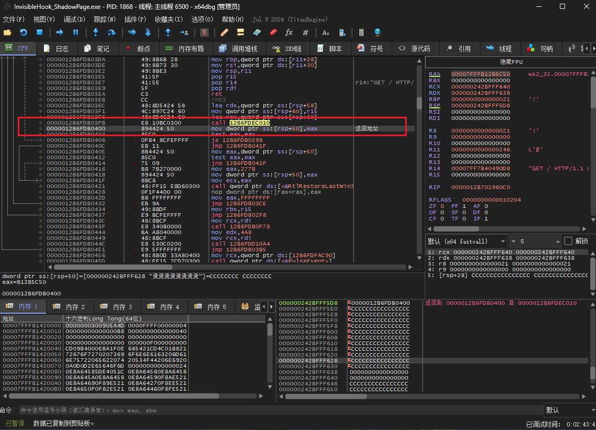

4. 我们跟进这个`call`看看，如图所示：
5. 好吧，果然是`jmp 12B701980C0`跳转到了异常的代码段，由于这里的相对跳转`E9 xxxx`，很明显这里的相对偏移是跳转不到正确代码的，这下跟`步骤1`的现象吻合了

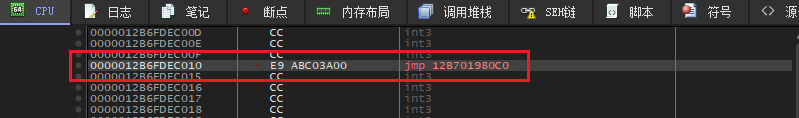

6. 既然现在发现了问题的来源，那么`jmp 12B701980C0`这个跳转是啥？我们可以用IDA反汇编`ws2_32.dll`，看看原始模块的代码是什么，如图所示

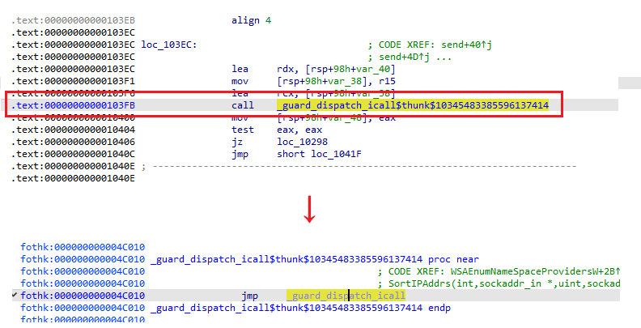

7. 到了这里，各位读者应该就豁然开朗了，原来是`CFG`控制流防护相关的代码！

​	既然定位到了问题的根源，要解决该问题就轻松多了，笔者的解决思路如下：

1. 众所周知，CFG控制流防护的`_guard_dispatch_icall`，会将真实调用的函数地址放在`rax`寄存器中
2. 那直接动态Patch一下影子模块中的`_guard_dispatch_icall`，将其修改为直接`jmp rax`不就解决问题了？


​	修复CFG控制流防护问题的关键代码如下：

```c
BOOLEAN 
FixCFG_ws2_32(
	_In_ ULONG64 ModuleAddress
)
{
	const auto ResolveCallRel32 = [](ULONG64 callAddress) -> ULONG64
	{
		if (!callAddress || *reinterpret_cast<BYTE*>(callAddress) != 0xE8)
		{
			return NULL;
		}

		const auto relativeOffset = *reinterpret_cast<std::int32_t*>(callAddress + 1);
		return callAddress + 5 + relativeOffset;
	};

	SearchCode::cSearchCode CodeSearcher;
	ULONG64 CodeAddr = CodeSearcher.SearchModule(
		ModuleAddress,
		"48 8D 54 24 ?? 4C 89 7C 24 ?? 48 8D 4C 24 ?? E8 ?? ?? ?? ?? 89 44 24 ?? 85 C0 0F 84 ?? ?? ?? ?? EB ??",
		PAGE_EXECUTE_READWRITE
	);
	if (NULL == CodeAddr)
	{
		return FALSE;
	}

	ULONG64 ResolveAddr = ResolveCallRel32(CodeAddr + 15);
	if (NULL == ResolveAddr)
	{
		return FALSE;
	}

	// Jmp rax
	*(USHORT*)((PUCHAR)ResolveAddr) = 0xE0FF;

	return TRUE;
}
```


### 4.4 修复全局变量不一致

​	在修复了`CFG控制流`防护问题后，再次运行程序，这个崩溃果然解决了

​	但是随之而来程序又崩溃了，额，挂上`x64Dbg`调试器再看看，如图所示，笔者分析过程如下：

1. `rdx`寄存器为空，很明显访问了空指针
2. 而`rdx`寄存器是来源于全局变量`000002A93348AB28`解引用
3. 在内存区域查看全局变量`000002A93348AB28`，果然是空的

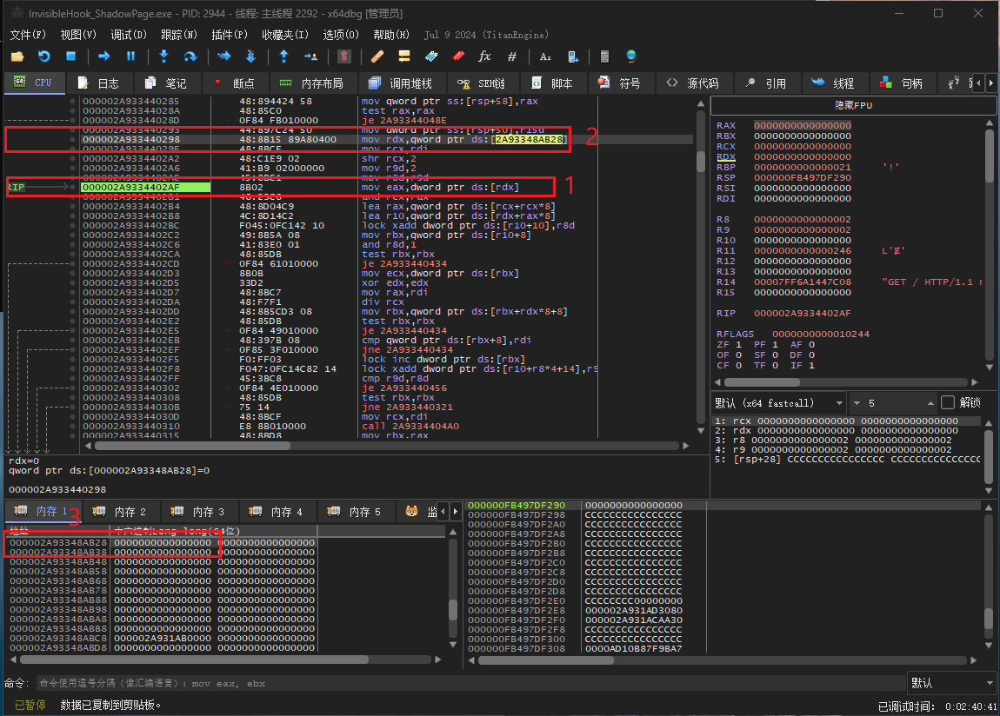

4. 分析到了这里，问题的根源就很清晰了，就是由于`源模块`、`影子模块`之间，虽然代码区域是一模一样的，但是由于**全局变量本质上是独立的**，导致劫持执行流后，在影子模块中访问一些全局变量时，出现了上下文不一致的缺陷
5. 要解决这个问题，笔者的思路就是想办法让原始模块、影子模块的**全局变量区域内存变为共享**的，即虽然用户态线性地址不一样，但是最终指向的物理页面是同一份

笔者首先想到了修改`PTE.page_frame_num`修改PTE的物理页帧号，使2个线性地址都指向同一份4KB物理页，实现代码如下所示：

```c
BOOLEAN
MapAddress_PTE(
	ULONG64 SrcVa,
	ULONG64 DstVa,
	ULONG Size
)
{
	ULONG64 SrcStartAddress = (ULONG64)PAGE_ALIGN(SrcVa);
	ULONG64 DstStartAddress = (ULONG64)PAGE_ALIGN(DstVa);
	ULONG64 EndOffset = (ULONG64)PAGE_ALIGN((PVOID)(SrcVa + Size));

	ULONG64 PageCount = (EndOffset - SrcStartAddress) / PAGE_SIZE;
	if (PageCount == 0)
	{
		PageCount = 1;
	}

	for (ULONG64 i = 0; i < PageCount; i++)
	{
		ULONG64 CurrentSrcVa = SrcStartAddress + (i * PAGE_SIZE);
		ULONG64 CurrentDstVa = DstStartAddress + (i * PAGE_SIZE);

		HARDWAREPTE* SrcPde = (HARDWAREPTE*)GetPde(CurrentSrcVa);
		HARDWAREPTE* DstPde = (HARDWAREPTE*)GetPde(CurrentDstVa);

		if (!MmIsAddressValid(SrcPde) || !SrcPde->valid)
		{
			return FALSE;
		}

		if (!MmIsAddressValid(DstPde) || !DstPde->valid)
		{
			return FALSE;
		}

		HARDWAREPTE* SrcPte = (HARDWAREPTE*)GetPte(CurrentSrcVa);
		HARDWAREPTE* DstPte = (HARDWAREPTE*)GetPte(CurrentDstVa);

		if (!MmIsAddressValid(SrcPte) || !SrcPte->valid)
		{
			return FALSE;
		}

		if (!MmIsAddressValid(DstPte) || !DstPte->valid)
		{
			return FALSE;
		}

		DstPte->page_frame_number = SrcPte->page_frame_number;

		__invlpg((PVOID)CurrentDstVa);
	}

	return TRUE;
}
```

​	但是很遗憾，经过笔者实验后发现，这种修改PTE页帧号的手法，在处理一些普通的内存页面时，的确可以实现内存共享（稳定挺长时间不蓝屏）。但是涉及到dll模块内的内存时，修改后系统1分钟之内必定会出现蓝屏错误，错误码为`MEMORY_MANAGEMENT`

​	直接修改硬件PTE的方式似乎走不通了，笔者这里选择的是通过`MDL`内存映射实现了内存页面共享，实现思路如下：

1. 释放影子模块`.data`节区的内容，让该线性地址释放、空闲出来
2. 调用`MDL`内存映射，让系统将指定的物理页面，映射到笔者指定的线性地址处
3. 经过笔者测试后，该方法算是比较完美地解决全局变量内存共享的问题，关键代码如下所示：

```c
BOOLEAN
MapAddress_MDL(
	ULONG64 SrcVa,
	ULONG64 DstVa,
	ULONG Size
)
{
	ULONG64 SrcStartAddress = (ULONG64)PAGE_ALIGN(SrcVa);
	ULONG64 DstStartAddress = (ULONG64)PAGE_ALIGN(DstVa);
	ULONG64 EndOffset = (ULONG64)PAGE_ALIGN((PVOID)(SrcVa + Size));

	ULONG64 PageCount = (EndOffset - SrcStartAddress) / PAGE_SIZE;
	if (PageCount == 0)
	{
		PageCount = 1;
	}

	for (ULONG64 i = 0; i < PageCount; i++)
	{
		ULONG64 CurrentSrcVa = SrcStartAddress + (i * PAGE_SIZE);
		ULONG64 CurrentDstVa = DstStartAddress + (i * PAGE_SIZE);

		if (!MmIsAddressValid((PVOID)CurrentSrcVa))
		{
			DbgPrint(
				"[MapAddress] Source address 0x%llx is invalid\n", 
				CurrentSrcVa
			);
			return FALSE;
		}

		PVOID BaseAddress = (PVOID)CurrentDstVa;
		SIZE_T RegionSize = PAGE_SIZE;
		NTSTATUS status = ZwFreeVirtualMemory(
			NtCurrentProcess(),
			&BaseAddress,
			&RegionSize,
			MEM_RELEASE
		);

		if (!NT_SUCCESS(status))
		{
			DbgPrint(
				"[MapAddress] Failed to decommit target address 0x%llx, status=0x%x\n",
				CurrentDstVa, 
				status
			);
		}

		PMDL Mdl = IoAllocateMdl((PVOID)CurrentSrcVa, PAGE_SIZE, FALSE, FALSE, NULL);
		if (!Mdl)
		{
			DbgPrint(
				"[MapAddress] Failed to allocate MDL for 0x%llx\n", 
				CurrentSrcVa
			);
			return FALSE;
		}

		__try
		{
			MmProbeAndLockPages(Mdl, UserMode, IoModifyAccess);
		}
		__except (EXCEPTION_EXECUTE_HANDLER)
		{
			DbgPrint(
				"[MapAddress] Failed to lock pages for 0x%llx\n", 
				CurrentSrcVa
			);
			IoFreeMdl(Mdl);
			return FALSE;
		}

		PVOID MappedAddress = MmMapLockedPagesSpecifyCache(
			Mdl,
			UserMode,
			MmCached,
			(PVOID)CurrentDstVa, 
			FALSE,              
			NormalPagePriority
		);

		if (!MappedAddress)
		{
			DbgPrint(
				"[MapAddress] Failed to map to address 0x%llx\n", 
				CurrentDstVa
			);
			MmUnlockPages(Mdl);
			IoFreeMdl(Mdl);
			return FALSE;
		}

		if (MappedAddress != (PVOID)CurrentDstVa)
		{
			DbgPrint(
				"[MapAddress] Mapped to 0x%p instead of requested 0x%llx\n",
				MappedAddress, 
				CurrentDstVa
			);
			MmUnmapLockedPages(MappedAddress, Mdl);
			MmUnlockPages(Mdl);
			IoFreeMdl(Mdl);
			return FALSE;
		}

		if (!AddMdlMapEntry(CurrentDstVa, Mdl))
		{
			DbgPrint("[MapAddress] Failed to track MDL for 0x%llx\n", CurrentDstVa);
			MmUnmapLockedPages(MappedAddress, Mdl);
			MmUnlockPages(Mdl);
			IoFreeMdl(Mdl);
			return FALSE;
		}

		DbgPrint(
			"[MapAddress] Successfully mapped 0x%llx -> 0x%llx (MDL tracked)\n",
			CurrentSrcVa, 
			CurrentDstVa
		);
	}

	return TRUE;
}
```


### 4.5 给影子模块挂Inline Hook

​	经过前文的各种调试、处理后，的确可以较为稳定地将代码执行流劫持到影子模块中

​	那么接下来完美就可以自由地做手脚了，笔者这里给影子模块中的`send`函数下`inline hook`，可以正常监控参数信息，如下所示：

```c
int
WINAPI
MySend(
	_In_ SOCKET s,
	_In_reads_bytes_(len) const char FAR* buf,
	_In_ int len,
	_In_ int flags
)
{
	printf("--------------------------------------------------- \n");
	printf("[+] Send Hook - Socket: %llu, Length: %d\n", (ULONG64)s, len);
	printf("[+] Data:%s \n", buf);
	printf("--------------------------------------------------- \n");

	return g_OriginalSend(s, buf, len, flags);
}
```

​	使用调试器，`send`处的代码**没有任何修改**，但是实际上确实是被我们Hook了，并正常输出参数

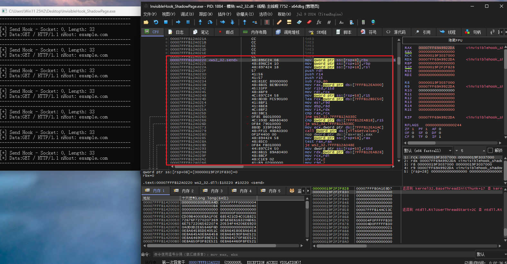

​	这部分代码已经整理好，Git仓库地址见文末


## 5. 提前接管用户态异常方法2

​	前文介绍了一种Hook `ntdll!Wow64PrepareForException`实现提前接管用户态异常的方法，但是毕竟是用户态的对抗，一些游戏安全厂商、安全开发者往往会直接Hook `ntdll!KUserExceptionDispatcher`实现总管用户态异常，那么我们提前接管用户态异常的行为，还是有可能会被监控、扫描出来

​	那么有没有一种方法？

​	在退回到用户态之前，直接在内核态提前接管用户态异常呢？

​	有的兄弟，有的，笔者接下来将会介绍一种**类似Hook nt!KiDispatchException的方法**，实现在内核态提前接管用户异常

​	前文长篇分析Win11内核异常体系、无痕Hook，都属于前期铺垫，现在笔者将带着各位朋友，把**对抗的层级拉到内核层**，本文精彩的部分才刚刚开始

### 5.1 nt!PsPicoDispatchException

​	我们重新回到`nt!KiDispatchException`中进行分析，在该函数的开头，会连续判断3个条件是否成立：

- 是否为首次异常派发
- 判断当前进程对象是否为空
- 判断当前进程`Process.PicoContext`是否为空

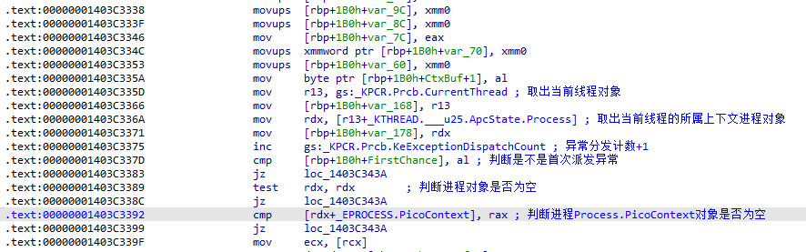

​	如果以上3点都满足，那么不调用`KiPreprocessFault`函数提前将`#DE`内部错误转换为文档化的错误码`C0000094`

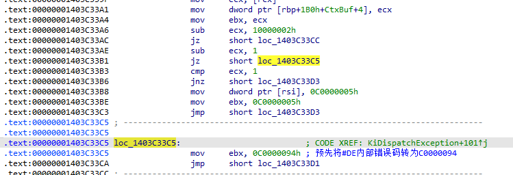

​	随后从全局变量`xmmword_140F05660`取出一个函数指针，通过`CFG`发起一次间接函数调用，如果该函数返回`TRUE`，那么`ntKiDispatchException`函数提前返回，所以说**该函数的异常接管优先级非常高**，早于`内核调试器`、`R3调试器`、`用户VEH`、`用户SEH`接管异常。这个函数调用其实是`nt!PsPicoDispatchException`，这其实和`WSL`子系统有关，笔者对此粗浅的理解如下：

> 由于WSL Linux子系统的存在，那么子系统中的进程就叫做WSL进程吧，这些进程内同样会出现各种异常，需要系统异常体系派发、处理，但是WSL进程毕竟不是原生的Win进程，微软希望的是由WSL子系统本身优先接管、处理异常
>
> 异常派发中，是如何区分原生Win进程、WSL子系统进程呢？
>
> 靠的就是EPROCESS.PicoContext字段是否为NULL，没错，判断条件非常单薄

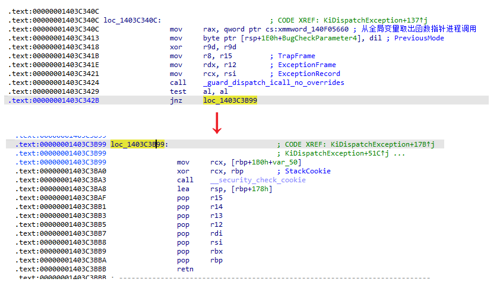


### 5.2 分析PicoProvider注册流程

​	我们继续分析这个利用点，由于是从全局变量`xmmword_140F05660`取出一个函数指针，再通过`CFG`发起一次间接函数调用，那么简单粗暴的方法，直接特征码搜索到这处代码，然后将我们自己的异常回调写进去。

​	这种方法是可行的，但是笔者认为这并不是最优解，首先涉及到特征码，后续在兼容多版本时工程维护起来会麻烦得多。还有就是这种系统异常派发的关键代码路径上，涉及到的全局变量可能会有`PG`保护。

​	所以笔者这里的思路是，既然这是给`WSL`子系统准备的异常处理，那么我们自己能不能通过合法的方式，将自己的Pico处理回调注册进去？既免去后期特征码维护、还让系统自己把异常回调写到全局变量`xmmword_140F05660`中

​	思路确定了，现在开始分析，我们查看全局变量`xmmword_140F05660`的交叉引用，发现`PsRegisterPicoProvider`函数处有调用

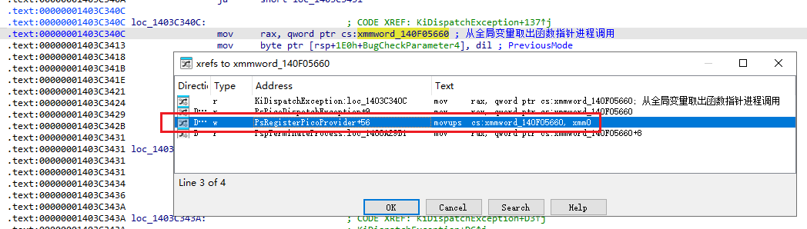

​	我们直接定位到该函数处，更惊喜的发现，这个函数居然还是导出！这个函数本身不长，我们直接来看：

- 判断参数1的第一个成员是否等于88
- 判断参数2的第一个成员是否等于96
- 判断[参数1 + 72]处该成员，高11位是否为0
- 判断[参数1 + 76]处该成员，高11为是否为0
- 全局变量`PspPicoRegistrationDisabled = 0`，否则当前禁止注册`Pico`异常回调
- 不满足以上任意一项，`Pico`注册函数是都会返回失败

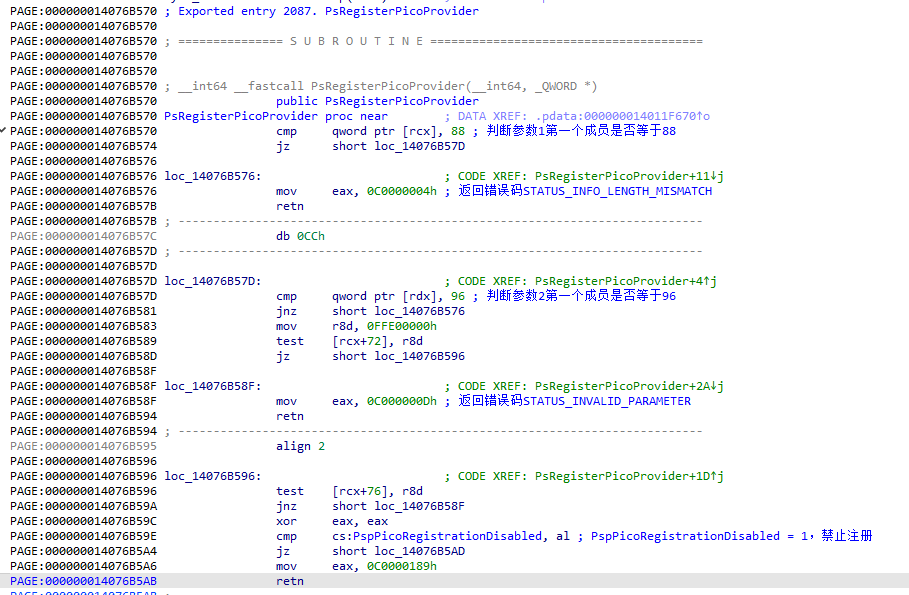

​	使用Windbg调试发现，当Win11 26H1正常启动进入桌面后，全局变量`PspPicoRegistrationDisabled`会被置1，看来微软并不想让其他驱动随便注册`Pico`回调

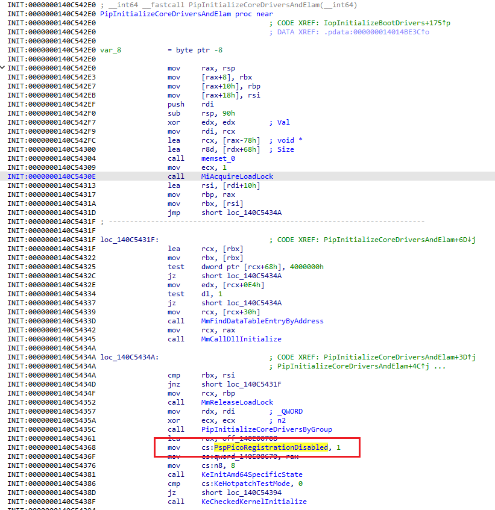

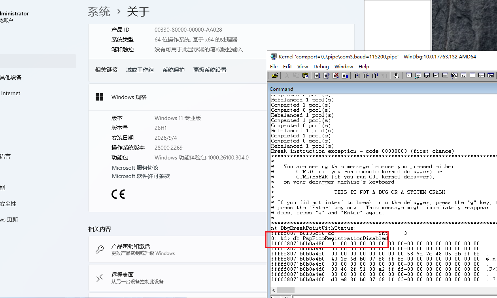

​	我们继续分析`PsRegisterPicoProvider`函数，以下代码功能很清晰，将参数1中的各个字段成员保存到全局变量中，参数2是作为输出参数，接收结果

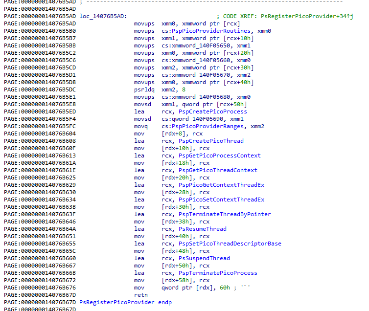

​	根据以上汇编，笔者反推参数1、参数2的部分对象结构，如下所示：

```c
typedef struct _PS_PICO_EXCEPTION_ARG1
{
	ULONG64 Size;
	PVOID Pad1[3];
	PVOID DispatchException;	// 这个是关键，我们自定义的异常处理回调指针
	PVOID Pad2[2];
	ULONG Flag[2];
	PVOID Pad3[3];
} PS_PICO_EXCEPTION_ARG1, *PPS_PICO_EXCEPTION_ARG1;

typedef struct _PS_PICO_EXCEPTION_ARG2
{
	ULONG64 Size;
	PVOID Pad1[11];
} PS_PICO_EXCEPTION_ARG2, *PPS_PICO_EXCEPTION_ARG2;
```


### 5.3 注册成为PicoProvider

​	`Pico`回调的注册流程已经分析清楚了，那么我们的注册思路、关键代码如下：

1. 从nt导出表找到`PsRegisterPicoProvider`函数指针
2. 构造注册参数1、参数2，补齐必要的字段信息，避免注册函数检查失败
3. 修改`PspPicoRegistrationDisabled`这个控制变量，手动置零
4. 调用`PsRegisterPicoProvider`注册`Pico`回调
5. 还原`PspPicoRegistrationDisabled`这个控制变量，由于该变量修改窗口期非常小，不会对系统运行有什么影响

```c
typedef 
BOOLEAN
(*fn_PicoExceptionHandler)(
	_In_ PEXCEPTION_RECORD ExceptionRecord,
	_In_ PKEXCEPTION_FRAME ExceptionFrame,
	_In_ PKTRAP_FRAME TrapFrame,
	_In_ ULONG Unknown,
	_In_ KPROCESSOR_MODE PreviousMode
);

BOOLEAN
InstallPicoExceptionHook(
	_In_ fn_PicoExceptionHandler ExceptionHandler
)
{
	BOOLEAN Ret = FALSE;
	NTSTATUS Status;

	do
	{
		if (NULL == ExceptionHandler)
		{
			break;
		}

		UNICODE_STRING FuncName;
		RtlInitUnicodeString(&FuncName, L"PsRegisterPicoProvider");
		_PsRegisterPicoProvider = (fn_PsRegisterPicoProvider)MmGetSystemRoutineAddress(&FuncName);
		if (NULL == _PsRegisterPicoProvider)
		{
			break;
		}

		_pPspPicoRegistrationDisabled = SearchPspPicoRegistrationDisabled(_PsRegisterPicoProvider);
		if (NULL == _pPspPicoRegistrationDisabled)
		{
			break;
		}

		PS_PICO_EXCEPTION_ARG1 ProviderRoutines = { 0 };
		ProviderRoutines.Size = 88;
		ProviderRoutines.DispatchException = ExceptionHandler;
		ProviderRoutines.ProtectedRanges[0] = 0;
		ProviderRoutines.ProtectedRanges[1] = 0;

		PS_PICO_EXCEPTION_ARG2 PicoRoutines = { 0 };
		PicoRoutines.Size = 96;

		*_pPspPicoRegistrationDisabled = 0;

		Status = _PsRegisterPicoProvider(&ProviderRoutines, &PicoRoutines);

		*_pPspPicoRegistrationDisabled = 1;

		if (!NT_SUCCESS(Status))
		{
			break;
		}

		Ret = TRUE;

	} while (FALSE);

	return Ret;
}
```


### 5.4 将目标进程设置为WSL子进程

​	我们现在注册好了`Pico`异常处理回调，但是该回调只能提前接管`WSL`子进程的异常，那么如何将目标进程变为`WSL`子进程呢？非常检查，只需要将`EPROCESS.PicoContext`字段成员设置一个任意非零值即可，笔者这里直接将其设置为1

```c
//0x840 bytes (sizeof)
struct _EPROCESS
{
    struct _KPROCESS Pcb;                                                   //0x0
    struct _EX_PUSH_LOCK ProcessLock;                                       //0x1c8
    VOID* UniqueProcessId;                                                  //0x1d0
	// ...
    VOID* PicoContext;                                                      //0x640
	// ...
}; 
```

```c
VOID SetProcessPicoContext(
	_In_ PEPROCESS Process
)
{
	ULONG PicoContextOffset = GetPicoContextOffset();
	*(PUCHAR)((PUCHAR)Process + PicoContextOffset) = 1;
}
```


### 5.5 利用Pico异常处理回调实现无痕Hook

​	实现以上步骤后，当目标进程发生用户态异常后，我们的`Pico`回调就能实现最高接管该异常，早于`内核调试器`、`用户调试器`,至于`VEH`、`SEH`更不必多说，此时我们可以将前文的`无痕Hook`实现，异常处理部分改动一下，就能实现更加隐蔽的无痕Hook效果，关键代码、效果图如下所示：

```c
BOOLEAN
ExceptionHandler(
	PEXCEPTION_RECORD ExceptionRecord,
	PKEXCEPTION_FRAME ExceptionFrame,
	PKTRAP_FRAME TrapFrame,
	ULONG Unknown,
	KPROCESSOR_MODE PreviousMode
)
{
	UNREFERENCED_PARAMETER(ExceptionFrame);
	UNREFERENCED_PARAMETER(Unknown);
	UNREFERENCED_PARAMETER(PreviousMode);

	if (g_TargetProcess == PsGetCurrentProcess() && STATUS_ACCESS_VIOLATION == ExceptionRecord->ExceptionCode)
	{
		SHADOW_EXCEPTION_INFO ShadowInfo = { 0 };
		if (!QueryShadowModule((ULONG64)ExceptionRecord->ExceptionAddress, &ShadowInfo))
		{
			return FALSE;
		}

		ULONG64 FuncOffset = (ULONG64)ExceptionRecord->ExceptionAddress - ShadowInfo.OriginalImageBase;
		TrapFrame->Rip = ShadowInfo.ShadowImageBase + FuncOffset;

		return TRUE;
	}

	return FALSE;
}
```


​	这部分代码已经整理好，Git仓库地址见文末


### 5.6 利用Pico异常回调实现反调试效果

​	既然我们目前可以最早接管目标进程的用户态异常，那么就很容易实现各种反调试手法

​	第一种常见的反调试思路是**破坏调试现场**，因为攻击方使用调试器分析我们的代码时，一个非常重要的过程就是看寄存器列表，反推参数的意义，但是暴力清空所有寄存器，这是一个非常明显、且强烈的反调试信号。这相当于提示调试者，当前程序有反调试措施，要先把反调试干掉！所以笔者的反调试的思路是，魔改一份寄存器现场，让寄存器中的内容看起来`非常正常`，但是调试者尝试断点、单步走时，就会出现各种乱七八糟的情况，误导调试者以为这个程序的数据结构怎么乱七八糟的，从而增加调试者的时间成本

​	第二种反调试的方式，就直接退出自身进程呗，代码如下：

​	调试者看到的效果就是，怎么断点一命中，程序就退出了？

```c
BOOLEAN
ExceptionHandler(
	PEXCEPTION_RECORD ExceptionRecord,
	PKEXCEPTION_FRAME ExceptionFrame,
	PKTRAP_FRAME TrapFrame,
	ULONG Unknown,
	KPROCESSOR_MODE PreviousMode
)
{
	UNREFERENCED_PARAMETER(ExceptionFrame);
	UNREFERENCED_PARAMETER(Unknown);
	UNREFERENCED_PARAMETER(PreviousMode);

	if (g_TargetProcess == PsGetCurrentProcess() && 
        (STATUS_BREAKPOINT == ExceptionRecord->ExceptionCode || STATUS_SINGLE_STEP == ExceptionRecord->ExceptionCode))
	{
		// 结束自身进程，报一个栈溢出的假退出码
		ZwTerminateProcess((HANDLE)-1, STATUS_STACK_OVERFLOW);
		return TRUE;
	}

	return FALSE;
}
```


### 5.7 WSL子进程进程保护

​	笔者这里测试，将任务管理器进程`Process.PicoContext`置1，将其变为`WSL`子进程，此时使用普通的调试器，例如`x64Dbg`、`CE`是无法打开进程的

1. `x64Dbg`进程列表找不到目标程序
2. `CE`无法进程目标进程报错，如图所示

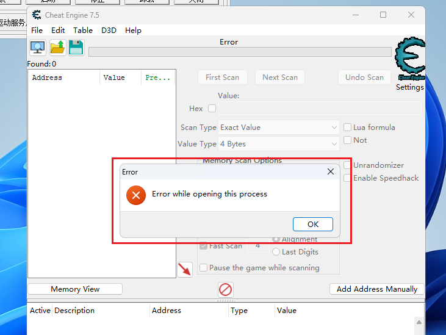

​	关于这种**进程保护**的原理，碍于当前文章篇幅问题，这里就不展开详细分析过程了，笔者之前在IDA中粗略分析了一下，原理如下：

> NtOpenProcess尝试打开进程时，会判断目标进程是不是WSL子进程，如果是就会返回错误码`STATUS_ACCESS_DENIED`，所以达到了进程保护的效果


## 6. 提前接管用户态、内核态异常方法

### 6.1 Win11 26H1

​	笔者在前文介绍了2种提前接管用户态异常的方法，但是局限在于仅能提前接管用户态异常，所以笔者这里将会介绍在`Win11 26H1`下，可以同时提前接管用户态、内核态异常的思路

​	还是回去分析我们的老熟人`KiDispatchException`函数，已知需要将异常派发到`内核调试器`时，会调用`KdTrap`或者`KdStub`函数，如图所示

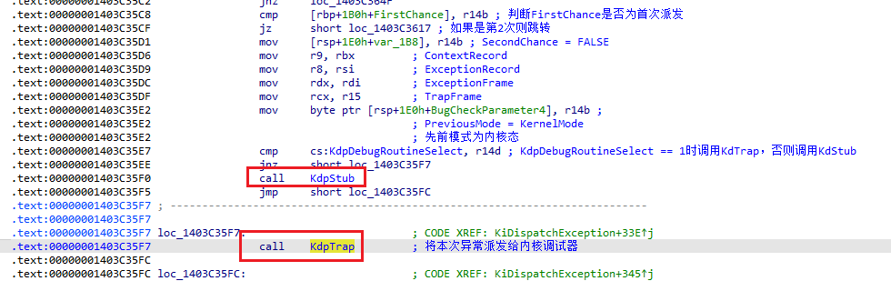

​	利用点在`KdTrap`中，大量的无关中间调用这里不展开分析，直到最后的`KeStallExecutionProcessor`函数

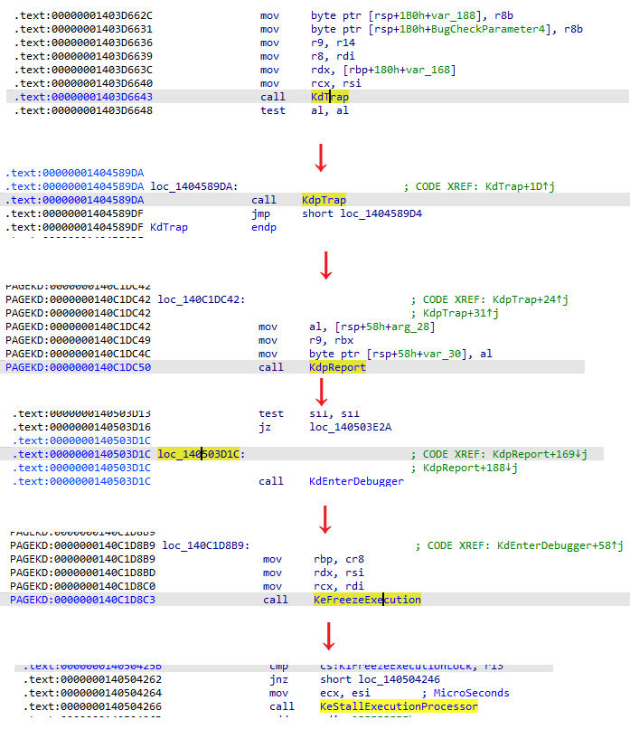

​	在`KeStallExecutionProcessor`函数中，会取出`HalpStallCounter`这个对象下`0x70`的函数指针，最后通过`CFG`发起一次间接函数调用，看到这里，对`ETW Hook`有所了解的朋友应该猜到劫持异常的原理了，没错，又是`Halxxx`指针导致的问题

​	已知不管是用户态还是内内核态异常，系统都先尝试将异常派发到内核调试器，此时替换`Halxxx`中的函数指针，并配合修改沿途的一些标志位，使得最终调用到我们处理回调中，让我们有机会提前接管异常。这个实现思路跟`ETW Hook`（或者`InfinityHook`）可以说非常相似了

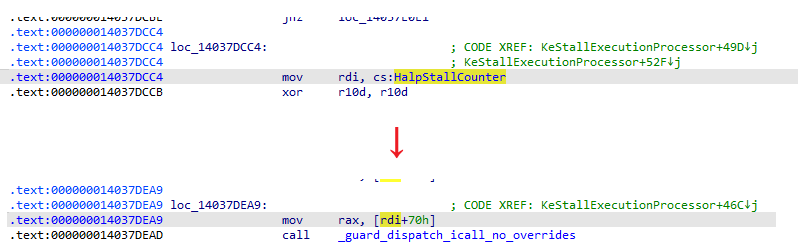

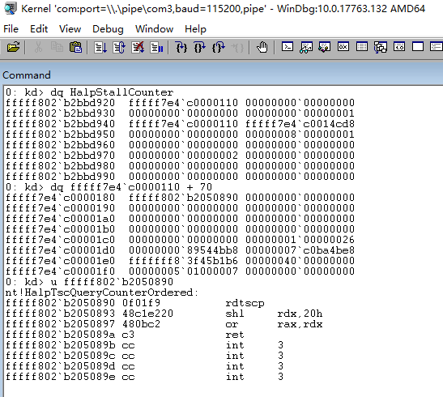


### 6.2 Win11 25H2及以下

​		着手点还在`KdTrap`中，大量的无关中间调用这里不展开分析，直到最后的`KeQueryPerformanceCounter`函数

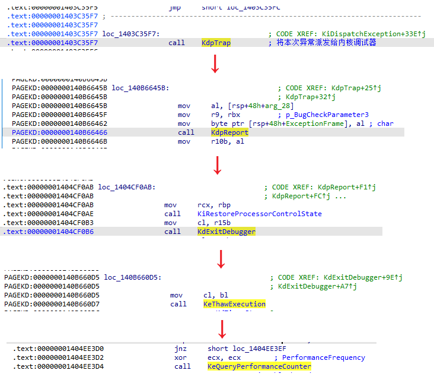

​	在``KeQueryPerformanceCounter``函数中，会取出`HalpPerformanceCounter`这个对象下`0x70`的函数指针，最后通过`CFG`发起一次间接函数调用，没错，又又是`Halxxx`指针导致的问题

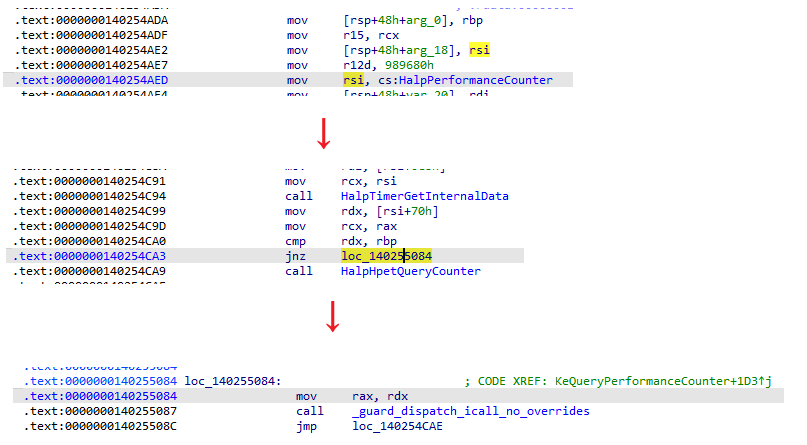

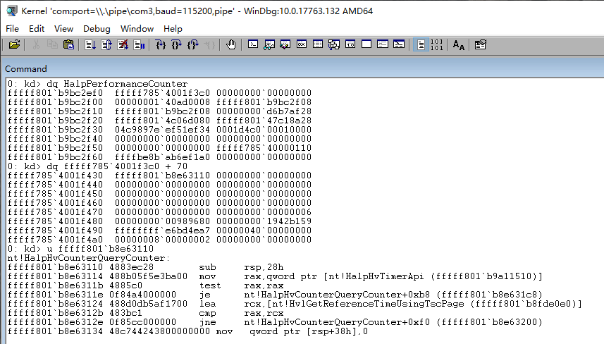


#### 6.2.1 特征码定位HalpPerformanceCounter

​	接下来开始简单实验，首先特征码定位到`HalpPerformanceCounter`对象

```c
ULONG64
SearchHalpPerformanceCounter()
{
	static ULONG64 HalpPerformanceCounter = 0;
	if (HalpPerformanceCounter)
	{
		return HalpPerformanceCounter;
	}

	ULONG64 Addr = SearchFeatureCode(
		(PCCHAR)"ntoskrnl.exe",
		(PCCHAR)".text",
(PCUCHAR)"\x48\x8B\x35\xFC\xE3\xD6\x00\x48\x89\x7C\x24\x28\x4C\x89\x74\x24\x20\x83\xBE\xE4\x00\x00\x00\x05\x0F\x84\x0A\x01\x00\x00\x83\xBE\xDC\x00\x00\x00\x40\x48\x8B\x9E\xC0\x00\x00\x00",
		"xxx????xxxx?xxxx?xx?????xx????xx?????xxx????",
		0
	);

	if (NULL == Addr)
	{
		return NULL;
	}

	ULONG64* pHalpPerformanceCounter = DEREF_RELATIVE_ADDR(ULONG64*, Addr, 3);
	HalpPerformanceCounter = *pHalpPerformanceCounter;
	return HalpPerformanceCounter;
}
```


#### 6.2.2 替换Hal函数指针

​		搜索成功后，替换其中`0x70`处的Hal函数指针，替换为自己的异常处理函数：

```c
g_HalpHvCounterQueryCounter =
		(fn_HalpHvCounterQueryCounter)_InterlockedExchangePointer((volatile PVOID*)(HalpPerformanceCounter + 0x70), HalpHvCounterQueryCounter_Hook);
```

```c
__int64
HalpHvCounterQueryCounter_Hook(
	PVOID Arg1,
	PVOID Arg2
)
{
	_InterlockedIncrement64((volatile LONG64*)&g_Counter);

    // 筛选出异常调用来源
	if (ExceptionStackTrace())
	{
		_InterlockedIncrement64((volatile LONG64*)&g_ExceptionCounter);

         // 从堆栈中恢复丢失的ExceptionRecord、Context等
		CONTEXT* Context = NULL;
		EXCEPTION_RECORD* ExceptionRecord = NULL;
         ResumeExceptionInfoFromStack(&Context, &ExceptionRecord);
        	
		if (STATUS_ACCESS_VIOLATION == ExceptionRecord->ExceptionCode)
		{
			// ...
		}

         // 构造中断返回栈，恢复异常派发
		ContinueExecution();
	}

	return g_HalpHvCounterQueryCounter(Arg1, Arg2);
}
```


#### 6.2.3 堆栈回溯筛选出异常派发调用

​	由于我们的Hook点位于`KeQueryPerformanceCounter`，就导致大量的**非异常调用**来源，所以我们要需要回溯堆栈信息，筛选出异常派发来源，笔者这里堆栈回溯判定比较简单，在堆栈中找到`KeThawExecution`、`KdpReport`、`KiDispatchException`范围附近的返回地址，便认为本次调用来源属于异常派发，部分代码如下：

```c
BOOLEAN
ExceptionStackTrace()
{
	PVOID* StackBase = (PVOID*)__readgsqword(0x1A8);
	PVOID* StackCurrent = (PVOID*)_AddressOfReturnAddress();

	if ((ULONG64)StackBase - (ULONG64)StackCurrent > 0x6000 || StackCurrent > StackBase)
	{
		return FALSE;
	}

	BOOLEAN bFindKeThawExecution = FALSE;
	BOOLEAN bFindKdpReport = FALSE;
	BOOLEAN bFindKiDispatchException = FALSE;

	for (; StackCurrent < StackBase; ++StackCurrent)
	{
		ULONG64 StackValue = *(ULONG64*)StackCurrent;

		if (StackValue <= (ULONG64)MM_HIGHEST_USER_ADDRESS)
		{
			continue;
		}

		if (!bFindKeThawExecution)
		{
			if (StackValue > g_TrackStackFunc.KeThawExecution &&
				StackValue < g_TrackStackFunc.KeThawExecution + 0x100)
			{
				bFindKeThawExecution = TRUE;
			}
			continue;
		}

		if (!bFindKdpReport)
		{
			if (StackValue > g_TrackStackFunc.KdpReport &&
				StackValue < g_TrackStackFunc.KdpReport + 0x150)
			{
				bFindKdpReport = TRUE;
			}
			continue;
		}

		if (!bFindKiDispatchException)
		{
			if (StackValue > g_TrackStackFunc.KiDispatchException &&
				StackValue < g_TrackStackFunc.KiDispatchException + 0x100)
			{
				bFindKiDispatchException = TRUE;
				return TRUE;
			}
		}
	}
	return FALSE;
}
```

​	

#### 6.2.4 从堆栈中恢复丢失的异常信息

​	顺利筛选出异常派发的调用来源后，那么新的问题来了，在多层的函数调用中，原始`ExceptionRecord`、`Context`等参数已经丢失了，并没有传递给我们的Hook异常回调

​	这个时候没招了嘛？接管异常的路子走不通了？

​	当然不会，此时我们可以分析上层函数的调用逻辑，向上回溯堆栈，尝试**从上层函数栈帧中恢复异常参数**，根据x64调用约定，调用子函数中，涉及到使用非易失寄存器时，由被调用方自己保存、恢复，所以这里笔者列出来整个调用链中，每一个函数的`序言部分代码`：

```c
// KdpTrap
PAGEKD:0000000140B662B8 48 8B C4       mov     rax, rsp
PAGEKD:0000000140B662BB 48 89 58 08    mov     [rax+8], rbx
PAGEKD:0000000140B662BF 48 89 68 10    mov     [rax+10h], rbp
PAGEKD:0000000140B662C3 48 89 70 20    mov     [rax+20h], rsi
PAGEKD:0000000140B662C7 57             push    rdi
PAGEKD:0000000140B662C8 48 83 EC 40    sub     rsp, 40h

// KdpReport
.text:00000001404CEF84 48 8B C4        mov     rax, rsp
.text:00000001404CEF87 48 89 58 08     mov     [rax+8], rbx	// Context
.text:00000001404CEF8B 48 89 68 10     mov     [rax+10h], rbp
.text:00000001404CEF8F 48 89 70 18     mov     [rax+18h], rsi
.text:00000001404CEF93 48 89 78 20     mov     [rax+20h], rdi
.text:00000001404CEF97 41 54           push    r12
.text:00000001404CEF99 41 56           push    r14
.text:00000001404CEF9B 41 57           push    r15
.text:00000001404CEF9D 48 83 EC 20     sub     rsp, 20h

// KdExitDebugger
PAGEKD:0000000140B66008 40 53          push    rbx
PAGEKD:0000000140B6600A 48 83 EC 20    sub     rsp, 20h

// KeThawExecution
.text:00000001404EE390 48 89 5C 24 08  mov     [rsp+arg_0], rbx
.text:00000001404EE395 48 89 74 24 10  mov     [rsp+arg_8], rsi
.text:00000001404EE39A 57              push    rdi
.text:00000001404EE39B 48 83 EC 20     sub     rsp, 20h

// KeQueryPerformanceCounter
.text:0000000140254AD0 40 53           push    rbx
.text:0000000140254AD2 41 54           push    r12
.text:0000000140254AD4 41 57           push    r15
.text:0000000140254AD6 48 83 EC 30     sub     rsp, 30h
```

​	我们从`KdpTrap`函数开始分析，该函数将`Context`分别保存到了`rbx`这个非易失寄存器中，由于调用了`KdpReport`函数的内部使用了`rbx`，会将原`rbx`保存到栈上，那么我们可以向上回溯堆栈，找到一个返回地址是处于`KdpTrap`函数范围内的，即可找到期栈帧位置，从中恢复`Context`异常上下文信息

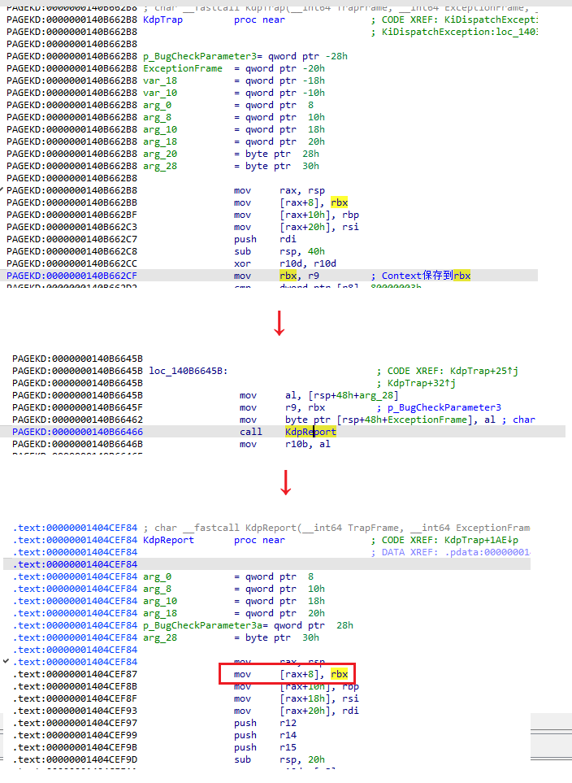


#### 6.2.5 构造中断返回帧，恢复异常派发流程

​	由于我们接管了异常后，不能从正常栈中取出返回地址一层层返回，需要从`KeQueryPerformanceCounter`函数直接折返到`KdpTrap`的返回地址处，即直接跳转回到`KiDispatchException`函数内，流程如下所示：

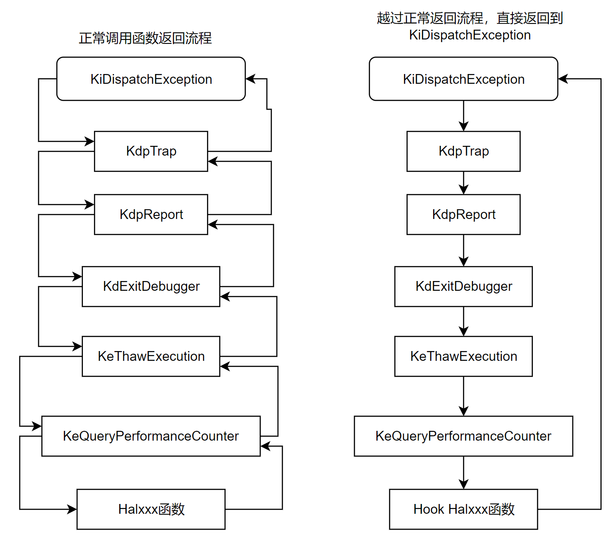

​	要做到这一点，我们要保证进入、退出`KdpTrap`函数时非易失寄存器现场要保持一致，那么就需要往上回溯栈帧，恢复所有被破坏的非易失寄存器环境，笔者这里给出部分实验代码：

```c
typedef struct _EXECUTION_CONTEXT
{
	ULONGLONG RFlags;   // +0x00
	ULONGLONG Rax;      // +0x08
	ULONGLONG Rcx;      // +0x10
	ULONGLONG Rdx;      // +0x18
	ULONGLONG Rbx;      // +0x20
	ULONGLONG Rsp;      // +0x28
	ULONGLONG Rbp;      // +0x30
	ULONGLONG Rsi;      // +0x38
	ULONGLONG Rdi;      // +0x40
	ULONGLONG R8;       // +0x48
	ULONGLONG R9;       // +0x50
	ULONGLONG R12;      // +0x58
	ULONGLONG R13;      // +0x60
	ULONGLONG R14;      // +0x68
	ULONGLONG R15;      // +0x70
	ULONGLONG Rip;      // +0x78
} EXECUTION_CONTEXT, *PEXECUTION_CONTEXT;

VOID 
ContinueExecution()
{
	PVOID* StackBase = (PVOID*)__readgsqword(0x1A8);
	PVOID* CurStackPtr = (PVOID*)_AddressOfReturnAddress();

	if ((ULONG64)StackBase - (ULONG64)CurStackPtr > 0x6000 || CurStackPtr > StackBase)
	{
		return VOID();
	}

	BOOLEAN bFindKdpReport = FALSE;
	BOOLEAN bFindKdpTrap = FALSE;
	BOOLEAN bFindKdTrap = FALSE;

	EXECUTION_CONTEXT ExecutionContext = { 0 };
	ExecutionContext.R13 = Asm_GetR13();
	ExecutionContext.RFlags = Asm_GetRFlags() | 0x200;

	for (; CurStackPtr < StackBase; ++CurStackPtr)
	{
		ULONG64 StackValue = *(ULONG64*)CurStackPtr;

		if (StackValue <= (ULONG64)MM_HIGHEST_USER_ADDRESS)
		{
			continue;
		}

		if (!bFindKdpReport)
		{
			if (StackValue > g_TrackStackFunc.KdpTrap &&
				StackValue < g_TrackStackFunc.KdpTrap + 0x100)
			{
				ExecutionContext.Rbx = *(ULONG64*)((ULONG64)CurStackPtr + 0x08);
				ExecutionContext.Rbp = *(ULONG64*)((ULONG64)CurStackPtr + 0x10);
				ExecutionContext.Rsi = *(ULONG64*)((ULONG64)CurStackPtr + 0x18);
				ExecutionContext.Rdi = *(ULONG64*)((ULONG64)CurStackPtr + 0x20);

				ExecutionContext.R12 = *(ULONG64*)((ULONG64)CurStackPtr - 0x8);
				ExecutionContext.R14 = *(ULONG64*)((ULONG64)CurStackPtr - 0x10);
				ExecutionContext.R15 = *(ULONG64*)((ULONG64)CurStackPtr - 0x18);

				bFindKdpReport = TRUE;
			}

			continue;
		}

		if (!bFindKdTrap)
		{
			if (StackValue > g_TrackStackFunc.KiDispatchException &&
				StackValue < g_TrackStackFunc.KiDispatchException + 0x100)
			{
				ExecutionContext.Rip = StackValue;
				ExecutionContext.Rsp = (ULONG64)CurStackPtr + 8;

				ExecutionContext.Rbx = *(ULONG64*)((ULONG64)CurStackPtr + 0x08);
				ExecutionContext.Rbp = *(ULONG64*)((ULONG64)CurStackPtr + 0x10);
				ExecutionContext.Rsi = *(ULONG64*)((ULONG64)CurStackPtr + 0x18);

				ExecutionContext.Rdi = *(ULONG64*)((ULONG64)CurStackPtr - 0x8);

				bFindKdTrap = TRUE;
				break;
			}
			
		}

	}

	if (bFindKdpReport && 
		bFindKdpReport && 
		bFindKdTrap)
	{
		// DbgBreakPoint();

		ContinueWithContext(&ExecutionContext);
		KeBugCheck(0);
	}
	else
	{
		DbgBreakPoint();
		KeBugCheck(0);
	}

	return VOID();
}
```


#### 6.2.6 大量踩坑

​	这一部分内容，单从劫持异常的原理来说，其实不算是非常难，但是在上手写代码、调试时，笔者遇到遇到了大量踩坑的地方，其中感受最强烈的2点如下：

1. 这种劫持异常的点，正好处在系统派发异常到内核调试器路径上，导致调试比较困难。笔者甚至遇到了无限异常递归的尴尬情况，即虚拟机无影响、但是`Windbg`一直接收不到异常
2. 挂内核调试器、不挂内核调试器这2种情况，似乎会改变系统内核异常派发的逻辑，导致不挂调试器时加载驱动卡死，挂上`WinDbg`后再加载驱动，问题却消失了

由于以上2点问题的存在，导致这个实验本身进度非常缓慢，达不到笔者心中可公开的PoC标准，所以笔者决定暂时不放出这部分实验的工程实现，对这部分内容感兴趣的朋友可以关注一下，日后工程完善了，笔者会放出实验工程文件


## 7. Git仓库开源地址

​	劫持`Wow64PrepareForException`接管异常，实现无痕Hook，仓库地址：[InvisibleHook_ShadowPage](https://github.com/Shinn-Home/InvisibleHook/tree/main/InvisibleHook_ShadowPage)

​	注册`PicoDispatchException`接管异常，实现无痕Hook，仓库地址：[InvisibleHook_PicoException](https://github.com/Shinn-Home/InvisibleHook/tree/main/InvisibleHook_PicoException)

​	如果各位朋友看完本文觉得有所帮助、启发，欢迎点赞、收藏本文。另外，欢迎各位朋友给仓库Star！


