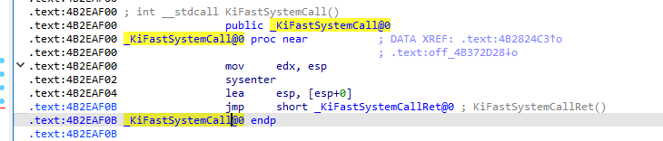

<!--more-->

## 快速系统调用

1. 我们书接上文，在上一篇笔记中，讲到了在32位的`ntdll.dll`中，在不支持快速系统调用的技巧上，是通过中断门实现发起一次系统调用的，那么会经历很多次的访问内存操作：
   1. 在IDT表中，取出0x2E号中断门描述符
   2. 解析中断门描述符，解析出其中的选择子、段内偏移Offset
   3. 到GDT表中，根据选择子取出对应的全局描述符
   4. 解析该全局描述符的Base
   5. Base + Offset最终计算得到内核态的代码入口
   6. 从TR寄存器取出TSS，从TSS中取出内核栈所需的Ss、Esp
2. 我们可以发现，通过中断门调用，中间获取Cs、Eip、Ss、Esp，存在大量的`CPU内存访问`操作，相当于拖慢了CPU的运行，所以CPU厂商就设计了一种`快速系统调用`，通过CPU内部的`寄存器`来获取这些权限切换所需的数据

> 通过命令cpuid可以获取当前CPU的厂商参数信息、各项能力（是否支持快速系统调用），在如何时代下，已经很难找到一台PC不支持快速系统调用了

1. 那么在支持快速系统调用的CPU上，`UserShareData.SystemCall`保存的函数指针是`KiFastSystemCall`，该函数反汇编如下所示：



3. 可以发现这里多了一个指令`sysenter`，CPU通过这个指令来发起一次快速系统调用


## 快速系统调用实现

1. 在系统初始化完成后，会将Cs、Eip、Ss、Esp等内容保存到MSR寄存器（模块特殊寄存器）中
2. 这样在执行sysenter指令后，CPU会自动从MSR寄存器中的内容填入相关寄存器中，就避免了大量内存访问操作，所以该过程被称为快速系统调用

| MSR寄存器编号              | 定义                                                         |
| -------------------------- | ------------------------------------------------------------ |
| IA32_SYSENTER_CS（0x174）  | Cs代码段选择子                                               |
| IA32_SYSENTER_ESP（0x175） | Esp内核栈                                                    |
| SS                         | Ss栈选择子为IA32_SYSENTER_CS数值 + 8，即两者在GDT表中是紧挨着的 |
| IA32_SYSENTER_EIP（0x176） | Eip内核代码入口                                              |


## KiFastCallEntry反汇编分析

1. 由以下反汇编分析可知，当系统调用返回时，存在一个派发APC的机会

```c
.text:00435750 _KiFastCallEntry proc near              ; DATA XREF: KiLoadFastSyscallMachineSpecificRegisters(x)+21↑o
.text:00435750                                         ; _KiTrap01+71↓o
.text:00435750
.text:00435750 var_7C          = dword ptr -7Ch
.text:00435750 anonymous_0     = dword ptr -24h
.text:00435750 anonymous_1     = dword ptr -20h
.text:00435750 anonymous_2     = dword ptr -1Ch
.text:00435750 anonymous_3     = dword ptr -18h
.text:00435750 anonymous_4     = dword ptr -14h
.text:00435750 anonymous_5     = dword ptr -10h
.text:00435750 var_B           = byte ptr -0Bh
.text:00435750 anonymous_6     = dword ptr -8
.text:00435750 anonymous_7     = dword ptr -4
.text:00435750 arg_B8          = dword ptr  0BCh
.text:00435750
.text:00435750 ; FUNCTION CHUNK AT .text:00435727 SIZE 00000026 BYTES
.text:00435750 ; FUNCTION CHUNK AT .text:00435A75 SIZE 00000014 BYTES
.text:00435750 ; FUNCTION CHUNK AT .text:00435BCB SIZE 00000038 BYTES
.text:00435750 ; FUNCTION CHUNK AT .text:00435C04 SIZE 0000001A BYTES
.text:00435750
.text:00435750                 mov     ecx, 23h ; '#'
.text:00435755                 push    30h ; '0'
.text:00435757                 pop     fs              ; 将R3的TEB切换为KPCR
.text:00435759                 mov     ds, ecx
.text:0043575B                 mov     es, ecx         ; 将ds、es重置为23h
.text:0043575D                 mov     ecx, large fs:_KPCR.TSS ; 将TSS任务段保存到Ecx
.text:00435764                 mov     esp, [ecx+4]    ; 将TSS.ESP0赋值给Esp
.text:00435764                                         ; 此时已经顺利切换为内核栈了
.text:00435767                 push    23h ; '#'       ; 保存TrapFrmae.SegSS
.text:00435769                 push    edx             ; 将R3的Esp保存到TrapFrame.Esp
.text:0043576A                 pushf                   ; 保存TrapFrame.EFLAG
.text:0043576B
.text:0043576B loc_43576B:                             ; CODE XREF: _KiFastCallEntry2+23↑j
.text:0043576B                 push    2
.text:0043576D                 add     edx, 8          ; 修正R3的Esp，跳过RetAddr1、RetAddr2，指向栈中的参数列表起始地址
.text:00435770                 popf                    ; 修改Eflag = 2
.text:00435771                 or      byte ptr [esp+1], 2
.text:00435776                 push    1Bh             ; 保存TrapFrame.SegCs
.text:00435778                 push    dword ptr ds:0FFDF0304h ; TrapFrmae.Eip = _KUSER_SHARE_DATA.SystemCallReturn
.text:0043577E                 push    0               ; Begin------------------这一段跟KiSystemService一模一样
.text:00435780                 push    ebp
.text:00435781                 push    ebx
.text:00435782                 push    esi
.text:00435783                 push    edi             ; End------------------这一段跟KiSystemService一模一样
.text:00435784                 mov     ebx, large fs:_KPCR.SelfPcr ; 将当前CPU的KPCR对象指针保存到Ebx
.text:0043578B                 push    3Bh ; ';'       ; TrapFrmae.SegFs = 3Bh
.text:0043578D                 mov     esi, [ebx+_KPCR.PrcbData.CurrentThread] ; 将当前线程对象KTHREAD保存到Esi
.text:00435793                 push    dword ptr [ebx] ; 保存KPCR.NtTib.ExceptionList
.text:00435795                 mov     dword ptr [ebx], 0FFFFFFFFh ; 清空KPCR.NtTib.ExceptionList
.text:0043579B                 mov     ebp, [esi+_KTHREAD.InitialStack]
.text:0043579E                 push    1
.text:004357A0                 sub     esp, 48h        ; 将栈顶指向TrapFrame头部
.text:004357A3                 sub     ebp, 29Ch       ; 将栈底也指向TrapFrame头部
.text:004357A9                 mov     [esi+_KTHREAD.PreviousMode], 1 ; 设置PreviousMode = UserMode
.text:004357B0                 cmp     ebp, esp        ; 堆栈检测
.text:004357B2                 jnz     short loc_43574B ; 检测出问题了，跳转到异常处理
.text:004357B4                 and     [ebp+_KTRAP_FRAME.Dr7], 0 ; 清空Dr7
.text:004357B8                 test    byte ptr [esi+3], 0DFh ; 判断KTHREAD.DebugActive，是否处于调试状态
.text:004357BC                 mov     [esi+_KTHREAD.TrapFrame], ebp ; 将栈中的TrapFrame指针保存到当前线程对象中
.text:004357C2                 jnz     Dr_FastCallDrSave ; 如果处于调试状态，就保存调试相关的寄存器
.text:004357C8
.text:004357C8 loc_4357C8:                             ; CODE XREF: Dr_FastCallDrSave+D↑j
.text:004357C8                                         ; Dr_FastCallDrSave+79↑j
.text:004357C8                 mov     ebx, [ebp+_KTRAP_FRAME._Ebp]
.text:004357CB                 mov     edi, [ebp+_KTRAP_FRAME._Eip]
.text:004357CE                 mov     [ebp+_KTRAP_FRAME.DbgArgPointer], edx ; 这里的Edx，保存的是R3栈中参数列表的起始地址
.text:004357D1                 mov     [ebp+_KTRAP_FRAME.DbgArgMark], 0BADB0D00h ; 赋值TrapFrame.DbgArgMark
.text:004357D8                 mov     [ebp+_KTRAP_FRAME.DbgEbp], ebx ; 保存TrapFrame.DbgEbp
.text:004357DB                 mov     [ebp+_KTRAP_FRAME.DbgEip], edi ; 保存TrapFrame.DbgEip
.text:004357DE                 sti                     ; 响应可屏蔽中断
.text:004357DF
.text:004357DF loc_4357DF:                             ; CODE XREF: _KiBBTUnexpectedRange+18↑j
.text:004357DF                                         ; _KiSystemService+7F↑j
.text:004357DF                 mov     edi, eax        ; 将系统调用号赋值给Edi
.text:004357E1                 shr     edi, 8          ; 32位的系统调用号，仅使用了其中的低13位（0~12）
.text:004357E1                                         ; 12位为使用哪张表
.text:004357E1                                         ; 0~11为调用号
.text:004357E1                                         ; 这里右移8位，只剩下5位有效
.text:004357E4                 and     edi, 10h        ; And运算，此时Edi中的值只有0、0x10两种情况
.text:004357E7                 mov     ecx, edi
.text:004357E9                 add     edi, [esi+_KTHREAD.ServiceTable] ; 取出系统服务描述表地址，相加
.text:004357E9                                         ; 在32位Windows下，SSDT、Shadow SSDT在内存上是连续的
.text:004357E9                                         ; 一个系统服务描述表大小为0x10字节
.text:004357E9                                         ; 所以这里设计很巧妙，直接就能得到要是有的表的地址
.text:004357EF                 mov     ebx, eax
.text:004357F1                 and     eax, 0FFFh      ; 去除第13位
.text:004357F6                 cmp     eax, [edi+8]    ; 判断系统调用号，是否超出SSDT.Limit
.text:004357F9                 jnb     _KiBBTUnexpectedRange ; 当前调用号，不小于Limit的话，说明调用非法
.text:004357FF                 cmp     ecx, 10h        ; 判断计算结果是不是Shadow SSDT
.text:00435802                 jnz     short loc_43581E ; 系统调用的次数
.text:00435804                 mov     ecx, [esi+_KTHREAD.Teb]
.text:0043580A                 xor     esi, esi
.text:0043580C
.text:0043580C loc_43580C:                             ; DATA XREF: _KiTrap0E+156↓o
.text:0043580C                 or      esi, [ecx+0F70h]
.text:00435812                 jz      short loc_43581E ; 系统调用的次数
.text:00435814                 push    edx
.text:00435815                 push    eax
.text:00435816                 call    ds:_KeGdiFlushUserBatch
.text:0043581C                 pop     eax
.text:0043581D                 pop     edx
.text:0043581E
.text:0043581E loc_43581E:                             ; CODE XREF: _KiFastCallEntry+B2↑j
.text:0043581E                                         ; _KiFastCallEntry+C2↑j
.text:0043581E                 inc     large dword ptr fs:_KPCR.PrcbData.KeSystemCalls ; 系统调用的次数
.text:00435825                 mov     esi, edx        ; R3栈，指向参数列表
.text:00435827                 xor     ecx, ecx        ; 清空Ecx
.text:00435829                 mov     edx, [edi+0Ch]  ; 取出服务描述表的参数表ArgTable
.text:0043582C                 mov     edi, [edi]      ; 解引用，得到函数表地址
.text:0043582E                 mov     cl, [eax+edx]   ; 当前调用参数的参数总字节数
.text:00435831                 mov     edx, [edi+eax*4] ; 在函数表中，取出当前要调用的函数地址
.text:00435834                 sub     esp, ecx        ; 此时的ecx是参数列表大小，抬升栈，给参数复制做准备
.text:00435836                 shr     ecx, 2          ; ecx /= 4
.text:00435836                                         ; ecx作为循环计次
.text:00435839                 mov     edi, esp        ; 当前内核栈为目的地
.text:0043583B                 cmp     esi, ds:_MmUserProbeAddress ; 判断R3的栈地址是否合法
.text:00435841                 jnb     loc_435A75      ; no below，不小于则跳转
.text:00435841                                         ; 说明R3的栈大小非法！
.text:00435847
.text:00435847 loc_435847:                             ; CODE XREF: _KiFastCallEntry+329↓j
.text:00435847                                         ; DATA XREF: _KiTrap0E:loc_438AD8↓o
.text:00435847                 rep movsd               ; 按照DWORD为单位循环拷贝
.text:00435849                 test    byte ptr [ebp+_KTRAP_FRAME.SegCs], 1 ; 再判断一下权限，如果是R0权限则跳转
.text:0043584D                 jz      short loc_435865 ; 将当前要执行的内核函数赋值给Ebx
.text:0043584F                 mov     ecx, large fs:_KPCR.PrcbData.CurrentThread
.text:00435856                 mov     edi, [esp]
.text:00435859                 mov     [ecx+_KTHREAD.SystemCallNumber], ebx
.text:0043585F                 mov     [ecx+_KTHREAD.FirstArgument], edi
.text:00435865
.text:00435865 loc_435865:                             ; CODE XREF: _KiFastCallEntry+FD↑j
.text:00435865                 mov     ebx, edx        ; 将当前要执行的内核函数赋值给Ebx
.text:00435867                 test    byte ptr ds:dword_52E0C8, 40h
.text:0043586E                 setnz   byte ptr [ebp+12h]
.text:00435872                 jnz     loc_435C04
.text:00435878
.text:00435878 loc_435878:                             ; CODE XREF: _KiFastCallEntry+4BB↓j
.text:00435878                 call    ebx             ; 调用内核函数

; 调用返回-----------------------------------------------------------------------------------------------------------------

.text:0043587A loc_43587A:                             ; CODE XREF: _KiFastCallEntry+334↓j
.text:0043587A                                         ; DATA XREF: _KiTrap0E+18C↓o
.text:0043587A                 test    byte ptr [ebp+6Ch], 1
.text:0043587E                 jz      short loc_4358B4
.text:00435880                 mov     esi, eax        ; 临时备份返回值到esi
.text:00435882                 call    ds:__imp__KeGetCurrentIrql@0 ; KeGetCurrentIrql()
.text:00435888                 or      al, al          ; 判断IRQ ＞ 0
.text:0043588A                 jnz     loc_435BCB      ; 如果返回R3时IRQL != PASSIVE_LEVEL，直接蓝屏
.text:00435890                 mov     eax, esi        ; 还原返回值
.text:00435892                 mov     ecx, large fs:_KPCR.PrcbData.CurrentThread ; 取出当前线程对象，放到Ecx
.text:00435899                 test    [ecx+_KTHREAD.ApcStateIndex], 0FFh ; 判断当前是否处于挂靠状态
.text:004358A0                 jnz     loc_435BE9
.text:004358A6                 mov     edx, dword ptr [ecx+_KTHREAD.___u26.__s0.KernelApcDisable]
.text:004358AC                 or      edx, edx
.text:004358AE                 jnz     loc_435BE9
.text:004358B4
.text:004358B4 loc_4358B4:                             ; CODE XREF: _KiFastCallEntry+12E↑j
.text:004358B4                                         ; _KiCallbackReturn+8D↓j
.text:004358B4                                         ; DATA XREF: ...
.text:004358B4                 mov     esp, ebp
.text:004358B6                 cmp     [ebp+_KTRAP_FRAME.Logging], 0 ; 是否启用了日志
.text:004358BA                 jnz     loc_435C10      ; 非0则跳转
.text:004358C0
.text:004358C0 loc_4358C0:                             ; CODE XREF: _KiBBTUnexpectedRange+3C↑j
.text:004358C0                                         ; _KiBBTUnexpectedRange+47↑j ...
.text:004358C0                 mov     ecx, large fs:_KPCR.PrcbData.CurrentThread
.text:004358C7                 mov     edx, [ebp+_KTRAP_FRAME._Edx] ; R3调进来的时候，会将esp保存到edx中
.text:004358CA                 mov     [ecx+_KTHREAD.TrapFrame], edx
.text:004358CA _KiFastCallEntry endp


.text:004358F2                 mov     [ebx+_KTHREAD.Alerted], 0 ; 设置线程不可被警醒
.text:004358F6                 cmp     [ebx+_KTHREAD.___u12.ApcState.UserApcPending], 0 ; 判断是否有Apc等待被执行
.text:004358FA                 jz      short loc_435944
.text:004358FC                 mov     ebx, ebp
.text:004358FE                 mov     [ebx+44h], eax
.text:00435901                 mov     [ebx+_KTRAP_FRAME.SegFs], 3Bh ; ';'
.text:00435908                 mov     [ebx+_KTRAP_FRAME.SegDs], 23h ; '#'
.text:0043590F                 mov     [ebx+_KTRAP_FRAME.SegEs], 23h ; '#'
.text:00435916                 mov     [ebx+_KTRAP_FRAME.SegGs], 0
.text:0043591D                 mov     ecx, 1          ; NewIrql
.text:00435922                 call    ds:__imp_@KfRaiseIrql@4 ; 提升IRQL到APC_LEVEL
.text:00435928                 push    eax
.text:00435929                 sti                     ; 开中断
.text:0043592A                 push    ebx
.text:0043592B                 push    0
.text:0043592D                 push    1
.text:0043592F                 call    _KiDeliverApc@12 ; Apc的派发，R0返回R0会有一次Apc执行的机会
.text:00435934                 pop     ecx             ; NewIrql
.text:00435935                 call    ds:__imp_@KfLowerIrql@4 ; 恢复IRQL
```


## 64位下的快速系统调用

1. 在前文中提到的`sysenter`，这个指令一般是32位系统下的快速调用，在64位系统下，快速系统调用的指令是`syscall`

2. 两者在工作原理上其实没太大区别，都是避免访问内存，从MSR寄存器加载环境，关于32、64位的区别，这里总结为如下：

```c
sysenter:
    1. CPU从MSR加载内核栈、内核代码入口
    2. 在内核入口保存R3上下文
    3. 调用分发服务
        
syscall：
    1. 从MSR加载内核入口
    2. 在内核入口处切换内核Rsp、保存R3上下文
    3. 调用分发服务
```


## 小结

1. 不管是中断门调用、快速系统调用，在进入到R0时都会保存R3的现场环境
2. 之后就根据系统调用号，查出本次系统调用的参数列表长度，将参数从R3堆栈完整复制一份到R0
