<!--more-->

## 系统调用实现方式

1. 出于权限控制的目标，Win开发中，大部分的API调用，最终的真实是在内核层中进行的。例如`CreateFile`函数，最终会调用到内核中的`NtCreateFile`函数中，发起这个调用的这个过程就叫做`系统调用`
2. 关于发起系统调用的方式，笔者这里整理了一个表格：

| 系统调用方式 | 定义                         |
| ------------ | ---------------------------- |
| Int 2E       | 通过**中断门**发起系统调用   |
| sysenter     | 32位系统下的**快速系统调用** |
| syscall      | 64位系统下的**快速系统调用** |

3. 而在本篇笔记中，笔者将围绕中断门调用展开


## 中断门系统调用（假设不支持快速调用）

1. 我们使用`IDA`打开一份32位系统的`ntdll.dll文件`，这里使用`NtReadVirtualMemory`作为例子进行分析

> 这里拓展讲解以下，在用户态DLL中，`NtReadVirtualMemory`、`ZwReadVirtualMemory`本质上是同一个函数的不同导出名称，两者完全相同

2. 我们看一下该函数的反汇编，如图所示

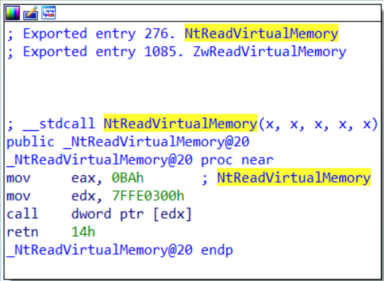

3. 发现他是直接发起了一次间接函数调用，相当于`call [0x7FFE0300]`
4. 这里需要拓展`_KUSER_SHARE_DATA`，该对象定义如下所示：

```c
//0x5f0 bytes (sizeof)
struct _KUSER_SHARED_DATA
{
    // ...
    ULONG DataFlagsPad[1];                                                  //0x2f4
    ULONGLONG TestRetInstruction;                                           //0x2f8
    ULONG SystemCall;                                                       //0x300
    ULONG SystemCallReturn;                                                 //0x304
    ULONGLONG SystemCallPad[3];                                             //0x308

    // ...
}; 
```

5. 到了现在我们可以发现，实际上是`call [UserShareData.SystemCall]`，这里的`SystemCall`保存的函数指针其实是`ntdll!KiIntSystemCall`，关于该函数定义如下所示，这个函数做了2件事：
   1. 将堆栈中的参数列表保存到edx寄存器中
   2. 调用Int 2E中断

```c
ntdll!KiIntSystemCall PROC
    // 将参数列表地址保存到edx寄存器中
    lea edx, [esp + 8]
    int 2Eh
    ret
ntdll!KiIntSystemCall ENDP
```


## Int 2E中断

1. 此时我们挂上`WinDbg`调试器，查看IDT表中0x2E号成员，如图所示：

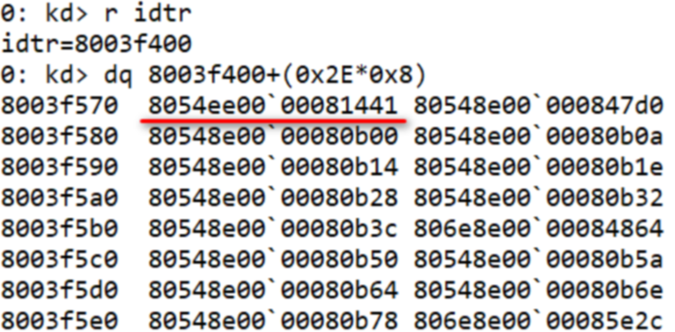

2. 从该中断门中可以解析出内核态的代码段选择子Cs、内核态的入口函数Eip

```c
8054ee00` 00081441 -> Offset = 80541441
```

3. 这个函数其实是`KiSystemServer`，在下一章节中展开讲解


## KiSystemServer

1. 已知当中断异常发生时，CPU会自动将Ss、Esp、EFlags、Cs、Eip压入堆栈
2. 我们来看`KisystemServer`在IDA中的反汇编，如图所示，该函数首先是保存R3现场，保存非易失寄存器

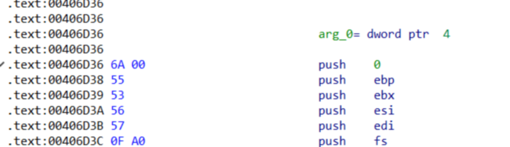

3. 切换CPU上下文，将`TEB`切换到`KPCR`

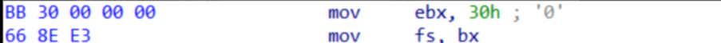

4. 由于在32位下，`SEH异常是基于堆栈的`，所以这里需要将SEH的头节点`保存到堆栈`中，并清空当前线程的SEH，这样当前线程才能使用内核SEH异常处理：

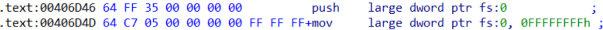

5. 再将当前线程的先前模式`PreviousMode`压入堆栈，这里也是保存现场，构造TrapFrame

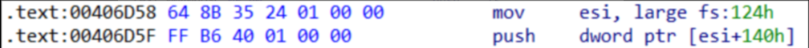

6. 之后就是继续构造TrapFrame对象：
   1. 抬升堆栈，将栈顶抬升到`TrapFrame`对象顶部
   2. 构造TrapFrame中的Cs字段
   3. 计算新的`PreviousMode`，并修改到当前线程先前模式

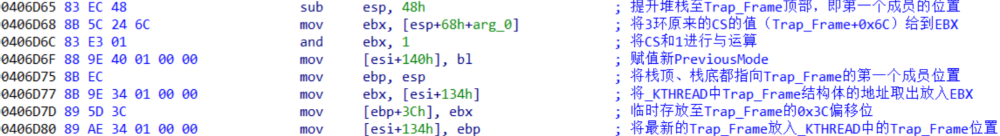

7. 继续构造TrapFrame对象，这里还判断了一下当前线程是否出于调试状态，如果是就将Dr寄存器也保存到TrapFrame

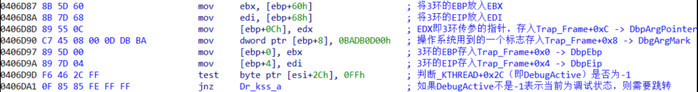

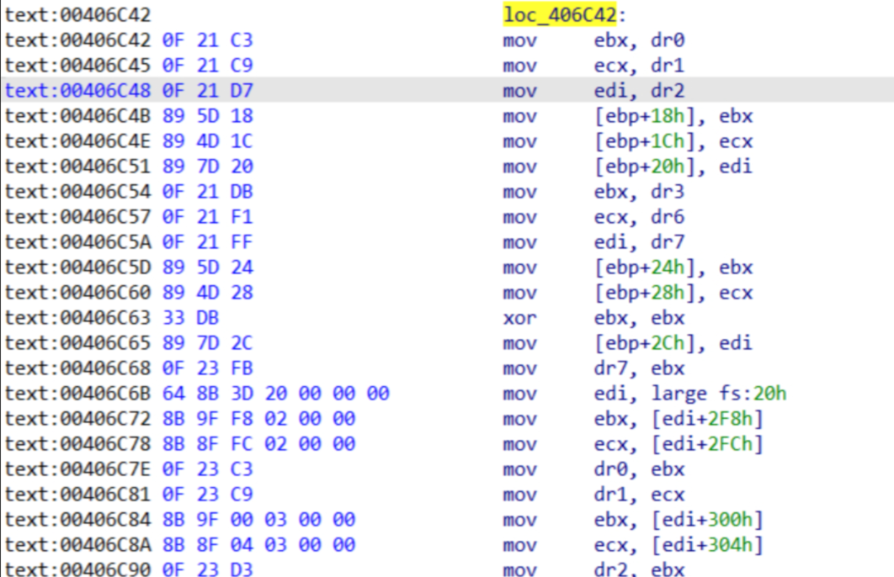

8. 在保存好R3线程后，代码直接Jmp到了`KiFastCallEntry`函数的中后部继续执行

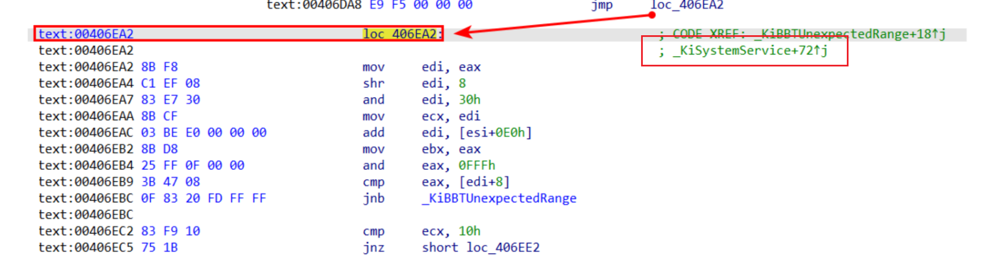

9. 初见这部分时会有点迷惑，所以笔者画了一个简单草图来帮助理解：

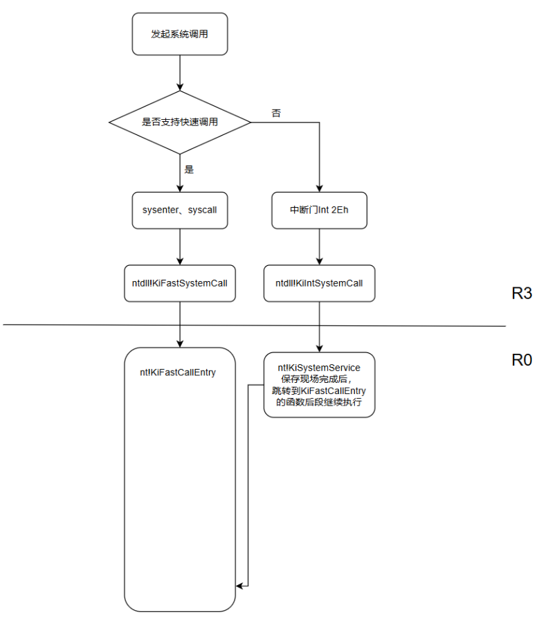


## KiSystemServer反汇编分析

```c
.text:0043567E _KiSystemService proc near              ; CODE XREF: ZwAcceptConnectPort(x,x,x,x,x,x)+C↑p
.text:0043567E                                         ; ZwAccessCheck(x,x,x,x,x,x,x,x)+C↑p ...
.text:0043567E                 push    0			   ; 通过Int 2Eh中断门调用，CPU会自动将SS、ESP、EFLAG、CS、EIP压入堆栈
.text:0043567E										   ; 这里Push 0就是压入ErrCode
.text:00435680                 push    ebp             ; 保存Ebp
.text:00435681                 push    ebx             ; 保存Ebx
.text:00435682                 push    esi             ; 保存Esi
.text:00435683                 push    edi             ; 保存Edi
.text:00435684                 push    fs              ; 保存Fs
.text:00435686                 mov     ebx, 30h ; '0'
.text:0043568B                 mov     fs, bx          ; 切换FS上下文，切换到_KPCR
.text:0043568E                 mov     ebx, 23h ; '#'
.text:00435693                 mov     ds, ebx
.text:00435695                 mov     es, ebx         ; 在R3层是，DS、ES段选择子本身就是23h
.text:00435697                 mov     esi, large fs:_KPCR.PrcbData.CurrentThread ; 保存ETHREAD到Esi
.text:0043569E                 push    large dword ptr fs:_KPCR.NtTib.ExceptionList ; 保存ExceptionList
.text:004356A5                 mov     large dword ptr fs:_KPCR.NtTib.ExceptionList, 0FFFFFFFFh ; ExceptionList保存好了，就清空ExceptionList，给内核Seh使用
.text:004356B0                 push    dword ptr [esi+_KTHREAD.PreviousMode] ; 保存先前模式PreviousMode
.text:004356B6                 sub     esp, 48h        ; 堆栈抬升48h，直接抬升到TrapFrame的起始位置
.text:004356B9                 mov     ebx, [esp+_KTRAP_FRAME.SegCs] ; 将TrapFrame.SegCs保存到Ebx
.text:004356BD                 and     ebx, 1          ; 将R3的CS跟1进行And运算，其实就是取段选择子的最低位
.text:004356BD                                         ; 用户态的RPL = 11b
.text:004356BD                                         ; 内核态的RPL = 00b
.text:004356C0                 mov     [esi+_KTHREAD.PreviousMode], bl ; 赋值新的PreviousMode
.text:004356C6                 mov     ebp, esp
.text:004356C8                 mov     ebx, [esi+_KTHREAD.TrapFrame]
.text:004356CE                 mov     [ebp+_KTRAP_FRAME._Edx], ebx
.text:004356D1                 and     [ebp+_KTRAP_FRAME.Dr7], 0
.text:004356D5                 test    byte ptr [esi+3], 0DFh
.text:004356D9                 mov     [esi+_KTHREAD.TrapFrame], ebp ; 将栈上的局部变量TrapFrame保存到KTHREAD.TrapFrame
.text:004356DF                 cld
.text:004356E0                 jnz     Dr_kss_a
.text:004356E6
.text:004356E6 loc_4356E6:                             ; CODE XREF: Dr_kss_a+D↑j
.text:004356E6                                         ; Dr_kss_a+79↑j
.text:004356E6                 mov     ebx, [ebp+_KTRAP_FRAME._Ebp]
.text:004356E9                 mov     edi, [ebp+_KTRAP_FRAME._Eip]
.text:004356EC                 mov     [ebp+_KTRAP_FRAME.DbgArgPointer], edx	; 这里的Edx，保存的是R3栈中参数列表的起始地址
.text:004356EF                 mov     dword ptr [ebp+8], 0BADB0D00h	; 赋值TrapFrame.DbgArgMark
.text:004356F6                 mov     [ebp+0], ebx    ; 保存TrapFrame.DbgEbp
.text:004356F9                 mov     [ebp+4], edi    ; 保存TrapFrame.DbgEip
.text:004356FC                 sti                     ; 响应可屏蔽中断
.text:004356FD                 jmp     loc_4357DF      ; 跳转到KiFastCallEntry中
.text:004356FD _KiSystemService endp
```


## [ 附加内容1 ]_TRAP_FRAME（32位）

1. 当R3进入到R0时，必定会保存R3的上下文现场环境，保存这个环境的对象就叫做`TrapFrame`，定义如下所示：

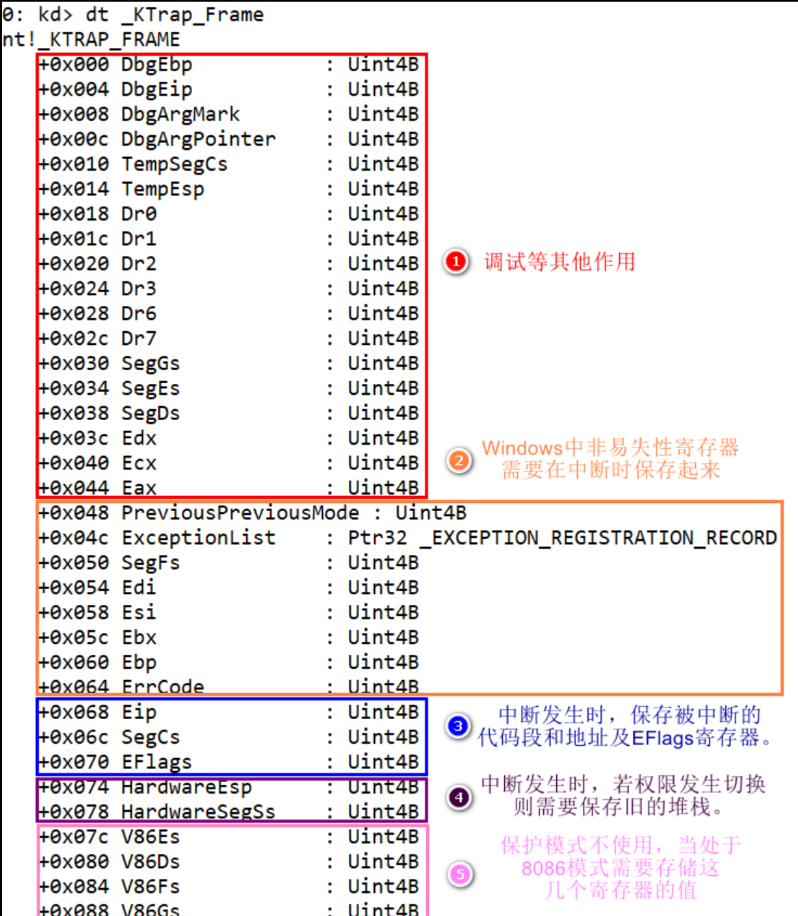

2. 在64位系统下，`TrapFrame`的结构有拓展，但是大体内容其实变动不大


## [ 附加内容2 ]KPCR（32位）

1. 每一个逻辑CPU都会有一个对象，来记录当前CPU运行上下文信息，例如以下信息：
   1. 当前CPU运行的线程对象是谁`ETHREAD`
   2. 当前CPU运行的下一个线程对象是谁`ETHREAD`
   3. 当前CPU的IRQL中断等级

```c
//0xd70 bytes (sizeof)
struct _KPCR
{
    struct _NT_TIB NtTib;                                                   //0x0
    struct _KPCR* SelfPcr;                                                  //0x1c
    struct _KPRCB* Prcb;                                                    //0x20
    UCHAR Irql;                                                             //0x24
    ULONG IRR;                                                              //0x28
    ULONG IrrActive;                                                        //0x2c
    ULONG IDR;                                                              //0x30
    VOID* KdVersionBlock;                                                   //0x34
    struct _KIDTENTRY* IDT;                                                 //0x38
    struct _KGDTENTRY* GDT;                                                 //0x3c
    struct _KTSS* TSS;                                                      //0x40
    USHORT MajorVersion;                                                    //0x44
    USHORT MinorVersion;                                                    //0x46
    ULONG SetMember;                                                        //0x48
    ULONG StallScaleFactor;                                                 //0x4c
    UCHAR DebugActive;                                                      //0x50
    UCHAR Number;                                                           //0x51
    UCHAR Spare0;                                                           //0x52
    UCHAR SecondLevelCacheAssociativity;                                    //0x53
    ULONG VdmAlert;                                                         //0x54
    ULONG KernelReserved[14];                                               //0x58
    ULONG SecondLevelCacheSize;                                             //0x90
    ULONG HalReserved[16];                                                  //0x94
    ULONG InterruptMode;                                                    //0xd4
    UCHAR Spare1;                                                           //0xd8
    ULONG KernelReserved2[17];                                              //0xdc
    struct _KPRCB PrcbData;                                                 //0x120
}; 
```

2. 关于这个`KPCR`，其中的成员`KPRCB`则保存着更多的CPU上下文信息，如下所示：

```c
//0xc50 bytes (sizeof)
struct _KPRCB
{
    USHORT MinorVersion;                                                    //0x0
    USHORT MajorVersion;                                                    //0x2
    struct _KTHREAD* CurrentThread;                                         //0x4
    struct _KTHREAD* NextThread;                                            //0x8
    struct _KTHREAD* IdleThread;                                            //0xc
    CHAR Number;                                                            //0x10
    CHAR Reserved;                                                          //0x11
    USHORT BuildType;                                                       //0x12
    ULONG SetMember;                                                        //0x14
    CHAR CpuType;                                                           //0x18
    CHAR CpuID;                                                             //0x19
    USHORT CpuStep;                                                         //0x1a
    struct _KPROCESSOR_STATE ProcessorState;                                //0x1c
    ULONG KernelReserved[16];                                               //0x33c
    ULONG HalReserved[16];                                                  //0x37c
    UCHAR PrcbPad0[92];                                                     //0x3bc
    struct _KSPIN_LOCK_QUEUE LockQueue[16];                                 //0x418
    UCHAR PrcbPad1[8];                                                      //0x498
    struct _KTHREAD* NpxThread;                                             //0x4a0
    ULONG InterruptCount;                                                   //0x4a4
    ULONG KernelTime;                                                       //0x4a8
    ULONG UserTime;                                                         //0x4ac
    ULONG DpcTime;                                                          //0x4b0
    ULONG DebugDpcTime;                                                     //0x4b4
    ULONG InterruptTime;                                                    //0x4b8
    ULONG AdjustDpcThreshold;                                               //0x4bc
    ULONG PageColor;                                                        //0x4c0
    ULONG SkipTick;                                                         //0x4c4
    UCHAR MultiThreadSetBusy;                                               //0x4c8
    UCHAR Spare2[3];                                                        //0x4c9
    struct _KNODE* ParentNode;                                              //0x4cc
    ULONG MultiThreadProcessorSet;                                          //0x4d0
    struct _KPRCB* MultiThreadSetMaster;                                    //0x4d4
    ULONG ThreadStartCount[2];                                              //0x4d8
    ULONG CcFastReadNoWait;                                                 //0x4e0
    ULONG CcFastReadWait;                                                   //0x4e4
    ULONG CcFastReadNotPossible;                                            //0x4e8
    ULONG CcCopyReadNoWait;                                                 //0x4ec
    ULONG CcCopyReadWait;                                                   //0x4f0
    ULONG CcCopyReadNoWaitMiss;                                             //0x4f4
    ULONG KeAlignmentFixupCount;                                            //0x4f8
    ULONG KeContextSwitches;                                                //0x4fc
    ULONG KeDcacheFlushCount;                                               //0x500
    ULONG KeExceptionDispatchCount;                                         //0x504
    ULONG KeFirstLevelTbFills;                                              //0x508
    ULONG KeFloatingEmulationCount;                                         //0x50c
    ULONG KeIcacheFlushCount;                                               //0x510
    ULONG KeSecondLevelTbFills;                                             //0x514
    ULONG KeSystemCalls;                                                    //0x518
    ULONG SpareCounter0[1];                                                 //0x51c
    struct _PP_LOOKASIDE_LIST PPLookasideList[16];                          //0x520
    struct _PP_LOOKASIDE_LIST PPNPagedLookasideList[32];                    //0x5a0
    struct _PP_LOOKASIDE_LIST PPPagedLookasideList[32];                     //0x6a0
    volatile ULONG PacketBarrier;                                           //0x7a0
    volatile ULONG ReverseStall;                                            //0x7a4
    VOID* IpiFrame;                                                         //0x7a8
    UCHAR PrcbPad2[52];                                                     //0x7ac
    VOID* volatile CurrentPacket[3];                                        //0x7e0
    volatile ULONG TargetSet;                                               //0x7ec
    VOID (* volatileWorkerRoutine)(VOID* arg1, VOID* arg2, VOID* arg3, VOID* arg4); //0x7f0
    volatile ULONG IpiFrozen;                                               //0x7f4
    UCHAR PrcbPad3[40];                                                     //0x7f8
    volatile ULONG RequestSummary;                                          //0x820
    struct _KPRCB* SignalDone;                                              //0x824
    UCHAR PrcbPad4[56];                                                     //0x828
    struct _LIST_ENTRY DpcListHead;                                         //0x860
    VOID* DpcStack;                                                         //0x868
    ULONG DpcCount;                                                         //0x86c
    volatile ULONG DpcQueueDepth;                                           //0x870
    volatile ULONG DpcRoutineActive;                                        //0x874
    volatile ULONG DpcInterruptRequested;                                   //0x878
    ULONG DpcLastCount;                                                     //0x87c
    ULONG DpcRequestRate;                                                   //0x880
    ULONG MaximumDpcQueueDepth;                                             //0x884
    ULONG MinimumDpcRate;                                                   //0x888
    ULONG QuantumEnd;                                                       //0x88c
    UCHAR PrcbPad5[16];                                                     //0x890
    ULONG DpcLock;                                                          //0x8a0
    UCHAR PrcbPad6[28];                                                     //0x8a4
    struct _KDPC CallDpc;                                                   //0x8c0
    VOID* ChainedInterruptList;                                             //0x8e0
    LONG LookasideIrpFloat;                                                 //0x8e4
    ULONG SpareFields0[6];                                                  //0x8e8
    UCHAR VendorString[13];                                                 //0x900
    UCHAR InitialApicId;                                                    //0x90d
    UCHAR LogicalProcessorsPerPhysicalProcessor;                            //0x90e
    ULONG MHz;                                                              //0x910
    ULONG FeatureBits;                                                      //0x914
    union _LARGE_INTEGER UpdateSignature;                                   //0x918
    struct _FX_SAVE_AREA NpxSaveArea;                                       //0x920
    struct _PROCESSOR_POWER_STATE PowerState;                               //0xb30
}; 
```
