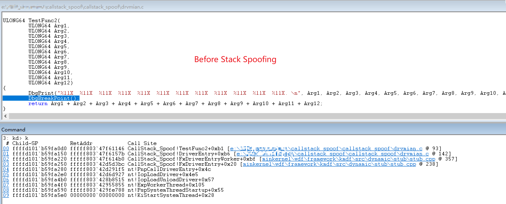
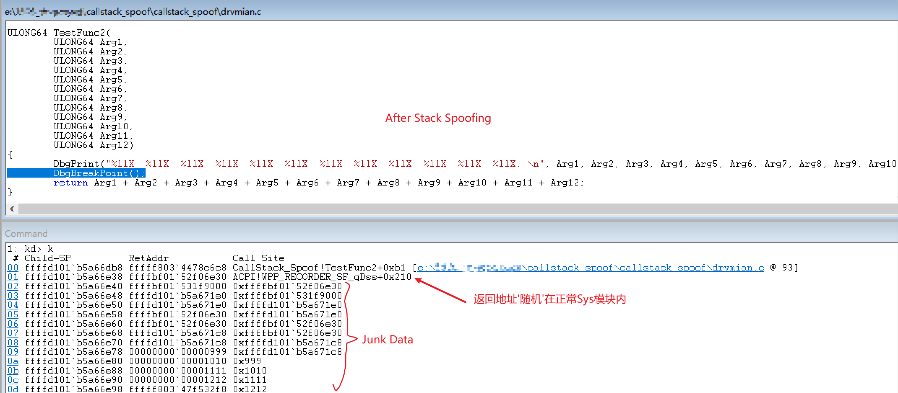

<!--more-->

## 堆栈回溯（Stack Unwind）

堆栈回溯往往可以用来检测敏感API的调用方信息：

1. 检测`无痕`注入(ShellCode远程Call)：
   > 对某国产摸金搜打撤游戏的`外挂`样本分析后，发现该外挂为手动映射（Manual Map）注入DLL到游戏进程。
   >
   > 通过调用虚幻（UE）引擎相关接口，实现绕过Object指针加密、坐标加密，并利用引擎射线检测（LineTraceSingle）进行掩体判断等，实现各种破坏游戏平衡性的功能。
   >
   > 对部分敏感API进行堆栈回溯，对于不在白名单内的调用方，可将异常调用信息记录并上报至服务端。
   >
   > 该外挂样本的分析工作已基本完成，后续有空会考虑发出来，感兴趣的朋友可以点个关注。

   

2. 检测`无模块`驱动：
   > 在如今游戏安全、内核对抗中为了隐藏驱动特征，这类方案通常会分为两层，外层驱动仅作为MapLoader（WHQL或未被AC拉黑的签名）负责PE映射、重定位表与导入表修复等操作，内层功能模块则以Shellcode或无模块映像的形式驻留/执行于内核态（R0），此时常见内核枚举/ARK工具无法在驱动列表中找到该驱动。
   > 此时进行堆栈回溯，一旦回溯到调用方不存在于任何合法的模块范围内，可将该异常调用链记录并上报至服务端。


## 手动伪造调用栈效果图

如下为效果图：






## 实现思路

### 污染堆栈中的返回地址

这里需要实现一个汇编函数，作为 Wrapper 使用，并充当一个通用的函数调用器，其功能如下：

1. 在特定时机，对堆栈中的返回地址进行加密、解密（自定义、随机密钥）
2. 构造新的调用栈，并调用真正的目标函数

汇编代码如下：

```assembly
Asm_SpoofWrapper PROC
	mov r11, g_XorKey
	xor [rsp], r11

	push rsi
	push rdi
	sub rsp, 300h

	lea rsi, [rsp + 340h]
	lea rdi, [rsp + 20h]
	mov r10, rcx   
	mov ecx, 40h   
	rep movsq      
	mov rcx, r10   

	call qword ptr [rsp + 338h]

	add rsp, 300h
	pop rdi
	pop rsi

	mov r11, g_XorKey
	xor [rsp], r11

	ret
Asm_SpoofWrapper ENDP
```


### Wrapper ShellCode 的偏移修复

1. 目前还存在一个问题：`Asm_SpoofWrapper` 中的 `call` 指令仍会将当前驱动中的返回地址压入堆栈。，那么就想办法将Wrapper移动到正常模块内，Wrapper的字节如下所示：
2. 但将 Wrapper 移动到正常模块后，又会引出新的问题：用于加密、解密的密钥是通过 `RIP` 相对寻址获取的，因此需要动态修复其相对偏移。

```c
UCHAR SpoofShellCode[] = 
{
	// 1. '动态'获取密钥并加密返回地址
	0x4C, 0x8B, 0x1D, 0x00, 0x00, 0x00, 0x00,  // mov     r11, XorKey
	0x4C, 0x31, 0x1C, 0x24,                    // xor     [rsp+0], r11

	// 2. 保存非易失性寄存器
	0x56,                                      // push    rsi
	0x57,                                      // push    rdi

	// 3. 提升栈空间 0x300
	0x48, 0x81, 0xEC, 0x00, 0x03, 0x00, 0x00,  // sub     rsp, 300h

	// 4. 设置内存拷贝的源和目标地址
	0x48, 0x8D, 0xB4, 0x24, 0x40, 0x03, 0x00, 0x00, // lea   rsi, [rsp + 340h]
	0x48, 0x8D, 0x7C, 0x24, 0x20,              // lea     rdi, [rsp + 20h]

	// 5. 暂存 rcx 并执行内存拷贝 (rep movsq)
	0x4C, 0x8B, 0xD1,                          // mov     r10, rcx
	0xB9, 0x40, 0x00, 0x00, 0x00,              // mov     ecx, 40h
	0xF3, 0x48, 0xA5,                          // rep     movsq
	0x49, 0x8B, 0xCA,                          // mov     rcx, r10

	// 6. 调用目标函数
	0xFF, 0x94, 0x24, 0x38, 0x03, 0x00, 0x00,  // call    [rsp + 338h]

	// 7. 恢复栈空间和寄存器
	0x48, 0x81, 0xC4, 0x00, 0x03, 0x00, 0x00,  // add     rsp, 300h
	0x5F,                                      // pop     rdi
	0x5E,                                      // pop     rsi

	// 8. '动态'获取密钥并解密返回地址
	0x4C, 0x8B, 0x1D, 0x00, 0x00, 0x00, 0x00,  // mov     r11, XorKey
	0x4C, 0x31, 0x1C, 0x24,                    // xor     [rsp+0], r11

	// 9. 函数返回
	0xC3                                       // retn
};

#pragma pack(push, 1)
typedef struct _SPOOF_SHELLCODE_TEMPLATE {
	UCHAR  mov_r11_opcode[3];      // mov r11, xxx
	LONG32 first_xor_key_offset;
	UCHAR  pad_1[56];
	UCHAR  mov_r11_opcode_2[3];    // mov r11, xxx
	LONG32 second_xor_key_offset;
	UCHAR  pad_2[5];
} SPOOF_SHELLCODE_TEMPLATE, *PSPOOF_SHELLCODE_TEMPLATE;
#pragma pack(pop)

#define OFFSET(type, field) ((ULONG_PTR)(&((type*)0)->field))
```


### Wrapper ShellCode 的放置

遍历系统中的驱动模块，随机选取一个正常加载的模块，在其模块范围内搜索`代码空洞`，搜索成功后将`ShellCode`放置过去，但需要注意以下内容：

1. 尽量搜索驱动模块中`.text`节区的内容，因为'PAGE'节区在系统内存资源紧张时可能会被换出到磁盘。
2. 避开`ntoskrnl`、`win32k`（图形子系统）、`hal`（硬件抽象层）等可能触发`PatchGuard`的模块。


## Github开源地址

Github仓库：[CallStackSpoof](https://github.com/Shinn-Home/CallStackSpoof)

此方案理论上同时支持R0、R3，实现代码大同小异，R0层驱动源码已经开源，测试环境为`Win10 19044`，欢迎感兴趣的朋友点个Star。